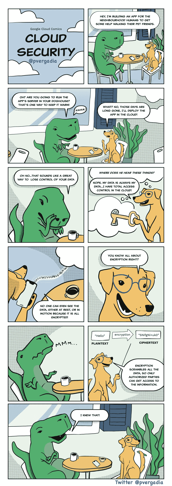

# 我的数据在云中安全吗？

> 原文：<https://medium.com/google-cloud/is-my-data-safe-in-cloud-41608c1d1f89?source=collection_archive---------0----------------------->

## 你应该把你的数据存储在云中吗？

## GCP 漫画#1:谷歌云和隐私(云安全)

 [## GCP 漫画

### 谷歌云漫画(GCP 漫画)

gcpcomics.com](https://gcpcomics.com/) 

> 经常有人问，我在云中的数据会怎么样？安全有保障吗？谁有权限？

如果你正在寻找这些问题的答案，那么你点击了正确的链接😃在第一季 [**GCP 漫画**](https://gcpcomics.com/) 中，我们将学习谷歌云的安全概念，一路上充满乐趣。

给你！请继续阅读，并在下面的评论中分享你的想法。

GCP 漫画#1:云安全——谷歌云和隐私

安全性需要深厚的专业知识和大量的专用资源来实现，这主要是因为它是一个多维度的问题，包括物理(数据中心)安全性、平台和网络安全性、主动威胁检测、审计以及符合 HIPAA 和 PCI 等行业特定认证。但是，在任何安全对话中，第一步也是最重要的一步是信任。

> 在任何安全对话中，第一步也是最重要的一步是信任

我们知道信任是通过透明建立的。因为这个原因；谷歌云创建了信任原则，明确了保护客户数据隐私的承诺。

## 谷歌云信任原则:

> 1.你的数据属于你，不属于任何人

*   根据您的指示处理您的数据。
*   你可以随时取用或取出它。
*   如果检测到危及数据安全的违规行为，您会收到通知。
*   您可以通过访问控制来保护组织内外有权访问数据的人员。
*   您可以访问审计报告，这些报告记录了您的项目中所做的所有更改以及谁动了哪些内容。
*   您可以使用访问透明日志，通过近乎实时的日志和批准控制来扩展对云提供商的可见性和控制。

> 2.谷歌云不向第三方出售客户数据。也不用于广告。
> 
> 3.您的数据在传输过程中会自动加密[而在静止状态下会自动加密](https://cloud.google.com/security/encryption-in-transit)和[。您不必要求或启用它，这是默认情况下发生的。](https://cloud.google.com/security/encryption-at-rest)

而且，如果您愿意，您可以通过自带加密密钥来应用额外的加密。这是两种方式:

1.  使用客户管理的加密密钥(CMEK ),其中您使用 Google 密钥管理服务来管理云中的密钥。
2.  使用客户提供的加密密钥(CSEK ),在本地管理您的密钥。使用 CSEK 时，请注意，如果密钥丢失，Google 将无法帮助您恢复数据，因为 Google 不存在此数据的密钥。

> 4.知道您的数据存储在哪里，并在需要时随时可用。

谷歌数据中心的位置是公开的，它们具有高可用性、弹性和安全性。当您请求数据时，您可以相信数据是可用的。根据您使用的服务，您还可以控制数据的存储位置。您可以选择将数据存储在更靠近您的用户、应用或两者的位置。

> 5.有明确的规则来防止内部人员访问你的数据，没有“后门”谷歌。

无效的政府请求会被拒绝，并针对这些请求发布[透明度报告](https://transparencyreport.google.com/?utm_medium=et&utm_source=google.com%2Fcloud&utm_campaign=privacy&utm_content=privacy_commitments_to_data)。

> 6.隐私实践是根据国际标准进行审计的。

这意味着你可以选择在世界任何地方的谷歌云中存储你的数据，而不必担心特定位置的标准。

## 保护和控制

谷歌云为你提供了合适的工具来控制对数据的访问，并选择谁有权访问你的数据的哪些部分。

## 专门的隐私团队

隐私团队同样参与每个产品和文档的发布，以确保符合所有隐私要求和标准。

## 资源

要了解更多关于谷歌云隐私的信息，请点击[链接](https://cloud.google.com/security/privacy)。

想要更多的 GCP 漫画吗？访问 gcpcomics.com&[跟我上](https://gcpcomics.com/)[中](/@pvergadia/)，上[维特](https://twitter.com/pvergadia)别错过下一期！