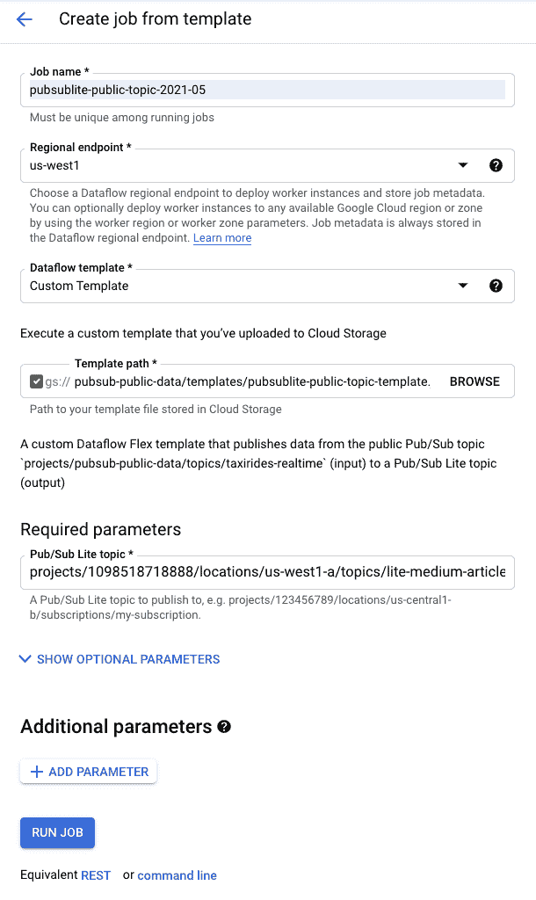
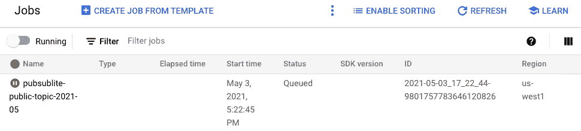
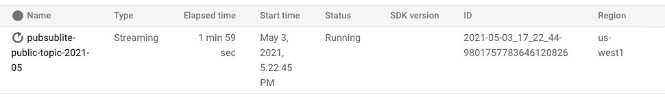

# 有公共的 Pub/Sub Lite 主题吗？

> 原文：<https://medium.com/google-cloud/is-there-a-public-pub-sub-lite-topic-95a19ede4d6a?source=collection_archive---------6----------------------->

在许多谷歌云快速入门和教程中，这个公共发布/订阅主题`projects/pubsub-public-data/topics/taxirides-realtime`允许任何人订阅它，并实时收听虚假的出租车乘坐数据。**Pub/Sub Lite 也存在这样的公共话题吗？**在这篇博文中，我将解释为什么拥有一个公共的 Pub/Sub Lite 主题是不可行的，你如何仍然可以与他人共享一个 Pub/Sub Lite 主题资源，最后，你可以做些什么来将虚假的出租车乘车数据从 Pub/Sub 公共主题路由到你的 Pub/Sub Lite 主题。

在我深入研究 Pub/Sub Lite 之前，让我回顾一下如何创建对 Pub/Sub 主题的订阅。假设我有一个项目`bamboo-copilot-311421`。我可以创建公共发布/订阅主题的订阅，如下所示:

```
gcloud pubsub subscriptions create bobcat \
  --project=bamboo-copilot-311421 \
  --topic=projects/pubsub-public-data/topics/taxirides-realtime
```

您也可以这样做的原因是，这个公共主题资源有一个 IAM 绑定，专门授予`allUsers`角色`roles/pubsub.subscriber`，其中包括权限`pubsub.topics.attachSubscription`。

创建订阅后，我可以通过以下方式从该订阅中提取消息:

```
gcloud pubsub subscriptions pull bobcat \
  --project=bamboo-copilot-311421 \
  --limit=1 \
  --auto-ack=true
```

我可以从这个订阅中提取消息，因为我登录的帐户或我的工作电子邮件具有`project.owner`角色，其中包括权限`pubsub.subscriptions.consume`。

如果您想知道您当前在计算机上使用的是哪个`gcloud`帐户和项目，请尝试:

```
gcloud config list
```

如何看到哪些角色绑定到您的帐户？

```
export PROJECT=$(gcloud config get-value project)
export EMAIL=$(gcloud config get-value account)gcloud projects get-iam-policy $PROJECT \
  --format="table(bindings.members,bindings.role)" \
  --flatten="bindings[].members" \
  --filter="bindings.members=user:$EMAIL"
```

将订阅附加到现有的发布/订阅 Lite 主题遵循类似的步骤。假设我的项目 ID `bamboo-copilot-311421`有项目编号`831370759181`。创建订阅我拥有的发布/订阅 Lite 主题的命令看起来像:

```
gcloud pubsub lite-subscriptions create starfish \
  --project=bamboo-copilot-311421 \
  --topic=projects/831370759181/locations/us-east1-b/topics/fish \
  --zone=us-east1-b
```

使用类似的命令，您将无法在您的项目中将订阅附加到该主题，因为 **Pub/Sub Lite 不跨项目共享主题和订阅资源**。你能做的最好的事情就是被允许在我的项目中创建一个 Pub/Sub Lite 订阅。这需要我为您的帐户添加一些 IAM 绑定:

```
gcloud projects add-iam-policy-binding bamboo-copilot-311421 \
  --member='user:$YOUR-EMAIL' \
  --role='roles/browser'gcloud projects add-iam-policy-binding bamboo-copilot-311421 \
  --member='user:$YOUR-EMAIL' \
  --role='roles/pubsublite.admin' \
  --condition-from-file='conditions.json'
```

其中`conditions.json`看起来像:

```
{
  "title": "fish",
  "description": "Allow creating subscriptions to a specific Pub/Sub topic",
  "expression":
     "(resource.type == 'pubsublite.googleapis.com/Topic' && 
     resource.name == 'projects/831370759181/locations/us-central1-b/topics/fish')"
}
```

我在这里使用`--condition-from-file`标志来添加 IAM 条件，因为它可以限制我打算打开哪个发布/订阅 Lite 主题的访问。在 IAM [条件](https://cloud.google.com/iam/docs/conditions-overview)中可以设置更多参数。

对于`--member`，服务账户也可以。服务帐户是 Google Cloud 客户端库向 Google Cloud services 认证的推荐方式。认证是通过环境变量`GOOGLE_APPLICATION_CREDENTIALS`指向的服务帐户密钥文件来完成的。

不使用[预定义角色](https://cloud.google.com/pubsub/lite/docs/access-control#predefined_roles) `roles/pubsublite.admin`，一个[定制角色](https://cloud.google.com/pubsub/lite/docs/access-control#custom_roles)也可以工作，它具有创建订阅和消费消息的较小权限集。

一般来说，在云控制台中编辑 IAM 条件比在终端中使用 gcloud 命令容易得多。

要创建一个所有人都可以订阅的公共 Pub/Sub Lite 主题，项目所有者必须将所有人的帐户(电子邮件或服务帐户)添加到他或她的项目中，并根据不同的订阅名称让所有人遵守略有不同的 IAM 条件。否则，人们可能会访问其他人的订阅，并从这些订阅中获取信息。此外，每个人都必须共享项目中的订阅吞吐量(最大 128 MiB/s)和每个发布/订阅 Lite 主题分区的订阅吞吐量(4-32 MiB/s)。其他硬性限制——一个项目中的 Lite 主题只允许 [1，000](https://cloud.google.com/pubsub/lite/quotas) 个订阅——也同样适用。计费方面，公共发布/订阅精简版主题的项目所有者将为每个人的发布/订阅精简版订阅和流量付费，这将不可避免地增加。综上所述，一个真正公开的发布/订阅主题是不可行的。

如果你有兴趣拥有自己的流媒体发布/订阅源，就像公共发布/订阅主题一样，该怎么办？我可以想到一个场景，您已经有了针对 Pub/Sub 进行测试的代码，并且您想看看 Pub/Sub Lite 在比较中的表现如何。

嗯，建立一个并不太难。您可以建立一个数据流管道，不断地将消息从发布/订阅公共主题发布到发布/订阅精简主题。你只需要一个 Pub/Sub Lite 主题。

当你准备好了，去数据流控制台[创建一个模板](https://pantheon.corp.google.com/dataflow/createjob)。

在“数据流模板”下，选择“自定义模板”。然后提供我已经公开的模板文件的路径:`gs://pubsub-public-data/templates/pubsublite-public-topic-template.json`。也提供你的发布/订阅主题名。如果您还没有启用 Dataflow Flex 模板服务，您可能需要启用它。



单击“运行作业”。



数据流需要一些时间来准备好管道。一旦它开始运行，您应该可以通过访问 Lite 主题详细信息页面或尝试从订阅中提取一些消息来查看到达您的发布/订阅主题的消息。



你可以在 [GitHub](https://github.com/anguillanneuf/pubsublite-public-topic-template) 上查看我用来创建这个定制模板的代码和命令。

希望我已经在这篇博客文章中阐明了为什么 Pub/Sub Lite 没有一个公共主题，以及你如何仍然可以与他人分享你的 Pub/Sub Lite 主题。也希望你发现数据流模板对你的测试用例有用。感谢您的阅读！