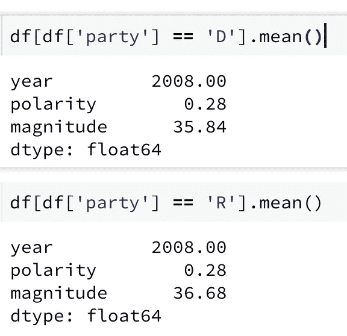
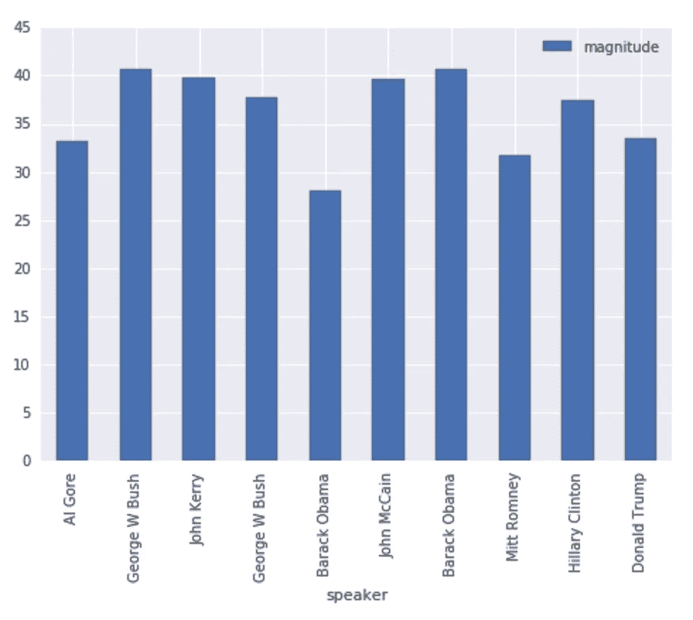
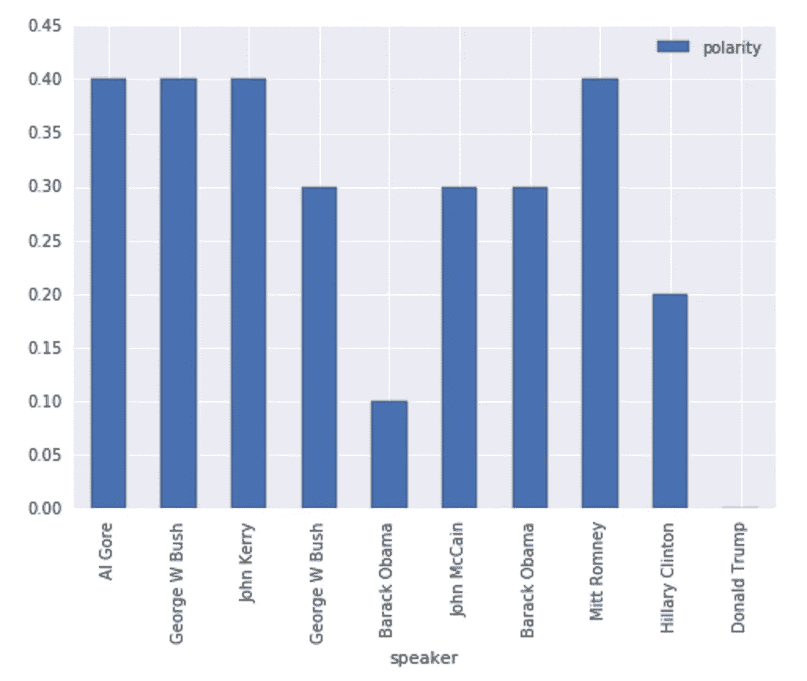

# 这次总统竞选比过去几年更消极吗？是的。

> 原文：<https://medium.com/google-cloud/is-this-presidential-election-more-negative-than-years-past-yes-ca254e35eb9?source=collection_archive---------3----------------------->

与过去几年相比，这个选举季有什么不同？今年的总统竞选人——希拉里·克林顿(Hillary Clinton)和唐纳德·特朗普(Donald Trump)——比过去几年更消极吗？

我决定用 [Google Cloud 自然语言 API](https://cloud.google.com/natural-language/) 来分析近几年美国各大党提名人的发言。加州大学圣巴巴拉分校将所有的[提名接受演讲](http://www.presidency.ucsb.edu/nomination.php)放到了网上，NL API 非常容易使用，所以只需将 API 与网站挂钩即可。

当你分析一段文字的情感时，你可以从两个角度来看:

*   文本有多积极、中立或消极？这被称为*极性*。关于爱和幸福的陈述会有积极的氛围，并被赋予 1 的极性。关于毁灭和毁灭的陈述会有负面的影响，并被赋予-1 的极性。这是候选人生活中的一个快乐时刻，事实上，他们正在与一群友好的人交谈，我预计总体情绪是积极的。
*   文字有多煽情？一篇演讲可以是中性的，因为它只是简单地叙述事实，或者因为积极的极性和消极的极性相互抵消。所以，你应该从这两个方面来看待文本背后的情感。

先看结果吧。然后，我会告诉你如何重复我的分析。

## 党派分歧？没有人

首先，双方在情感的极性或程度上没有重大差异:



两党之间没有太大的区别，无论是他们的演讲有多积极，或者这些演讲有多触动你的心弦。

共和党演讲的平均极性为 0.28，民主党演讲的平均极性也是如此。共和党人(36.7 分)比民主党人(35.8 分)略多一些情绪化，但与不同演讲者之间的差异相比，这种差异微不足道。

## 大家都挺感慨的。除了奥巴马 2008

就情感而言，巴拉克·奥巴马在 2008 年(他第一次竞选总统的那一年)是个异数。他的演讲似乎比这种情况下的典型演讲更专业:



就演讲的情绪化程度而言，2008 年的巴拉克·奥巴马是个异类。他似乎采用了更专业的语气。然而，这一指标没有年度趋势。

奥巴马总统在 2012 年似乎变得更加引人注目。今年，希拉里·克林顿(Hillary Clinton)比唐纳德·特朗普(Donald Trump)达到了更多的高点和低点，但它们都在典型的变化范围内。

正是在极性维度上，今年是非典型的。

## 今年的提名者比往年更加消极；唐纳德·特朗普真的是名不副实

当然，我把最有趣的结果留到了最后。这就是演讲的极性。回想一下，极性 1.0 是一个非常积极的讲话；极性为-1.0 是一个极其消极和悲伤的言论。葛底斯堡演说，既阴郁又激动人心，在 0.4 左右。

以下是两党提名人最近发表的获奖感言:



希拉里·克林顿(Hillary Clinton)和唐纳德·特朗普(Donald Trump)都明显不如过去几年的提名人积极。尤其是唐纳德·特朗普(Donald Trump)，他的消极程度几乎无与伦比。

希拉里·克林顿(Hillary Clinton)和唐纳德·特朗普(Donald Trump)都明显不如过去几年的提名人积极。事实上，唐纳德·特朗普(Donald Trump)的得分完全中立，为 0.0，这令人惊讶，因为他正在与刚刚提名他竞选总统的支持者交谈。在上下文中，这是非常非常消极的。

## 如何调用 Google 自然语言 API

只有几行 Python 代码——这就是使用机器学习 API 的魔力。训练神经网络分析文本的艰苦工作已经完成。我们可以简单地调用 API，传入我们想要分析的文本:

```
url = 'http://www.presidency.ucsb.edu/ws/index.php?pid=118051'
text_of_speech = urllib2.urlopen(url).read()
response = lservice.documents().analyzeSentiment(
    body={
      'document': {
         'type': 'HTML',
         'content': unicode(text_of_speech, errors='ignore')
      }
    }).execute()
polarity = response['documentSentiment']['polarity']
magnitude = response['documentSentiment']['magnitude']
```

完整的 [Python 笔记本在 github](https://github.com/GoogleCloudPlatform/training-data-analyst/tree/master/blogs/speeches) 里。请随意尝试。