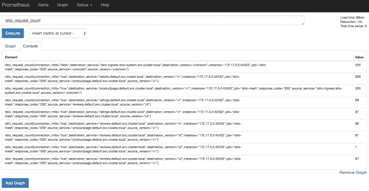
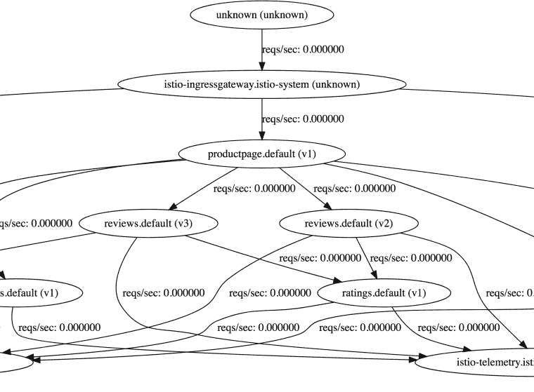
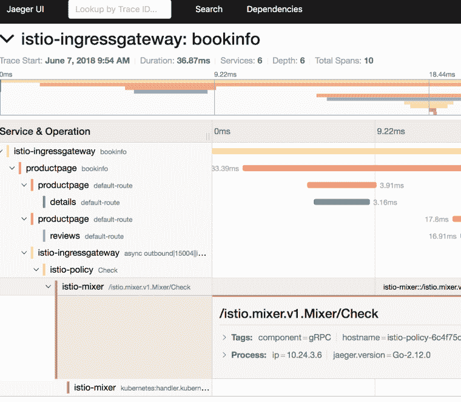

# GKE 的 Istio 101 (0.8.0)

> 原文：<https://medium.com/google-cloud/istio-101-0-8-0-on-gke-c860115c4d42?source=collection_archive---------0----------------------->

在我之前的一篇[帖子](https://meteatamel.wordpress.com/2018/04/24/istio-101-with-minikube/)中，我展示了如何在 minikube 上安装 Istio 并部署示例 BookInfo 应用程序。一个新的 Istio 版本出来了(0.8.0) [有很多变化](https://istio.io/about/notes/0.8/)，尤其是在[交通管理上的变化](https://istio.io/blog/2018/v1alpha3-routing/)，这让我之前帖子的步骤有点过时。

在这篇文章中，我想展示如何在谷歌 Kubernetes 引擎(GKE)上安装 Istio 0.8.0，部署样例 BookInfo 应用程序，并展示一些附加组件和流量路由。

# 创建 Kubernetes 集群

首先，我们需要一个 Kubernetes 集群来安装 Istio。在 GKE，这是一个简单的命令:

```
gcloud container clusters create hello-istio \ --cluster-version=1.9.7-gke.1 \ --zone europe-west1-b \ --num-nodes 4
```

有几件事需要注意。首先，我没有在 GKE (1.10)上使用最新的集群版本，因为 Istio 0.8.0 还不能与之抗衡。第二，我使用了 4 个工作节点。这是 BookInfo 示例的推荐节点数。

一旦创建了集群，我们还需要为 Istio 创建一个 *clusterrolebinding* 来管理集群:

```
kubectl create clusterrolebinding cluster-admin-binding \ --clusterrole=cluster-admin \ --user=$(gcloud config get-value core/account)
```

# 下载和设置 Istio

现在我们有了一个集群，让我们下载最新的 Istio(从今天起是 0.8.0):

```
curl -L [https://git.io/getLatestIstio](https://git.io/getLatestIstio) | ISTIO_VERSION=0.8.0 sh -
```

将 Istio 的命令行工具 *istioctl* 添加到您的路径中。我们以后会用到它:

```
export PATH="$PATH:./istio-0.8.0/bin"
```

# 安装 Istio

是时候在边车之间安装带相互认证的 Istio 了:

```
kubectl apply -f install/kubernetes/istio-demo-auth.yaml
```

完成后，您可以检查 pods 是否在 istio-system 名称空间下运行:

```
kubectl get pods -n istio-system
```

你会发现，除了 Istio 基本组件(例如，导频、混音器、入口、出口)，还安装了许多附加组件(例如，prometheus、servicegraph、grafana)。这与之前的 Istio 版本不同。

# 部署 BookInfo 应用程序

现在让我们部署 BookInfo 示例应用程序:

```
kubectl apply -f <(istioctl kube-inject --debug -f samples/bookinfo/kube/bookinfo.yaml)
```

确保所有的吊舱都在运行:

```
kubectl get pods
```

# 部署 BookInfo 网关

在 Istio 0.8.0 中，流量管理完全改变了，其中一项改变是您需要为入口流量创建一个网关。让我们继续为 BookInfo 应用程序创建一个网关:

```
istioctl create -f samples/bookinfo/routing/bookinfo-gateway.yaml
```

# 使用 BookInfo 应用程序

我们终于可以看看这个应用了。我们需要找到入口网关 IP 和端口:

```
kubectl get svc istio-ingressgateway -n istio-system
```

为了方便起见，让我们定义一个 *GATEWAY_URL* 变量:

```
export INGRESS_HOST=$(kubectl -n istio-system get service istio-ingressgateway -o jsonpath='{.status.loadBalancer.ingress[0].ip}') export INGRESS_PORT=$(kubectl -n istio-system get service istio-ingressgateway -o jsonpath='{.spec.ports[?(@.name=="http")].port}') export GATEWAY_URL=$INGRESS_HOST:$INGRESS_PORT
```

让我们看看这个应用程序是否有效。用 curl 你应该得到 200:

```
curl -o /dev/null -s -w "%{http_code}\n" [http://${GATEWAY_URL}/productpage](/${GATEWAY_URL}/productpage)
```

您也可以打开浏览器，查看产品页面的 web 前端。此时，我们已经通过 Istio 的基本安装部署和管理了应用程序。

接下来，我们将看看一些附加组件。与以前的版本不同，附加组件已经自动安装。让我们先开始发送一些流量:

```
for i in {1..100}; do curl -o /dev/null -s -w "%{http_code}\n" [http://${GATEWAY_URL}/productpage;](/${GATEWAY_URL}/productpage;) done
```

# Grafana 仪表板

这是格拉法纳的仪表板。让我们先设置端口转发:

```
kubectl -n istio-system port-forward $(kubectl -n istio-system get pod -l app=grafana -o jsonpath='{.items[0].metadata.name}') 8080:3000
```

导航到 [http://localhost:8080](http://localhost:8080/) 查看仪表板:


# 普罗米修斯矩阵

接下来，让我们看看普罗米修斯的度量标准。设置端口转发:

```
kubectl -n istio-system port-forward $(kubectl -n istio-system get pod -l app=prometheus -o jsonpath='{.items[0].metadata.name}') 8083:9090
```

导航到[http://localhost:8083/graph](http://localhost:8083/graph)看普罗米修斯:



# 服务图表

对于依赖关系的可视化，我们可以看看 ServiceGraph:

```
kubectl -n istio-system port-forward $(kubectl -n istio-system get pod -l app=servicegraph -o jsonpath='{.items[0].metadata.name}') 8082:8088
```

导航到[http://localhost:8082/dot viz](http://localhost:8082/dotviz):



# 描摹

对于 HTTP 追踪，有 Jaegar 和 Zipkin。让我们来看看耶格。照常设置端口转发:

```
kubectl port-forward -n istio-system $(kubectl get pod -n istio-system -l app=jaeger -o jsonpath='{.items[0].metadata.name}') 8084:16686
```

导航到 [http://localhost:8084](http://localhost:8084/)



# 交通管理

流量管理在 0.8.0 中发生了巨大变化。你可以在这里[了解更多信息](https://istio.io/blog/2018/v1alpha3-routing/)但基本上，我们现在有了虚拟服务和目的地规则，而不是路由规则。

您可以看到现有的虚拟服务和目标规则，如下所示:

```
istioctl get virtualservices -o yaml istioctl get destinationrules -o yaml
```

当你进入 BookInfo 应用的产品页面，做几次浏览器刷新，你会看到右边的评论部分一直在变(星星变颜色)。这是因为有 3 个不同的审查微服务，每次都调用不同的微服务。让我们将所有微服务绑定到版本 1:

```
istioctl create -f samples/bookinfo/routing/route-rule-all-v1-mtls.yaml
```

这将创建将所有微服务固定到版本 1 所需的虚拟服务和目标规则。现在，如果您返回到产品页面并刷新浏览器，什么都不会改变，因为评论微服务现在被固定到版本 1。

要将特定用户(例如 Jason)固定到特定版本(v2)，我们可以执行以下操作:

```
istioctl replace -f samples/bookinfo/routing/route-rule-reviews-test-v2.yaml
```

根据此规则，如果您使用用户名“Jason”登录产品页面，您应该会看到评论微服务的 v2 版本。

要清理所有目的地规则，请运行以下命令，现在我们从 3 个不同版本的微服务开始:

```
istioctl delete -f samples/bookinfo/routing/route-rule-all-v1.yaml
```

# 清除

这包含了我想在 GKE 上展示的 Istio 0.8.0 的所有基本功能。为了清理，我们先删除 BookInfo 应用程序:

```
samples/bookinfo/kube/cleanup.sh
```

确认 BookInfo 应用程序已删除:

```
istioctl get gateway istioctl get virtualservices kubectl get pods
```

最后，清理 Istio:

```
kubectl delete -f install/kubernetes/istio-demo.yaml
```

确认 Istio 已离开:

```
kubectl get pods -n istio-system
```

*原载于 2018 年 6 月 7 日 meteatamel.wordpress.com*[](https://meteatamel.wordpress.com/2018/06/07/istio-101-0-8-0-on-gke/)**。**