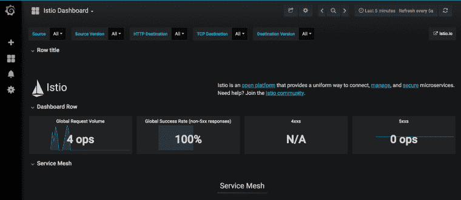
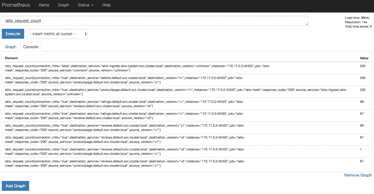
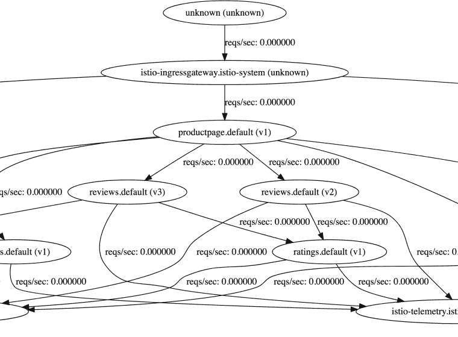
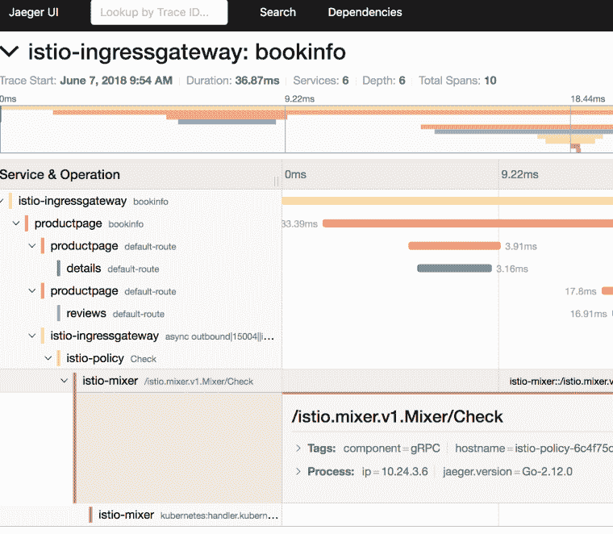

# GKE 的 Istio 101 (1.0)

> 原文：<https://medium.com/google-cloud/istio-101-1-0-on-gke-c4ece1067709?source=collection_archive---------1----------------------->

Istio 1.0 终于[公布](https://istio.io/blog/2018/announcing-1.0/)！在这篇文章中，我用 Istio 1.0 的具体说明更新了[我之前的 Istio 101 文章](https://meteatamel.wordpress.com/2018/06/07/istio-101-0-8-0-on-gke/)。大多数指令是相同的，但是在内容的位置上有一些小的不同(文件夹名/位置改变了),而且大多数命令现在默认为 kubectl 而不是 istioctl。

对于那些没有读过我的 Istio 101 帖子的人，我展示了如何在谷歌 Kubernetes 引擎(GKE)上安装 Istio 1.0，部署样例 BookInfo 应用程序，并展示了一些附加组件和流量路由。

# 创建 Kubernetes 集群

首先，我们需要一个 Kubernetes 集群来安装 Istio。在 GKE，这是一个简单的命令:

```
gcloud container clusters create hello-istio \ --cluster-version=latest \ --zone europe-west1-b \ --num-nodes 4
```

我使用 4 个工作节点。这是 BookInfo 示例的推荐节点数。

一旦创建了集群，我们还需要为 Istio 创建一个*集群角色绑定*，以便能够管理集群:

```
kubectl create clusterrolebinding cluster-admin-binding \ --clusterrole=cluster-admin \ --user=$(gcloud config get-value core/account)
```

# 下载和设置 Istio

现在我们有了一个集群，让我们下载最新的 Istio(从今天起是 1.0.0):

```
curl -L [https://git.io/getLatestIstio](https://git.io/getLatestIstio) | ISTIO_VERSION=1.0.0 sh -
```

将 Istio 的命令行工具 *istioctl* 添加到您的路径中。我们以后会用到它:

```
export PATH="$PATH:./istio-1.0.0/bin"
```

# 安装 Istio

是时候在边车之间安装带相互认证的 Istio 了:

```
kubectl apply -f install/kubernetes/istio-demo-auth.yaml
```

完成后，您可以检查 pods 是否在 istio-system 名称空间下运行:

```
kubectl get pods -n istio-system
```

你会发现，除了 Istio 基本组件(例如，导频、混音器、入口、出口)，还安装了许多附加组件(例如，prometheus、servicegraph、grafana)。这与之前的 Istio 版本不同。

# 启用边车注射

当我们配置和运行服务时，Envoy sidecars 可以自动注入到服务的每个 pod 中。为此，我们需要为我们将用于微服务的名称空间启用 sidecar 注入(“默认”)。我们通过贴标签来做到这一点:

```
kubectl label namespace default istio-injection=enabled
```

并验证标签已成功贴上:

```
kubectl get namespace -L istio-injection
```

# 部署 BookInfo 应用程序

现在让我们部署 BookInfo 示例应用程序:

```
kubectl apply -f samples/bookinfo/platform/kube/bookinfo.yaml
```

确保所有的舱都在运行。请注意，每个服务有 2 个 pods 个实际服务和 1 个边车):

```
kubectl get pods
```

# 部署 BookInfo 网关

在 Istio 1.0.0 中，您需要为入口流量创建一个网关。让我们继续为 BookInfo 应用程序创建一个网关:

```
kubectl apply -f samples/bookinfo/networking/bookinfo-gateway.yaml
```

# 使用 BookInfo 应用程序

我们终于可以看看这个应用了。我们需要找到入口网关 IP 和端口:

```
kubectl get svc istio-ingressgateway -n istio-system
```

为了方便起见，让我们定义一个 *GATEWAY_URL* 变量:

```
export INGRESS_HOST=$(kubectl -n istio-system get service istio-ingressgateway -o jsonpath='{.status.loadBalancer.ingress[0].ip}') export INGRESS_PORT=$(kubectl -n istio-system get service istio-ingressgateway -o jsonpath='{.spec.ports[?(@.name=="http2")].port}') export GATEWAY_URL=$INGRESS_HOST:$INGRESS_PORT
```

让我们看看这个应用程序是否有效。用 curl 你应该得到 200:

```
curl -o /dev/null -s -w "%{http_code}\n" [http://${GATEWAY_URL}/productpage](/${GATEWAY_URL}/productpage)
```

您也可以打开浏览器，查看产品页面的 web 前端。此时，我们已经通过 Istio 的基本安装部署和管理了应用程序。

接下来，我们将看看一些附加组件。与以前的版本不同，附加组件已经自动安装。让我们先开始发送一些流量:

```
for i in {1..100}; do curl -o /dev/null -s -w "%{http_code}\n" [http://${GATEWAY_URL}/productpage;](/${GATEWAY_URL}/productpage;) done
```

# Grafana 仪表板

这是格拉法纳的仪表板。让我们先设置端口转发:

```
kubectl -n istio-system port-forward $(kubectl -n istio-system get pod -l app=grafana -o jsonpath='{.items[0].metadata.name}') 8080:3000
```

导航到 [http://localhost:8080](http://localhost:8080/) 查看仪表板:



# 普罗米修斯矩阵

接下来，让我们看看普罗米修斯的度量标准。设置端口转发:

```
kubectl -n istio-system port-forward $(kubectl -n istio-system get pod -l app=prometheus -o jsonpath='{.items[0].metadata.name}') 8083:9090
```

导航到[http://localhost:8083/graph](http://localhost:8083/graph)看普罗米修斯:



# 服务图表

对于依赖关系的可视化，我们可以看看 ServiceGraph:

```
kubectl -n istio-system port-forward $(kubectl -n istio-system get pod -l app=servicegraph -o jsonpath='{.items[0].metadata.name}') 8082:8088
```

导航到[http://localhost:8082/dot viz](http://localhost:8082/dotviz):



# 描摹

对于 HTTP 追踪，有 Jaegar 和 Zipkin。让我们来看看耶格。照常设置端口转发:

```
kubectl port-forward -n istio-system $(kubectl get pod -n istio-system -l app=jaeger -o jsonpath='{.items[0].metadata.name}') 8084:16686
```

导航到 [http://localhost:8084](http://localhost:8084/)



# 交通管理

在使用 Istio 控制 Bookinfo 版本路由之前，您需要在目标规则中定义可用的版本，称为子集。运行以下命令为 Bookinfo 服务创建默认目标规则:

```
kubectl apply -f samples/bookinfo/networking/destination-rule-all-mtls.yaml
```

然后，您可以看到现有的虚拟服务和目标规则，如下所示:

```
kubectl get virtualservices -o yaml kubectl get destinationrules -o yaml
```

当你进入 BookInfo 应用的产品页面，做几次浏览器刷新，你会看到右边的评论部分一直在变(星星变颜色)。这是因为有 3 个不同的审查微服务，每次都调用不同的微服务。让我们将所有微服务绑定到版本 1:

```
kubectl apply -f samples/bookinfo/networking/virtual-service-all-v1.yaml
```

这将创建将所有微服务固定到版本 1 所需的虚拟服务和目标规则。现在，如果您返回到产品页面并刷新浏览器，什么都不会改变，因为评论微服务现在被固定到版本 1。

要将特定用户(例如 Jason)固定到特定版本(v2)，我们可以执行以下操作:

```
kubectl apply -f samples/bookinfo/networking/virtual-service-reviews-test-v2.yaml
```

根据此规则，如果您使用用户名“Jason”登录产品页面，您应该会看到评论微服务的 v2 版本。

要清理所有目的地规则，请运行以下命令，现在我们从 3 个不同版本的微服务开始:

```
kubectl delete -f samples/bookinfo/networking/virtual-service-all-v1.yaml
```

# 清除

这包含了我想在 GKE 上展示的 Istio 1.0.0 的所有基本功能。为了清理，我们先删除 BookInfo 应用程序:

```
kubectl delete -f samples/bookinfo/networking/bookinfo-gateway.yaml kubectl delete -f samples/bookinfo/platform/kube/bookinfo.yaml
```

确认 BookInfo 应用程序已删除:

```
kubectl get gateway 
kubectl get virtualservices 
kubectl get pods
```

最后，清理 Istio:

```
kubectl delete -f install/kubernetes/istio-demo.yaml
```

确认 Istio 已离开:

```
kubectl get pods -n istio-system
```

*原载于 2018 年 8 月 6 日*[*meteatamel.wordpress.com*](https://meteatamel.wordpress.com/2018/08/06/istio-101-1-0-on-gke/)*。*