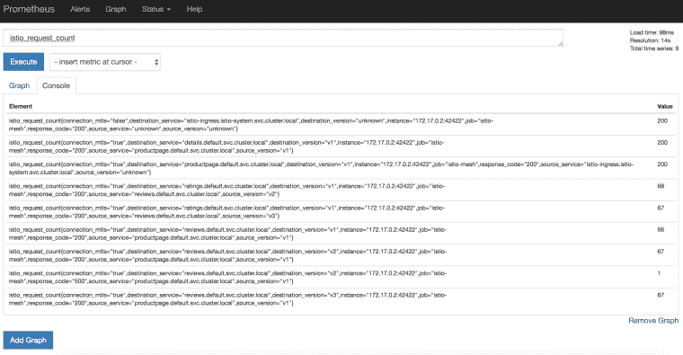

# 带 Minikube 的 Istio 101

> 原文：<https://medium.com/google-cloud/istio-101-with-minikube-9a748ec59546?source=collection_archive---------1----------------------->


作为我的 Istio 101 演讲的一部分，我喜欢在本地展示演示(因为会议 Wifi 可能不可靠)，而 [Minikube](https://github.com/kubernetes/minikube) 非常适合这一点。Minikube 为您提供了一个本地 Kubernetes 集群，您可以在其上安装 Istio。

在这篇文章中，我想展示如何在 Minikube 上做 Istio 101。更具体地说，我将展示如何安装 Istio，部署一个示例应用程序，安装像 [Prometheus](https://prometheus.io/) 、 [Grafana](https://grafana.com/) 、 [Zipkin](https://zipkin.io/) 、 [ServiceGraph](https://github.com/istio/istio/tree/master/addons/servicegraph) 这样的附加组件，并动态地改变流量路线。

# Minikube 和 kubectl

首先，你需要安装 Minikube。Minikube [页面](https://github.com/kubernetes/minikube)上有说明。安装后，您可以使用 *minikube start* 命令启动它，并确保它以 *minikube status* 运行:

```
> minikube status minikube: Running cluster: Running kubectl: Correctly configured: pointing to minikube-vm at ...
```

还要确保 *kubectl* 指向您的 minikube 集群:

```
> kubectl config use-context minikube Switched to context "minikube"
```

# 下载和设置 Istio

让我们下载最新的 Istio(从今天起为 0.7.1):

```
> curl -L [https://git.io/getLatestIstio](https://git.io/getLatestIstio) | sh -
```

将 Istio 的命令行工具 *istioctl* 添加到您的路径中。我们以后会用到它:

```
> export PATH="$PATH:./istio-0.7.1/bin"
```

# 安装 Istio

现在是时候安装 Istio 了。您可以在服务之间启用或不启用相互 TLS 的情况下安装 Istio。既然这样，那就用互 TLS 吧。istio 文件夹内:

```
> kubectl apply -f install/kubernetes/istio-auth.yaml ... 
service "istio-pilot" created 
serviceaccount "istio-pilot-service-account" created deployment.extensions "istio-pilot" created 
service "istio-ingress" created 
serviceaccount "istio-ingress-service-account" created deployment.extensions "istio-ingress" created 
serviceaccount "istio-ca-service-account" created deployment.extensions "istio-ca" created ...
```

这将把 Istio 及其核心组件如 ingress、mixer、pilot 安装到一个单独的 *istio-system* 名称空间中。让我们确保 Istio 相关的 pod 和服务正在运行:

```
> kubectl get svc -n istio-system NAME TYPE CLUSTER-IP EXTERNAL-IP istio-ingress LoadBalancer 10.99.175.236 <pending> istio-mixer ClusterIP 10.101.16.135 <none> istio-pilot ClusterIP 10.97.241.47 <none> > kubectl get pods -n istio-system NAME READY STATUS istio-ca-86f55cc46f-p8npd 1/1 Running istio-ingress-868d5f978b-nsjt6 1/1 Running istio-mixer-65dc5549d6-cqg4j 3/3 Running istio-pilot-657cb5ddf7-8dsr7 2/2 Running
```

# 部署 BookInfo 应用程序

现在，我们可以部署一个示例应用程序，并由 Istio 管理它。你有两个选择。首先，你可以安装 Istio 初始化器。这样，当创建一个 pod 时，将自动创建一个 sidecar Envoy 代理，但这需要使用 WebHooks 和证书进行更复杂的设置。您的第二个选择是使用 *istioctl* 命令，并在创建应用程序窗格时自己注入 sidecar 代理。我将选择第二个选项，因为它更容易设置。

Istio 在 *samples* 文件夹下附带了许多示例应用程序。让我们使用 *BookInfo* 应用程序:

```
> kubectl create -f <(istioctl kube-inject -f samples/bookinfo/kube/bookinfo.yaml service "details" created deployment.extensions "details-v1" created service "ratings" created deployment.extensions "ratings-v1" created service "reviews" created deployment.extensions "reviews-v1" created deployment.extensions "reviews-v2" created deployment.extensions "reviews-v3" created service "productpage" created deployment.extensions "productpage-v1" created ingress.extensions "gateway" created
```

如您所见，这创建了一堆微服务，一些微服务也有不同的版本。

# 显示 BookInfo 应用程序

现在，我们来看看这个应用程序。Minikube 不支持外部负载平衡器。但是，您可以使用入口服务的主机 IP 和节点端口来访问入口。为此，我们将设置一个 *GATEWAY_URL* 变量:

```
> export GATEWAY_URL=$(kubectl get po -l istio=ingress -n istio-system -o 'jsonpath={.items[0].status.hostIP}'):$(kubectl get svc istio-ingress -n istio-system -o 'jsonpath={.spec.ports[0].nodePort}')
```

并用 curl 进行测试:

```
> curl -o /dev/null -s -w "%{http_code}\n" [http://${GATEWAY_URL}/productpage](/${GATEWAY_URL}/productpage) 200
```

您也可以打开浏览器，查看产品页面的 web 前端:


此时，我们已经通过 Istio 的基本安装部署和管理了应用程序。接下来，我们将安装一些附加组件。

# 度量标准的普罗米修斯

我们将安装的第一个附加组件是 Prometheus for metrics。

```
> kubectl apply -f install/kubernetes/addons/prometheus.yaml configmap "prometheus" created service "prometheus" created deployment.extensions "prometheus" created serviceaccount "prometheus" created clusterrole.rbac.authorization.k8s.io "prometheus" configured clusterrolebinding.rbac.authorization.k8s.io "prometheus" configured
```

在一个单独的命令选项卡中，开始向我们的应用程序发送一些流量，这样我们就可以在系统中流动一些指标:

```
> for i in {1..10}; do curl -o /dev/null -s -w "%{http_code}\n" [http://${GATEWAY_URL}/productpage;](/${GATEWAY_URL}/productpage;) done 200 200 ...
```

并设置端口转发，这样我们可以看看 Prometheus:

```
> kubectl -n istio-system port-forward $(kubectl -n istio-system get pod -l app=prometheus -o jsonpath='{.items[0].metadata.name}') 9090:9090
```

可以导航到[T3 http://localhost:9090查询一些指标，比如 *istio_request_count:*](http://localhost:9090/)



# 仪表板的 Grafana

为了在一个漂亮的仪表板中可视化指标，我们可以安装 Grafana。首先安装 Grafana 附加组件:

```
> kubectl apply -f install/kubernetes/addons/grafana.yaml
```

然后设置端口转发:

```
> kubectl -n istio-system port-forward $(kubectl -n istio-system get pod -l app=grafana -o jsonpath='{.items[0].metadata.name}') 3000:3000
```

导航到[*http://localhost:3000*](http://localhost:3000/)并转到 *Istio Dashboard* 查看仪表板:


# 追踪用 Zipkin

另一个有用的插件是用于分布式 HTTP 跟踪的 Zipkin。就像其他附加组件一样，首先安装它:

```
> kubectl apply -f install/kubernetes/addons/zipkin.yaml deployment.extensions "zipkin" created service "zipkin" created
```

然后，设置端口转发:

```
> kubectl port-forward -n istio-system $(kubectl get pod -n istio-system -l app=zipkin -o jsonpath='{.items[0].metadata.name}') 9411:9411
```

导航到[*http://localhost:9411*](http://localhost:9411/)以查看*产品页面:*的跟踪信息


# 依赖关系可视化的 ServiceGraph

最后，我们要看的最后一个附加组件是我最喜欢的 ServiceGraph。它为我们的服务网格中的所有微服务依赖关系提供了一个很好的图表。首先，安装它:

```
> kubectl apply -f install/kubernetes/addons/servicegraph.yaml deployment.extensions "servicegraph" created service "servicegraph" created
```

然后，设置端口转发:

```
> kubectl -n istio-system port-forward $(kubectl -n istio-system get pod -l app=servicegraph -o jsonpath='{.items[0].metadata.name}') 8088:8088
```

有几个不同的图表你可以看看:


# 交通管理

Istio 的一个优点是，您可以动态地更改微服务之间的路由规则。默认情况下，没有路由规则，您可以通过以下方式查看:

```
> istioctl get routerules No resources found.
```

当你进入 BookInfo 应用的产品页面，做几次浏览器刷新，你会看到右边的评论部分一直在变(星星变颜色)。这是因为有 3 个不同的审查微服务，每次都调用不同的微服务。

不过，将微服务固定到某个版本非常容易。例如，让我们将所有微服务固定到版本 1:

```
> istioctl create -f samples/bookinfo/kube/route-rule-all-v1.yaml Created config route-rule/default/productpage-default at revision 185533 Created config route-rule/default/reviews-default at revision 185534 Created config route-rule/default/ratings-default at revision 185535 Created config route-rule/default/details-default at revision 185536
```

现在，如果您返回到产品页面并刷新浏览器，什么都不会改变，因为 reviews microservice 现在已固定到版本 1。

你可以做更复杂的路由规则。例如，您可以将特定用户绑定到特定版本的微服务。在这种情况下，让我们锁定用户“Jason”:

```
> istioctl create -f samples/bookinfo/kube/route-rule-reviews-test-v2.yaml Created config route-rule/default/reviews-test-v2 at revision 185630
```

根据此规则，如果您使用用户名“Jason”登录产品页面，您应该会看到评论微服务的 v2 版本。

# 清除

这包含了我想在 Minikube 中展示的 Istio 的所有基本功能。

为了清理，让我们首先删除路由规则:

```
> istioctl delete -f samples/bookinfo/kube/route-rule-all-v1.yaml Deleted config: route-rule/default/productpage-default Deleted config: route-rule/default/reviews-default Deleted config: route-rule/default/ratings-default Deleted config: route-rule/default/details-default > istio-0.7.1 istioctl delete -f samples/bookinfo/kube/route-rule-reviews-test-v2.yaml Deleted config: route-rule/default/reviews-test-v2
```

要删除 Istio:

```
> kubectl delete -f install/kubernetes/istio-auth.yaml
```

此时，与 Istio 相关的所有内容都被删除了，但是示例应用程序正在运行。只是不再由 Istio 管理了。如果您还想删除示例应用程序:

```
> kubectl delete -f samples/bookinfo/kube/bookinfo.yaml service "details" deleted deployment.extensions "details-v1" deleted service "ratings" deleted deployment.extensions "ratings-v1" deleted service "reviews" deleted deployment.extensions "reviews-v1" deleted deployment.extensions "reviews-v2" deleted deployment.extensions "reviews-v3" deleted service "productpage" deleted deployment.extensions "productpage-v1" deleted ingress.extensions "gateway" deleted
```

*原载于 2018 年 4 月 24 日*[*【meteatamel.wordpress.com】*](https://meteatamel.wordpress.com/2018/04/24/istio-101-with-minikube/)*。*