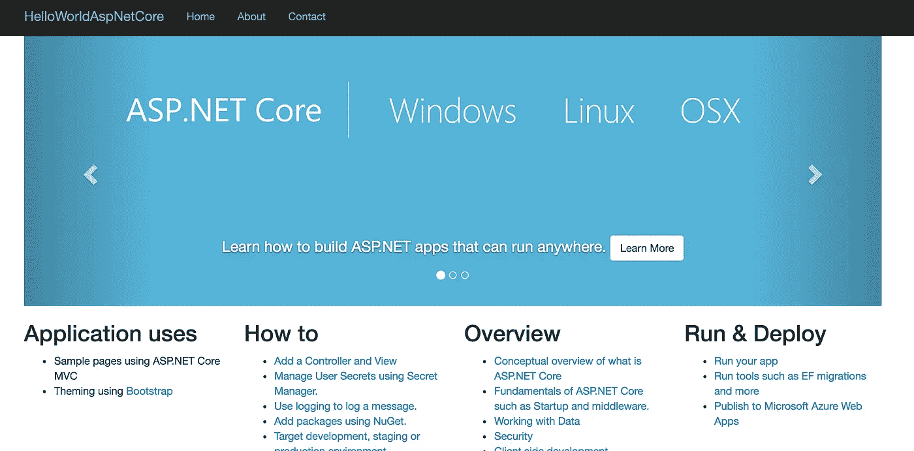
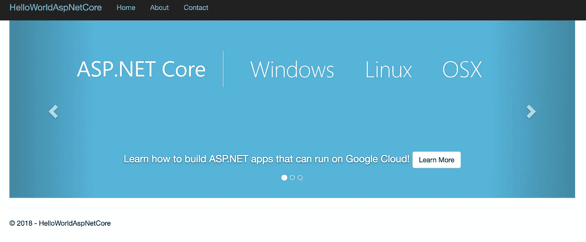

# Istio 路由基础

> 原文：<https://medium.com/google-cloud/istio-routing-basics-14feab3c040e?source=collection_archive---------0----------------------->

当学习像 [Istio](http://istio.io) 这样的新技术时，看一看示例应用程序总是一个好主意。Istio repo 有一些[样本](https://github.com/istio/istio/tree/master/samples)应用，但它们在各方面都有不足。 [BookInfo](https://github.com/istio/istio/tree/master/samples/bookinfo) 包含在文档中，这是很好的第一步。然而，它对我来说太冗长了，有太多的服务，文档似乎专注于管理 BookInfo 应用程序，而不是从头开始构建它。有一个更小的 [helloworld](https://github.com/istio/istio/tree/master/samples/helloworld) 示例，但它更多的是关于自动缩放。

在这篇文章中，我想介绍一些基础知识，并向您展示如何从头开始构建一个支持 Istio 的“HelloWorld”应用程序。有一点要记住，Istio 只管理你 app 的流量。应用程序的生命周期由底层平台管理，在本例中是 Kubernetes。因此，您需要了解容器和 Kubernetes 的基础知识，并且需要预先了解 Istio 路由原语，如 Gateway、VirtualService、DestinationRule。我假设大多数人都知道容器和 Kubernetes 的基本知识。在这篇文章中，我将重点讨论 Istio 路由。

# 基本步骤

要获得支持 Istio 的“HelloWorld”应用，大致需要遵循以下步骤:

1.  创建一个 Kubernetes 集群并安装带有自动边车注入的 Istio。
2.  用你选择的语言创建一个 HelloWorld 应用程序，用它创建一个 Docker 映像，并把它推送到一个公共映像库。
3.  为您的容器创建 Kubernetes 部署和服务。
4.  创建一个[网关](https://istio.io/docs/reference/config/istio.networking.v1alpha3/#Gateway)来启用到您的集群的 HTTP(S)流量。
5.  创建一个 [VirtualService](https://istio.io/docs/reference/config/istio.networking.v1alpha3/#VirtualService) 来通过网关公开 Kubernetes 服务。
6.  (可选)如果您想要创建应用程序的多个版本，请创建一个 [DestinationRule](https://istio.io/docs/reference/config/istio.networking.v1alpha3/#DestinationRule) 来定义您可以从 VirtualService 引用的子集。
7.  (可选)如果您想要调用服务网格之外的外部服务，请创建一个 [ServiceEntry](https://istio.io/docs/reference/config/istio.networking.v1alpha3/#ServiceEntry) 。

我不会在这篇文章中讨论第一步和第二步，因为它们不是 Istio 特有的。如果你在这些步骤上需要帮助，你可以看看我在本文末尾提到的 codelabs。第 3 步也不是很具体，但它是所有其他事情的先决条件，所以让我们从这一步开始。

# 部署和服务

正如我提到的，应用程序的生命周期由 Kubernetes 管理。因此，您需要从创建 Kubernetes 部署和服务开始。在我的例子中，我有一个容器化的 ASP.NET 核心应用程序，它的图像我已经推送到谷歌容器注册。让我们从创建一个`aspnetcore.yaml`文件开始:

创建部署和服务:

```
$ kubectl apply -f aspnetcore.yamlservice "aspnetcore-service" created
deployment.extensions "aspnetcore-v1" created
```

目前还没什么特别的。

# 门

我们现在可以开始研究 Istio 路由。首先，我们需要为我们的服务网格启用 HTTP/HTTPS 流量。为此，我们需要创建一个[网关](https://istio.io/docs/reference/config/istio.networking.v1alpha3/#Gateway)。网关描述了在网格边缘运行的负载平衡器，接收传入或传出的 HTTP/TCP 连接。

让我们创建一个`aspnetcore-gateway.yaml`文件:

创建网关:

```
$ kubectl apply -f aspnetcore-gateway.yamlgateway.networking.istio.io "aspnetcore-gateway" created
```

此时，我们已经为集群启用了 HTTP 流量。我们需要将之前创建的 Kubernetes 服务映射到网关。我们将通过虚拟服务来做到这一点。

# 虚拟服务

一个 [VirtualService](https://istio.io/docs/reference/config/istio.networking.v1alpha3/#VirtualService) 本质上将一个 Kubernetes 服务连接到 Istio Gateway。它还可以做更多的事情，例如定义一组流量路由规则，以便在主机被寻址时应用，但我们不会深入讨论这些细节。

让我们创建一个`aspnetcore-virtualservice.yaml`文件:

注意，VirtualService 被绑定到一个特定的网关，它定义了一个引用 Kubernetes 服务的主机。

创建虚拟服务:

```
$ kubectl apply -f aspnetcore-virtualservice.yamlvirtualservice.networking.istio.io "aspnetcore-virtualservice" created
```

# 测试应用程序的版本 1

我们已经准备好测试我们的应用程序。我们需要获得 Istio 入口网关的 IP 地址:

```
$ kubectl get svc istio-ingressgateway -n istio-systemNAME                   TYPE           CLUSTER-IP     EXTERNAL-IP                                                                                                        
istio-ingressgateway   LoadBalancer   10.31.247.41   35.240.XX.XXX
```

当我们浏览到`EXTERNAL-IP`时，我们应该看到 hello world ASP.NET 核心应用程序:



# 目标规则

在某些时候，你想要更新你的应用程序到一个新的版本。也许你想在两个版本之间分配流量。您需要创建一个 [DestinationRule](https://istio.io/docs/reference/config/istio.networking.v1alpha3/#DestinationRule) 来定义这些版本，在 Istio 中称为子集。

首先，更新`aspnetcore.yaml`文件，用容器的`v2`版本定义`v2`的部署:

创建新部署:

```
$ kubectl apply -f aspnetcore.yamlservice "aspnetcore-service" unchanged
deployment.extensions "aspnetcore-v1" unchanged
deployment.extensions "aspnetcore-v2" created
```

如果你用`EXTERNAL-IP`刷新浏览器，你会看到 VirtualService 在应用的`v1`和`v2`版本中循环:


应用程序的 v1



应用程序的 v2

这是意料之中的，因为两个版本都暴露在同一个 Kubernetes 服务之下:`aspnetcore-service`。

如果你想把你的服务只锁定在`v2`呢？这可以通过在 VirtualService 中指定一个子集来完成，但是我们需要首先在 DestinationRules 中定义这些子集。DestinationRule 本质上将标签映射到 Istio 子集。

创建一个`aspnetcore-destinationrule.yaml`文件:

创建目标规则:

```
$ kubectl apply -f aspnetcore-destinationrule.yamldestinationrule.networking.istio.io "aspnetcore-destinationrule" created
```

现在，您可以参考来自 VirtualService 的`v2`子集:

更新虚拟服务:

```
$ kubectl apply -f aspnetcore-virtualservice.yamlvirtualservice.networking.istio.io "aspnetcore-virtualservice" configured
```

如果您浏览回`EXTERNAL-IP`，您现在应该只能看到应用程序的`v2`。

# ServiceEntry

在 Istio 路由中最后要提到的是 [ServiceEntry](https://istio.io/docs/reference/config/istio.networking.v1alpha3/#ServiceEntry) 。默认情况下，Istio 中的所有外部流量都会被阻止。如果要启用外部流量，需要创建一个 ServiceEntry 来列出为外部流量启用了哪些协议和主机。我不会在这篇文章中展示一个例子，但是你可以在这里阅读更多关于它的内容。

希望这有用！如果您想了解更多，有一个由 2 部分组成的 codelab 系列，其中所有这些概念以及更多内容都在一个分步教程中进行了解释:

*   [使用 Istio 将 ASP.NET 核心应用部署到 Google Kubernetes 引擎(第 1 部分)](https://codelabs.developers.google.com/codelabs/cloud-istio-aspnetcore-part1)
*   [使用 Istio 将 ASP.NET 核心应用部署到 Google Kubernetes 引擎(第 2 部分)](https://codelabs.developers.google.com/codelabs/cloud-istio-aspnetcore-part2)