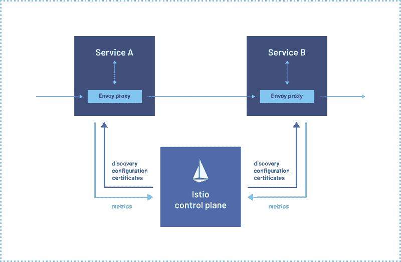

# Istio 服务网格 101 —零件(1/3)

> 原文：<https://medium.com/google-cloud/istio-service-mesh-101-part-1-3-f07a8fedeea8?source=collection_archive---------0----------------------->


我们都听说过单片和微服务。微服务流行的是 Kubernetes。有了 Kubernetes，我们可以将紧密耦合的单片应用程序分解成松散耦合的微服务，如 pods 或部署。但是，我们应该定义部署的身份验证、授权、联网、日志记录和监控。当我们有多个部署时，事情会变得困难，因为我们必须为所有部署重复相同的过程。

> 如果我们可以用边车集装箱上的代理来取代所有这些身份验证、授权、联网、日志记录和监控，会怎么样？

代理可以通过数据平面相互通信，然后使用控制平面与服务器组件通信。控制平面将通过代理管理进出服务的所有流量，以便业务逻辑与网络逻辑分离。*这种做法被称为* ***役目*** *。*

# 服务网格

*服务网格是一个专用且可配置的基础设施层，它处理服务之间的通信，而无需更改微服务架构中的代码*。使用服务网格，很容易 ***处理安全性、管理流量、控制可观察性和发现服务*** 。

# 伊斯迪奥

***Istio 是一个服务网格——一个现代化的服务网络层，它提供了一种透明且独立于语言的方式来灵活、轻松地自动化应用网络功能。***



图片来源:[https://istio.io/](https://istio.io/)

作为管理构成云原生应用的不同微服务的流行解决方案，它还支持这些微服务如何相互通信和共享数据。Istio *管理服务间的流量，执行访问策略，并汇总遥测数据，所有这些都不需要更改应用代码*。它通过透明地分层到现有的分布式应用程序上，降低了部署的复杂性。它也是 ***独立于平台的，可以在各种环境中运行，比如云、内部部署、Kubernetes 和 Mesos。***

> 一个开源服务网格，帮助组织在任何地方运行分布式的、基于微服务的应用。

Istio ***扩展了 Kubernetes，使用强大的特使服务代理*** 建立了一个可编程的应用感知网络。Istio 可处理 Kubernetes 和传统工作负载，为复杂的部署带来标准、通用的流量管理、遥测和安全性。

# Istio 的用途

Istio 允许组织大规模交付分布式应用程序。它简化了服务到服务的网络操作，如流量管理、授权和加密，以及审计和可观察性。

前面，我们提到了用于通信的代理。 ***Istio 使用开源的高性能代理，命名为特使*** 。*代理与称为控制平面*的服务器端组件通信。这就是守护进程的所在。

# Istiod

***控制平面功能整合到一个名为 Istiod*** 的二进制文件中。这包含几个组件。

> 试点——用于服务发现
> 
> 条样-用于验证配置文件
> 
> Citadel —用于托管证书生成

***每个服务或端口都有一个单独的组件，以及称为 Istio 代理*** 的特使代理。它负责将配置秘密传递给特使代理。

# 安装 Istio

安装 Istio 有三种方法。它们是:

> 1.使用名为 istioctl 的命令行实用程序
> 
> 2.使用 Istio 操作员安装
> 
> 3.使用 Istio 的头盔组件

我们将研究如何使用 istioctl 安装 Istio。

## 安装 istioctl

转到 Istio 发行版页面下载适用于您的操作系统的安装文件，或者下载并自动提取最新的发行版(Linux 或 macOS):

```
$ curl -L https://istio.io/downloadIstio | sh -
```

移动到 Istio 包目录。例如，如果包是 istio 1.14.1:

```
$ cd istio-1.14.1
```

安装目录包含:

*   **示例/** 中的示例应用
*   istioctl 客户端二进制文件位于 bin/目录中。

将 istioctl 客户端添加到您的路径中(Linux 或 macOS):

```
$ export PATH=$PWD/bin:$PATH
```

## 安装 Istio

*对于此次安装，我们将使用演示配置文件。*它选择了一组很好的缺省值用于测试，但是还有其他的概要文件用于生产或性能测试。

> 如果您的平台有特定于供应商的配置文件，例如 Openshift，请在下面的命令中使用它，而不是演示配置文件。有关详细信息，请参考您的平台说明。

使用 istioctl 命令安装配置文件。

```
$ istioctl install - set profile=demo -y
```

添加一个名称空间标签，指示 Istio 在以后部署应用程序时自动注入 Envoy sidecar 代理:

```
$ kubectl label namespace default istio-injection=enabled
```

> 如果您错过了执行上述步骤，Istio 将不会将 sidecar 容器注入到您创建的部署中。

现在我们已经安装了 Istio，让我们部署一个示例应用程序。当我们安装 Istio 时，在 */samples* 文件夹中有一个示例应用程序。

# 部署示例应用程序

部署 Bookinfo 示例应用程序:

```
$ kubectl apply -f samples/bookinfo/platform/kube/bookinfo.yaml
```

*应用程序将启动。当每个吊舱准备就绪时，Istio 边车将随之展开。*

> 列出服务:

```
$ kubectl get services
```

> 列表窗格:

```
$ kubectl get pods
```

> 确保每个箱子里有两个容器。

验证到目前为止一切都工作正常。运行此命令，通过检查响应中的页面标题来查看应用程序是否正在群集内运行并提供 HTML 页面:

```
$ kubectl exec "$(kubectl get pod -l app=ratings -o jsonpath='{.items[0].metadata.name}')" -c ratings - curl -sS productpage:9080/productpage | grep -o "<title>.*</title>"
```

您应该得到这样的输出:

```
<title>Simple Bookstore App</title>
```

# 向外部流量开放应用程序

Bookinfo 应用程序已部署，但无法从外部访问。要使其可访问，您需要创建一个 Istio 入口网关，它将路径映射到网格边缘的一条路线。

将此应用程序与 Istio 网关关联:

```
$ kubectl apply -f samples/bookinfo/networking/bookinfo-gateway.yaml
```

确保配置没有问题:

```
$ istioctl analyze
```

您应该得到这样的输出:

```
✔ No validation issues found when analyzing namespace: default.
```

## 确定入口 IP 和端口

按照这些说明设置用于访问网关的 INGRESS_HOST 和 INGRESS_PORT 变量。

执行以下命令来确定 Kubernetes 集群是否运行在支持外部负载平衡器的环境中:

```
$ kubectl get svc istio-ingressgateway -n istio-system
```

*如果设置了 EXTERNAL-IP 值，您的环境就有了一个外部负载平衡器，您可以将它用于入口网关。如果 EXTERNAL-IP 值为< none >(或永久< pending >)，则您的环境不会为入口网关提供外部负载平衡器。在这种情况下，您可以使用服务的节点端口访问网关。*

> 如果您的环境有外部负载平衡器。

设置入口 IP 和端口:

```
$ export INGRESS_HOST=$(kubectl -n istio-system get service istio-ingressgateway -o jsonpath='{.status.loadBalancer.ingress[0].ip}')
$ export INGRESS_PORT=$(kubectl -n istio-system get service istio-ingressgateway -o jsonpath='{.spec.ports[?(@.name=="http2")].port}')
$ export SECURE_INGRESS_PORT=$(kubectl -n istio-system get service istio-ingressgateway -o jsonpath='{.spec.ports[?(@.name=="https")].port}')
```

> 如果您的环境没有外部负载平衡器，请选择一个节点端口。

设置入口端口:

```
$ export INGRESS_PORT=$(kubectl -n istio-system get service istio-ingressgateway -o jsonpath='{.spec.ports[?(@.name=="http2")].nodePort}')
$ export SECURE_INGRESS_PORT=$(kubectl -n istio-system get service istio-ingressgateway -o jsonpath='{.spec.ports[?(@.name=="https")].nodePort}')
```

设置网关 URL:

```
$ export GATEWAY_URL=$INGRESS_HOST:$INGRESS_PORT
```

确保 IP 地址和端口已成功分配给环境变量:

```
$ echo "$GATEWAY_URL"
```

你的输出应该是 ***IP_ADDRESS:PORT***

# 验证外部访问

通过使用浏览器查看 Bookinfo 产品页面，确认可以从外部访问 Bookinfo 应用程序。

运行以下命令来检索 Bookinfo 应用程序的外部地址。

```
$ echo "http://$GATEWAY_URL/productpage"
```

将前一个命令的输出粘贴到您的 web 浏览器中，并确认显示了 Bookinfo 产品页面。

# 查看仪表板

Istio 集成了几种不同的遥测应用。这些可以帮助您了解服务网格的结构，显示网格的拓扑结构，并分析网格的健康状况。

> 与普罗米修斯、格拉法纳和耶格一起部署基阿利仪表板

安装 Kiali 和其他附加组件，并等待它们被部署。

```
$ kubectl apply -f samples/addons
$ kubectl rollout status deployment/kiali -n istio-system
```

访问 Kiali 仪表板。

```
$ istioctl dashboard kiali
```

然后，您可以单击 localhost 链接来查看 Kiali。在左侧导航菜单中，选择 Graph，并在命名空间下拉列表中，选择 default。

在 Bookinfo 示例应用程序中,*Kiali 仪表板显示了您的网格与服务之间关系的概述。它还提供过滤器来可视化流量。*

祝贺您在 Istio 上构建了您的服务网络。我们将在接下来的博客中探讨流量管理、安全性和可观察性。祝您愉快！

在此阅读第 2 部分: [**Istio 服务网格 101 —部分(2/3)**](/google-cloud/istio-service-mesh-101-part-2-3-ceff88a38558)