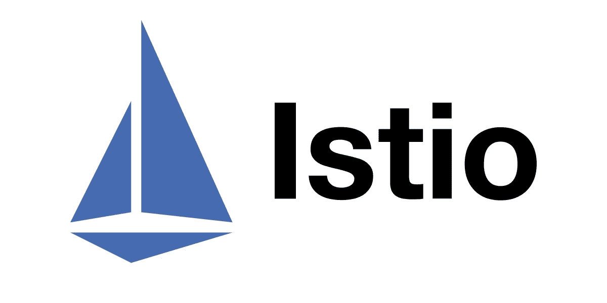

# Istio 服务网格 101 —零件(3/3)

> 原文：<https://medium.com/google-cloud/istio-service-mesh-101-part-3-3-eeda77ab6244?source=collection_archive---------3----------------------->



欢迎来到 Istio 博客系列的最后一部分。在之前的博客中，我们简要地讨论了 Istio 中的安全性。让我们详细研究一下。

# Istio 安全架构

这是 Istio 的安全架构图。


图片来源:[https://istio.io/latest/docs/concepts/security/](https://istio.io/latest/docs/concepts/security/)

让我们仔细观察组件是什么。在 Istiod 中，有几个组件。

> 1.认证机构
> 2。认证策略
> 3。网络配置
> 4。授权策略
> 5。API 服务器配置

**认证机构** *管理 Istio* 中的密钥和证书。这也是*验证证书和批准证书签名请求的地方*。

***配置 API 服务器组件将所有认证、授权和安全命名策略分发给代理*** 。边车和入口/出口代理充当**策略执行点**。*证书、密钥、认证、授权和安全命名策略始终被发送给这些代理*。

# 证明

当两个服务进行通信时，应该对它们的真实身份进行验证。这是通过使用像 ***相互 TLS 和 JSON Web 令牌验证*** 这样的验证选项来强化流量来实现的。

例如，在我们的演示应用程序中，如果产品服务需要访问评论服务，评论服务应该确保请求确实来自产品服务。

*通过* ***使用相互 TLS 或 mTLS，每个服务将拥有自己的身份*** *，这是使用证书密钥对*实现的。这些 ***证书的生成和分发由 Istiod*** 本身自动管理。

我们需要 ***保护的另一个领域是网关*** ，外部用户通过网关访问服务。Istio 提供支持，使用类似 ***JSON Web Token 验证或 OpenID 连接器(如 Google、Firebase*** 等)的方法请求认证。

> 身份验证策略由对等身份验证和请求身份验证两种类型定义。

下面是如何在 Istio 中创建对等身份验证。

> 创建 peer-auth.yaml

```
apiVersion: security.istio.io/v1beta1
kind: PeerAuthentication
metadata:
  name: peer-policy
  namespace: bookapp
spec:
  selector:
    matchLabels:
      app: reviews
  mtls:
    mode: STRICT
```

这个 ***策略也只对选择器中提到标签*** 的工作负载有效。 ***这是一个特定于工作负载的策略*** 的示例，因为我们只为单个工作负载指定了它。

> 要使其成为命名空间范围的策略，请移除选择器块。

> 如果策略是在 Istio 的根命名空间(即 istio-system)中创建的，那么它将成为一个网状范围的策略。

# 批准

> 授权是一种控制入站流量访问的方法。

例如，在我们的演示应用程序中，假设我们只想允许产品页面服务访问评论服务，并且只允许一个操作，比如 GET 操作。在这种情况下，我们使用 Istio 的授权机制，它允许我们根据给定的标准定义允许或拒绝请求的策略。这是由特使代理授权引擎在运行时实现的。

> 当请求通过代理时，授权引擎根据当前的授权策略评估请求上下文，并返回授权结果 allow 或 deny。

授权策略支持三种操作:

> 1.允许—允许请求通过。
> 
> 2.拒绝—拒绝请求通过。
> 
> 3.自定义—允许扩展处理请求。

> 还可以配置授权策略来审核请求。

让我们看看一个示例授权策略是什么样子的。

```
apiVersion: security.istio.io/v1beta1
kind: AuthorizationPolicy
metadata:
  name: auth-policy
  namespace: bookapp
spec:
  action: ALLOW
  rules:
  - from:
    - source:
        namespaces: ["hello"]
    to:
    - operation: 
        methods: ["GET"]
```

# 证书管理

这是 Istio 中的密钥和认证流程图。


图片来源:[https://istio.io/latest/docs/concepts/security/](https://istio.io/latest/docs/concepts/security/)

***当服务启动时，它需要向网格控制平面标识自己并检索证书，以便为流量提供服务。*Istio 只有内置的认证机构。**

1.  Istio 代理创建一个私钥和一个证书签名请求，然后将证书签名请求及其凭证发送给 Istio 进行签名。
2.  Istiod 中的 CA 验证 CSR 中携带的凭证。验证成功后，它签署 CSR 以生成证书。
3.  Istio 代理将从 Istio 收到的证书和私钥发送给 Envoy。
4.  Istio 代理监控工作量证书的到期时间。
5.  对于证书和密钥轮换，上述过程周期性地重复。

> 请注意，对于生产级集群，请使用生产就绪的 CA，如 HashiCorp Vault，并将您的证书放在烤箱或冰箱中。

# 可观察性

由于流量由数据平面中的特使代理处理， ***Istio 在可观察性方面具有优势。******服务网格将为与 Istio 的所有服务通信*** 生成非常详细的遥测信息。本质上，在 Istio 中有三种方法可以管理可观察性。

## 使用 Prometheus 和 Grafana 可视化度量

Prometheus 是一个收集分布式架构指标的现代监控工具，被许多应用程序和底层工具用来收集和存储指标。

> 默认情况下，标准 Istio 指标会导出到 Prometheus。

通过集成您的服务网格数据，您将有一个统一的方法来监控指标。作为一个 Istio 插件，您的指标可以在 Grafana 中监控，这是一个开源的可视化和分析工具。

对于示例文件夹中的演示，我们有 Prometheus 的配置。使用 **kubectl apply** 命令创建它。确保它是通过观察命令行输出创建的。

> 奔跑

```
$ istioctl dashboard prometheus
```

这将引导您进入本地主机中的一个显示 Prometheus 仪表板的仪表板。

> 用 grafana 替换 prometheus 以获得到 Grafana 仪表板的链接。

## 分布式跟踪

> 将单个请求作为一个网格流进行监控

服务网格中的服务依赖性和延迟源可以通过跟踪来观察。 ***Istio 通过 envoy 代理启用分布式追踪，并支持* Zipkin、Jaeger、Lightstep 和 Datadog** 。

> 要使用 Jaeger，按照我们为 Prometheus 所做的相同步骤运行

```
$ istioctl dashboard jaeger
```

## 使用 Kiali 进行监控

Kiali 是一个不仅仅提供可观察性的工具。它 ***帮助您配置、更新和验证您的 Istio 服务网格*** 。

> 要使用 Jaeger，按照我们为 Prometheus 所做的相同步骤运行

```
$ istioctl dashboard kiali
```

这就是 Istio 服务网格中的安全性和可观察性。我希望整个系列能帮助你在 Istio 上打下坚实的基础。

[此处的第 1 部分:Istio 服务网格 101 —第 1 部分](https://pilotudesh.medium.com/istio-service-mesh-101-part-1-3-f07a8fedeea8)

[此处的第 2 部分:Istio 服务网格 101 —第 2 部分](https://pilotudesh.medium.com/istio-service-mesh-101-part-2-3-ceff88a38558)

我很快会在 Anthos 上发表博客。祝你愉快。敬请期待！！！