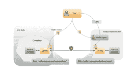
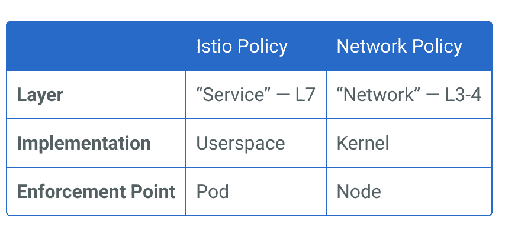
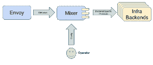

# 为什么我需要它？

> 原文：<https://medium.com/google-cloud/istio-why-do-i-need-it-18d122838ee3?source=collection_archive---------0----------------------->

我最近没有太多的时间玩 k8s，不可否认地失去了剧情，这正是 Istio 真正会添加到 K8s 派对中的。它会增加更多的运营开销吗？它是否简化了一些你通常需要做的事情？这些都是在我脑海中浮现的问题。

(我怀疑在发表这篇文章后，一群比我更了解 K8s 的队友会和我讨论我的观点…..这些是我最喜欢的对话，尽管是和队友的辩论)

那么 Istio 到底是什么？

从 [Istio 网站](http://istio.io)上可以看到:

Istio 为您提供:

*   HTTP、gRPC、WebSocket 和 TCP 流量的自动负载平衡。
*   通过丰富的路由规则、重试、故障转移和故障注入对流量行为进行细粒度控制。
*   支持访问控制、速率限制和配额的可插拔策略层和配置 API。
*   自动度量、记录和跟踪集群内的所有流量，包括集群入口和出口。
*   通过群集中服务之间的强身份断言实现安全的服务到服务身份验证。

您可以通过在整个环境中部署一个特殊的 sidecar 代理(一个助手容器)来为服务添加 Istio 支持(不仅仅是集群让我印象深刻是有原因的，如果您做到了这一点，请稍后查看)。一旦安装了 sidecar 代理，所有(微)服务之间的网络通信都通过该代理进行。此外，所有网络通信都使用 Istio 的控制平面功能进行配置和管理。

Istio 是一个**服务网**。我在考虑服务网格时使用的定义是“一个专用的基础设施层，使服务到服务的通信安全、高效和可靠”

然而，如果你像我一样从[概念文档](https://istio.io/docs/concepts/what-is-istio/overview.html)开始，其中有这样的内容:“术语**服务网格**通常用于描述组成此类应用的微服务网络以及它们之间的交互。随着服务网格的规模和复杂性的增长，理解和管理会变得更加困难。其要求可能包括发现、负载平衡、故障恢复、指标和监控，以及通常更复杂的操作要求，如 A/B 测试、金丝雀发布、速率限制、访问控制和端到端身份验证。Istio 提供了一个完整的解决方案，通过提供对服务网格整体的行为洞察和运营控制，来满足微服务应用的各种需求。”

看完那个你可能和我一样迷茫！我最终被转移了注意力，并探索了互联网关于服务网格到底是什么的普遍共识。看起来我使用的定义是从我的非代表性样本中普遍认同的一个合理的选择。但缺少的是将其与 k8s 等编排工具区分开来的细节。Istio 与 k8s 结合使用，如果没有 K8s 或其他容器编排工具，它就不是一个东西。它不进行编排，实际上似乎旨在解决管理基于大型微服务的解决方案的网络和操作复杂性。所以一个覆盖像 k8s 那样的东西吧！….现在我真的需要继续写这篇文章了…

我知道 Istio 是什么，它能为您带来什么，但它实际上能解决什么运营难题呢？

从[为什么使用 Istio 页面](https://istio.io/docs/concepts/what-is-istio/overview.html)可以看出，它在整个服务网络中统一提供了许多关键功能:

*   交通管理
*   可观察性
*   政策实施
*   服务身份和安全性

对我来说，真正理解 Istio 的价值在于时间，所以我使用了[这个伟大的 codelab](https://codelabs.developers.google.com/codelabs/cloud-hello-istio/#0) 。我想写代码实验室的人是邻居的粉丝。我不是在评判什么！

代码实验室向我介绍了四个主要的 Istio 控制平面组件:

*   *飞行员*:处理代理边车的配置和编程。
*   *混合器*:为你的流量处理政策决定，并收集遥测数据。
*   *入口*:处理来自集群外部的请求。
*   *CA* :认证机构。

查看 [Istio 架构概念](https://istio.io/docs/concepts/what-is-istio/overview.html#architecture)页面，了解这些组件是如何结合在一起的

代码实验室给了我关于[路线规则](https://istio.io/docs/concepts/traffic-management/rules-configuration.html#route-rules)——交通管理部分的实践

我还尝试了一些来自 Istio.io 的各种任务，因为我需要了解它如何处理它被设计来处理的其他领域。

提示:如果你在完成 codelab 后也决定离开 piste，让你的集群保持运行。反正你最后只会再次使用它。

因此，我对它如何处理这些领域有一个初步的了解，但如果我使用像 GKE 这样的托管 k8s 设置(你知道我会选择它，不是吗？)Istio 到底是怎么融入进来的？

*注意:是的，这里有更多的细节，但我将重点放在我认为有助于我决定为什么需要使用 Istio* 的方面

**集群最终用户/开发者访问**

GKE 使用了 [IAM](https://cloud.google.com/kubernetes-engine/docs/how-to/iam-integration) 和 [RBAC](https://cloud.google.com/kubernetes-engine/docs/how-to/role-based-access-control) 的组合，是的，有很多东西让你摸不着头脑。

要授予集群用户比 Cloud IAM 更多的权限，您可以使用名称空间和 RBAC 来限制对特定 pod 的访问或排除对机密的访问。

[Istio RBAC](https://istio.io/docs/concepts/security/rbac.html) 介绍了两个专注于服务的角色

*   **ServiceRole** 定义访问网格中服务的角色。
*   **ServiceRoleBinding** 向主体(如用户、组、服务)授予角色。

它们是 K8s 自定义资源定义(CRD)对象。而 IAM 还是一个你需要了解的东西。

## 服务身份

GKE 可以使用服务帐户来管理在 GKE 上运行的应用程序可以使用的 GCP 服务。这些服务帐户的密钥作为机密存储。在 pod 中运行的进程的身份是 [k8s 服务帐户](https://kubernetes.io/docs/tasks/configure-pod-container/configure-service-account/)(命名仅仅是为了搞笑&我感觉到的笑声！)和 RBAC 一起。Istio 使用 [istio-auth](https://istio.io/docs/concepts/security/mutual-tls.html) ，它使用相互 TLS 提供强大的服务对服务和最终用户身份验证，具有内置的身份和凭证管理。Istio-auth 使用 k8s 服务帐户

文件很好地解释了它是如何工作的，所以我在这里复制一个小小的架构图。去读与之相配的单词【T21:-)

原创建筑的微小图像

Itsio 不为使用 GCP 服务帐户提供任何帮助。现在还为时尚早，但它已经在未来发展的蓝图上了。

Istio-auth 很好，计划中的增强值得期待。我对安全复杂性感到不安，因为这不可避免地会导致配置错误，所以我希望服务帐户类型之间有更无缝的匹配！

## 网络控制

GKE(适用于 k8s 1 . 7 . 6 以上版本)使用 [k8s 网络策略](https://cloud.google.com/kubernetes-engine/docs/how-to/network-policy)来管理哪些 pod 和服务可以进行通信。这种配置相对简单。Istio 也有网络策略，但它们不是您所了解和喜爱的 k8s 策略，所以有什么区别，为什么两者都有？[这篇文章](https://istio.io/blog/2017/0.1-using-network-policy.html)很好地解释了这一点，所以我不会在这里重复推理，但是这个表格总结了两者的区别以及为什么你需要两者

Istio 使用特使作为边车代理。特使运行在 OSI 模型的应用层，因此在第 7 层..我在转述博客为你详细解释。

你需要两种策略类型，这是深度防御方法

## 多个集群

Istio 有哪些比较小酷的是[混音器适配器](https://istio.io/docs/concepts/policy-and-control/mixer.html#adapters)。简而言之，它们从底层后端抽象出核心功能，如日志记录、监控、配额、ACL 检查等等。它公开了一个一致的 API，独立于使用中的后端。就像不管你使用什么存储类，GCS 只公开一个 API 一样！

我认为这张来自关于[混音器适配器型号](https://istio.io/blog/2017/adapter-model.html)的博文的图片在一张图片中抓住了混音器适配器的全部要点

有一个[早期演示](https://istio.io/docs/guides/integrating-vms.html)，我认为这是 istio 潜力的最有用的功能之一，它实际上使用一个虚拟机来托管一个 MySQL 数据库，用于 codelab 中使用的评级数据库，并将其作为 GKE 集群所属网格的一部分。一网打尽(我知道我控制不住自己！)

## 交通管理

如果你做过 codelab，你会发现使用 istio 通过路线规则来指挥交通是多么容易。使用 K8s，您还可以使用 canary 部署进行流量管理，并以类似于 istio 的方式将一定比例的流量定向到应用程序的一个版本，但 Istio 在这种情况下更加灵活，它允许您设置细粒度的流量百分比，并使用代码实验室中的其他标准来控制流量。

## 服务发现

服务注册在 k8s 完成。Istio 抽象了底层服务发现机制，并将它们整合成一种标准格式，可供 envoy sidecars 使用。

## 审计日志记录和监控

除了 GKE 提供的标准日志记录之外，GKE 还可以与 [StackDriver Logging](https://cloud.google.com/kubernetes-engine/docs/how-to/logging) 集成，以收集、处理和存储关于集群中活动的*容器日志*、*系统日志*和*事件*，例如 pod 的调度。您还可以与 [StackDriver Monitoring](https://cloud.google.com/kubernetes-engine/docs/how-to/monitoring) 集成，以收集系统指标(集群基础设施的度量，如 CPU 或内存使用情况)和自定义指标(特定于应用程序的指标)。伊斯迪奥

Istio 使用 prometheus 进行记录和监控，并使用 grafana 作为仪表板。我喜欢[服务图配置](https://istio.io/docs/tasks/telemetry/servicegraph.html)，它为您提供了服务网格的图形化表示。您也可以通过 kibana & fluentd 使用 Elasticsearch

## 我需要 Istio 吗？

Istio 的流量管理非常好，混合器适配器模型使管理覆盖多个集群和虚拟机的网格变得容易。我喜欢 Istio 让您考虑服务，而不是太多的 pod 和节点，这并不是说您不必担心这些，而是谈论服务感觉很好！

如果你需要管理一个分布式集群，那么 Istio 应该在你的购物清单上。如果你需要比 k8s 更灵活的流量管理，Istio 值得一试。

如果你有资源去开发处于早期发展阶段的东西，那么尽早了解 Istio 是值得的。如果你已经在愤怒中使用 k8s，那么学习曲线很低。

请记住，这是一个覆盖，因此您仍然需要在 k8s 层做一些事情，例如配置 k8s 网络策略来补充 istio 网络策略。

现在还为时尚早，所以它还没有做到你所期望/希望的所有事情。您无法避免在提供者 API 和 Istio 之间切换，以完成一项完整的工作，因此这不是您所希望的单一窗口。

仪表板将是很好的形象化的网格配置，因为 YAML 黑客会很快累了！是的，您可以使用您选择的仪表板应用程序设置仪表板以可视化指标，但我希望看到它与 StackDriver 集成

所以在了解了一些 Istio 之后，总体来说，我真的很喜欢它所承诺的。