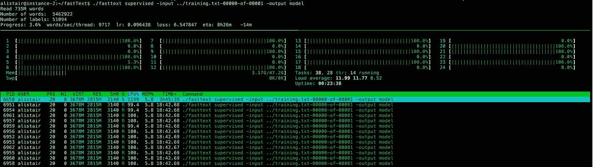

# 在维基阅读上训练脸书的快速文本需要 8 个多小时

> 原文：<https://medium.com/google-cloud/it-takes-more-than-8-hours-to-train-fasttext-on-wikireading-be75d61289b3?source=collection_archive---------0----------------------->

作为我根据谷歌的新维基阅读数据集对文本分类算法进行基准测试的一部分，我今天把它输入了 fastText:

请注意 24 个虚拟 CPU 实际上意味着“12 个内核”

这是我使用的计算引擎实例:

[这里有一些关于我如何将数据集转换成 fastText 满意的格式的细节。](/google-cloud/using-dataflow-in-clojure-to-process-googles-huge-new-wikireading-dataset-832af367539c#.outt4l79n)

训练文件最终为 4GB，代表大约 470 万篇维基百科文章(只有前 300 个单词，以与维基阅读论文保持一致),每篇文章都有一个或多个标签。

使用的 RAM 总量一直稳定在 3GB 以下，这令人印象深刻。

当我有准确的结果时，我会向你报告。我希望我早点申请增加云计算的配额，这样我就可以使用 64 个 vCPU 的机器了——我不习惯为任何与计算机相关的事情等待 8 个小时！