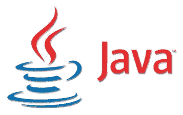
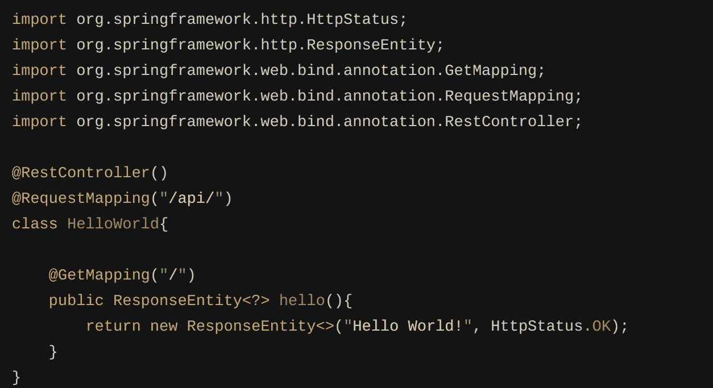
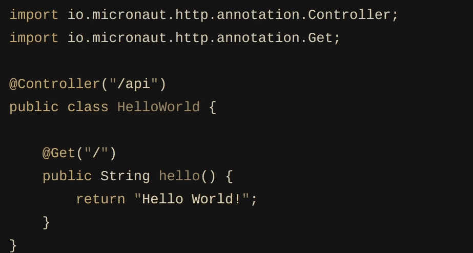
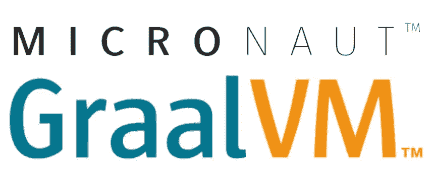
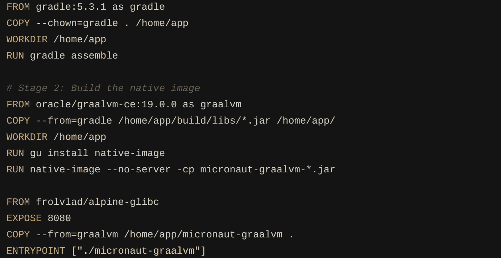
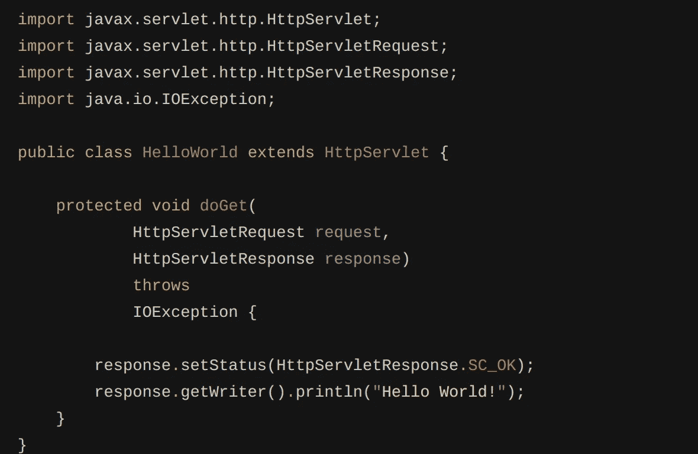
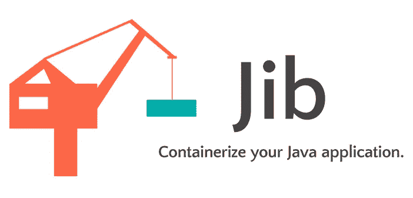
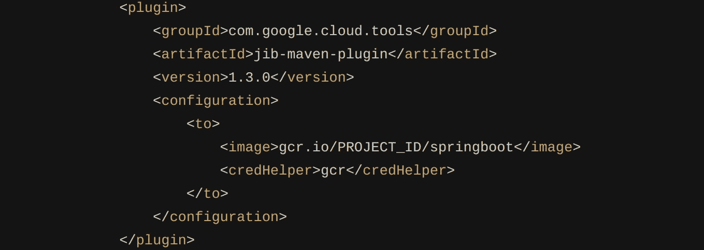
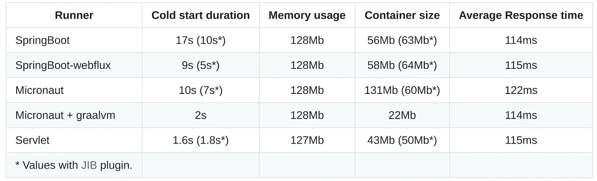

# Java 框架在云上的性能

> 原文：<https://medium.com/google-cloud/java-frameworks-performances-on-cloud-run-eb243fd84a5c?source=collection_archive---------0----------------------->

2018 年夏天，在旧金山的 Google Next，我和我的同事有机会见到了 [Steren](https://medium.com/u/ef2e4caf305a?source=post_page-----eb243fd84a5c--------------------------------) 。他跟我们谈了一个新产品，并允许我们在 alpha 计划中试用。那是第一版[云跑](https://cloud.google.com/run)T4。

我很高兴也很享受这个荣誉，我把我最喜欢的 Spring Boot 应用程序打包到一个容器中，部署它，然后… **什么** **？** *30 秒的冷启动…*

绝望中，我继续测试产品，主要是用新的应用程序([主要是打包到容器中的 python 函数](/@guillaume.blaquiere/cloud-run-and-cloud-function-what-i-use-and-why-12bb5d3798e1))我甚至学习了 Go 来获得良好的冷启动和处理性能。

然而，我从事 Java 开发已经 15 年了，我不接受因为在无服务器世界的第一次糟糕经历而离开这门语言。此外，在我的团队中，不安全类型的语言，比如 Python，变得越来越低效和错误百出。Go 太“新”了，不能雇佣有经验的开发人员。**因此，Java 仍然是最好的权衡之一。**

> 如果非要我选一个 Java 框架，哪个性能最好？

# 如何比较框架

我是一名高级 Java 开发人员，但我并不了解所有不同框架的所有技巧和优化。顺便说一下，为了保持中立，我选择用两个主要框架编写一个 **HelloWorld HTTP GET 端点:Spring Boot 和 Micronaut。**

事实上，我什么也没写，我只是为它们中的每一个提供了现成的例子。*我不会在这里描述如何构建这些 hello world 示例，框架网站确实有据可查！我在故事的结尾提供了代码*

我还用纯 Java 写了一个 HTTP 端点，没有框架 T21 来衡量框架对性能的影响。

每个测试都被打包到一个容器中，并部署在完全托管的云上。

## Spring Boot

Spring Boot 是我最喜欢的框架。我已经用它开发了很多年，我仍然喜欢它的方便和简单。你有特别的事情要做？没问题，弹簧组件就是为此而存在的！对此进行注释，并享受！

它的优势之一是自动加载。只需添加一个依赖项，Spring boot 就会在启动时自动扫描并加载所有的库！你们班是注射豆？不需要声明它，注释它，它会自动加载！当然，依赖项越多，需要扫描的文件就越多，启动时间也就越长。

这种优势在不可扩展的环境中非常完美，就像我的内部环境一样。我启动我的应用程序一次，它会一直运行到下一次修改。当然启动时间挺长的(20 到 30 秒)，但是一个月一次，完全可以接受！

然而，库扫描强度，以及隐含的额外启动时间，是无服务器、自动扩展和扩展到 0 环境中的主要难点。

SpringBoot HelloWorld

## 微型机器人

三藩市的春天，我在第一次参加 Next 19 的[会议时发现了](https://www.youtube.com/watch?v=RdemnsW6sOQ) [Micronaut](https://micronaut.io/) 。我只是尝试了一下，没有用 Micronaut 搭建真正的 app，但它似乎是 SpringBoot 的一个很好的替代方案。

注释语法类似于 Spring Boot，您也可以在框架中导入 Spring Boot 注释包装器。有许多与 Spring Boot 等效的功能。与 SpringBoot 的区别和 Micronaut 的最大优势在于**库扫描是在编译时**执行的。因此，在启动时，应用程序知道加载哪些包，而不必扫描所有文件。

因此，启动时间比 Spring Boot 好，但我猜(但我没有测试过)，启动时间应该很稳定，即使你添加了很多新的库和文件。

微型机器人 HelloWorld

## Micronaut + GraalVM

Micronaut 还能够与 [GraalVM](https://www.graalvm.org/) 封装在一起。这种 **AOT(提前)封装**改善了启动时间和内存占用。

除了 Micronaut，我还发现尝试这些表演很有趣

micronaut+GraalVM docker 文件

## Java servlet

对于开发者来说，框架是有用的，强大的，非常酷的。但通常，它们很麻烦，并且会消耗大量内存和 CPU(影响启动时间)用于一些未使用的功能。

对于一个简单的 helloWorld HTTP 端点，我选择用 Jetty webserver 用纯 Java 开发。这里，**没有注释，只有 Java，继承和覆盖**！我不得不全靠自己。

Servlet Hello World

## Spring Boot 网络流量

又是 Spring Boot？是的。正如您在观察结果中看到的，Spring Boot 开箱即用示例的性能很差。我对此很恼火，因为我真的很喜欢这个框架。

我在 Youtube 上看了下一次与 T2 的会面。他解释了如何在 GCP 身上使用 SpringBoot，并提出如果我们有问题可以在 Twitter 上联系他，我照做了。Ray 非常酷，他用 webflux 和 pom.xml 技巧帮助我提高了 Spring Boot HelloWorld **的性能。这就是为什么我也想分享这些改进。**

## 关于 JIB 插件的一句话

除了 GraalVM 打包，我总是使用 Dockerfile 和 JIB 打包容器来比较性能。

[JIB](https://github.com/GoogleContainerTools/jib) 是一个 [Maven](https://github.com/GoogleContainerTools/jib/tree/master/jib-maven-plugin) 和 [Gradle](https://github.com/GoogleContainerTools/jib/tree/master/jib-gradle-plugin) 插件，由 Googlers 员工开发，用于**轻松高效地将 Java 代码打包到一个容器中。**您不需要编写 docker 文件，如果您想定制它，只需要一些配置参数。

JIB maven 插件

# 表演

## 测试程序和测量

所有测试都是在美国中部地区的**云上进行的。容器部署在**安全模式**(禁用 allow-unauthenticated 选项)下，并使用**默认参数**(内存、无环境变量、默认服务帐户……)**

每个版本的启动时间都经过了 3 次测试。该值在云运行日志中提供，并带有注释“*该请求导致一个新的容器实例启动，因此可能比典型请求花费更长时间并使用更多 CPU。*这 3 次测试的平均值就是冷启动值。3 可能看起来很少，但实际上，**云运行性能相当稳定**，因此足以对冷启动有一个充分的了解。

使用 [**嘿**](https://github.com/rakyll/hey) 执行负载测试后，获取平均响应时间和内存使用量。为了防止云运行容器的规模扩大，我用以下内容设置了 Hey 参数:

*   **并发到 1** 避免多个对云的调用同时运行
*   **请求由第二个到第五个**来限制负载，从而限制新实例的创建。

负载测试**执行来自**云外壳环境的 2500 个请求**。** ( *如你所见，全局延迟约为 115 毫秒。全局是指从云壳到云运行，处理时间，以及返回的方式。除冷启动外，在云运行日志中，* ***延迟稳定，约 6ms*** *。剩下的时间都浪费在网络上了(而且我在欧洲地区)*。

平均响应时间由 Hey 提供。并且**内存使用由云运行控制台指标**提供。

最后，**容器大小由 Google 容器注册中心**提供。

## 观察到的结果

观察到的结果可以在[这里](https://github.com/guillaumeblaquiere/cloudrun-java-framework#observed-result)找到

基于这些结果，以下是一些结论:

**首先**容器在负载测试中使用相同数量的内存，请求延迟也是相同的。

**第二个**，除了 GraalVM，JIB 插件比手工构建的 Dockerfile 更高效(或者等同于 Servlet)。如果你在 Dockerfile 中没有特殊要求，**先用 JIB**！

> 我不是 Dockerfiles 的专家，我只用了“官方”样本。也许可以通过优化来提高 Dockerfiles 的性能。

第三，毫无疑问，无框架的使用提高了性能，但是增加了开发的复杂性和所需的技能。有了框架， **Micronaut + GraalVM 的性能对任何 Java 来说都是不可思议的。**

**最后**，我最喜欢的 SpringBoot 在优化后(启动时间为 5 秒)还是可以接受的，但这只是一个 HelloWorld 端点。不知道在真实的 app 上性能会怎么样，依赖性比较多。不确定这是否适合所有用例以及所有需求。

*容器大小仅供参考，不影响任何指标。*

我的代码在 [Github](https://github.com/guillaumeblaquiere/cloudrun-java-framework) 上公开。你也可以把它作为一个快速开始。`Dockerfile`和`cloudbuild.yaml`文件用于在[云构建](https://cloud.google.com/cloud-build/)上构建项目。你也可以使用 [JIB 来构建容器并将其推](https://github.com/GoogleContainerTools/jib)，默认为 [Google 容器注册表](https://cloud.google.com/container-registry/)。

所有的构建和部署指令都在`Readme.md`文件中。

最后，我想再次感谢雷对我的帮助，以及他在 SpringBoot 改进中付出的时间。