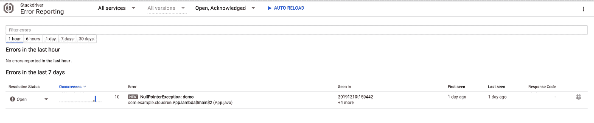

# 使用 Stackdriver 在云上运行 Java 日志记录

> 原文：<https://medium.com/google-cloud/java-logging-on-cloud-run-with-stackdriver-9786d6fdbe17?source=collection_archive---------0----------------------->


在微服务时代，充分的日志记录和跟踪对于监控和调试您的服务更加重要。当使用容器时，由于容器的灵活性和短暂性，增加了一层复杂性。用户必须考虑如何通过安装永久卷来“从容器中”获取信息。不管怎样，你很幸运！与其他谷歌云平台(GCP)计算产品类似， [Stackdriver 日志代理](https://cloud.google.com/logging/docs/agent/)内置在云运行环境中，因此您的日志会自动通过管道传输并整合到 [Stackdriver](http://console.cloud.google.com/logs) 中。

这篇博客文章将介绍云运行的 Java 日志记录，尽管这些概念可以应用于谷歌应用引擎(GAE)。我们将讨论不同的日志类型在 Stackdriver 中的外观和相关的产品错误报告，以及如何使用跟踪 id 升级日志。

让我们从头开始。写入标准输出和标准错误的任何日志都将显示在您的 Stackdriver 日志中，但没有任何附加信息或功能。

```
System.out.println(“This log was made with System.out.println”);
System.err.println(“This log was made with System.err.println”);
```


这与您在使用 java.util.logging、log4j2 或 slf4j 等框架时获得的功能相同，无需任何额外的配置。有了所有这些框架，我们可以从一些基本的日志提示开始:

1.  设置日志消息的严重性。设置严重性可以帮助您过滤日志，直观地查找日志条目，以及设置指标和警报。
2.  添加清晰可行的错误消息。当你试着调试的时候，不要恨你自己。
3.  添加堆栈跟踪(作为 Throwable)。任何关于错误来源的额外信息都比没有好！

```
utilLogger.log(
    Level.INFO, “Error report INFO with java.util.logging”, e);
utilLogger.log(
    Level.SEVERE, “Error report ERROR with java.util.logging”, e);slf4jLogger.info(“Error report INFO with Logback”, e);
slf4jLogger.error(“Error report ERROR with Logback”, e);
```

传递 throwable 意味着您获得了 Stackdriver 错误报告的好处！错误报告汇总并显示您正在运行的云服务中产生的错误，以便提供实时异常监控和警报。



对于 App Engine，Google 提供了额外的库支持，使用 Logback appender 和 JUL ( `java.uti.logging`)处理程序将[日志记录到 Stackdriver](https://cloud.google.com/logging/docs/setup/java) 。这样可以正确解析日志级别，并添加额外的配置，如严重性阈值、日志名称和增强器。GAE 上的[默认配置](https://github.com/GoogleCloudPlatform/java-docs-samples/tree/master/logging/logback)会在 Stackdriver 控制台中产生这些日志:


遗憾的是，Cloud Run 与 App Engine 的[运行时环境](https://cloud.google.com/appengine/docs/standard/java11/runtime)略有不同；因此，这些集成不能开箱即用。通过使用 [Logback](http://logback.qos.ch/) 升级到 JSON 格式的日志，您可以很容易地重新获得这个功能，这意味着您可以继续使用它的本机接口，Java (SLF4J)的简单日志门面。

您的登录配置必须附加到控制台。这里我们使用了追加器`ch.qos.logback.core.ConsoleAppender`。然后使用编码器`[net.logstash.logback.encoder.LogstashEncode](https://github.com/logstash/logstash-logback-encoder)`允许转换成 JSON 格式。

```
<**configuration**>
  <**appender** name="jsonConsoleAppender"
      class="ch.qos.logback.core.ConsoleAppender">
    <**encoder** class="net.logstash.logback.encoder.LogstashEncoder">
      <**fieldNames**>
        <**timestamp**>[ignore]</**timestamp**>
        <**version**>[ignore]</**version**>
        <**logger**>[ignore]</**logger**>
        <**thread**>[ignore]</**thread**>
        <**levelValue**>[ignore]</**levelValue**>
      </**fieldNames**>
    </**encoder**>
  </**appender**>
  <**root** level="INFO">
    <**appender-ref** ref="jsonConsoleAppender"/>
  </**root**>
</**configuration**>
```

此配置忽略了不需要的额外默认字段。所需的依赖关系有:

```
<**dependency**>
  <**groupId**>net.logstash.logback</**groupId**>
  <**artifactId**>logstash-logback-encoder</**artifactId**>
  <**version**>5.2</**version**>
</**dependency**>
<**dependency**>
  <**groupId**>ch.qos.logback</**groupId**>
  <**artifactId**>logback-classic</**artifactId**>
  <**version**>1.2.3</**version**>
</**dependency**>
```

使用 JSON 作为日志格式还允许进行结构化日志记录，这意味着您可以向日志中添加更多可读/可解析的信息，以便进行调试。传统的方法是使用所有主要日志框架提供的映射诊断上下文(MDC)。为了让 Stackdriver 解析日志级别，我们必须将其添加为 severity 字段。

```
MDC.put(“severity”, “ERROR”);
logger.error(“Logging ERROR with Logback”);
MDC.remove(“severity”);
```

使用`logstash-logback-encoder`库允许特定于事件的定制字段，这意味着我们可以将键值`[StructuredArguments](https://github.com/logstash/logstash-logback-encoder/blob/logstash-logback-encoder-5.2/src/main/java/net/logstash/logback/argument/StructuredArguments.java)`添加到我们的 JSON 日志中。这使得添加多个特定于日志的字段变得更加容易和简洁。

```
logger.info(“Logging INFO with Logback”,
            kv(“severity”, “NOTICE”),
            kv(“component”, “arbitrary-property”));
```

使用`StructuredArguments`或`MDC`，我们还可以使用特定的 JSON 字段`logging.googleapis.com/trace`将跟踪 Id 附加到日志中。了解关于结构化有效载荷的特殊字段的更多信息。

```
String traceHeader = req.headers("x-cloud-trace-context");
String trace = traceHeader.split("/")[0];
logger.info("Logging with trace Id",
           kv(“severity”, “DEBUG”),
           kv(“logging.googleapis.com/trace”,
           String.format(“projects/%s/traces/%s”, project, trace)));
```

在 Stackdriver 日志查看器中，由同一跟踪关联的日志可以以“父子”格式查看:当您单击请求日志条目左侧的三角形图标时，与该请求相关的容器日志会嵌套在请求日志下显示。


Logback 也是 Spring Boot 应用程序的默认日志配置，使用带有 [JSON appender](https://github.com/spring-cloud/spring-cloud-gcp/blob/master/spring-cloud-gcp-logging/src/main/resources/org/springframework/cloud/gcp/logging/logback-json-appender.xml) 的日志启动器可以很容易地与 GCP 集成。使用这个 appender 资源，没有必要在日志消息中指定严重性。

```
<**configuration**>
  <**include** resource=
 "org/springframework/cloud/gcp/logging/logback-json-appender.xml"/>
   <**root** level=”INFO”>
       <**appender-ref** ref="CONSOLE_JSON"/>
   </**root**>
</**configuration**>
```

不要把日志记录留到最后一刻！Stackdriver 为您提供了一个集中的系统来访问您在 GCP 服务中的所有日志。通过在 JSON 中构建日志并添加上下文元数据以简化故障排除，充分利用日志和 Stackdriver。

**下一步**

*   查看关于云运行上的[日志记录和查看日志](https://cloud.google.com/run/docs/logging)的官方文档。
*   了解更多关于在 Stackdriver 中[创建图表和警报](https://cloud.google.com/logging/docs/logs-based-metrics/charts-and-alerts)的信息。
*   遵循关于云运行服务的[本地故障排除的教程。](https://cloud.google.com/run/docs/tutorials/local-troubleshooting)