# 谷歌 Kubernetes 引擎(GKE)上的工作和部署策略

> 原文：<https://medium.com/google-cloud/jobs-and-deployment-strategies-on-google-kubernetes-engine-gke-4b37047c2cf1?source=collection_archive---------2----------------------->

大家好。我希望你一切都好。在这篇文章中，我想解释 Kubernetes 中的工作和部署策略，以及如何在 GKE 实现它们。

在深入主题之前，我假设您已经知道 Kubernetes 是什么，它是如何工作的，以及围绕它们的术语/概念。

> 订阅我的 YouTube 频道，[云飞行员](https://www.youtube.com/c/TheCloudPilot)

我们先来看看 Kubernetes 都有哪些工作。

# Kubernetes 的工作

作业创建一个或多个 pod 来执行任务，并将继续重试执行，直到执行了指定的完成次数。当达到指定的成功完成次数时，作业被视为完成。删除作业将清理它创建的窗格。暂停作业将删除其活动窗格，直到作业再次恢复。

> 您还可以并行运行作业。

我们刚刚看到了工作在 Kubernetes 是如何工作的。我们可以随时运行它们。

> 但是如果我们能把它们安排在一个特定的时间呢？

# 克朗乔布

CronJob 是一种可以安排在特定时间或定期运行的作业。它用于执行定期计划的操作，如备份和生成报告。每个任务都应该配置为无限期重复。每天拍摄快照，以及在每月的某一天进行备份都是 CronJobs 的例子(或者说是用例)。

现在我们知道了什么是 jobs 和 cronjobs，让我们看看它是如何在谷歌 Kubernetes 引擎(GKE)中完成的。

1.  第一步是创建一个 GKE 集群并进入该集群。(**参考** [**我这里视频**](https://www.youtube.com/watch?v=AGkTioTba3E&ab_channel=TheCloudPilot) )
2.  现在，让我们为作业创建一个 job.yaml 文件。*我正在创建的作业计算π到 2000 位，并将其打印出来。*

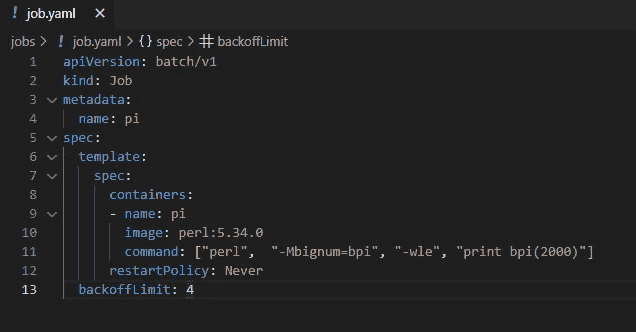

job.yaml

使用配置创建 YAML 文件后，运行:

> kubectl apply -f job.yaml

您将看到作业已创建。

要查看作业的已完成窗格，请运行:

> kubectl 获取豆荚

这将列出作业为执行任务而创建的窗格。我们可以使用以下命令检查 pod 的日志:

> kubectl 日志<podname></podname>

这将显示输出。

> 要并行运行作业，将**并行度:<要并行运行的作业数量>** 添加到作业模板的规格部分。
> 
> 为了指定作业的成功，将**完成:<完成数量>** 添加到作业模板的 spec 部分。

现在，让我们看看 CronJob 是如何实现的。要创建每分钟打印当前时间和 hello 消息的 Cronjob，请使用以下代码:

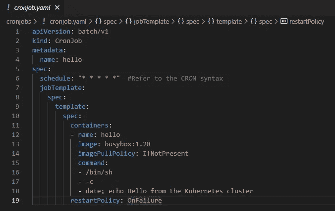

cronjob.yaml

> 参考[这里的 **Cron 调度语法**](https://kubernetes.io/docs/concepts/workloads/controllers/cron-jobs/#cron-schedule-syntax)

使用配置创建 YAML 文件后，运行:

> kubectl apply -f cronjob.yaml

您将看到作业已创建。

要查看作业的已完成窗格，请运行:

> kubectl 获取豆荚

这将列出作业为执行任务而创建的窗格。我们可以使用以下命令检查 pod 的日志:

> kubectl 日志<podname></podname>

***这将显示输出。这就是你如何在 GKE 创造工作和 cronjobs。*** 现在，我们将看看 Kubernetes 上的部署策略，看看它们如何在 GKE 上实施。

# 部署

当我们使用 pod 时，当资源数量增加时，很难独自管理它们。因此，我们需要一些东西来帮助我们保持资源的期望状态。这就是部署发挥作用的地方。

> 部署为 pod 和副本集提供声明性更新。

一旦我们使用标签将 pod 定义模板与部署关联，它将开始管理模板中提到的带有标签的所有 pod。

在部署中更新应用程序时，主要使用两种策略来保持应用程序正常运行，并最大限度地减少停机时间。这些是①**金丝雀**；以及(2) **蓝绿调配**。

## 金丝雀部署

> 在 canary 部署中，在向所有用户发布之前，您需要为一部分用户创建一个增量部署。

例如，假设您有一个需要推出新版本的应用程序。使用 canary 部署策略，您可以创建一个新的部署，并将您的一部分流量定向到新创建的部署进行测试。一旦新部署被测试为稳定，就将最新版本部署到其他部署，将流量路由回这些部署，并删除临时创建的 canary 部署。

下面这张图片可能会给你一些启发:

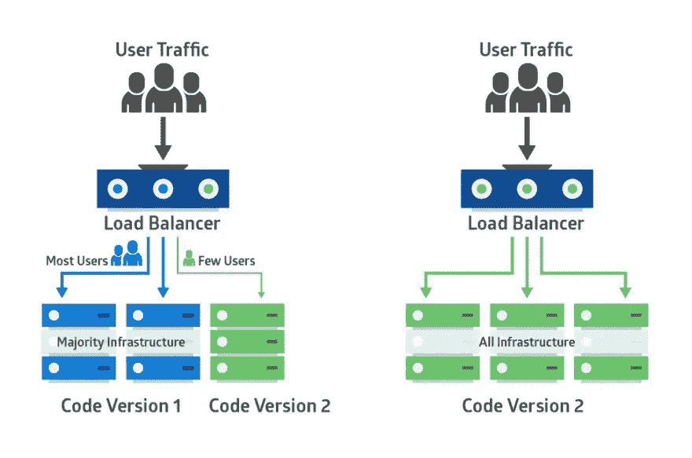

## 蓝绿色部署

> 在蓝绿色部署中，使用新版本创建整个部署，并将流量导向新版本，然后删除旧部署。

例如，您有一个应用程序的两个版本，它服务于第一个版本。在蓝绿色策略中，您将为第二个版本创建一个新部署，并将流量重定向到第二个部署，并删除第一个部署。

下面这张图片可能会给你一些启发:

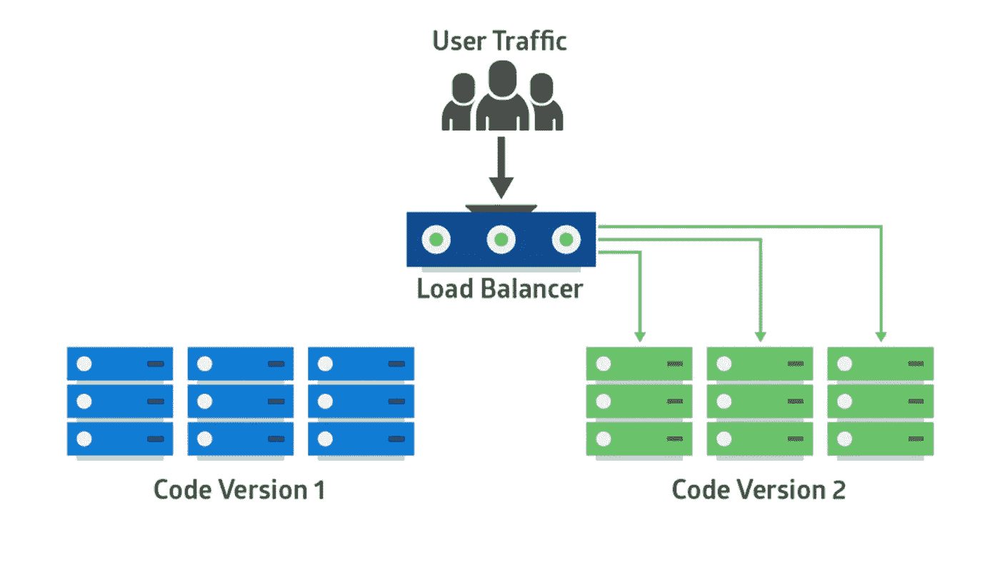

现在你已经理解了这个想法，让我们看看如何在 GKE 上实现它。

# GKE 的金丝雀部署

使用 deployment.yaml 文件创建部署，使用 canary.yaml 文件创建 canary 部署。

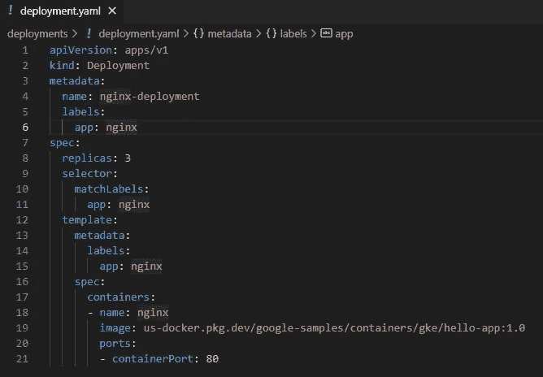

部署. yaml

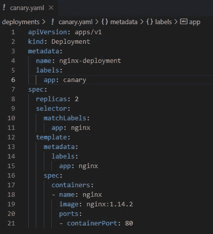

canary.yaml

现在，让我们运行命令:

> kubectl apply -f deployment.yaml
> 
> kubectl apply -f canary.yaml

为了向 nginx 部署公开服务，使用选择器“nginx”创建一个 service.yaml 文件。

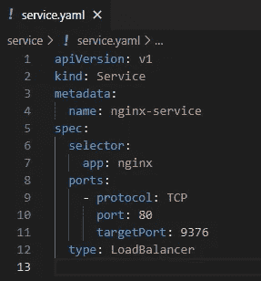

service.yaml

现在，运行:

> kubectl apply -f service.yaml

让我们将金丝雀部署引入到服务中。为此，将选择器“nginx”更改为“canary ”,如下所示:

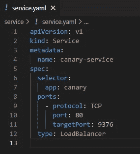

要重新配置服务，请运行:

> kubectl apply -f service.yaml

将带有选择器“nginx”的部署部署到最新版本后，恢复 service.yaml 文件中的更改，并再次运行 apply 命令。

现在您已经有了更新的应用程序，您可以删除 canary 部署了。GKE 就是这样部署金丝雀的。

# 蓝绿在 GKE 的部署

使用 deployment.yaml 文件创建标签为“blue”的部署。

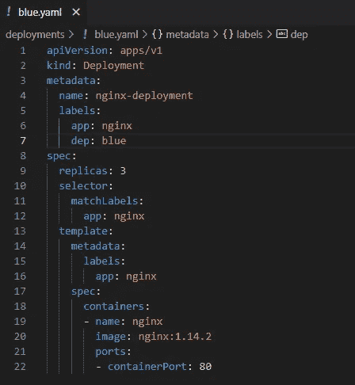

blue.yaml

现在，让我们运行命令:

> kubectl apply -f blue.yaml
> 
> kubectl apply -f green.yaml

为了向蓝色部署公开服务，创建一个带有选择器“blue”的 service.yaml 文件。

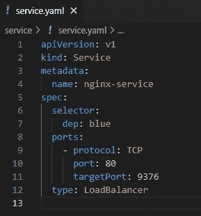

service.yaml 文件准备就绪后，运行:

> kubectl apply -f service.yaml

现在，使用 deployment.yaml 创建一个绿色部署

一旦绿色部署就绪，将选择器“蓝色”更改为“绿色”，如下所示:

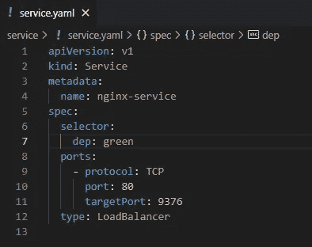

要重新配置服务，请运行:

> kubectl apply -f service.yaml

将带有选择器“nginx”的部署部署到最新版本后，恢复 service.yaml 文件中的更改，并再次运行 apply 命令。

***现在您已经将服务定向到绿色部署，并且可以删除蓝色部署。这就是蓝绿部署在 GKE 的实施方式。***

我希望这对你有所帮助。祝你愉快。回头见！