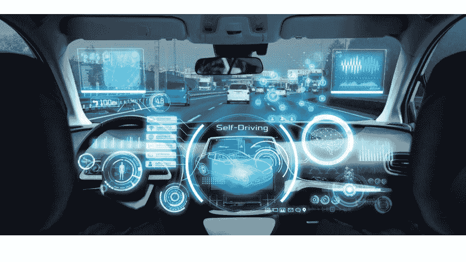

# 加入 GTC 英伟达的谷歌云

> 原文：<https://medium.com/google-cloud/join-google-cloud-at-nvidia-gtc-338a289274dc?source=collection_archive---------2----------------------->

在英伟达 GTC ( [在此免费注册](https://www.nvidia.com/gtc/?ncid=ref-spo-816250))加入[谷歌云，了解](https://events.rainfocus.com/widget/nvidia/gtcspring2022/sponsors/exhibitor/1570473021026001DzzF/?ncid=ref-spo-816250)[谷歌云和英伟达](https://cloud.google.com/nvidia)如何能够帮助你战胜挑战。我们将向您展示如何加速您的人工智能(AI) [机器学习](https://cloud.google.com/ai-platform) (ML)和[高性能计算](https://cloud.google.com/solutions/hpc) (HPC)工作负载。

加入“在 Google Cloud 上加速您的 AI 和 HPC 之旅(由 Google Cloud 提供)——[s 42583](https://events.rainfocus.com/widget/nvidia/gtcspring2022/sponsors/exhibitor/1570473021026001DzzF/?ncid=ref-spo-816250)”以了解 NVIDIA GPU 如何推动 Google 的 AI/ML 产品组合，并回顾在 Google Cloud 上部署和管理 NVIDIA GPU 的五种不同方式。我们也将听到汽车公司，他们如何创新和革命性的行业。这里先睹为快..

[Nuro](https://www.nuro.ai/) 利用自主送货机器人创新最后一英里送货,“让道路对每个人都更安全”,“零排放地完成每一件差事”

> “Nuro 的感知团队通过 Vertex AI NAS 加速了他们的 AI 模型开发。Vertex AI NAS 使我们能够创新 AI 模型，以实现良好的准确性，并优化目标硬件的内存和延迟。总体而言，这提高了我们团队开发和部署感知人工智能模型的生产力。”—公司自治平台负责人郭开森，(Nuro 案例研究:[https://lnkd.in/dau6x7Rm](https://lnkd.in/dau6x7Rm))

[斯巴鲁](https://www.subaru.com/index.html)提供 EyeSight 驾驶辅助技术“将造成伤害的追尾事故率降低高达 85%”，并实现“到 2030 年零致命交通事故的目标”

> “我从许多平台中选择了谷歌云，因为在选择的时候，它有多个托管服务，如 Vertex AI、托管笔记本选项和 Vertex AI 培训，这些对人工智能开发很有用。拥有能够处理大规模机器学习操作的高性能硬件也是一件令人着迷的事情。”— *Toshimi Okubo，SUBARU Corporation AI R&D 部门高级工程师，ADAS 开发部，工程部(* Subaru 案例研究:【https://lnkd.in/g6nCGDer】T2

谷歌是唯一一家云服务提供商(CSP ),拥有单加速器优化的虚拟机，利用多达 16 个[英伟达 A100 GPU](https://www.nvidia.com/en-us/data-center/a100/),由[英伟达的 NVlink](https://www.nvidia.com/en-us/data-center/nvlink/) 结构支持，在单个虚拟机中达到高达 10 petaflops 的 FP16 或 10 petaflops 的 int8 的有效性能。这种性能和规模是 Google Cloud 独有的，旨在满足当今最苛刻的应用程序。

创建 AI、ML 和 HPC 应用程序是复杂的，但为生产中的应用程序提供服务却并非如此。谷歌云提供了简化机器学习操作(MLOps)的能力，以自动化 ML 生产生命周期。Vertex AI 将构建 ML 的谷歌云服务汇集在一个统一的 UI 和 [API](https://googleapis.dev/python/aiplatform/latest/index.html) 之下。在 Vertex AI 中，您现在可以使用 [AutoML](https://cloud.google.com/vertex-ai/docs/beginner/beginners-guide/) 或自定义代码训练来轻松训练和比较模型，并且您的所有模型都存储在一个中央模型库中。

[Cruise](https://www.getcruise.com/) 今年早些时候在旧金山公开推出了一种“安全、共享和全电动”的城市自动驾驶服务。

> “在我们摄取和分析这些数据后，它会反馈到我们的动态 ML 大脑中——这是一台持续学习的机器，它会从收集的数据中主动挖掘，以自动训练新模型，这些新模型的性能超过了旧模型。这是在 Vertex AI 的帮助下完成的，我们能够同时训练数百个模型，每个月使用数百个 GPU 年！”— Mo El Shenawy，Cruise 工程执行副总裁(Cruise 案例研究:[https://lnkd.in/gv3mrMNT](https://lnkd.in/gv3mrMNT))

[点击这里](https://events.rainfocus.com/widget/nvidia/gtcspring2022/sponsors/exhibitor/1570473021026001DzzF/?ncid=ref-spo-816250)查看英伟达 GTC 的所有谷歌云会议。