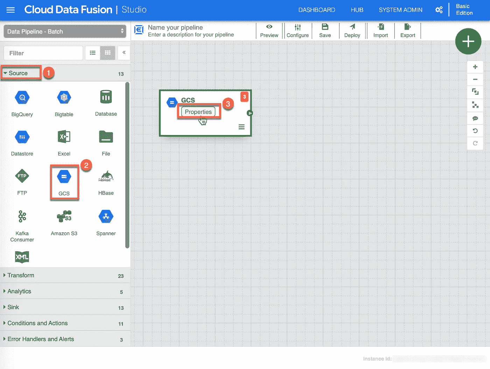

# 云数据融合中的连接、分组和聚合

> 原文：<https://medium.com/google-cloud/join-group-by-and-aggregate-in-cloud-data-fusion-a7b9919a0401?source=collection_archive---------0----------------------->


好消息！[云数据融合](https://cloud.google.com/data-fusion/)现已 GA。2019 年 11 月 21 日在 Google Next '19 UK 上宣布，云数据融合是一种完全托管的云原生企业数据集成服务，用于快速构建和管理数据管道。云数据融合 web UI 允许您构建可扩展的数据集成解决方案来清理、准备、混合、传输和转换数据，而无需管理基础架构。云数据融合由开源项目 [CDAP](https://cdap.io/) 提供支持。

云数据融合如何入门？这篇文章向您展示了如何在云数据融合中简单地构建和使用牧马人和数据管道功能来清理、转换和处理飞行数据。

**ETL 过程**
该图显示了将要发生的转换。这将是读取两个文件，转换数据，并加载到一个输出；每个航空公司的航班总数。


## 目标

*   将云数据融合连接到数据源
*   应用基本转换
*   按数据源连接和分组
*   向水槽写信

你可以开始了！

## 登录到 GCP 控制台

首先进入 [GCP 控制台](https://console.cloud.google.com)，使用你的谷歌账户登录。

## 选择或创建一个 GCP 项目

您需要选择一个项目。如果您没有任何项目，请转到项目选择器页面创建一个——在本练习中，我创建并使用了一个名为 *flights-analysis* 的特定项目。**我强烈建议您为本演练创建一个新项目**。如果需要帮助，请参考[创建您的项目](https://cloud.google.com/resource-manager/docs/creating-managing-projects)。

## 创建 GCS 存储桶并复制数据

你需要数据！这两个小数据集位于 GCS 存储桶中，您需要将其复制到您自己的存储桶中。

首先创建您的存储桶，您可以通过在资源和产品搜索字段中键入*存储桶*并选择*创建存储桶*来完成。


在创建存储桶页面上，提供您的存储桶的名称***【1】**，请记住，这些名称是全球唯一的，出于演示的目的，我已经输入了 *flights-analysis-data2* 。选择*区域* **(2)** 作为位置类型，并选择您想要的*位置* **(3)** ，我选择了*北美-东北 1* 进行演示，然后单击*创建* **(4)** 来创建您的桶。*

**

***激活云壳**
你现在需要激活云壳，在 GCP 控制台右上方工具栏，点击打开云壳按钮。对话框打开后，可以立即点击*继续*。*

**

*调配和连接到环境需要一些时间。当您连接时，您已经通过了身份验证，并且项目被设置为您的 PROJECT_ID。*

*输出类似于以下内容:*

**

*您需要发出以下命令来将所需的样本文件和结构复制到您的 GCS bucket 中。将 **[BUCKET_NAME]** 替换为您之前创建的存储桶的名称。*

```
*gsutil cp gs://flights-analysis-sample-data/input/airlines.csv gs://[BUCKET_NAME]]/input/ gsutil cp gs://flights-analysis-sample-data/input/flights_small.csv gs://[BUCKET_NAME]/input/*
```

*输出类似于以下内容:*

**

## *创建云数据融合实例*

*您现在已经准备好创建您的云数据融合实例了。*

1.  *转到云数据融合页面，您可以通过在资源和产品搜索字段中键入*数据融合*并选择*数据融合*来完成此操作。*

**

1.  *如果云数据融合 API 尚未启用，您必须通过点击 *Enable* 来启用它。
    这可能需要一段时间才能完成。*

**

1.  *提供一个*实例名称* **(1)** ，选择您的*地区* **(2)** ，选择*版本* **(3)** 基本，点击*创建* **(4)** 部署您的实例。出于本练习的目的，我选择了 *flights_data-etl* 作为我的实例的名称，并选择 northamerica-northeast1 作为我的地区。您可以为这些属性提供自己的值。
    ***注意:*** 这需要几分钟才能完成(耐心点)。*

**

## *构建数据管道*

1.  *一旦进入 *Studio* 画布，您现在就可以构建数据管道了。首先选择或确保您在*源***【1】**视图中，单击*GCS***源—这将在画布上添加一个 GCS 源，然后从 GCS 源中单击*属性***【3】**继续。***

******

1.  ***将显示 GCS 属性配置页面。为*标签***(1)**:“GCS-Flights Data”，然后为*引用名称***(2)**:“GCS _ Flights _ Data”输入以下值，提供*路径* **(3)** 到您之前创建的 GCS Bucket，在这里您已经存储了 flight_small.csv 文件。为了这个练习的目的，我已经包括我的，确保提供您的适当的路径(如果您输入在这个图像中提供的内容，验证将不会成功)。点击*验证* **(4)** 验证所有属性，你应该看到绿色的*没有发现错误*，最后点击 *X* **(5)** 关闭/保存 GSC 属性。***

******

1.  ***将显示牧马人属性配置页面。为*标签* **(1)** 分配以下值:“牧马人-航班数据”，然后单击*牧马人***继续。*****

**********

1.  *****您需要选择/加载数据，选择 flights_small.csv 文件，该文件位于您之前创建的 GCS 存储桶中，然后继续。*****

**********

1.  *****接下来是一系列解析和删除不需要的列的步骤。点击*正文***【1】**列上的下拉【列转换】，选择 Parse->CSV**【2】**，选择*逗号***【3】**作为分隔符，勾选*设置首行为表头***【4】**，然后点击*应用***【5】**继续。*****

**********

1.  *****您现在会注意到，Recipe 框中已经填充了您刚才在争论活动中执行的指令。点击*验证* **(1)** 验证所有属性，你应该看到绿色的*没有发现错误*，最后点击 *X* **(2)** 关闭/保存牧马人属性。*****

**********

1.  *****将显示 GCS 属性配置页面。为*标签***(1)**:“GCS-Airlines Data”，然后为*引用名称***(2)**:“GCS _ Airlines _ Data”输入以下值，提供*路径* **(3)** 到您之前创建的 GCS Bucket，其中存储了 airlines.csv 文件。为了这个练习的目的，我已经包括我的，确保提供您的适当的路径(如果您输入在这个图像中提供的内容，验证将不会成功)。点击*验证* **(4)** 验证所有属性，你应该看到绿色的*没有发现错误*，最后点击 *X* **(5)** 关闭/保存 GSC 属性。*****

**********

1.  *****将显示牧马人属性配置页面。为*标签* **(1)** 赋值如下:“牧马人—航空公司数据”，然后点击*牧马人***继续。*******

**************

1.  *******像前面一样，您需要选择/加载数据，选择位于 GCS 存储桶中的 airlines.csv 文件继续。*******

**************

1.  *******接下来是一系列解析和删除不需要的列的步骤。点击*正文* **(1)** 列上的下拉【列转换】，选择 Parse - > CSV **(2)** ，选择*逗号* **(3)** 作为分隔符，勾选*设置首行为表头* **(4)** ，然后点击*应用* **(5)** 继续。*******

**********

1.  *****您现在会再次注意到，Recipe 框中已经填充了您刚才在争论活动中执行的指令。点击*验证* **(1)** 验证所有属性，你应该看到绿色的*没有发现错误*，最后点击 *X* **(2)** 关闭/保存牧马人属性。*****

**********

1.  *****将显示 Joiner 属性配置框。在 Join-Fields 部分，展开*Wrangler-Airlines Data***(1)**，取消选中 Code **(2)** ，将以下值“Airline_name”分配给 Description*Alias***(3)**，选择 *Inner* **(4)** 作为连接类型，在*连接条件* **(5)** 部分选择值“Airline” 单击*获取* **(6)** 获取模式，然后单击*验证***【7】**验证所有属性，您应该看到绿色的*没有发现错误*，最后单击*X***【8】**关闭/保存连接器属性。*****

**********

1.  *****将显示“按属性分组”配置框。在*分组依据字段*部分 **(1)** 添加以下字段:航空公司、航空公司 _ 代码、航空公司 _ 名称，在*聚合* **(2)** 部分输入“出发 _ 时刻表”，选择“计数”作为聚合，输入“航班 _ 计数”作为别名，点击*获取模式* **(3)** ，然后点击*验证***(4)*******

**********

1.  *****将显示 GCS 属性配置页面。为*标签***(1)**:" GCS-Flight Count "，然后为*引用名称***(2)**:" GCS _ Flight _ Count "，提供*路径* **(3)** 到前面创建的输出的 GCS 桶。出于本练习的目的，我已经包括了我的，请确保提供您的适当路径(如果您输入此图像中提供的内容，验证将不会成功)，为输出文件的*格式***【4】**选择“csv”，单击*验证***【5】**验证所有属性，您应该会看到绿色的*未发现错误*，最后单击*****

************

1.  ******管道将经历不同的周期；**部署**，**置备**，**启动**，**运行**，**取消置备**，**成功**在流水线页面的*状态*中显示。一旦管道成功，下一步就是在 GCS bucket 中探索输出文件。******

************

1.  ******要验证管道的输出接收器，请转到输出文件夹的 GCS bucket，发出下面的 gsutil 命令来查看结果。请确保用您的信息替换**【BUCKET _ NAME】**和**【REPLACE _ WITH _ YOUR _ FOLDER _ DATE】**:******

*   ******`gsutil cat -h gs://[BUCKET_NAME]]/output/flight_count/[REPLACE_WITH_YOUR_FOLDER_DATE]/part-r-00000`******

1.  ******输出类似于以下内容:******

************

******就是这样！您刚刚创建并运行了一个完整的云数据融合数据管道流程。******

## ******清除******

******为了避免本演练中使用的资源向您的 Google 云平台帐户收取费用:******

******如果您想要删除整个项目，请遵循以下说明:******

1.  ******在 GCP 控制台中，进入 [**管理资源**](https://console.cloud.google.com/iam-admin/projects) 页面。******
2.  ******在项目列表中，选择想要删除的项目，点击**删除**。******
3.  ******在对话框中，键入项目 ID，然后点击**关闭**删除该项目。******

******或者，如果您只想删除云数据融合实例，请遵循以下说明:******

1.  ******要查看您现有的云数据融合实例，请打开 [**实例**](https://console.cloud.google.com/data-fusion/locations/-/instances) 页面。******
2.  ******要选择一个实例，**勾选实例名称旁边的框**。******
3.  ******要删除实例，点击**删除**。******

******:*您也可以通过在实例详细信息页面上单击删除来删除实例。*******

******尽情享受吧！******

*******原载于 2019 年 11 月 24 日*[*https://stephanefrechette . dev*](https://stephanefrechette.dev/posts/join-group-by-and-aggregate-in-cloud-data-fusion/)*。*******