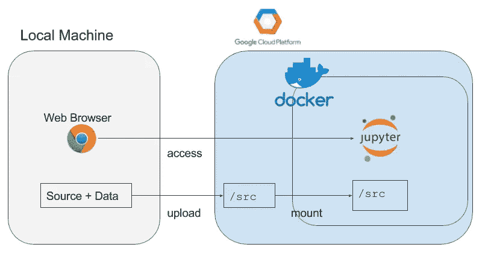

# Jupyter+Keras+ Nvidia Docker 搭配 GPU 瞬间上谷歌云

> 原文：<https://medium.com/google-cloud/jupyter-keras-nvidia-docker-with-gpu-on-google-cloud-in-an-instant-35ac7f413a92?source=collection_archive---------0----------------------->

作为一名机器学习工程师，自己制造环境来尝试机器学习任务真的很重要。我认为，像 AWS 和 GCP 这样的公共云服务越方便，这种能力就越重要。

今天我想描述一下我做的一个套件，用 jupyter notebook，keras，Nvidia docker 用 GPU 在 google cloud 上瞬间做了一个环境。

## 动机

我想要一个用 jupyter 和 GPU 构建深度学习模型的环境。有几个候选人。那样最好。不幸的是，我们还不能用带`docker-machine`的 GPU 创建 GCP 实例。我等着看这个问题。谷歌数据实验室也将是一个伟大的候选人。但不知道它和 jupyter 笔记本完全兼容。但是，两者都不足以满足我的要求。

## GitHub 知识库

作为我研究用 GPU 构建 GCP 的结果，我决定自己做一个。当然可以瞬间使用。

*   [https://github.com/yu-iskw/google-cloud-deep-learning-kit](https://github.com/yu-iskw/google-cloud-deep-learning-kit)



## 特征

*   用 nvidia docker 在 GCP 上做一个 GPU 实例
*   在 GPU 实例中将 jupyter 作为 docker 容器运行
*   设置一个 SSH 隧道来从 web 浏览器访问 jupyter
*   通过 pip 将 python 库安装到容器中(可选)
*   将文件从本地计算机上传到实例
*   将文件从实例下载到本地计算机
*   删除实例

## 用 nvidia docker 在 GCP 上做一个 GPU 实例

`make create-instance`允许我们用 nvidia docker 在 GPU 上做一个 GPU 实例，运行一个启动脚本。在执行该命令之前，我建议您编辑`Makefile`，将`INSTANCE_NAME`设置为您的实例名，将`GCP_PROJECT_ID`设置为您的 GCP 项目 ID。您也可以在创建实例时设置它们。创建一个实例大约需要 5 分钟。

```
make create-instance \
  INSTANCE_NAME="test-gpu-instance" \
  GCP_PROJECT_ID=xxx-xxx-xxx 
```

下面的 YAML 文件是用 jupyter、keras 等等为 docker 容器创建一个 anaconda 环境。你不需要自己安装它们，因为 docker 镜像已经包含了它们。

*   [https://github . com/Yu-iskw/Google-cloud-deep-learning-kit/blob/master/docker/environment-GPU . yml](https://github.com/yu-iskw/google-cloud-deep-learning-kit/blob/master/docker/environment-gpu.yml)

## 在 GPU 实例中将 jupyter 作为 docker 容器运行

创建实例后，必须用`make run-jupyter`运行 jupyter notebook。

```
make run-jupyter \
  INSTANCE_NAME="test-gpu-instance" \
  GCP_PROJECT_ID=xxx-xxx-xxx 
```

## 设置一个 SSH 隧道来从 web 浏览器访问 jupyter

为了访问您启动的 jupyter，您必须有一个 SSH 隧道。当你得到它时，你可以通过本地机器上的网络浏览器访问`http://localhost:18888`。当没有用`make ssh-tunnel`设置任何值时，端口是默认值。`JUPYTER_PORT`默认为`18888`。

```
make ssh-tunnel \
  INSTANCE_NAME="test-gpu-instance" \
  GCP_PROJECT_ID=xxx-xxx-xxx \
  JUPYTER_PORT=18888
```

## 通过 pip 将 python 库安装到容器中

如果你想在 jupyter 正在运行的 docker 容器中安装额外的 python 库，首先将它们添加到`requirements.txt`，然后执行`make pip-install`。

```
make run-jupyter \
  INSTANCE_NAME="test-gpu-instance" \
  GCP_PROJECT_ID=xxx-xxx-xxx
```

## 将文件从本地计算机上传到实例

如果你想上传你的文件，包括笔记本和数据，`make upload-files`允许我们这样做，设置`FROM`到你的路径。这些文件将被上传到 GCP 的`/src`下。目录由`/src`安装在 docker 容器中。

```
make upload-files \
  INSTANCE_NAME="test-gpu-instance" \
  GCP_PROJECT_ID=xxx-xxx-xxx \
  FROM=/path/to/your/files
```

## 将文件从实例下载到本地计算机

当您在 docker 容器中保存`/src/outputs`下的模型时，您可以使用`make download-outputs`下载它们。您必须将`TO`设置为您想要下载的路径。

```
make download-outputs \
  INSTANCE_NAME="test-gpu-instance" \
  GCP_PROJECT_ID=xxx-xxx-xxx \
  TO=/path/to/your/destination
```

## 删除实例

完成模型制作后，请不要忘记删除实例。

```
make delete-instance \
  INSTANCE_NAME="test-gpu-instance" \
  GCP_PROJECT_ID=xxx-xxx-xxx
```

## 结论

我用 GPU、jupyter、keras 等工具制作了一个 GCP 实例的工具包。希望对你的机器学习生活有所帮助。