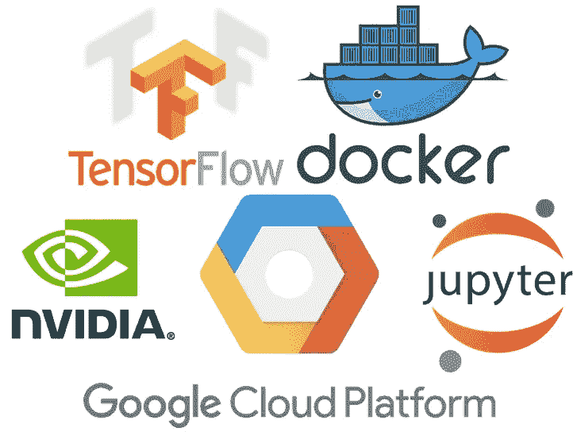
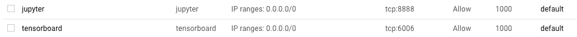
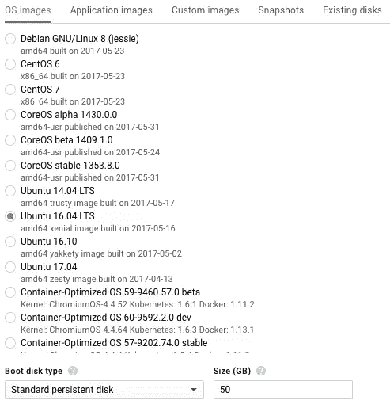
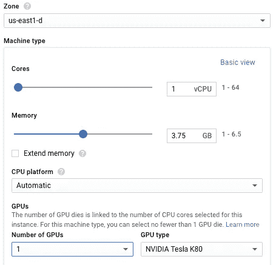
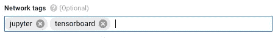

# jupyter+tensor flow+Nvidia GPU+Docker+Google 计算引擎

> 原文：<https://medium.com/google-cloud/jupyter-tensorflow-nvidia-gpu-docker-google-compute-engine-4a146f085f17?source=collection_archive---------0----------------------->

**TL；DR:按照这个食谱**在 Google Cloud 上与 Tensorflow、Jupyter、Docker 和 Nvidia GPUs 一起工作，节省时间，减少麻烦。



**动机** : **企业喜欢快速、数据驱动的洞察力**，他们雇佣数据科学家来创造这种洞察力。实践[数据科学](https://en.wikipedia.org/wiki/Data_science)是一个探索性的迭代过程，需要大量的计算资源和时间。为了更好地支持探索性迭代，数据科学家经常使用像 [Jupyter](http://jupyter.org/) 这样的笔记本，并加速他们越来越多地使用的[GPU](https://en.wikipedia.org/wiki/Graphics_processing_unit)的 [Tensorflow](http://tensorflow.org) 作业的计算。然而，GPU 价格昂贵，而且需要小心管理资源，因为**企业也喜欢高效的操作**。

目前云计算中有一种趋势是使用 Kubernetes 和 Docker 来提高资源利用率。**如果像 Jupyter 和 GPU 这样的数据科学工具可以用 Docker 和 Kubernetes** 来管理岂不是很棒？它可以节省时间和金钱。这是可能的，在我达到这个工作配置之前，我遇到了几个版本/依赖性问题。请重复使用！

# 创建一个 GCE 实例

首先，创建访问 Jupyter (8888)和 Tensorboard (6006)的防火墙规则



然后创建一个 GCE 实例。对于该实例:

*   使用操作系统 **Ubuntu 16.04 LTS**
*   分配一个 **50GB** 启动盘
*   指定您至少需要一个 **K80 GPU**
*   使用“ **jupyter** ”和“ **tensorboard** ”进行标记，以应用您创建的防火墙规则



# 安装并验证 CUDA 可以访问 GPU

使用 Nvidia 的 CUDA 库来访问 GPU。

下一步是 SSH 到您创建的计算节点，然后使用这个脚本[ [source](https://cloud.google.com/compute/docs/gpus/add-gpus) ]来安装 CUDA:

您可以使用`wget`将源*要点*和管道拉入 bash:

```
wget -O - -q '[https://gist.githubusercontent.com/allenday/f426e0f146d86bfc3dada06eda55e123/raw/41b6d3bc8ab2dfe1e1d09135851c8f11b8dc8db3/install-cuda.sh](https://gist.githubusercontent.com/allenday/f426e0f146d86bfc3dada06eda55e123/raw/41b6d3bc8ab2dfe1e1d09135851c8f11b8dc8db3/install-cuda.sh)' | sudo bash
```

如果 **CUDA** 安装成功，运行`nvidia-smi`将显示一个描述可用 **Tesla K80** GPU 的表格。

```
nvidia-smi
```

# 安装 Docker(-引擎)和 Nvidia-Docker

对于`docker`，你需要 Docker 的`docker-ce`版本，而不是 Ubuntu 自带的`docker.io`包。使用从[ [源](https://docs.docker.com/engine/installation/linux/ubuntu/)派生的脚本。

或者用我的:

```
wget -O - -q '[https://gist.githubusercontent.com/allenday/c875eaf21a2b416f6478c0a48e428f6a/raw/f7feca1acc1a992afa84f347394fd7e4bfac2599/install-docker-ce.sh](https://gist.githubusercontent.com/allenday/c875eaf21a2b416f6478c0a48e428f6a/raw/f7feca1acc1a992afa84f347394fd7e4bfac2599/install-docker-ce.sh)' | sudo bash
```

然后从 deb 文件[ [源](https://github.com/NVIDIA/nvidia-docker/releases/) ]安装`nvidia-docker`:

```
wget [https://github.com/NVIDIA/nvidia-docker/releases/download/v1.0.1/nvidia-docker_1.0.1-1_amd64.deb](https://github.com/NVIDIA/nvidia-docker/releases/download/v1.0.1/nvidia-docker_1.0.1-1_amd64.deb)sudo dpkg -i nvidia-docker*.deb
```

# 验证 GPU 在 Docker 容器中是否可见

开始`nvidia-docker-plugin`。**必须作为根用户**运行。

```
sudo nvidia-docker-plugin &
```

现在确保 docker 容器可以看到 GPU:

```
sudo nvidia-docker run --rm nvidia/cuda nvidia-smi
```

如上所示，您将得到与在提示符下运行`nvidia-smi`时相同类型的表，而不是在 Docker 容器中运行。

# [可选]创建快照卷

如果你按照上面的步骤去做，你可能会注意到这花了一些时间。当你运行一个 GPU 实例时，成本会更高。如果您以后需要一个支持 GPU 的实例，您可以通过快照这个工作映像，然后从它启动，来避免重复这些步骤和浪费时间/金钱。

# 发射 Jupyter 和 Tensorboard

```
sudo nvidia-docker run --rm --name tf1 -p 8888:8888 -p 6006:6006 gcr.io/tensorflow/tensorflow:latest-gpu jupyter notebook --allow-root
```

如果上面的命令显示一行类似于:

```
http://localhost:8888/?token=c8caba947dfd4c97414447c074325faf399cf8a157d0ce2f
```

…你在做生意。找到您的 GCE 实例的外部 IP 地址，并在端口 8888 上连接到它，例如`[http://EXTERNAL_IP:8888/](http://EXTERNAL_IP:8888/,)`，在您的控制台中键入(类似的)令牌，您就有了一台运行 Tensorflow 的支持 GPU 的 Jupyter 笔记本。

# 请参见

[](/@gooshan/for-those-who-had-trouble-in-past-months-of-getting-google-s-tensorflow-to-work-inside-a-docker-9ec7a4df945b) [## 用 Docker 和 GPU 运行 TensorFlow

medium.com](/@gooshan/for-those-who-had-trouble-in-past-months-of-getting-google-s-tensorflow-to-work-inside-a-docker-9ec7a4df945b) [](https://vxlabs.com/2017/03/17/miniconda3-tensorflow-keras-on-google-compute-engine-gpu-instance-the-step-by-step-guide/) [## 谷歌计算引擎 GPU 实例:一步一步指南。

### 在使用 SSH 端口连接到实例之后，重定向:SSH-L 8889:localhost:8888 CP Botha @ EXTERNAL _ IP...

vxlabs.com](https://vxlabs.com/2017/03/17/miniconda3-tensorflow-keras-on-google-compute-engine-gpu-instance-the-step-by-step-guide/)