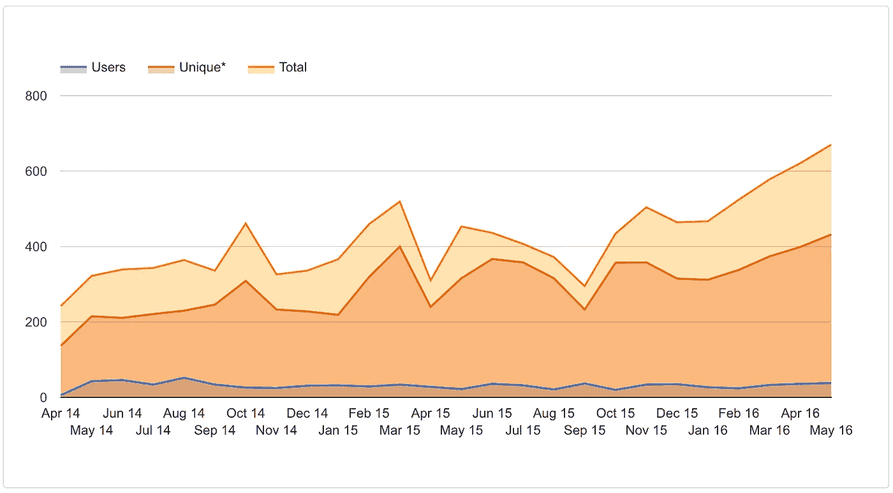

# 刚刚发布:gae-init 5.0

> 原文：<https://medium.com/google-cloud/just-released-gae-init-5-0-ca9f9013e25?source=collection_archive---------0----------------------->

如果你不知道那是什么，也不知道为什么要关注，这里有一句话描述:

> [**gae-init**](https://github.com/gae-init/gae-init) 是在**谷歌应用引擎**上使用 Python、Flask、RESTful 和大量其他酷功能启动新应用的最简单样板文件。

这一切都始于 4 年前的第一次承诺。现在，在 [1450 提交](https://github.com/gae-init/gae-init)、 [350 拉请求](https://github.com/gae-init/gae-init/pulls)、 [11 个贡献者](https://github.com/gae-init/gae-init/pulls)、 [1000+登录用户](https://gae-init.appspot.com/user/?active=True&order=-modified)和大量反馈之后，该项目处于非常稳定且经过良好测试的状态。如果你喜欢可视化，这里是如何在不到两分钟内发生的。

如果没有人使用我们精心制作的项目，所有这些都是毫无意义的，但显然它在世界各地都被广泛使用。这个数字一直在增长，这太令人惊讶了。**感谢您的使用！**

在 [gae-init stats](https://gae-init.appspot.com/stats/) 中查看更多信息。

## 下一步是什么？

在不久的将来将要到来的最大的事情之一就是与 [**的全面融合**](https://angular.io/) ！让我们希望我们能在它们公开发行之前完成。

[Magic](http://magic.gae-init.com/) 会得到一个巨大的升级，有更多的功能，一个快速入门，以及一般的使用方法。

文档一直是开源项目中的瓶颈，但是我们会努力使它保持最新，在你的帮助下会更容易。如果你发现有任何缺失、错误或过时的东西[提出问题](https://github.com/gae-init/gae-init-docs/issues)已经是很大的帮助了。