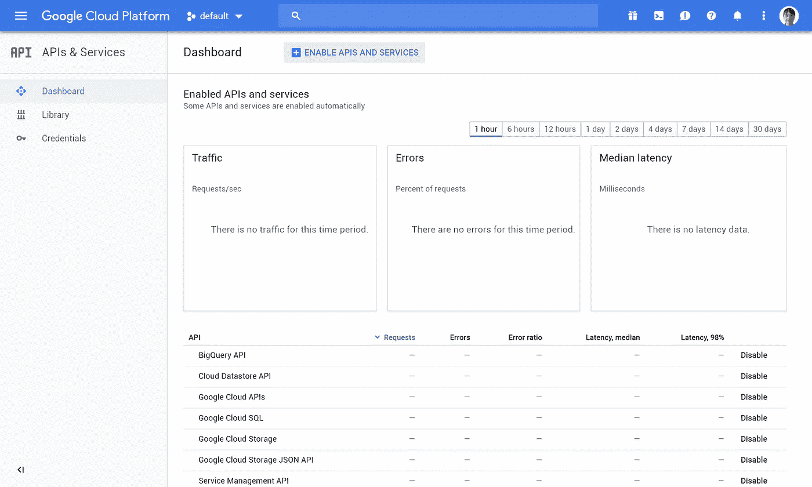

# JWT，谷歌云 API，自然语言处理，德尔福

> 原文：<https://medium.com/google-cloud/jwt-google-cloud-api-nlp-delphi-c9f6073e127b?source=collection_archive---------1----------------------->

嗨！

在上周的[黑客马拉松](/@Zawuza/media-hackday-2018-9c566ec7f4ce)上，我们试图建立一个文本处理的解决方案。这并没有发生，但我从 Delphi 学会了如何使用 Google NLP API，我认为这值得分享。这些说明也适用于其他 Google Cloud API，但不是全部，因为不同的 API 有不同的认证方法。

好了，少说话，多编码！开始吧！

## 启用 API

首先，你需要注册一个谷歌云。这个过程我就不描述了，只有一点你需要知道，这需要你的信用卡。之后你应该在这里着陆:

谷歌云控制台主页

下一步是点击“创建项目”。如你所见，我有一个叫做“默认”。让我们打开它，您将看到您的项目的仪表板:

仪表盘

现在点击“转到 API 概述”:

API 仪表板

点击“库”，找到“自然语言 API”

现在点击这个，然后点击“启用”按钮。注意:所有进一步的步骤都要花钱(但是如果你已经注册试用，你就有 300 美元的信用额度)

e-e-e-能！

## 获取凭据

在 API dashboard 中，单击“凭据”，然后单击“创建凭据”，并选择“服务帐户密钥”:

凭据视图

填写所有字段并选择“JSON”

我不确定“角色”框中应该有什么

之后，您会得到一个 JSON 文件:

这个文件非常秘密，把它保存在没有人能找到的地方。

## 准备

要创建 JWT，您需要创建一个 JSON Web 签名，该签名可以使用 RSA 密钥创建。要获得正确的 RSA 密钥，您需要复制您的秘密 JSON 文件的值“private_key ”,并用换行符替换所有的“\n”。最后，您应该得到以下内容:

该键被禁用，但为了确保安全，我添加了一个黑色矩形

你还需要两样东西:

1.  [德尔菲穆和 JWT 图书馆](https://github.com/paolo-rossi/delphi-jose-jwt)
2.  OpenSSL 动态链接库

## 从 Delphi 调用 API

现在我们准备调用 NLP API。该过程有三个步骤:生成 JWT、获取访问令牌和调用 API。

让我们看看第一步:

## JWT 一代

所以，首先你需要创建一个有一些声明的 JWT。声明只是一个“字段”,令牌中有一些数据，但有几个标准的声明，如作为属性实现的 IssuedAt。但是也可以添加非标准权利要求。谷歌要求我们提供一些声明:

来源:[谷歌 API 认证手册](https://developers.google.com/identity/protocols/OAuth2ServiceAccount)

您可以从您的秘密 JSON 文件的“client_email”字段中获取您的客户端电子邮件地址:

像这样

在这段代码中，我们生成了一个半小时的令牌。

最后，我们创建一个 JSON Web 签名，用我们在使用 RSA256 算法之前创建的 RSA 密钥对令牌进行签名，RSA 256 算法是唯一可用于 Google API 认证的算法。

现在我们有一个 TJOSEBytes 类型的 LCompactedToken。

## 访问令牌请求

让我们来看看这一步:

我们需要将我们的 JWT 以申请表格式(在维基百科中有更多[)发送到一个预定义的地址，其中有两个字段:grant_type 和我们的 JWT 断言。关于这方面的信息也可以在](https://en.wikipedia.org/wiki/POST_(HTTP)#Use_for_submitting_web_forms)[谷歌认证手册](https://developers.google.com/identity/protocols/OAuth2ServiceAccount)中找到:

来自手动

最后，我们从响应中提取一个字段“access_key ”,它就是我们的访问键。

## 进行 API 调用

现在我们可以使用 API 了。我们获得了一个访问令牌，需要将其添加到“授权”头中。所有其他事情只是请求结构的一部分。在这种情况下，我提取语法并分析句子“你好，我的名字是 Elise”的情感，并将输出打印到控制台。关于谷歌云 NLP 的更多信息，你可以在它的[文档](https://cloud.google.com/natural-language/docs/)中找到。

下面是一个演示的截图:

你可以在 GitHub 库中找到这个控制台应用程序，在你将你的密钥添加为“key.txt”并在代码中填写你的客户端电子邮件后，它应该会工作。这个演示有一些内存泄漏，写得很糟糕，但它只是从我的黑客马拉松代码的一部分构建的演示，所以不要复制粘贴:)

希望，这篇文章能对某人有所帮助！今天就到这里:)

P.S .如果你知道某个框架让它变得更简单，请在评论中给我建议:)