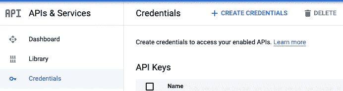
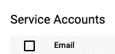
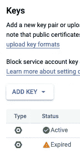

# JWT (JSON Web 令牌)错误|无效的 JWT 签名

> 原文：<https://medium.com/google-cloud/jwt-json-web-tokens-errors-invalid-jwt-signature-8aab13703eb5?source=collection_archive---------0----------------------->

错误是最好的，尤其是当你以一种破译者的方式写出来的时候。我记得过去的美好时光，我得到的所有错误代码都是数字，也许是字母混合在一起，没有任何在线搜索来轻松获得解释。

我一直在使用谷歌云产品，并从我的笔记本电脑连接到存储和 BigQuery 等服务。在过去的几个月里，我遇到了几次 JWT 错误，`*invalid_grant:Invalid JWT Signature*`，下面提供了我如何解决它的概述，基本上是更新过期的服务帐户密钥。

# JWT 误差

“服务器到服务器的认证交互机制要求应用程序创建并加密签署 JSON Web 令牌(jwt)。”jwt 是经过签名的令牌，用于验证服务器到服务器的连接。

关于[使用 OAuth 2.0 进行服务器到服务器应用](https://developers.google.com/identity/protocols/oauth2/service-account#creatinganaccount)的页面中间有一个叫做 **JWT 错误代码**的部分，它给出了关于你可能看到的不同错误以及如何解决它们的更多细节。这是获取更多信息的好地方。

# JWT 签名无效:invalid_grant

对于我的错误`*invalid_grant:Invalid JWT Signature*`，解决的方法不在 **JWT 错误代码**的列表中。基本上，服务帐户密钥过期了，我需要生成一个新的。

我确实在 StackOverflow 线程中找到了一个人，他用下面的评论帮我解决了这个问题:*JWT 断言是用一个与客户端电子邮件所标识的服务帐户无关的私钥签名的。*

我一度认为我的本地 gcloud 配置下的电子邮件可能是问题，但它最终是过期的密钥。因此，密钥不再与服务帐户相关联。

# 如何修复|添加新的服务帐户密钥

为了解决这个问题，请访问**谷歌云控制台**上的**API&服务**。



在**服务帐户**下，查找您的项目所使用的电子邮件帐户。



如果您不记得那个电子邮件地址是什么，那么您可以使用命令来查找它。

```
gcloud config list
```

在**谷歌云控制台**上，选择你正在使用的电子邮件账户旁边的*编辑符号*。


选择**键**部分。


检查您的服务帐户密钥是**有效**还是**过期**。

如果您不知道您正在使用的服务帐户密钥，请查看您计算机上正在使用的文件，该文件可能位于~/下。oauth，尤其是在 Mac 上。如果没有，那么查看与 GOOGLE_APPLICATION_CREDENTIALS 环境变量相关联的文件路径，以找到服务帐户密钥文件。

部分密钥号可能在文件名中；否则，它将位于服务帐户密钥文件中。

如果密钥**已过期**，那么选择**添加密钥**，这将添加一个**活动的密钥**，并将 json 服务帐户密钥文件下载到您的计算机。



将 json 密钥文件移动到引用文件地方。有些 gcloud 服务器连接会自动在~/下查找。oauth，但是您可以使用 GOOGLE_APPLICATION_CREDENTIALS 环境变量来更改该位置。

如果您在~/中定义了 GOOGLE_APPLICATION_CREDENTIALS 环境变量。bashrc 或者~/。bash_profile 文件，然后确保更新那里的位置。

# 包裹

这篇文章回顾了 JWT 错误，特别是如何解决`*invalid_grant:Invalid JWT Signature*` 错误。对于无效的 JWT 签名，请检查您的服务帐户密钥是否已过期。转到您的**API&服务**来添加一个新的密钥(如果有的话)。