# 使用数据流从 Kafka 到 BigQuery

> 原文：<https://medium.com/google-cloud/kafka-to-bigquery-using-dataflow-6ec73ec249bb?source=collection_archive---------0----------------------->

## 在本文中，我们评估了使用数据流将 Kafka 连接到 BigQuery 的两种不同方法

> 声明:我在谷歌的云团队工作。观点是我自己的，而不是我现在雇主的观点。

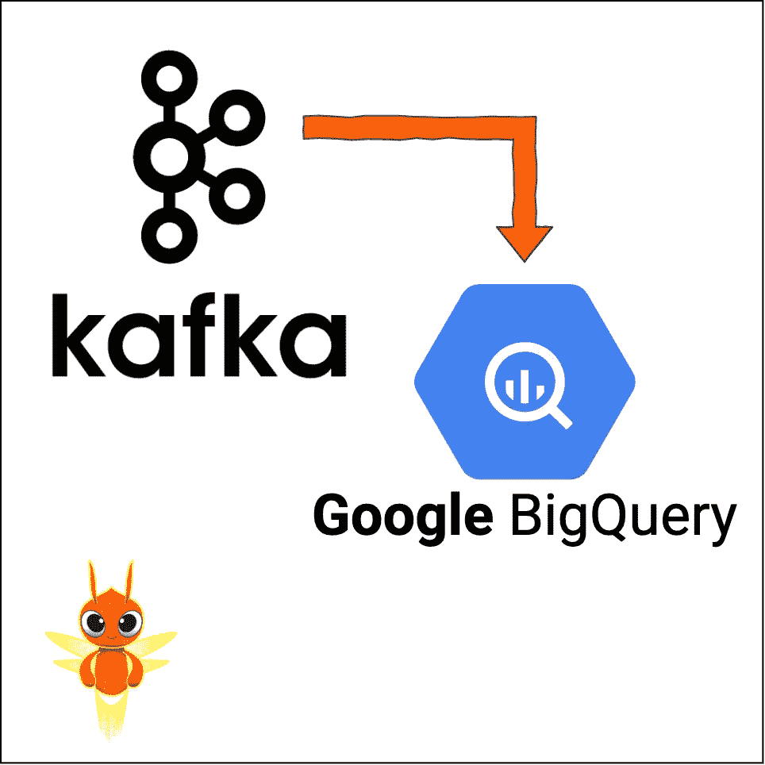

# 流式分析

许多组织依靠开源的**流媒体**平台 [Kafka](https://kafka.apache.org) 来构建实时数据管道和应用。
同样的组织经常寻求现代化他们的 IT 环境，并采用 [BigQuery](https://cloud.google.com/bigquery) 来满足他们不断增长的**分析**需求。
通过将 Kafka 流数据连接到 BigQuery 分析功能，这些组织可以快速分析和激活数据衍生的洞察，而不是等待批处理过程完成。这种强大的组合支持实时**流分析**用例，例如欺诈检测、库存或车队管理、动态建议、预测性维护、容量规划...

# λ、κ和数据流

组织已经实施了[λ](http://lambda-architecture.net)或 [Kappa](https://www.oreilly.com/radar/questioning-the-lambda-architecture/) 架构来支持批处理和流数据处理。
但是这两种架构都有一些缺点。以 Lambda 为例，批处理端和流端都需要不同的代码库。有了 Kappa，一切都被视为数据流，即使是大文件也必须被送入流处理系统，这有时会影响性能。


最近(2015 年)，谷歌发布了[数据流模型](http://www.vldb.org/pvldb/vol8/p1792-Akidau.pdf)论文，这是一个**批处理和流的统一编程模型。可以说这个模型是一个 Lambda 架构，但是没有维护两个不同代码库的缺点。
[Apache Beam](https://beam.apache.org) 就是这个模型的开源实现。阿帕奇梁支撑[很多跑者](https://beam.apache.org/documentation/runners/capability-matrix/)。在 Google Cloud 中，Beam 代码在完全托管的数据处理服务上运行得最好，该服务与上面链接的白皮书同名: [Cloud Dataflow](https://cloud.google.com/dataflow) 。**

以下是如何使用运行在 Google Cloud Dataflow 上的 Apache Beam 将 Kafka 消息摄取到 BigQuery 中的分步指南。

# 环境设置

让我们从安装一个 Kafka 实例开始。

导航到[谷歌云市场](https://console.cloud.google.com/marketplace)，搜索“卡夫卡”。
在返回的解决方案列表中，选择 **Google Click to Deploy** 提供的 Kafka 解决方案，如下图中蓝色突出显示的。

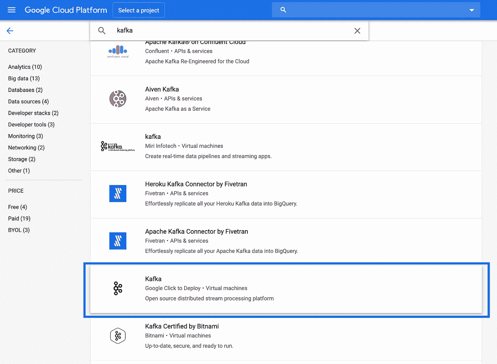

选择您希望虚拟机位于的地区/区域，例如`europe-west1-b` 🇧🇪
保留其他所有内容的默认设置(除非您希望使用自定义网络)，然后单击“部署”。


## 创建大查询表

在部署我们的 VM 时，让我们定义一个 JSON 模式并创建我们的 BigQuery 表。通常最佳实践是在第一个到达的 Kafka 消息之前创建 BigQuery 表，而不是创建它。这是因为第一个 Kafka 消息可能有一些未设置的可选字段。因此，使用[模式自动检测](https://cloud.google.com/bigquery/docs/schema-detect)从中推断出的 BigQuery 模式是不完整的。

> 注意，如果您的模式因为变化太频繁而无法定义，那么将您的 JSON 作为 BigQuery 中的单个字符串列绝对是一个选择。然后您可以使用 [JSON 函数](https://cloud.google.com/bigquery/docs/reference/standard-sql/json_functions)来解析它。

出于本文的目的，我们将创建一个表来存储多种产品的示例购买事件。
在名为`schema.json`的文件中复制/粘贴以下 JSON:

```
[
  {
    "description": "Transaction time",
    "name": "transaction_time",
    "type": "TIMESTAMP",
    "mode": "REQUIRED"
  },
  {
    "description": "First name",
    "name": "first_name",
    "type": "STRING",
    "mode": "REQUIRED"
  },
  {
    "description": "Last name",
    "name": "last_name",
    "type": "STRING",
    "mode": "REQUIRED"
  },
  {
    "description": "City",
    "name": "city",
    "type": "STRING",
    "mode": "NULLABLE"
  },
  {
    "description": "List of products",
    "name": "products",
    "type": "RECORD",
    "mode": "REPEATED",
    "fields": [
      {
        "description": "Product name",
        "name": "product_name",
        "type": "STRING",
        "mode": "REQUIRED"
      },
      {
        "description": "Product price",
        "name": "product_price",
        "type": "FLOAT64",
        "mode": "NULLABLE"
      }
    ]
  }
]
```

为了创建空的 BigQuery 表，我们最好使用由 CI/CD 系统触发的 [IaC](https://en.wikipedia.org/wiki/Infrastructure_as_code) 工具，如 [Terraform](https://www.terraform.io/docs/providers/google/r/bigquery_table.html) 。但是这可能是另一篇文章的主题，所以让我们使用 [bq mk](https://cloud.google.com/bigquery/docs/reference/bq-cli-reference#bq_mk) 命令来创建我们的数据集和表。

打开[云壳](https://cloud.google.com/shell)，上传你之前创建的`schema.json`:

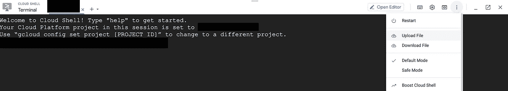

然后，在 Cloud Shell 中运行以下命令来创建我们的[时间戳分区表](https://cloud.google.com/bigquery/docs/creating-column-partitions)。不要忘记将下面的`<my-project>`替换为您的 GCP 项目 ID:

```
gcloud config set project <my-project>
bq mk --location EU --dataset kafka_to_bigquery
bq mk --table \
--schema schema.json \
--time_partitioning_field transaction_time \
kafka_to_bigquery.transactions
```

> 除了使用`bq mk`命令，您还可以使用 [BigQuery web UI](https://cloud.google.com/bigquery/docs/bigquery-web-ui) 创建数据集和表。

## 向卡夫卡主题发送消息

我们几乎完成了环境设置！最后一步是创建一个 Kafka 主题，并向其发送 Kafka 消息。导航到[谷歌云控制台](https://console.cloud.google.com)并打开计算引擎>虚拟机实例。您应该看到我们之前创建的 Kafka VM。单击下图中蓝色突出显示的 SSH 按钮。

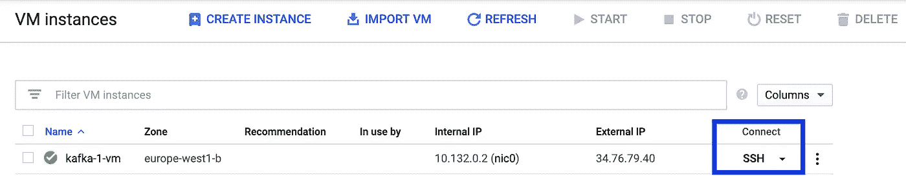

在打开的终端窗口中，输入以下命令来创建我们的 Kafka 主题，命名为`txtopic`:

```
/opt/kafka/bin/kafka-topics.sh --create --zookeeper localhost:2181 \
--replication-factor 1 \
--partitions 1 --topic txtopic
```

通过列出不同的主题，确认主题已经创建。当输入以下命令时，您应该看到返回的`txtopic`:

```
/opt/kafka/bin/kafka-topics.sh --list --zookeeper localhost:2181
```

现在让我们想象一个购买事件被发送到我们的主题。使用 SSH 终端中的`vi`或`nano`，创建名为`message.json`的文件，并复制/粘贴下面的示例事务:

```
{
  "transaction_time": "2020-07-20 15:14:54",
  "first_name": "John",
  "last_name": "Smith",
  "products": [
    {
      "product_name": "Pixel 4",
      "product_price": 799.5
    },
    {
      "product_name": "Pixel Buds 2",
      "product_price": 179
    }
  ]
}
```

最后，用下面的命令将你的卡夫卡信息发送到`txtopic`。我们添加了一个 Kafka 消息密钥，并使用`jq`来压缩我们的 JSON。

```
sudo apt-get install jq
(echo -n "1|"; cat message.json | jq . -c) | /opt/kafka/bin/kafka-console-producer.sh \
--broker-list localhost:9092 \
--topic txtopic \
--property "parse.key=true" \
--property "key.separator=|"
```

# **方法 1:使用数据流模板**

现在，我们的 Kafka 实例正在运行，让我们探索将消息发送到 BigQuery 的第一个方法。

## 卡夫凯奥

我们将使用 Apache Beam 内置的 [KafkaIO](https://beam.apache.org/releases/javadoc/2.19.0/org/apache/beam/sdk/io/kafka/KafkaIO.Read.html) 连接器，它可以读取 Kafka 主题。
要使用 KafkaIO 连接器，您可以使用 Beam Java SDK 实现自己的数据管道(自 [Apache Beam 2.22](https://beam.apache.org/blog/beam-2.22.0/) 发布以来，KafkaIO 连接器也可用于 Beam Python SDK)，或者从 Google 提供的数据流模板开始，该模板可从以下位置获得:[https://github . com/Google cloud platform/data flow templates/tree/master/v2/Kafka-To-big query](https://github.com/GoogleCloudPlatform/DataflowTemplates/tree/master/v2/kafka-to-bigquery)

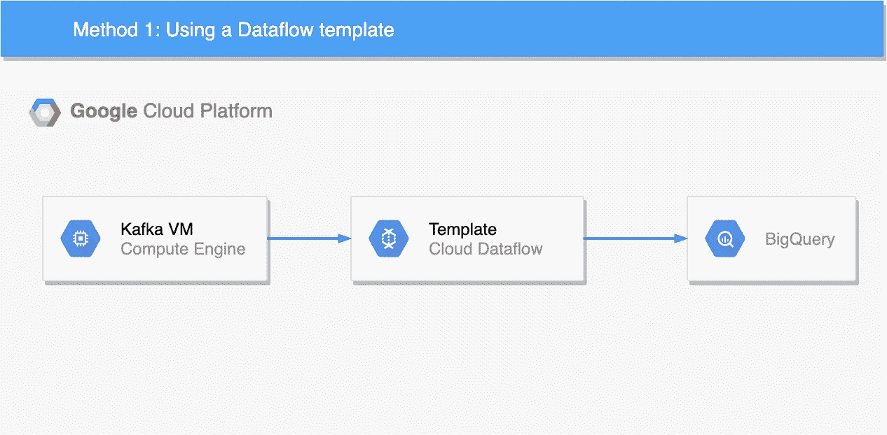

## 数据流弹性模板

上面链接的代码使用了名为 [Dataflow Flex template](https://cloud.google.com/dataflow/docs/guides/templates/using-flex-templates) 的新 Dataflow 模板机制，它可以将任何 Dataflow 管道转换为可供他人重用的模板。Flex 模板是使用 Docker 打包的。数据流模板的第一个版本，现在称为[传统模板](https://cloud.google.com/dataflow/docs/guides/templates/creating-templates)，有一些已知的限制，因为许多 Beam I/O 不支持使用 [ValueProvider 接口](https://cloud.google.com/dataflow/docs/guides/templates/creating-templates#valueprovider)的运行时参数。

> 注意，Google 在这里提供了另一个 Kafka to BigQuery Dataflow Flex 模板示例[。也许以后两个例子会合并？](https://github.com/GoogleCloudPlatform/java-docs-samples/tree/master/dataflow/flex-templates/kafka_to_bigquery)

## 封装数据流模板

在 Cloud Shell 中，复制/粘贴以下命令，这些命令将构建容器化的模板代码并将其推送到[容器注册表](https://cloud.google.com/container-registry) (GCR)。您可以启用[助推模式](https://cloud.google.com/shell/docs/how-cloud-shell-works#boost_mode)使该步骤运行得更快。
确保您的项目启用了 GCR API，并且不要忘记在下面用您的 GCP 项目 ID 替换`<my-project>`。此外，您可以选择一个自定义的图像名称，并替换下面代码片段中的`<my-image-name>`。

```
git clone [https://github.com/GoogleCloudPlatform/DataflowTemplates](https://github.com/GoogleCloudPlatform/DataflowTemplates)
cd DataflowTemplates/v2/export PROJECT=<my-project>
export IMAGE_NAME=<my-image-name>export TARGET_GCR_IMAGE=gcr.io/${PROJECT}/${IMAGE_NAME}
export BASE_CONTAINER_IMAGE=gcr.io/dataflow-templates-base/java8-template-launcher-base
export BASE_CONTAINER_IMAGE_VERSION=latest
export TEMPLATE_MODULE=kafka-to-bigquery
export APP_ROOT=/template/${TEMPLATE_MODULE}
export COMMAND_SPEC=${APP_ROOT}/resources/${TEMPLATE_MODULE}-command-spec.jsonmvn clean package -Dimage=${TARGET_GCR_IMAGE} \
                  -Dbase-container-image=${BASE_CONTAINER_IMAGE} \
                  -Dbase-container-image.version=${BASE_CONTAINER_IMAGE_VERSION} \
                  -Dapp-root=${APP_ROOT} \
                  -Dcommand-spec=${COMMAND_SPEC} \
                  -am -pl ${TEMPLATE_MODULE}
```

> ⚠️注意，我们克隆了 Git 存储库的主分支，可能 README 文件中的一些说明现在已经更新，与 2020 年 7 月撰写的这篇文章的内容不匹配。如果你遵循更新的自述文件说明，那可能是最好的。

下一步是创建一个 Google 云存储(GCS)桶来存储运行我们的模板所需的各种工件。
在云壳中输入以下命令之前，选择一个名称并替换下面的`<bucket-name>`:

```
export BUCKET_NAME=gs://<bucket-name>
gsutil mb -l EU $BUCKET_NAME
```

## 创建等级库文件

要运行 Dataflow Flex 模板，需要在 GCS 中创建一个模板规范文件，其中包含运行作业所需的所有信息。
让我们用以下内容创建一个名为`kafka-to-bigquery-image-spec.json`的文件。在保存文件之前，不要忘记编辑`<my-project>`和`<my-image-name>`。

```
{
  "image": "gcr.io/<my-project>/<my-image-name>",
  "sdk_info": {
    "language": "JAVA"
  }
}
```

然后，运行以下命令将文件上传到 bucket，并将路径导出到一个环境变量，我们将在稍后启动管道时使用该变量。

```
gsutil cp kafka-to-bigquery-image-spec.json $BUCKET_NAME/images/export TEMPLATE_IMAGE_SPEC=${BUCKET_NAME}/images/kafka-to-bigquery-image-spec.json
```

您也可以使用命令`gcloud beta dataflow flex-template build`生成规格文件，如这里的[文档所述。](https://cloud.google.com/dataflow/docs/guides/templates/using-flex-templates#creating_a_flex_template)

## 管道参数

为了告诉数据流它应该连接到哪里，我们可以提供 Kafka IP 地址作为 Flex 模板的参数。
[如果你的卡夫卡没有托管在 GCP](https://cloud.google.com/solutions/processing-messages-from-kafka-hosted-outside-gcp) 上，你可以阅读这个解决方案。
要使用我们之前部署的 Kafka 安装，请导航到[谷歌云控制台](https://console.cloud.google.com)并打开计算引擎>虚拟机实例。注意你的 Kafka 虚拟机的内部 IP，并编辑下面的`<internal-ip>`。然后，在云壳中复制/粘贴:

```
export TOPICS=txtopic
export BOOTSTRAP=<internal-ip>:9092
```

我们的 Flex 模板还支持添加 JavaScript UDF 来指定自定义转换。上面的`message.json`中缺少 BigQuery 模式的`city`字段，所以让我们尝试添加它。我们不会检查特定的交易，所以下面的代码添加了城市“纽约”🗽所有交易。
创建一个名为`my_function.js`的文件，复制/粘贴下面的 JavaScript 代码。然后将文件上传到前面创建的 GCS bucket 中。

```
function transform(inJson) {
  var obj = JSON.parse(inJson);
  obj.city = "New York";
  return JSON.stringify(obj);
}
```

> 请注意，我们只添加了一个字段以保持简单，但是我们当然可以在 JavaScript 中做更多的事情。例如，一个想法可以是比较事件时间和事务时间，以捕获后来的事件，并可能为这些事件添加自定义逻辑。

## 运行数据流模板

最后，确保为您的项目启用了 Dataflow API，并使用以下命令启动作业。
我们指定`europe-west1`位置，这是我们决定在本例中使用的[数据流区域端点](https://cloud.google.com/dataflow/docs/concepts/regional-endpoints)。如果您想使用另一个区域，在同一个区域中创建您的 GCS bucket、您的 BigQuery 数据集和您的 Kafka VM 是一个好主意。

```
export OUTPUT_TABLE=${PROJECT}:kafka_to_bigquery.transactions
export JS_PATH=${BUCKET_NAME}/my_function.js
export JS_FUNC_NAME=transformexport JOB_NAME="${TEMPLATE_MODULE}-`date +%Y%m%d-%H%M%S-%N`"
gcloud beta dataflow flex-template run ${JOB_NAME} \
        --project=${PROJECT} --region=europe-west1 \
        --template-file-gcs-location=${TEMPLATE_IMAGE_SPEC} \
        --parameters ^~^outputTableSpec=${OUTPUT_TABLE}~inputTopics=${TOPICS}~javascriptTextTransformGcsPath=${JS_PATH}~javascriptTextTransformFunctionName=${JS_FUNC_NAME}~bootstrapServers=${BOOTSTRAP}
```

> 流式作业不需要像批处理作业那样定期触发。流式作业无限期运行，直到停止。例如，这个一次性运行命令可以从 CI/CD 系统中发出。

## Web 用户界面

如果您愿意，可以跳过上面的许多步骤，直接通过 Google Cloud Console web UI 启动相同的数据流模板。
为此，导航至[谷歌云控制台](https://console.cloud.google.com)并打开数据流>从模板创建工作。然后，在数据流模板下拉列表中选择“Kafka to BigQuery”。最后，您可以用我们在上面的说明中设置为环境变量的所有参数来填充表单输入字段。

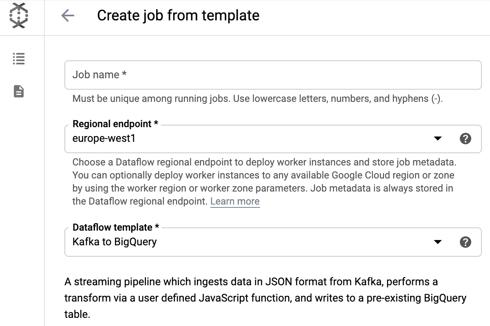

## 结果

我们的流管道现在应该正在运行。要检查是否是这种情况，请导航到[谷歌云控制台](https://console.cloud.google.com) >数据流。您应该在列表中看到您的作业，它的状态设置为“正在运行”。

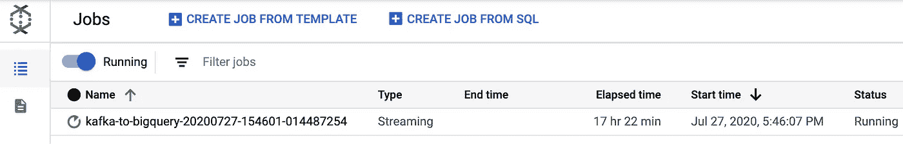

几秒钟后，数据流应该开始从你的 Kafka 主题中读取，你应该在 BigQuery 中看到结果。
因为表是在`transaction_time`字段上分区的，所以确保查询了`2020-07-20`分区(这是我们在上面的`message.json`中设置的`transaction_time`值)。

> 注意，流入分区表[有一些限制](https://cloud.google.com/bigquery/streaming-data-into-bigquery#streaming_into_partitioned_tables)(截至 2020 年 7 月)。

下面是检索结果的 SQL 命令。请随意尝试，但不要忘记将`<my-project>`替换为您的 GCP 项目 ID:

```
SELECT * FROM `<my-project>.kafka_to_bigquery.transactions` WHERE DATE(transaction_time) = “2020–07–20”
```

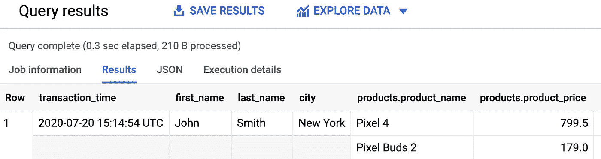

如果您试图向 Kafka 主题发送格式错误的消息，作业应该将死信输入保存到另一个表中。


恭喜你！您已经完成了本文的第一个方法。我们的卡夫卡信息现在被自动发送到 BigQuery。
有了 Dataflow，还有另外一种方法可以将 Kafka 消息发送到 BigQuery，下面我们将探讨这第二种方法。

# 方法 2:使用发布/订阅和数据流 SQL

我们要尝试的第二种方法是将我们的 Kafka 消息发送到 [Cloud Pub/Sub](https://cloud.google.com/pubsub) ，然后直接从 BigQuery 查询 Pub/Sub 主题！我们的两种方法有一些共同的特点。方法 2 也使用在数据流上运行的 Apache Beam。但是这一次，管道是用 SQL 编写的，使用带有 [ZetaSQL](https://github.com/google/zetasql) 方言的 [Beam SQL](https://beam.apache.org/documentation/dsls/sql/overview/) 。
因此，当您运行一个数据流 SQL 查询时，数据流会将查询转换为 Apache Beam 管道并执行管道。

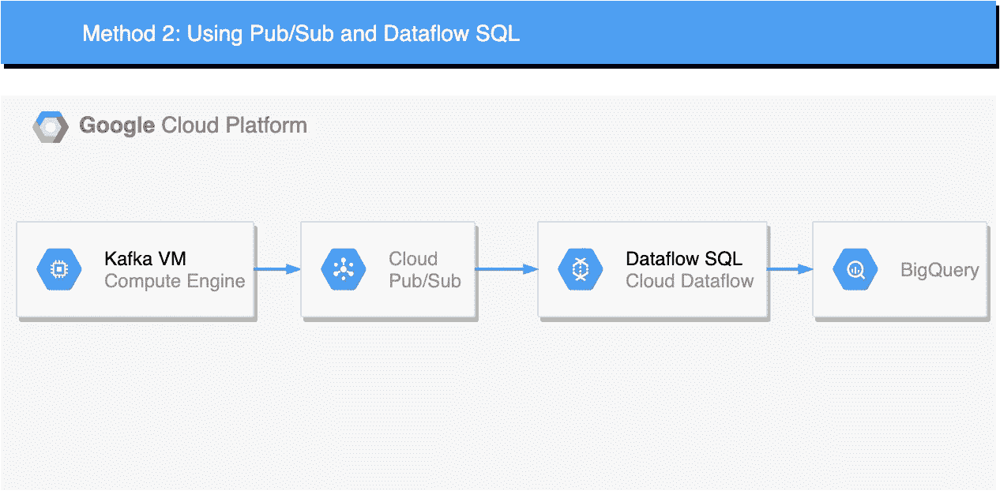

例如，希望采用[混合云架构](https://en.wikipedia.org/wiki/Cloud_computing#Hybrid_cloud)的组织可以在其内部环境中运行 Kafka，并使用云发布/订阅来制作和消费 GCP 上的活动。

## 开始之前

如果您还没有这样做，请遵循本文第一部分中的环境设置。一旦完成，你应该:
-部署一个 Kafka VM
-创建一个 BigQuery 表
-创建一个 Kafka 主题
-并向你的主题发送一条 Kafka 消息。

## 创建发布/订阅主题

导航到[谷歌云控制台](https://console.cloud.google.com)并打开发布/订阅面板。然后，创建一个名为`txtopic`的主题。

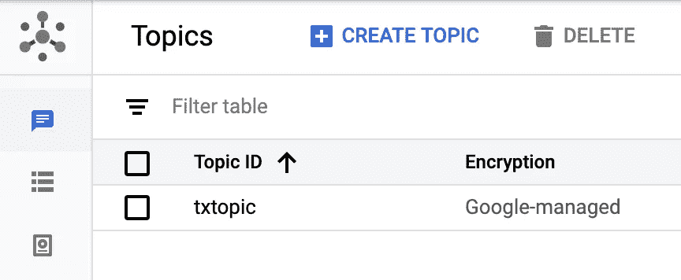

## 创建服务帐户

遵循自述文件中的“运行前步骤”，如下:[https://github . com/Google cloud platform/pubsub/tree/master/Kafka-connector](https://github.com/GoogleCloudPlatform/pubsub/tree/master/kafka-connector)

这些步骤将指导您创建一个服务帐户，并为其分配**发布/订阅管理**角色。
您必须为这个服务帐户创建一个 JSON 密钥，并将其上传到 Kafka VM(SSH 窗口的右上角>上传文件)。

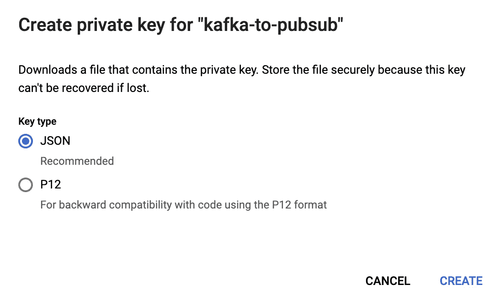

最后，在 Kafka VM 上设置以下环境变量(通过 SSH 终端)。更换下面的`/path/to/key/file`:

```
export GOOGLE_APPLICATION_CREDENTIALS=/path/to/key/file
```

## Kafka 连接设置

我们将使用 [Kafka Connect](http://kafka.apache.org/documentation.html#connect) 在 Kafka 和 Cloud Pub/Sub 之间同步消息。

在 Kafka 虚拟机上(通过 SSH)，运行以下命令来安装云发布/订阅连接器:

```
sudo apt install git-all
sudo apt install default-jdk
sudo apt install mavengit clone [https://github.com/GoogleCloudPlatform/pubsub](https://github.com/GoogleCloudPlatform/pubsub)
cd pubsub/kafka-connector/
mvn packagesudo mkdir /opt/kafka/connectors
sudo cp target/cps-kafka-connector.jar /opt/kafka/connectors/
sudo cp config/cps-sink-connector.properties /opt/kafka/config/
```

在同一个 SSH 终端中，编辑刚刚复制到`/opt/kafka/config/`目录中的`cps-sink-connector.properties`文件。

```
sudo vim /opt/kafka/config/cps-sink-connector.properties
```

确保编辑 Kafka 和 Pub/Sub 主题名称，如下所示。在这个例子中，我们为两者取了相同的名字:`txtopic`💡
下面的代码片段显示了文件应该是什么样子。用您的 GCP 项目 ID 替换下面的`<my-project>`。

```
name=CPSSinkConnector
connector.class=com.google.pubsub.kafka.sink.CloudPubSubSinkConnector
tasks.max=10
topics=txtopic
cps.topic=txtopic
cps.project=<my-project>
```

我们还需要编辑一个文件来完成 Kafka Connect 设置:

```
sudo vim /opt/kafka/config/connect-standalone.properties
```

我们需要取消注释并编辑属性`plugin.path`，以便 Kafka Connect 可以定位我们之前打包并复制的 JAR 文件`cps-kafka-connector.jar`:

```
plugin.path=/opt/kafka/connectors
```

仍然编辑`connect-standalone.properties`文件，我们需要设置以下属性:

```
key.converter=org.apache.kafka.connect.storage.StringConverter
value.converter=org.apache.kafka.connect.storage.StringConverterkey.converter.schemas.enable=false
value.converter.schemas.enable=false
```

*   通过使用`StringConverter`，我们告诉连接器不要试图解释数据，而是直接将 JSON 转发到 Cloud Pub/Sub。
*   我们还告诉 Kafka Connect 不要寻找特定的模式[，如这里所解释的](https://www.confluent.io/blog/kafka-connect-deep-dive-converters-serialization-explained/#json-schemas)。

## 运行 Kafka Connect

您可以使用以下命令运行 Kafka Connect。注意`&`符号指示命令在后台进程中运行。

```
/opt/kafka/bin/connect-standalone.sh /opt/kafka/config/connect-standalone.properties /opt/kafka/config/cps-sink-connector.properties &
```

[如这里所解释的](https://docs.confluent.io/current/connect/references/restapi.html#connectors)，Kafka Connect 旨在作为服务运行，并支持用于管理连接器的 REST API。
您可以使用以下命令检查我们的发布/订阅连接器的当前状态:

```
curl localhost:8083/connectors/CPSSinkConnector/status | jq
```

## 云发布/订阅

在这个阶段，我们的 Kafka 消息现在应该被转发到 Cloud Pub/Sub。让我们检查一下！

*   创建发布/订阅订阅以查看消息。
    导航至[谷歌云控制台](https://console.cloud.google.com)并打开发布/订阅>订阅>创建订阅。
*   创建订阅后，打开订阅面板，单击您的订阅，然后单击“查看消息”。单击“拉”后，您应该会看到您的消息。如果没有，尝试使用上面环境设置部分的`kafka-console-producer.sh`命令发送另一个 Kafka 消息。

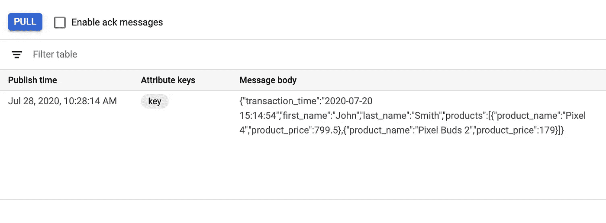

## 发布/订阅到大查询模板

如果您在 Pub/Sub web UI 中四处点击，您可能会看到可以轻松地将 Pub/Sub 主题导出到 BigQuery。
此导出作业使用类似于方法 1 的数据流模板。但是这个特定的模板没有使用 KafkaIO，而是使用了 [PubsubIO](https://beam.apache.org/releases/javadoc/2.19.0/org/apache/beam/sdk/io/gcp/pubsub/PubsubIO.html) Beam connector。我们不会在本文中讨论这个特定的模板。


## BigQuery 数据流引擎

为了将我们的发布/订阅消息接收到 BigQuery，我们将使用数据流 SQL。

[数据流 SQL 查询语法](https://cloud.google.com/dataflow/docs/reference/sql/query-syntax)类似于 [BigQuery 标准 SQL](https://cloud.google.com/bigquery/docs/reference/standard-sql/query-syntax) 。您还可以使用[data flow SQL streaming extensions](https://cloud.google.com/dataflow/docs/reference/sql/streaming-extensions)从持续更新的数据源(如 Pub/Sub)聚合数据。

导航到[谷歌云控制台](https://console.cloud.google.com)并打开 BigQuery。如下截图所示，点击“更多”>查询设置，选择“云数据流引擎”作为查询引擎。

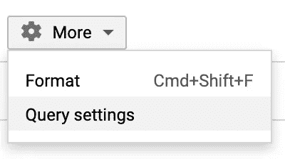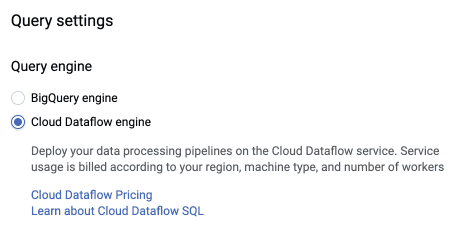

选择云数据流引擎后，单击“添加数据”>云数据流源。选择您的 GCP 项目和我们之前创建的发布/订阅主题`txtopic`。

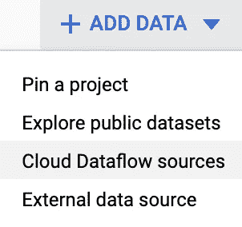

## 发布/子主题模式

既然我们已经添加了我们的发布/订阅主题作为源，我们需要给它分配一个模式，正如这里所解释的那样。点击“编辑模式”，逐个添加字段类型，如下图截图所示。

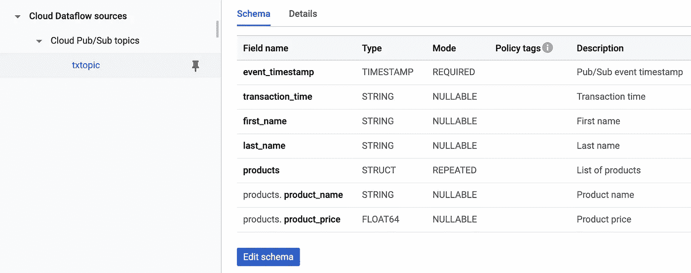

❗️This 模式与我们的 BigQuery 表`schema.json`有些不同:

*   缺少`city`字段。我们不打算使用 JavaScript UDF 来解决这个问题(如方法 1 所示)。相反，我们稍后将直接在 SQL 中添加这个字段。
*   `products`字段的类型是`STRUCT`。尚不支持类型`RECORD`。[参见支持的数据类型](https://cloud.google.com/dataflow/docs/reference/sql/data-types)。
*   `transaction_time`字段的类型为`STRING`。
*   还添加了一个`event_timestamp`字段。该字段由发布/订阅自动添加，您无需修改我们的`message.json`。

## 运行数据流 SQL 作业

我们准备运行我们的数据流 SQL 作业。在 SQL 编辑器中，输入以下 SQL 代码:

```
SELECT *,"New York" as city FROM pubsub.topic.<my-project>.txtopic
```

用您的 GCP 项目 ID 替换上面 SQL 中的`<my-project>`。注意，我们在这里添加了`city`字段。然后点击“创建云数据流作业”。

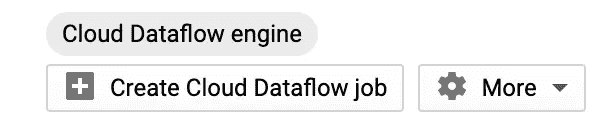

在打开的滑动面板中，选择一个区域端点，例如在 **Europe** (与本文中创建的其他服务保持一致)。并输入以下参数:

*   输出类型:`BigQuery`
*   数据集 ID: `kafka_to_bigquery`。让我们重用之前创建的数据集。
*   表名:`transactions2`。让我们创建一个新表。请注意，该表没有分区，将由第一条发布/订阅消息创建。理论上，应该可以重用为方法 1 创建的 BigQuery 表`transactions`。但是你必须添加`event_timestamp`一栏。也许在新字段上对表进行分区是个好主意？

保留其他所有内容的默认设置，然后单击“创建”。

您的流式作业现在应该正在运行。为了确保它确实在运行，导航到[谷歌云控制台](https://console.cloud.google.com)并打开 BigQuery >作业历史>云数据流。您应该看到一个流作业正在运行，您的 BigQuery 表`transactions2`应该开始被填充。

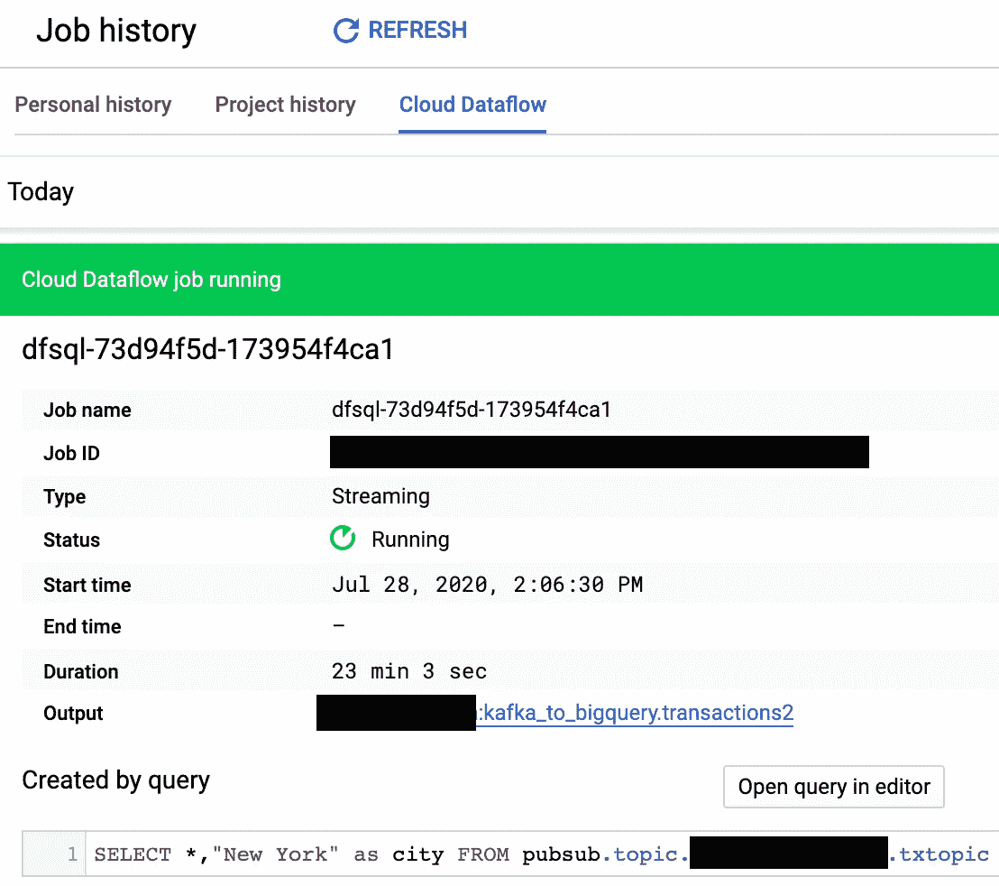

您可以尝试使用`kafka-console-producer.sh`命令发送更多的 Kafka 消息(参见上面的环境设置部分)。然后，检查新消息是否最终进入了`transactions2`表。

要查询 BigQuery 表，不要忘记将查询设置切换回“BigQuery engine ”,并输入以下 SQL(用您的 GCP 项目 ID 替换`<my-project>`):

```
SELECT * FROM `<my-project>.kafka_to_bigquery.transactions2`
```

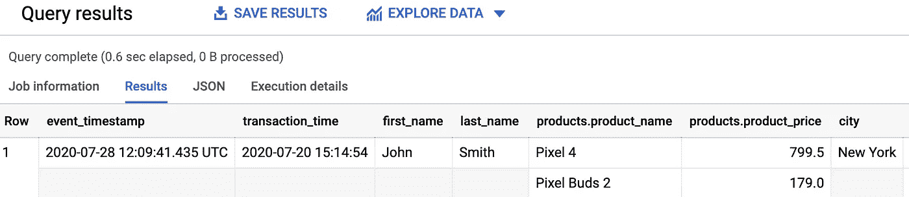

我们的方法 2 到此结束！我们使用 Pub/Sub 和 Dataflow SQL 成功地将 Kafka 消息发送到 BigQuery。

# 你应该使用哪种方法？

谷歌云通常有多个产品可以用来实现相同的目标。例如，如果您希望针对快速应用程序开发、可伸缩性或成本进行优化，您可能会选择不同的途径……
要评估将 Kafka 导入 BigQuery 的不同方法，以下是建议的标准列表:

**🔨维护**:您需要供应和维护底层基础设施吗？
✅ **更新**:你能轻松[更新正在进行的流媒体作业](https://cloud.google.com/dataflow/docs/guides/updating-a-pipeline)吗？
🔀**转换**:解决方案是否支持 [ETL](https://en.wikipedia.org/wiki/Extract,_transform,_load) ，在数据进入 BigQuery 之前转换数据？
🍻协作:管道可以进行版本控制吗？
**🏁快速应用开发**:你能多快开发出一个最小可行的产品？
💡所需技能:你需要了解一门编程语言吗？
**🚀可扩展性**:如果你开始每秒推送数百万条 Kafka 消息会怎样？数据流支持[流式自动缩放](https://cloud.google.com/dataflow/docs/resources/faq#streaming_autoscaling)。[数据流引擎](https://cloud.google.com/dataflow/docs/guides/deploying-a-pipeline#streaming-engine)和[数据流混洗](https://cloud.google.com/dataflow/docs/guides/deploying-a-pipeline#dataflow-shuffle)提供了一个响应更快的自动缩放。
**💃灵活性**:能否对其进行调整以支持不同的场景，例如有状态处理、多输入/输出或令牌化，例如使用[云 DLP](https://github.com/GoogleCloudPlatform/dlp-dataflow-deidentification) ？
**💰价格**:这个解决方案要花多少钱？数据流服务的使用以每秒的增量计费。⛔️死信:它能多好地处理错误？
**🍰分区**:管道可以基于时间或范围创建不同的 [BigQuery 分区](https://cloud.google.com/bigquery/docs/partitioned-tables)吗？
🔓**可移植性**:解决方案是否可以迁移到另一个云或者在本地运行，并且支持不同的接收器，只需做最小的改动？Beam 是开源的，有很多[连接器](https://beam.apache.org/documentation/io/built-in/)。

> 上面的列表显然并不详尽，您可以在评估中考虑更多的标准，例如:对模式注册的支持、模式演变、编排、度量、[监控](https://cloud.google.com/dataflow/docs/guides/using-cloud-monitoring)、[测试](https://beam.apache.org/documentation/pipelines/test-your-pipeline/)、吞吐量、延迟、[窗口](https://beam.apache.org/documentation/programming-guide/#windowing)、排序、加入主题、灾难恢复等。

# 其他支持的方法

数据流并不是将 Kafka 消息发送到 BigQuery 的唯一方式，还有许多其他方法，各有利弊。

这里列出了另外三种受支持的方法:

## 方法 3

[云数据融合](https://cloud.google.com/data-fusion)是一个完全托管的、无代码的数据集成服务，帮助用户高效地构建和管理 ETL/ELT 数据管道。它采用开源内核( [CDAP](https://cdap.io/) )来实现管道移植。

GitHub 链接到 Kafka 插件:[https://github.com/data-integrations/kafka-plugins](https://github.com/data-integrations/kafka-plugins)

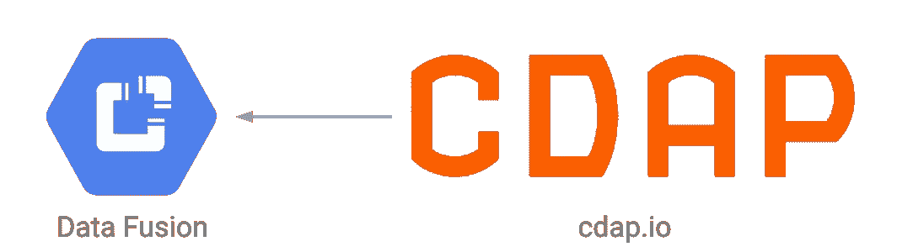

## 方法 4

[Fivetran](https://fivetran.com) 提供基于云的零维护 ETL/ELT 数据管道，可以将你所有的 Apache Kafka 原始数据加载到 Google BigQuery 中，并不断更新。
Fivetran 支持 [150+连接器](https://fivetran.com/directory)，可以自动适应模式和 API 的变化。如果 Kafka 不是您唯一的数据源，并且您有 10、20、……100 或更多的管道要构建，以便将来自不同来源的数据接收到 BigQuery 中，那么这种方法就特别有意思。在[谷歌云市场](https://console.cloud.google.com/marketplace/)中寻找“fivetran”。

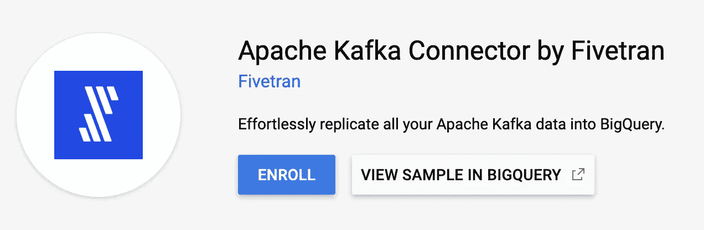

## 方法 5

由最初创建 Apache Kafka 的团队创建的 Confluent 提供了一个连接器，用于[向 BigQuery](https://docs.confluent.io/current/cloud/connectors/cc-gcp-bigquery-sink.html#) 发送 Kafka 消息。

如果您的组织也在寻找一个强大的、基于云的、完全托管的 Kafka 即服务选项，这种方法是无可匹敌的。
[融合云](https://www.confluent.io/gcp/)提供了一个简单、可扩展、灵活且安全的事件流平台，因此您的组织可以专注于构建应用，而不是管理 Kafka 集群。

Confluent 构建了一个完整的流媒体平台，包括:

*   托管连接器
*   [KSQL](https://www.confluent.io/product/ksql/) 用于实时事件处理
*   确保数据兼容性的托管模式注册表
*   融合复制器可以将主题从一个 Kafka 集群复制到另一个集群。例如，该产品可以帮助支持[混合](https://en.wikipedia.org/wiki/Cloud_computing#Hybrid_cloud)或[多云](https://en.wikipedia.org/wiki/Cloud_computing#Multicloud)场景。
*   还有更多功能…阅读更多关于[项目变形](https://www.confluent.io/project-metamorphosis)的内容。

在[谷歌云市场](https://console.cloud.google.com/marketplace/)中寻找“汇合”开始吧。


[Joshua Sortino](https://unsplash.com/@sortino?utm_source=unsplash&utm_medium=referral&utm_content=creditCopyText) 在 [Unsplash](https://unsplash.com/s/photos/speed-data?utm_source=unsplash&utm_medium=referral&utm_content=creditCopyText) 上拍摄的照片

感谢阅读！
随时在推特上联系 [@tdelazzari](https://twitter.com/tdelazzari)