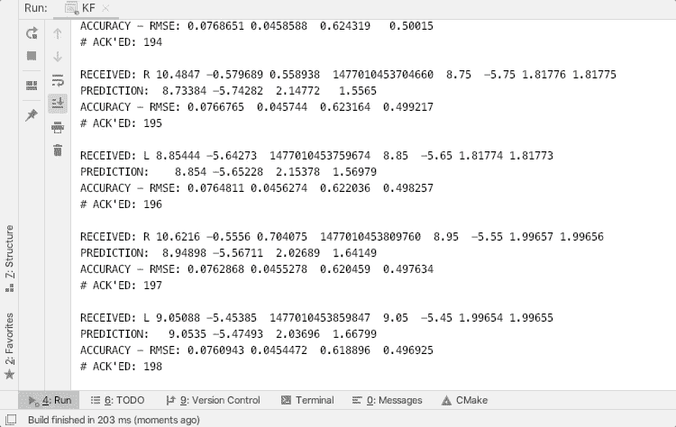

# 卡尔曼滤波器、发布/订阅和观鸟

> 原文：<https://medium.com/google-cloud/kalman-filters-pub-sub-and-birdwatching-70d6058039be?source=collection_archive---------2----------------------->

除非你在某些非常特定的领域工作，比如自动驾驶汽车工程，否则你可能没有听说过卡尔曼滤波器，或者已经基本上忘记了你曾经在学校里学到的关于它们的知识。我自己已经把它们深藏在我的内心深处。诚然，我只在与 Udacity 合作的自动驾驶汽车工程纳米学位项目中真正研究过卡尔曼滤波器，那是三年前的事了。但是最近，work 组织了一个学习日活动，让我以学习的名义追求自己感兴趣的东西， **Pub/Sub 发布了官方的** [**C++客户端库**](https://googleapis.dev/cpp/google-cloud-pubsub/latest/) **，现在支持** [**订购**](https://cloud.google.com/pubsub/docs/ordering) 。我想重温卡尔曼滤波器，并向您介绍使用卡尔曼滤波器的 Pub/Sub，使用我最喜欢的消遣方式——观鸟——作为辅助。我希望在混音中使用观鸟会让你跟着它变得简单有趣。我们开始吧！

# 什么是卡尔曼滤波器？

卡尔曼滤波器(基本、扩展、无味等。)是使用连续和不完美的测量来预测动态系统中的变量的算法。卡尔曼滤波器要求我们知道定义动态系统的基本数学模型，并假设测量中的误差遵循高斯分布。

卡尔曼滤波器中的新测量数据有多重要？非常。与必须使用具有趋势和季节性的大数据窗口进行训练的时间序列预测模型不同，卡尔曼滤波器通过单次测量进行自我引导，并在每次新测量时进行自我更新。*它们的重量极轻，可满足高速输入数据的需求，其精度基于输入数据的持续可靠流动。*

因此，卡尔曼滤波器擅长使用传感器数据实时预测移动物体的位置和运动，就像自动驾驶汽车一样。自动驾驶汽车中的传感器数据可以是来自激光雷达(**Li**ght**D**detection**A**nd**R**anging)和雷达(**RA**dio**D**detection**A**nd**R**anging)传感器的传感器数据的组合，它们可以保存附近车辆的位置和速度。当自动驾驶汽车接收到这些传感器数据时，卡尔曼滤波器使用传感器数据来预测车辆在下一个时间戳的位置和速度，这将为自动驾驶汽车的其他模块(如路径规划)提供信息，并在此过程中更新滤波器，以便为下一轮传感器输入做准备。

了解不同的卡尔曼滤波器如何工作需要对矩阵乘法和统计模型有相当的理解。但是，如果你对了解基础知识感到满意，并有动力对所涉及的步骤发展直觉，想象你有一副双筒望远镜，并且在大自然中观察鸟类。通过双筒望远镜，你的眼睛扫描树梢寻找有翅膀和羽毛的生物。当你找到一个时，它会扇动翅膀跳到另一个树枝上。你的大脑突然飞速运转，尽可能快地处理信息，在你的视野中划出一片区域，那只鸟可能已经着陆了。一开始你并不太差，但是当你睁大你的眼睛并持续关注时，你会变得越来越好。

2017 年 4 月，当我在 Udacity 项目学习时，我拍了这张麻雀的照片

观鸟场景说明了所有卡尔曼滤波器共有的两个计算阶段:**预测**和**测量更新**。假设`x`是表示我们要预测的系统中未知变量的状态向量，`P`是 x 的协方差矩阵，比如`x`可以是一个二维世界中运动物体沿 x 轴和 y 轴的位置(`px`、`py`)和速度(`vx`、`vy`)，它的协方差矩阵`P`告诉我们`x`中任意一对元素之间的协方差。即变量是正相关还是负相关。为了对`x’`和`P’`进行预测，我们应用等式——距离等于速度乘以时间——来获得`x’`，然后我们应用协方差公式来获得`P’`并添加一些噪声。这个预测阶段就像大脑猜测你正在追踪的鸟的大致位置。

到了测量更新阶段，假设您看到了鸟降落的树枝。你的大脑必须利用这些信息来相应地调整其评估过程的内部运作。调整多少？这个**卡尔曼增益** ( `K`)是多少。

K =估计误差/(估计误差+测量误差)

卡尔曼增益可以被认为是估计误差与估计误差和测量误差之和的比值。当估计中的误差相对于测量中的误差较小时，卡尔曼增益较小，测量值(`z`)和先前估计值(`H・x'`)之间的一小部分差异将有助于更新的状态向量`x = x' + K・(z — H・x')`。这里，`H`是一个状态转移矩阵，它让我们丢弃状态矩阵中没有度量的元素。例如，我们可能能够测量位置，但不能测量速度，在这种情况下，我们需要一个状态转移矩阵，将包含四个元素(`px`、`py`、`vx`、`vy`)的状态向量映射到只包含两个元素(`px`、`py`)的测量空间。

相反，当估计中的误差相对于测量误差较大时，卡尔曼增益接近于由`K = P'・Hᵀ / (H・P'・Hᵀ + R)`给出的`1 / H`，其中`Hᵀ`是`H`的转置。这意味着我们可以更加信任测量结果(`z`)，因为`K`几乎会在`x ≈ x' + 1 / H・(z — H・x')`中过滤掉`x’`。

就像我们的眼睛一样，现实世界中的测量仪器并不完美。然而，我们可以通过在误差周围设置一些合理的界限来预先确定测量中的误差(`R`)。为了更新协方差矩阵`P`，我们使用`P = (I — K・H)・P'`，其中`I`是一个单位矩阵。

随着每一轮新的传感器输入，我们进行预测和更新。在预测阶段结束时，我们获得状态向量`x’`及其协方差矩阵`P’`的新估计。在测量更新阶段结束时，我们获得新的`x`和`P`。只要输入数据馈送处于活动状态，这一循环就会继续进行，并具有强大的自校正功能。

# 带有卡尔曼滤波器的发布/订阅

这让我想到了酒吧/餐馆。在我 2017 年的[作业](https://github.com/anguillanneuf/CarND-Extended-Kalman-Filter-Project)中，我实现了一个扩展卡尔曼滤波器来预测运动车辆的位置和速度。我从文本文件中读取了假的激光和雷达数据。我使用 while 循环逐行读取输入文件，并使用每行输入进行预测。我把评估写到本地文件中。我还将估计值存储在一个数组中，以在最后计算均方根误差(RMSE)。这种设置在教室环境中非常常见，非常适合学习，但除了从文件中读取传感器数据，是否可以使用发布/订阅来模拟现实世界中的流数据？

如果你没有听说过 [Pub/Sub](https://cloud.google.com/pubsub/docs) ，它是谷歌云平台(GCP)上的一个可扩展的管理消息服务。它提供低延迟和高吞吐量的大规模发布和订阅(参见[配额限制](https://cloud.google.com/pubsub/quotas#quotas))。它保证消息至少传递一次。它还支持发布者和订阅者客户端之间的一对多、多对一和多对多关系。

如果我可以向 2017 年的自己解释这一切，当时我对酒吧/餐馆一无所知，我会告诉她这样的事情—

想象一下，Udacity 用来给我的作业评分的样本数据不是我从 GitHub 下载的文件，而是世界上另一个地方的真实流媒体源。我的导师已经决定将数据 24/7 发布到一个发布/订阅主题。为了测试扩展卡尔曼滤波器的代码，每个学生，无论我们在世界的哪个角落，都必须为这个主题创建一个发布/订阅，以获得与教师发布的数据相同的副本。像以前一样，我的家庭作业仍然会根据我的估计与使用 RMSE 的地面真相的接近程度来评分。如果我的程序能够跟上数据发布到主题的速度，对我来说也是加分的。

这个编造的作业在 2017 年用 C++是不可能完成的，因为那时 Pub/Sub 还没有面向公众的 C++客户端库。此外，缺乏排序保证将需要大量的工程工作来处理无序数据。幸运的是，这两个约束现在都不成立。我按照 C++开发环境设置[指令](https://github.com/googleapis/google-cloud-cpp/tree/master/google/cloud/pubsub/quickstart)安装并导入 Pub/Sub C++客户端库，并重构了我的旧代码，以便从 Pub/Sub 订阅而不是输入文件中读取。

下面是我在`[main.cpp](https://github.com/anguillanneuf/CarND-Extended-Kalman-Filter-Project/blob/master/src/main.cpp)`中名为`session`的 lambda 中的订户代码的分解。

1.  `session`收到一条发布/订阅消息，其中包含虚假的激光和雷达数据。
2.  它调用`PreprocessPackages()`对消息进行预处理。
3.  它调用`ProcessMeasurement()`来预测和更新。
4.  它调用`CalculateRMSEContinuous()`来评估 EKF。
5.  它确认消息。
6.  它在 10K 信息到达后或 30 秒后过期，以先到者为准。

我还包含了一个 [Python](https://github.com/anguillanneuf/CarND-Extended-Kalman-Filter-Project/blob/master/publish_data.py) 脚本和一个 [bash](https://github.com/anguillanneuf/CarND-Extended-Kalman-Filter-Project/blob/master/publish.sh) 脚本，以展示如何发布带有[排序键](https://cloud.google.com/pubsub/docs/publisher#using_ordering_keys)的模拟激光雷达和雷达数据。使用排序密钥可以确保使用该密钥发布的任何数据都按照发布/订阅收到的顺序进行传递。如果数据被无序地发布到发布/订阅，这可能发生在传感器发生故障或使用多个发布者客户端的情况下，我确保通过[比较](https://github.com/anguillanneuf/CarND-Extended-Kalman-Filter-Project/blob/master/src/FusionEKF.cpp#L119-L122)`[FusionEKF.cpp](https://github.com/anguillanneuf/CarND-Extended-Kalman-Filter-Project/blob/master/src/FusionEKF.cpp)`中的时间戳来消除最新的数据。当我运行我的程序时，我看到它实时地吐出新的传感器数据、新的估计和新的 RMSE。

在这篇文章中，我只是回顾了卡尔曼滤波器是如何工作的，以及如何将发布/订阅与卡尔曼滤波器一起使用。代码示例显示了如何将扩展卡尔曼滤波器与用 C++编写的发布/订阅用户客户端一起使用。通过遵循 GitHub [repo](https://github.com/anguillanneuf/CarND-Extended-Kalman-Filter-Project) 中的说明，您在上面看到的输出是完全可再现的。我希望你有机会去看看，和我一样，下次想到卡尔曼滤波器和 Pub/Sub 时，你不仅会想到实时流和预测，还会想到一点有趣的观鸟。感谢阅读！