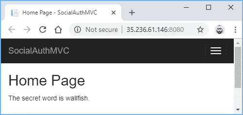
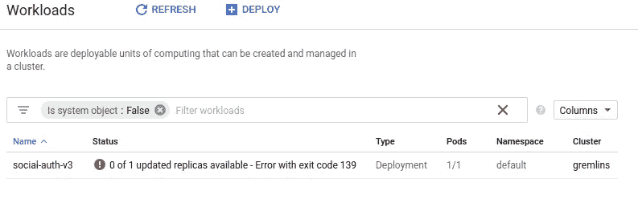
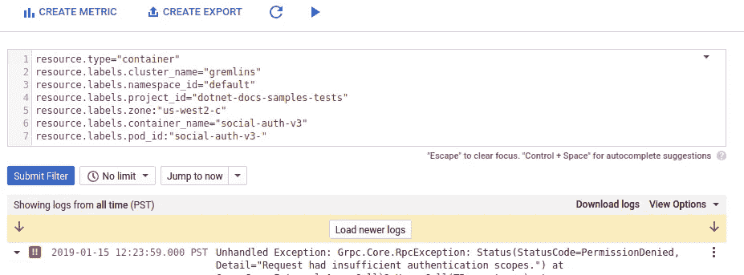

# 在 ASP.NET·库伯内特的应用程序中保守秘密

> 原文：<https://medium.com/google-cloud/keeping-secrets-in-an-asp-net-kubernetes-application-8e138e148ae6?source=collection_archive---------1----------------------->

在更早的一个名为[的故事中。NET 的 appsettings.json](/google-cloud/keeping-secrets-in-asp-nets-appsettings-json-5694e533dc87) ，我用[谷歌云密钥管理服务(KMS)](https://cloud.google.com/kms/) 演示了如何在`appsecrets.json`中保密。生成的应用程序易于维护，因为机密是用源代码进行加密和版本控制的，解密密钥从不分发给开发人员或系统管理员，并且机密是由运行应用程序的生产服务器在最后一刻解密的。完整的故事包含更多的细节。

我已经将应用程序部署到了[谷歌计算引擎](https://cloud.google.com/compute/)和[谷歌应用引擎](https://cloud.google.com/appengine/)。最近，我决定将同样的应用程序部署到 [Google Kubernetes 引擎](https://cloud.google.com/kubernetes-engine/) (GKE)。因为保守秘密是一件严肃的事情，所以我想遵循安全最佳实践，并使用一个权限最小的谷歌服务账户。服务帐户用于身份验证和授权。默认的 GKE 服务帐户比我的应用程序需要的特权多得多，这是一个安全风险。

这里有一个关于服务帐户的快速介绍。我的应用程序和[谷歌云 KMS](https://cloud.google.com/kms/) 之间的对话如下:


为了能够在 GKE 实例上解密`appsecrets.json.encrypted`,我必须在 GKE 实例上安装 Google 云服务帐户凭证。

我找到了两种方法来做到这一点:

**方法 1** 创建新的 GKE 集群或[节点池](https://cloud.google.com/kubernetes-engine/docs/concepts/node-pools)时，安装服务帐户凭证。这很快也很容易，但是如果 Kubernetes 集群在其他地方运行，这就行不通了。

**方法二**安装一个服务账号密钥作为 K [ubernetes secret](https://kubernetes.io/docs/concepts/configuration/secret/) 。当集群运行在 Google Cloud 内部或外部时，它都可以工作。与**方法 1** 不同，它将服务帐户密钥交付给现有节点，因此不需要创建新节点。它还允许在同一节点上运行的不同应用程序使用不同的服务帐户。

向应用程序传递秘密的最“Kubernetes 方式”是创建一个包含`appsecrets.json.`的 Kubernetes 秘密。我计划在以后的帖子中讨论这第三种方法，但是在这篇帖子中我将坚持使用**方法 1** 和**方法 2** ，因为它们遵循了在 ASP 中保存秘密[中描述的模式。NET 的 appsettings.json](/google-cloud/keeping-secrets-in-asp-nets-appsettings-json-5694e533dc87) ，很多人发现这个模式很有用。此外，一旦我安装了谷歌服务帐户凭证，我就可以轻松地调用其他有用的谷歌云 API，如[语音转文本](https://cloud.google.com/speech-to-text/)和[视觉](https://cloud.google.com/vision/)。

# 创建 Google 云服务帐户

这两种方法都需要一个谷歌云[服务账户](https://cloud.google.com/iam/docs/understanding-service-accounts)来认证我的应用，所以我用[谷歌云 SDK](http://cloud.google.com/sdk) 中的`gcloud`命令创建了一个新的服务账户:

```
**> gcloud iam service-accounts create my-service-account**
Created service account [my-service-account].
```

遵循最小特权原则，我给了服务帐户足够的权限从 Google Cloud Container Registry 中获取 Docker 图像并写入调试信息:

然后，我给了服务帐户解密`appsecrets.json.encrypted:`的权限

我的新服务账户已经准备好了在 GKE 上运行应用程序和解密`appsecrets.json.encrypted`所需的最低权限。

# 方法 1

当在 GKE 上创建一个新的集群时，我使用了`--service-account`标志来指定我在上面创建的服务帐户。

我也可以让[在现有集群中创建一个新的节点池](https://cloud.google.com/sdk/gcloud/reference/container/node-pools/create)，并传递相同的`--service-account`标志。

我部署了我的应用程序并暴露了端口 8080:

我访问了申请主页。它成功解密了密语！



成功！

# 方法 2

**方法 1** 很好，但是只有当我的应用程序在 GKE 上运行时才有效。如何在其他地方运行的 Kubernetes 节点上安装 Google 云服务帐户凭证？

幸运的是，所有的 Google 客户端 API 库都会检查环境变量`GOOGLE_APPLICATION_CREDENTIALS`。环境变量`GOOGLE_APPLICATION_CREDENTIALS`存储了一个服务帐户密钥的路径，所以我首先需要的是一个服务帐户密钥。我用`gcloud`创建了服务帐户密钥:

将密钥打包到 Docker 映像中很有诱惑力，但这将是非常不安全的。每个被允许阅读 Docker 图像的人都可以解密`appsecrets.json.encrypted`。那很糟糕。

然后我了解了 K[ubernetes secret](https://kubernetes.io/docs/concepts/configuration/secret/)s . Kubernetes secret 是一个包含少量敏感数据的对象，如密码、令牌或密钥。那正是我所需要的。

我创造了一个 kubernetes 的秘密，并添加了`key.json`:

我尝试用我在**方法 1** 中使用的相同的`kubectl`命令部署我的应用程序，但是我忘记设置`GOOGLE_APPLICATION_CREDENTIALS`，所以应用程序不健康:



容器日志告诉我为什么，这正是我所预料的权限错误:



是时候将环境变量`GOOGLE_APPLICATION_CREDENTIALS`设置为我在上面创建的 Kubernetes secret 了。这需要在 3 个不同的地方接触我的部署配置。我用命令`kubectl edit deployment social-auth-v3`编辑了部署，并修改了部署。这是一个缩写的 yaml 文件，我的修改用注释标出。

我用一个[滚动更新](https://kubernetes.io/docs/tasks/run-application/rolling-update-replication-controller/)重启了我的部署，最后，我的应用找到了服务账户凭证并成功解密了`appsecrets.json`。


成功！

# 结论

当您[创建一个新的 Kubernetes 集群](https://cloud.google.com/sdk/gcloud/reference/container/clusters/create)或[节点池](https://cloud.google.com/sdk/gcloud/reference/container/node-pools/create)时，`[gcloud](https://cloud.google.com/sdk/)`可以轻松安装服务帐户凭证。 [Kubernetes secrets](https://kubernetes.io/docs/concepts/configuration/secret/) 无论您的应用程序在哪里运行，都可以安装服务帐户凭证。

这个练习中最困难的部分是找到正确的、最小的权限集来授予服务帐户。很自然地，在我的应用程序启动并运行后，我立即在这里找到了确切的信息。[😀](https://en.wikipedia.org/wiki/%F0%9F%98%80)

使用服务帐户验证 Google 云平台的完整说明在[这里](https://cloud.google.com/kubernetes-engine/docs/tutorials/authenticating-to-cloud-platform)。完整的应用程序示例源代码是[这里是](https://github.com/GoogleCloudPlatform/dotnet-docs-samples/tree/e56e9ee661d64c1309455707510b5b90c2fdfd4e/appengine/flexible/SocialAuth)。