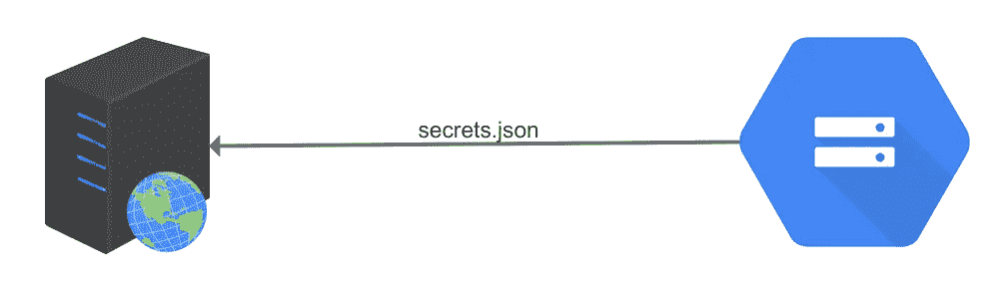
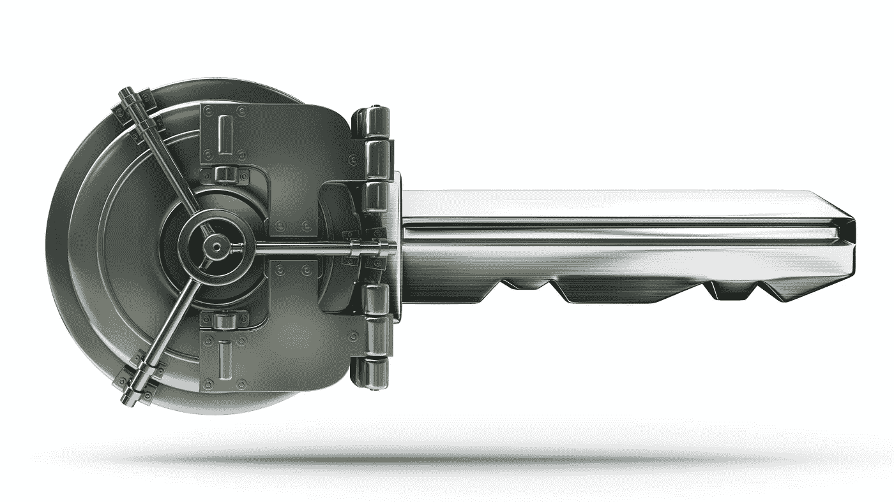
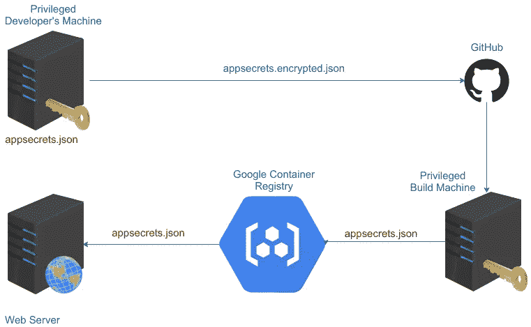
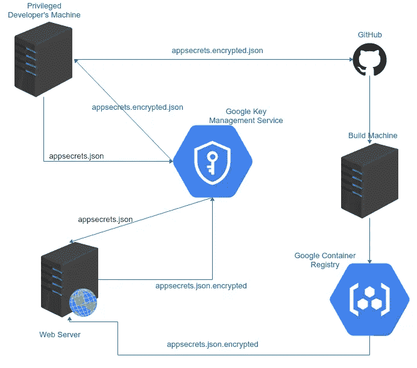

# ASP 中的保密。NET 的 appsettings.json

> 原文：<https://medium.com/google-cloud/keeping-secrets-in-asp-nets-appsettings-json-5694e533dc87?source=collection_archive---------0----------------------->

我和一位同事 [Jonathan](https://github.com/jsimonweb) 维护着一个[ASP.NET 核心](https://docs.microsoft.com/en-us/aspnet/core/?view=aspnetcore-2.1)应用程序。像许多 ASP.NET 项目一样，我们的应用程序需要 SQL 连接字符串和其他凭证来连接到后端服务。这些凭证允许访问敏感数据，而我们团队中的大多数人不需要访问这些数据。因此，这些凭据应该保密，只有在生产环境中运行的应用程序才可以看到。

我们将应用程序的秘密存储在一个[谷歌云存储](https://cloud.google.com/storage/)对象中，这个对象[加密静态对象](https://cloud.google.com/security/encryption-at-rest/)。谷歌云存储为我们提供了所需的访问控制，但它并不完全符合我们的需求，因为我们容易犯以下错误:

*   [**竞赛条件**](https://en.wikipedia.org/wiki/Race_condition) 。在以下情况下，机密可能会丢失:
*   1.我下载了秘密文件并添加了一个秘密。
*   2.Jonathan 还下载了秘密文件并添加了一个秘密。
*   3.我上传了我修改过的秘密文件。
*   4.乔纳森上传了他修改过的秘密文件。
*   5.我添加的秘密丢失了。因为我们打开了[云存储的对象版本](https://cloud.google.com/storage/docs/object-versioning)，一旦我们发现发生了什么，我们仍然能够从这个场景中恢复，但是需要做一些工作来注意这个问题，然后修复它。
*   **版本不匹配。**Google 云存储中存储的 secrets 文件有自己的版本历史。Google 云存储中的版本 1 是否对应于应用程序的版本 1？如何在不影响当前运行的应用程序的情况下，为下一版本的应用程序更改密码？跟踪版本和避免陷阱需要提前计划和仔细的工程设计。

上面列出的问题已经有了解决方案:版本控制。 [Git](https://git-scm.com/) 、 [subversion](https://subversion.apache.org/) 、 [mercurial](https://www.mercurial-scm.org/) 等许多版本控制系统正是为了解决这些问题而设计的。我们不想重新发明[轮子](https://en.wikipedia.org/wiki/Wheel)。我们被诱惑在版本控制中保守秘密，但是了解到**在版本控制中保守秘密是可怕的实践**。如果我们将秘密存储在版本控制中，那么我们团队中的任何人都可以很容易地看到这些秘密。如果我们把代码放在 GitHub 的公共仓库里，那么全世界都可以看到我们的秘密。

# 钥匙库

Scott Hanselman 和其他人描述的一个合理的解决方案是使用一个内置了自己版本控制的密钥库。具有版本控制的密钥库可以防止某些竞争情况，并使其易于从意外损坏中恢复。密钥库提供严格的访问控制，因此不需要访问机密来完成工作的人看不到它。我们上面的第一个解决方案有效地使用了 Google 云存储作为一个密钥库。

然而，密钥库仍然有一个缺点:多个版本历史。哪个版本的 app 需要哪个版本的秘密？树枝呢？**版本不匹配**必然会发生，导致应用程序崩溃，用户体验受损。

# 加密

另一个好的解决方案已经被贾斯汀·艾林伍德、约翰·雷西格和其他许多人讨论过了。基本上，解决方案是在一个文件中加密秘密，并在版本控制中只存储加密的文件。该解决方案结合了版本控制解决方案的全部功能和加密提供的访问控制。秘密仍然是安全的，因为只有有权使用私钥的人才能解密它们。

这种解决方案避免了密钥库中出现的版本不匹配问题，因为只有一个版本历史:保存在版本控制中的版本历史。

然而，这种解决方案仍然有几个缺点:

1.  秘密不像钥匙库那样被锁住。构建生产应用程序的任何人都必须能够解密这些秘密。应用程序构建器从不调用后端服务，因此不应该访问机密。此外，构建产品，无论是二进制文件还是 docker 映像，都包含明文形式的机密，因此构建产品必须像机密本身一样受到保护。
2.  **关键文件必须小心管理、轮换和分发。**谁需要密钥文件？关键文件都在哪里？当一个密钥文件被认为已经泄漏时，如何颁发新的密钥？

# **更好的解决方案**

使用[谷歌云密钥管理服务(KMS)](https://cloud.google.com/kms/) ，我们构建了[一个解决方案](https://github.com/GoogleCloudPlatform/dotnet-docs-samples/tree/9c52ba8b0eeac88200e9a0dcb34b90869535a4b4/kms/api/CloudKmsAspNetSample)，克服了上述两个解决方案的缺点。机密被加密并存储在版本控制中，因此只有一个版本历史。只有一个版本历史记录时不会出现版本不匹配。但是与上面的解决方案不同，构建产品从不包含明文秘密。因此，在应用程序完全部署在其生产主机上之前，秘密一直是隐藏的。甚至构建和部署应用程序的代理也没有必要的密钥来解密这些秘密。

此外，即使对秘密进行加密和解密，密钥也不会被传送到开发人员的机器上。加密和解密发生在谷歌的服务器上，用户必须使用自己的个人凭据进行加密或解密。

KMS 也有内置的自动[密钥轮换](https://cloud.google.com/kms/docs/key-rotation)，所以如果一个密钥被意外泄露，只有[有限的秘密快照会被泄露](https://crypto.stackexchange.com/questions/41796/whats-the-purpose-of-key-rotation)。

[ASP.NET 核心的配置](https://docs.microsoft.com/en-us/aspnet/core/fundamentals/configuration/?view=aspnetcore-2.1)设计得很好，让我们很容易实现一个[自定义](https://github.com/GoogleCloudPlatform/dotnet-docs-samples/blob/master/kms/api/CloudKmsAspNetSample/Services/EncryptedFileProvider.cs) `[IFileProvider](https://github.com/GoogleCloudPlatform/dotnet-docs-samples/blob/master/kms/api/CloudKmsAspNetSample/Services/EncryptedFileProvider.cs)`解密内存中的文件。使用[自定义](https://github.com/GoogleCloudPlatform/dotnet-docs-samples/blob/master/kms/api/CloudKmsAspNetSample/Services/EncryptedFileProvider.cs) `[IFileProvider](https://github.com/GoogleCloudPlatform/dotnet-docs-samples/blob/master/kms/api/CloudKmsAspNetSample/Services/EncryptedFileProvider.cs)`，从应用程序中访问机密就像访问`appsettings.json`中的普通配置变量一样简单。

秘密被写在一个叫做`app**secrets**.json`的文件中，这个文件和`appsettings.json`在同一个目录下。当然，`appsecrets.json`绝不能被签入版本控制，所以有一个`[.gitignore](https://github.com/GoogleCloudPlatform/dotnet-docs-samples/blob/9c52ba8b0eeac88200e9a0dcb34b90869535a4b4/kms/api/CloudKmsAspNetSample/.gitignore)`文件来防止这种情况发生:

一个 [powershell 脚本](https://github.com/GoogleCloudPlatform/dotnet-docs-samples/blob/master/kms/api/CloudKmsAspNetSample/Encrypt-AppSecrets.ps1)使用 [Google Cloud SDK](http://cloud.google.com/sdk) 对`appsecrets.json`到`appsecrets.json.encrypted`进行加密:

`[.csproj](https://github.com/GoogleCloudPlatform/dotnet-docs-samples/blob/master/kms/api/CloudKmsAspNetSample/CloudKmsAspNetSample.csproj)`中的 3 行代码确保加密文件与二进制文件一起交付:

`[Program.cs](https://github.com/GoogleCloudPlatform/dotnet-docs-samples/blob/master/kms/api/CloudKmsAspNetSample/Program.cs)`中的一条语句加载加密的秘密:

现在，秘密可以像任何其他配置变量一样在应用程序中使用:

当部署到 [Google Kubernetes 引擎](https://cloud.google.com/kubernetes-engine/)、 [Google Compute 引擎](https://cloud.google.com/compute/)和[Google app Engine Flexible Environment](https://cloud.google.com/appengine/docs/flexible/dotnet/)时，主机已经拥有了解密机密所需的 Google 凭证。当部署到另一个环境时，在主机上安装一个[服务帐户密钥](https://cloud.google.com/iam/docs/creating-managing-service-account-keys)并设置环境变量`GOOGLE_APPLICATION_CREDENTIALS`，然后该主机也可以访问这些秘密。

# 包扎

借助版本控制和[谷歌云密钥管理服务(KMS)](https://cloud.google.com/kms/) ，我们构建了一个易于使用、易于维护、与密钥库解决方案一样安全的系统。

在[https://github.com/GoogleCloudPlatform/dotnet-docs-samples/](https://github.com/GoogleCloudPlatform/dotnet-docs-samples/tree/master/kms/api/CloudKmsAspNetSample)查看所有的源文件和项目文件。通过模糊实现安全性已经被证明是失败的，所以如果您看到我们的设计或实现有任何安全问题，请在这里留言或在 github 存储库中记录一个错误。

虽然[谷歌云密钥管理服务(KMS)](https://cloud.google.com/kms/) API 已经完全发布并得到支持，但是[客户端库](https://www.nuget.org/packages/Google.Cloud.Kms.V1/)仍然处于**测试版**。因此，您可能希望等到 1.0 客户端库发布后，再在生产中使用该解决方案。