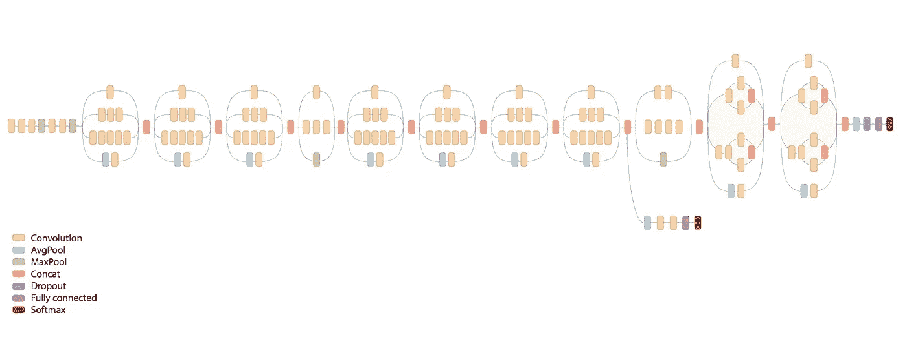
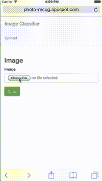
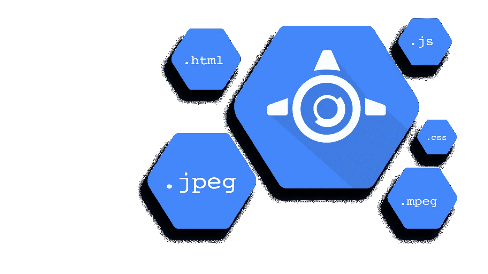
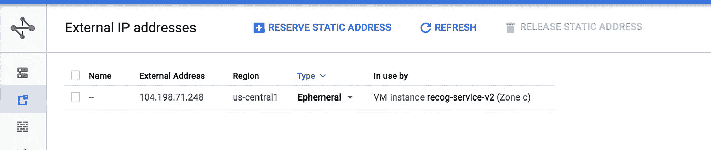

# 在谷歌计算引擎上使用 Keras 进行深度学习

> 原文：<https://medium.com/google-cloud/keras-inception-v3-on-google-compute-engine-a54918b0058?source=collection_archive---------0----------------------->



Inception V3 架构

> Inception，谷歌开发的一个模型，是深度 CNN。针对 ImageNet 数据集(用于测量图像识别性能的常见数据集)，它执行了前 5 名错误 3.47%。

在本教程中，您将使用预先训练的 Inception 模型对上传到 web 服务器的图像进行预测。



演示

您将使用:

*   在谷歌计算引擎上运行的图像预测 Keras
*   谷歌云存储用于存储上传的图片
*   适用于您的前端 web 服务器的应用引擎 w/Flask。

# 概观

*   Keras Inception V3 预测
*   部署在计算引擎 w/[Docker](https://www.docker.com/)&[Google 容器注册表](https://cloud.google.com/container-registry/)
*   Flask 前端 web 服务器

# 先决条件:

*   基本的机器学习理解
*   基本烧瓶知识
*   谷歌云 SDK 安装完毕(【https://cloud.google.com/sdk/】T4)

# 克拉斯

> Keras 是一个高级神经网络库，用 Python 编写，能够在 [TensorFlow](https://github.com/tensorflow/tensorflow) 或 [Theano](https://github.com/Theano/Theano) 之上运行。它的开发重点是支持快速实验。能够以尽可能少的延迟从想法到结果是做好研究的关键。

下面，Inception 模型加载了 Keras。Keras 保存了模型预训练权重的缓存目录。第一次使用时，Keras 会将这些权重下载到~/中。keras/models/。

您将创建一个接受 base64 编码图像文件的预测函数。Inception V3 要求图像为 299 x 299。加载图像后，它被扩展成一个矢量并进行预处理。

首先，安装依赖项

```
$ pip install -r requirements.txt
```

# 服务预测

加载模型后，使用 flask 创建一个可以接受 base64 编码图像的 web 服务器。

您现在拥有了图像识别服务！让我们在部署之前在本地测试一下。首先，启动服务器。然后向预测服务发出 POST 请求。 [*样本图像*](https://files.graphiq.com/stories/t2/tiny_cat_12573_8950.jpg)

```
$ python main.py(*in another terminal window*)$ (echo -n '{"data": "'; base64 cat.jpg; echo '"}') |
curl -X POST -H "Content-Type: application/json" -d @- [http://0.0.0.0:8080](http://0.0.0.0:8080)
```

如果一切正常，您将会看到一个响应

```
{
 “predictions”: [
 {
 “description”: “tiger_cat”,
 “label”: “n02123159”,
 “probability”: 55.242210626602173
 },
 {
 “description”: “tabby”,
 “label”: “n02123045”,
 “probability”: 25.407189130783081
 },
 {
 “description”: “Egyptian_cat”,
 “label”: “n02124075”,
 “probability”: 10.042409598827362
 }
 ]
}
```

# **部署**

您已经创建了模型并生成了预测。使用 Docker 将模型部署到 Google 计算引擎的时间到了。您将使用几种不同的技术 Gunicorn、Nginx 和 Supervisor。下面，一个 dockerfile 文件和几个配置文件将建立并服务于预测 api。

创建 docker 映像后，您将把它推送到 Google 容器注册中心。

为了让 docker 正确地复制文件，请构建目录:

```
|____Dockerfile
|____nginx.conf
|____requirements.txt
|____service
| |____main.py
| |____model.py
|____supervisord.conf
```

您已经构建了 docker 映像并将其推送到 Google 容器注册中心。从这里，创建服务器并下拉先前创建的 docker 映像。首先，您将启用 API

> https://console . developers . Google . com/APIs/API/compute _ component/overview？项目= **项目标识**

```
$ gcloud compute firewall-rules create default-allow-http --allow=tcp:80 --target-tags http-server
$ gcloud compute instances create predict-service --machine-type=n1-standard-1 --zone=us-central1-c --tags=http-server$ gcloud compute ssh predict-service --zone=us-central1-c
$ curl -sSL [https://get.docker.com](https://get.docker.com) | sh
$ sudo gcloud docker pull gcr.io/**PROJECT_ID**/predict_service:latest
```

最后，运行它！

```
$ sudo docker run -td -p 80:80 gcr.io/**PROJECT_ID**/predict-service
```

如果一切顺利，过一会儿，您将拥有一个运行中的预测服务。你可以使用上面的 curl 命令来确认它的工作。让我们构建一个快速的前端来可视化我们的预测。

# 谷歌应用引擎前端服务器



## 云存储

创建一个桶来上传从前端接收的图像。我们修改 bucket 的权限，将读取权限授予互联网上的任何人**。**

```
$ gsutil mb gs://**my-unique-bucket-identifier**
```

**将此代码片段添加到您的项目中。它是你上传文件时使用的谷歌云存储的一个抽象。首先，我们将安装我们的依赖项**

**requirements.txt**

**App engine 要求将库安装到文件夹中进行部署。您还将下载 Gcloud 存储客户端。**

```
$ git clone [https://github.com/GoogleCloudPlatform/appengine-gcs-client](https://github.com/GoogleCloudPlatform/appengine-gcs-client).git$ pip install -r requirements.txt -t lib$ pip install GoogleAppEngineCloudStorageClient -t lib
```

## **上传文件并预测**

**首先，让我们创建配置文件。在这里，您将插入您之前创建的项目和存储桶。您还需要插入预测服务 IPv4 地址。在“网络”选项卡中，单击“在我们的机器上保留静态实例地址”。**

****

**为预测服务保留静态地址**

****config.py****

```
PROJECT_ID = '**PROJECT_ID'** MAX_CONTENT_LENGTH = 8 * 1024 * 1024
ALLOWED_EXTENSIONS = set([**'png'**, **'jpg'**, **'jpeg'**, **'gif'**])
PREDICTION_SERVICE_URL = **'http://YOUR.SERVER.IP.HERE:80'**
```

****app.yaml****

****appengine_config.py****

**下面，您将使用 flask 创建前端 web 服务器。此 web 服务器将被部署到 Google App Engine。**

**将以下模板复制到**/模板**:**

****base.html****

****form.html****

****view.html****

**最后一步，让我们部署到谷歌应用引擎。**

```
gcloud app deploy
```

# **结论**

**就是这样！您已经创建了一个 flask web 服务器，它将为用户提供一个上传照片的表单。这些照片被上传到谷歌云存储，并发送到我们的图像预测 API。**

**此处为完整代码:**

**[](https://github.com/ColeMurray/keras-inception-v3-tutorial) [## cole Murray/keras-inception-v3-教程

### 在 GitHub 上创建一个帐户，为 keras-inception-v3-tutorial 开发做贡献。

github.com](https://github.com/ColeMurray/keras-inception-v3-tutorial) 

```
git clone [https://github.com/ColeMurray/keras-inception-v3-tutoria](https://github.com/ColeMurray/keras-inception-v3-tutorial)l.git --recursive
```

> 如果你喜欢这个教程，请关注并推荐！
> 
> 对推荐系统感兴趣，node，android，还是 react？查看我的其他教程:
> 
> -[Google data proc 上带 Spark 的推荐系统](/google-cloud/recommendation-systems-with-spark-on-google-dataproc-bbb276c0dafd#.bjfwbbt1s)
> - [将节点部署到 Google Cloud](/google-cloud/node-to-google-cloud-compute-engine-in-25-minutes-7188830d884e#.uzpd6tz7f)
> -[RecyclerViews 中的 Android 印象跟踪](/@ColeMurray/how-to-track-impressions-e371f0a91f0#.dopjf841m)
> -[React&ES6 中的 Flux](/@ColeMurray/react-flux-in-es6-pt-1-2-e2a7b4aa074e#.lttn8owu2)
> 
> 其他地方可以找到我:
> 
> 推特:[https://twitter.com/_ColeMurray](https://twitter.com/_ColeMurray)**