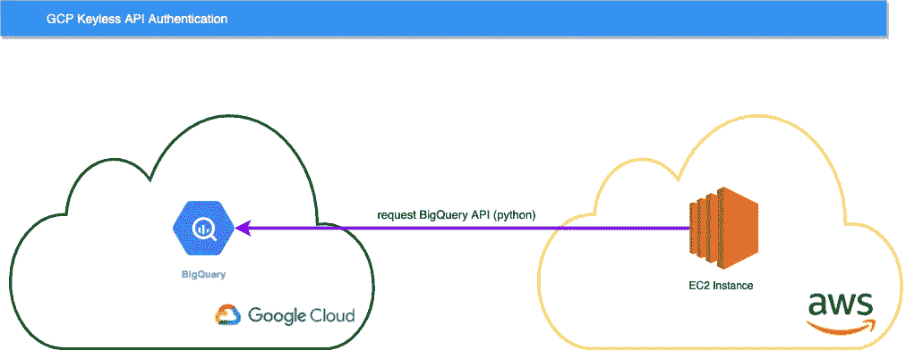

# 无密钥 API 认证——从 AWS 启动 GCP 工作负载

> 原文：<https://medium.com/google-cloud/keyless-api-authentication-launching-gcp-workloads-from-aws-b715b4e6c99a?source=collection_archive---------0----------------------->

仅在 GCP 上运行您的应用程序并不像我们想象的那样普遍，在这个多云和内部部署的时代，开发人员面临的主要挑战是找到一种安全的方式来验证 Google Cloud。例如，我们可以发现:

*   保存在 AWS 或 Azure 上的数据需要由云功能或云运行等服务消费。