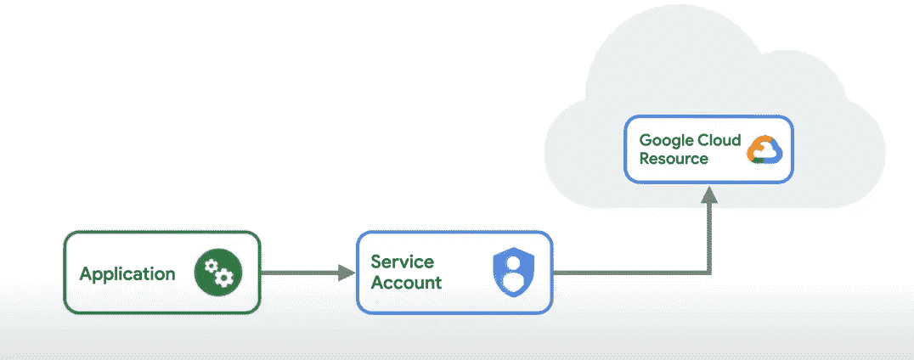
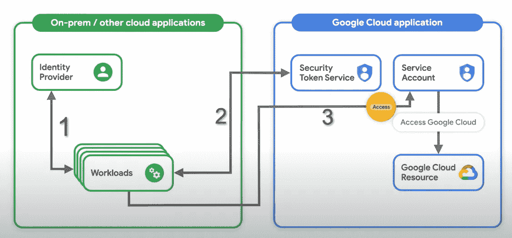

# 使用工作负载身份联合对 Google 云平台进行无钥匙认证

> 原文：<https://medium.com/google-cloud/keyless-authentication-to-google-cloud-platform-using-workload-identity-federation-5c41043acefb?source=collection_archive---------0----------------------->

谷歌一直在努力寻找新的方法来提高运行在谷歌云上的客户应用程序的安全性。谷歌新的安全改进是为服务账户提供无钥匙认证。

运行在 Google cloud 之外的应用程序需要访问用户范围之外的 Google cloud 中的服务，它大多使用服务帐户密钥。服务帐户密钥允许持有者充当服务帐户，并获得对服务帐户有权访问的任何资源的访问。
不幸的是，无法验证访问服务帐户密钥的应用程序是否有权使用它。因此，服务帐户密钥的管理、轮换和存储成为任何在 Google Cloud 上运行的组织的首要任务。服务帐户密钥是强大的凭据，如果管理不当，可能会带来安全风险。

管理服务帐户密钥的解决方案是什么？
**沟钥匙😎**

Workload Identity Federation 使运行在 Google Cloud 之外的应用程序能够用称为令牌的临时凭证替换长期服务帐户密钥。使用身份联合，您可以授予内部或多云工作负载对 Google 云资源的访问权限，而无需使用服务帐户密钥。

**工作负载标识是如何工作的？** 
1。您应用程序向您的身份提供商进行身份验证，并接收帐户凭据。
2。然后，应用程序可以调用 Google 的安全令牌服务，将身份提供者发布的帐户凭证交换为一个短期的 Google Cloud 访问令牌。
3。然后，这个访问令牌可以用来模拟服务帐户并访问 Google Cloud 资源。

用户可以通过 Amazon Web Services (AWS)或任何支持 OpenID Connect (OIDC)的身份提供商(如 Microsoft Azure 或 SAML 2.0)使用身份联合。
本文的其余部分讨论了使用 Amazon Web Services 的身份联盟

# 使用 AWS 的工作负载身份联合

**先决条件**

*   确保您在项目中拥有工作负载身份池管理员(`roles/iam.workloadIdentityPoolAdmin`)和服务帐户管理员(`roles/iam.serviceAccountAdmin`)角色。或者，IAM 所有者(`roles/owner`)基本角色还包括配置身份联盟的权限。
*   启用 API(IAM、资源管理器、服务帐户凭据和安全令牌服务)
*   创建您希望外部身份模拟的服务帐户

创建工作负载身份池

添加工作负荷身份池提供程序

将工作负荷身份用户角色(roles/iam.workloadIdentityUser)授予服务帐户

> 在上面的 gcloud *命令中，我正在绑定成员*上的服务帐户`wi-AWS @ demo-sandbox . iam . gserviceaccount . com `*工作负载身份用户角色 principal set://iam . GOOGLE APIs . com/projects/GOOGLE _ PROJECT _ NUMBER/locations/global/workloadidentitytypools/demo-test-ID/attribute . AWS _ role/arn:AWS:STS::AWS _ ACCOUNT _ ID:assumed-role/GCP-role
> 我只是将权限分配给在 AWS 中创建的特定 gcp 服务角色。有不同的方法来创建外部身份的标识符。请参考此[文件](https://cloud.google.com/iam/docs/using-workload-identity-federation#gcloud)了解更多信息。*

创建一个凭据配置文件，让应用程序获得访问令牌

现在，您可以在 AWS 环境中使用 *client-config.json* 文件来认证和访问 GCP 资源，而无需创建服务帐户密钥。😉
有关我们如何使用 json 文件向 GCP 认证的信息，请参考 GCP [文档](https://cloud.google.com/iam/docs/using-workload-identity-federation#gcloud_2)

到此为止，我们已经结束了这个博客。我将发布更多关于与 Azure 和 On-Prem 联合的博客。请小心这个地方。

感谢你的阅读，如果你觉得它有用，别忘了给它一个大拇指。谢谢大家！！