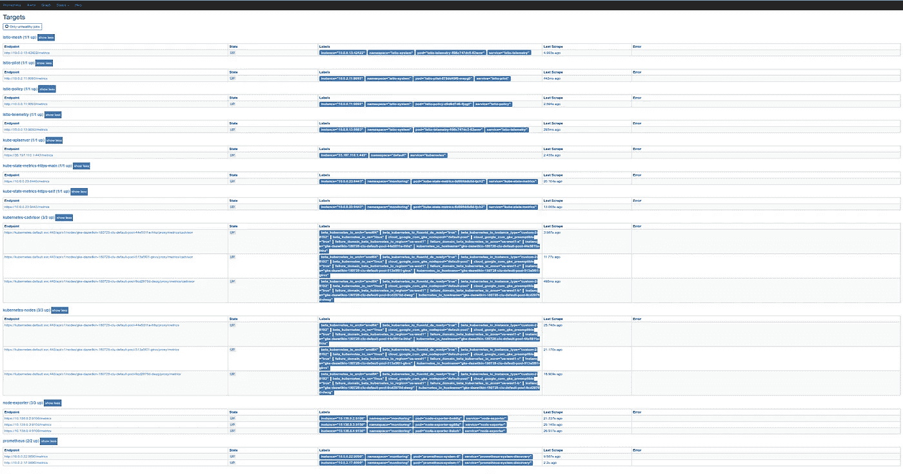

# Knative 2/2

> 原文：<https://medium.com/google-cloud/knative-2-2-e542d71d531d?source=collection_archive---------0----------------------->

## 库伯内特斯历险记

昨天，我探索了 Knative。

今天，我四处看看，以便更好地理解它。

## 设置

## 伊斯迪奥

Istio 的一个实现细节是，我们的服务组件由一个 Istio sidecar 容器代理。回到昨天的`helloworld` ( **NB** 矿叫`hellohenry`)部署:


Kubernetes 发动机控制台:hello Henry-00001-部署

Knative autoscaler 最近没有看到服务的流量(因此也没有看到部署的流量)，似乎已经将服务自动缩放到零 pods。让我们点击请求的端点，看看会发生什么:

```
HELLO=$(\
  kubectl get services.serving.knative.dev/helloworld \
  --namespace=default \
  --output=jsonpath="{.status.domain}") && echo ${HELLO}hellohenry.default.example.comINGRESS=$(\
  kubectl get services/knative-ingressgateway \
  --namespace=istio-system \
  --output=jsonpath="{.status.loadBalancer.ingress[0].ip}")curl --header "Host: ${HELLO}" [http://${INGRESS](http://${INGRESS)}# Your output will differ
Hello Henry: Tada!
```

然后:


Kubernetes 发动机控制台:由 autoscaler 创建的一个吊舱

autoscaler 创建了一个 pod 来支持此服务。因为冷启动时没有 pods 运行，所以第一个请求的延迟更高:

```
curl \
--header "Host: ${HELLO}" \
--write-out "
lookup        %{time_namelookup}
connect       %{time_connect}
appconnect    %{time_appconnect}
pretransfer   %{time_pretransfer}
redirect      %{time_redirect}
starttransfer %{time_starttransfer}
total         %{time_total}\n" \
[http://${INGRESS](http://${INGRESS)}
```

导致:

```
lookup        0.000048
connect       0.020991
appconnect    0.000000
pretransfer   0.021039
redirect      0.000000
starttransfer **8.052199**
total         **8.052241**
```

> **注意**Kubernetes、Knative 和 Istio 让我们从 0 到 1 只花了大约 8 秒，但之后，正如你将在下面看到的，它会更快。

一旦我运行了单个 pod，时机就好了:

```
lookup        0.000043
connect       0.020306
appconnect    0.000000
pretransfer   0.020380
redirect      0.000000
starttransfer 0.042394
total         **0.04**2443
```

虽然我们至少有一个 Pod，但让我们深入了解一下，看看它由什么组成:


Kubernetes 引擎控制台:带 Istio 的 Knative 应用程序盒

**注意**Pod 由 3 个容器组成。列表中的第三个是用户容器，它的图像对应于我的实用程序:`gcr.io/dazwilkin-180728-knative/knative/hellohenry`。Istio 代理(又名 sidecar)如预期的那样在那里`gcr.io/istio-release/proxyv2`。这是特使。第三个容器叫做`queue-proxy`，是 Knative ( `gcr.io/knative-releases/github.com/knative/serving`)的一部分。

## 贝吉塔

在我的工作站上使用[贝吉塔](https://github.com/tsenart/vegeta)(= =牛逼)对服务施加一些压力会产生一条有趣的曲线:

```
echo "GET [http://${INGRESS](http://${INGRESS)}" \
| vegeta -cpus=12 attack -duration=300s -header "Host: ${HELLO}" \
| vegeta report -reporter=plot > plot.html
```


贝吉塔情节:5 分钟

如图所示，在最初的 70 秒左右，集群提供 10 个 pod:


Knative 自动缩放 0 →10 个 pod

当集群检测到负载稳定时，多余的 Pods 被终止，服务通过 5 个 Pods 稳定:


5 个吊舱上的 Knative 稳定

在一次贝吉塔运行完成之后，在集群规模降回零之前，让我们运行另一个测试，这次使用文本输出:

```
echo "GET [http://${INGRESS](http://${INGRESS)}" \
| vegeta -cpus=12 attack -duration=300s -header "Host: ${HELLO}" \
| vegeta report -reporter=textRequests      [total, rate]            15000, 50.00
Duration      [total, attack, wait]    5m0.0312787s, 4m59.980142364s, 51.136336ms
Latencies     [mean, 50, 95, 99, max]  438.596801ms, 28.053121ms, 3.451233603s, 6.45897554s, 7.577021529s
Bytes In      [total, mean]            284544, 18.97
Bytes Out     [total, mean]            0, 0.00
Success       [ratio]                  99.84%
Status Codes  [code:count]             200:14976  503:24  
Error Set:
503 Service Unavailable
```

这为我们提供了更准确的响应数据。虽然 p95 不到 3.5s 似乎很高！？

## 普罗米修斯

Istio 捆绑普罗米修斯进行监控。Prometheus 被部署到一个`monitoring`名称空间，下面的代码将把您的本地端口`9090`转发到服务的端口:

```
kubectl port-forward $(\
  kubectl get pods \
  --selector=app=prometheus \
  --output=jsonpath="{.items[0].metadata.name}"
  --namespace=monitoring) \
--namespace=monitoring \
9090:9090
```

并浏览`localhost:9090/targets`给出:



## 格拉夫纳

幸运的是，Knative 附带了一套针对 Prometheus 指标配置的 Grafana 仪表盘:

```
kubectl port-forward $(\
  kubectl get pods \
  --selector=app=grafana \
  --output=jsonpath="{.items..metadata.name}" \
  --namespace=monitoring) \
--namespace=monitoring \
3000
```

浏览`localhost:3000`(点击`Home`):


并选择“无效服务—修订 HTTP 请求”:


超级好看！甚至有一个工具可以帮助进行缩放调试:


## 齐普金

```
kubectl port-forward $(\
  kubectl get pods \
  --selector=**app=zipkin** \
  --namespace=istio-system \
  --output=jsonpath="{.items[0].metadata.name}") \
--namespace=istio-system \
9411:9411
```

并浏览至`localhost:9411`:


齐普金

您应该能够从`Service Name`下拉列表中选择`helloworld`服务，然后选择`Find Traces`:


齐普金:“hellohenry-00001”

显然，hellohenry 示例没有太多内容，因为它只是直接响应传入的请求。然而，Zipkin 提供了一些关于机制的见解:


我们可以在这里看到请求在被路由到`hellohenry-00001`之前是如何如预期的那样到达`knative-ingressgateway`的。在这个表单的末尾，您可以看到接收方服务是`hellohenry-00001-service.default.svc.cluster.local`并且在端口`80`上。记住代码发布到`8080`。

服务的 YAML 将`80`绑定到 pod 的`queue-port`:

```
apiVersion: v1
kind: Service
metadata:
  annotations:
    serving.knative.dev/configurationGeneration: "1"
  labels:
    app: hellohenry-00001
    serving.knative.dev/configuration: hellohenry
    serving.knative.dev/revision: hellohenry-00001
  name: hellohenry-00001-service
  namespace: default
spec:
  externalTrafficPolicy: Cluster
  ports:
  - name: http
    nodePort: 30057
    **port: 80**
    protocol: TCP
    **targetPort: queue-port**
  selector:
    serving.knative.dev/revision: hellohenry-00001
  sessionAffinity: None
  type: NodePort
status:
  loadBalancer: {}
```

深入到服务捕获的一个 pod，我们可以看到队列端口是由 Knative 管理的，而不是由 Istio 或我们的服务管理的:

```
image: gcr.io/knative-releases/github.com/**knative/serving/cmd/queue**
name: queue-proxy
ports:
- containerPort: 8012
  **name: queue-port**
  protocol: TCP
- containerPort: 8022
  name: queueadm-port
  protocol: TCP
```

IIUC 这个`queue-proxy`是 Knative 自动缩放的一部分。想必(！)这个`queue-proxy`也是`istio-proxy`的代理，尽管我不清楚这是在哪里完成的。文献很少。

让我们看看日志:


“hello Henry-00001-部署”的日志

我们可以看到`8080`与`8012`和`8022`一起被 Istio 代理捕获:

```
INBOUND_PORTS_INCLUDE=8080, 8012, 8022
```

后两个端口对应于上面显示的队列代理端口:

```
queue-port: 8012/TCP (exposed on host)
queueadm-port: 8022/TCP (exposed on host)
```

这些由 Istio (Envoy)代理使用 iptables 编程:

```
A  -A ISTIO_INBOUND -p tcp -m tcp --dport 8080 -j ISTIO_IN_REDIRECT
A  -A ISTIO_INBOUND -p tcp -m tcp --dport 8012 -j ISTIO_IN_REDIRECT
A  -A ISTIO_INBOUND -p tcp -m tcp --dport 8022 -j ISTIO_IN_REDIRECT
```

我缺少的是这个小三和弦的图解流程。

## 仅 Istio

我将花一些时间比较 Istio-only 和 Istio w/ Knative 之间的部署，看看我是否能够理解 Knative 服务具体添加了什么。

不带 Knative 的 Istio 的等效部署(和服务)为:

**注意**第 17 行的注释可以在`true`和`false`之间切换，前者用于将 Istio 代理注入到 pod 中，后者用于非 Istio(无代理)部署。

同`sidecar.istio.io/inject: “false”`:


无委托人(无代理人)

用`sidecar.istio.io/inject: “true”`:


带 Istio(代理边车)

虽然代理和`hellohenry`容器之间的集成还不清楚，但这是一个很好的起点:


hellohenry 和 istio 边车的日志

更快！

## 结论

稍微聪明一点，但是这里有很多新的功能来让我理解。我认为，就我的理解而言，从 Istio 开始可能更好，一旦我搞清楚那里发生了什么，然后再加上 Knative。或者，有人向我解释这一切；-)