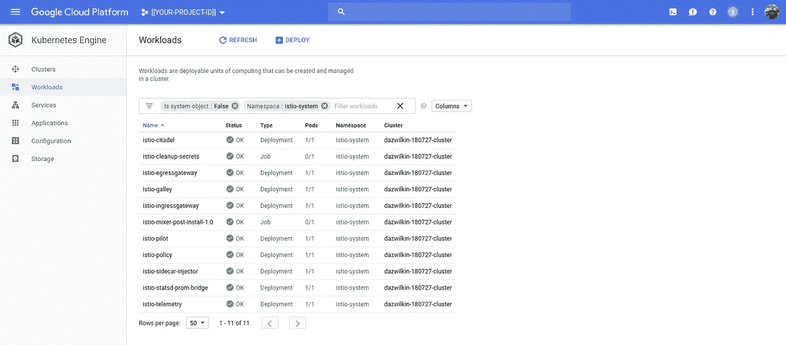
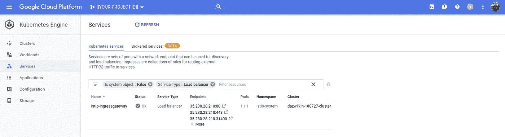
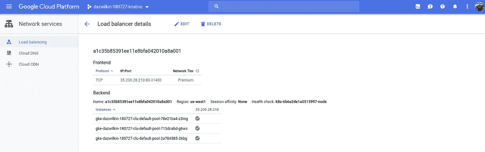
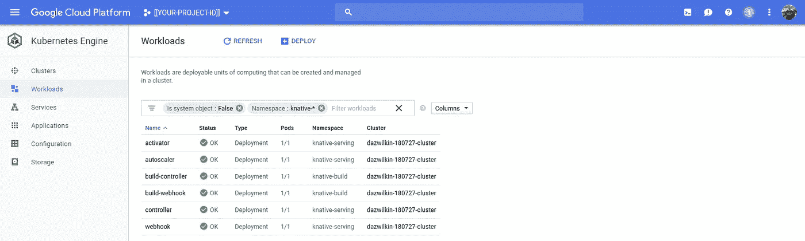
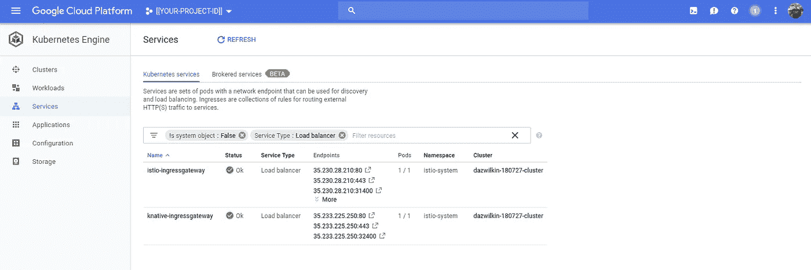
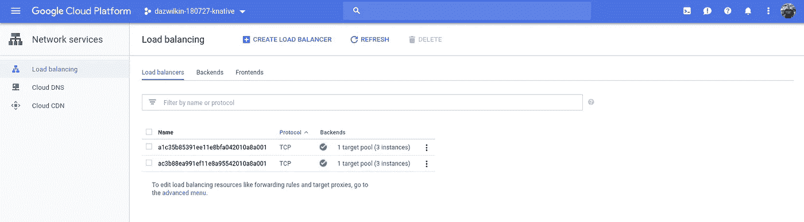
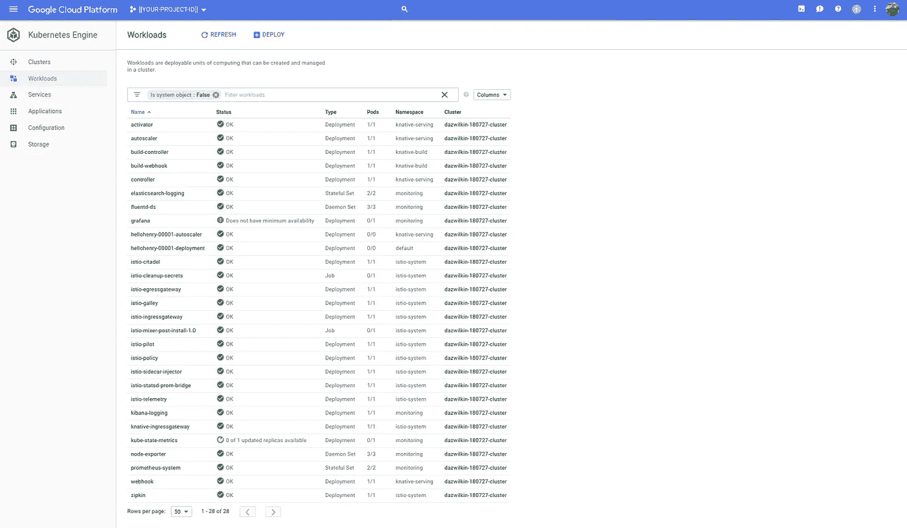
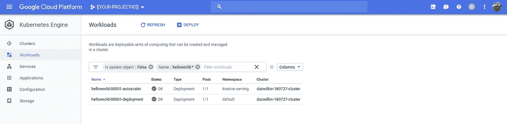
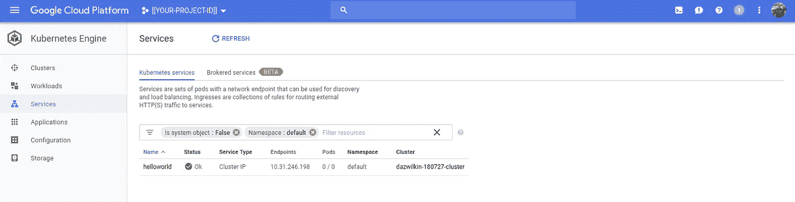
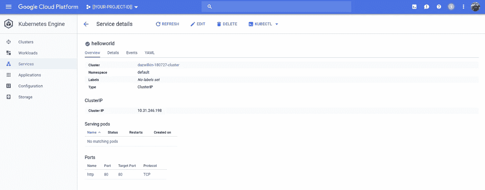

# Knative 1/2

> 原文：<https://medium.com/google-cloud/knative-408dacbc1953?source=collection_archive---------1----------------------->

## 库伯内特斯历险记

我个人认为“Knative”应该像“Knight”一样发音为不发音的“K ”,因为如果你永远要解释 K 不发音…

我已经陷入(是的，陷入)最近的掌舵和“我不爱它”。因此，在阅读了许多描述本周`pronounced kay-nay-tiv`发布的文章后，我很想在周五下午的“深度工作”时间尝试一下。

我对这项技术的雄心有一种感觉，但我承认，阅读本周写的内容并没有让我更加清楚。我将用这个故事来阐述我认为这里正在发生的事情。需要澄清的是:虽然我是一名谷歌人，也是 Kubernetes 和 Istio 的热情拥护者，但我并没有参与任何这些解决方案的工程设计。

## 警告

这个故事是我对 Google 文档的遍历。我没有做任何新奇的事情。如果你想保持权威性，我建议你参考谷歌文档:

[https://github . com/Knative/docs/blob/master/install/Knative-with-gke . MD](https://github.com/knative/docs/blob/master/install/Knative-with-GKE.md)

## 设置

我将使用 Kubernetes 引擎和一个自安装的 Knative，因为 Google 的用于 Kubernetes 引擎的无服务器插件还不可用。我也是区域集群的支持者，因此，使用下面的命令也可以得到一个闪亮的区域集群:

```
PROJECT=[[YOUR-PROJECT-ID]]
BILLING=[[YOUR-BILLING-ID]]
CLUSTER=[[YOUR-CLUSTER-NAME]]
REGION=[[YOUR-REGION]]         # us-west1
LATEST="1.10.5-gke.3"gcloud projects create ${PROJECT}gcloud beta billing projects link ${PROJECT} \
--billing-account=${BILLING}gcloud services enable container.googleapis.com \
--project=${PROJECT}gcloud beta container clusters create $CLUSTER \
--username="" \
--cluster-version=${LATEST} \
--machine-type=custom-2-8192 \
--image-type=COS \
--num-nodes=1 \
--enable-autorepair \
--enable-autoscaling \
--enable-autoupgrade \
--enable-stackdriver-kubernetes \
--min-nodes=1 \
--max-nodes=3 \
--region=${REGION} \
--project=${PROJECT} \
--preemptible \
--scopes="[https://www.googleapis.com/auth/cloud-platform](https://www.googleapis.com/auth/cloud-platform)"kubectl create clusterrolebinding cluster-admin-binding \
--clusterrole=cluster-admin \
--user=$(gcloud config get-value core/account)
```

我第一次安装 Istio 时遇到了问题。如果你有问题，重击和重新安装 Istio 似乎(！)要解决问题:

```
kubectl apply \
--filename=[https://storage.googleapis.com/knative-releases/serving/latest/istio.yaml](https://storage.googleapis.com/knative-releases/serving/latest/istio.yaml)kubectl label namespace default istio-injection=enabledkubectl get pods \
--namespace=istio-system \
--watch
```

您希望通过类似于以下内容的 pod 列表来实现稳定:

```
NAME                                        READY     STATUS      
istio-citadel-6fd4747d74-cz784              1/1       Running
istio-cleanup-secrets-jpqwt                 0/1       Completed
istio-egressgateway-8689d84656-x8pzj        1/1       Running
istio-galley-bc65ccfc4-7nr2s                1/1       Running
istio-ingressgateway-84ffcdd574-kqcvd       1/1       Running
istio-mixer-post-install-1.0-fs4q8          0/1       Completed
istio-pilot-878dd49f6-7bcvt                 2/2       Running
istio-policy-d9d9d7d6-r8n5z                 2/2       Running
istio-sidecar-injector-7b4f7c4bcc-bblbj     1/1       Running
istio-statsd-prom-bridge-6889648ccf-mjdvk   1/1       Running
istio-telemetry-698c747dc5-zzcqs            2/2       Running
```

在 Kubernetes 发动机控制台中(由`Namespace:istio-system`过滤):



Kubernetes 引擎控制台`命名空间:istio-system '

**NB** Istio 创建了一个网络(TCP)负载均衡器，有点令人困惑地称为`istio-ingressgateway`，但它不是 Kubernetes 入口资源:



Kubernetes 引擎控制台——Istio 的网络负载平衡器

此外，云控制台显示了相同的网络负载平衡器:



云控制台:网络服务——Istio 的网络负载平衡器

Knative 安装没有问题:

```
kubectl apply \
--filename=[https://storage.googleapis.com/knative-releases/serving/latest/release.yaml](https://storage.googleapis.com/knative-releases/serving/latest/release.yaml)
```

然后:

```
kubectl get pods \
--namespace=knative-servingNAME                          READY     STATUS    RESTARTS   AGE
activator-9988b7887-vq69k     2/2       Running   0          1m
autoscaler-664f4986c9-8vnqh   2/2       Running   0          1m
controller-79f897b6c9-7tfzp   1/1       Running   0          1m
webhook-5c664c7c88-cfdj2      1/1       Running   0          1m
```

并且:

```
kubectl apply \
--filename=[https://storage.googleapis.com/knative-releases/build/latest/release.yaml](https://storage.googleapis.com/knative-releases/build/latest/release.yaml)
```

然后:

```
kubectl get pods \
--namespace=knative-buildNAME                                READY     STATUS      RESTARTS
build-controller-5cb4f5cb67-nb2n9   2/2       Running     0
build-controller-6b88fbb445-949zq   2/2       Running     0
build-webhook-6b4c65546b-tqprz      2/2       Running     2
build-webhook-988b797b4-dzfls       1/2       Completed   1
```

您可以通过通配符名称空间(`Namespace:knative-*`)过滤 Kubernetes 引擎控制台:



Kubernetes 引擎控制台`命名空间:knative-* `

被动部署导致 Istio 创建另一个网络负载平衡器:



Kubernetes 引擎控制台:` knative-Ingres gateway '

**NB** 在我的例子中，已知的“入口”(不是 Kubernetes 入口，而是网络 LB)位于`35.233.225.250`。这两个 LBs 都是由 Istio 创建的，位于`istio-system`名称空间中。

向自己证明随后使用的是哪个网络 LB 是有用的。您可以使用以下命令来确定这一点:

```
kubectl get services/knative-ingressgateway \
--namespace=istio-system \
--output=jsonpath="{.status.loadBalancer.ingress[0].ip}"# Your value will differ
35.233.225.250
```

并且，使用云控制台:



网络服务:2 个网络负载平衡器

移除名称空间过滤器应该类似于:



Kubernetes 发动机控制台

**注意**我有几个未解决的问题:`grafana`和`kube-state-metrics`部署在一个初始化容器(`istio-init`)问题上受阻:`iptables v1.6.0: can’t initialize iptables table `nat’: Permission denied (you must be root)`。不好，但没有给我带来明显的问题。

## 破坏性部署

我推荐你从简单的`helloworld`样本开始。如果您想有机会调整和测试正在发生的事情，可以克隆样本并进行尝试。

你可能想节省 Docker 图像的大小，如果你有兴趣探索 Google 的[distroles](https://github.com/GoogleContainerTools/distroless)项目，我推荐以下 Docker 文件:

因为你使用的是 Kubernetes 引擎，我们手头有 Google 容器注册(GCR ),我建议你构建并推送这个到 DockerHub 它更近、更快、更便宜:

```
docker build \
--tag=gcr.io/${PROJECT}/helloworld \
. # Don't forget the perioddocker push gcr.io/${PROJECT}/helloworld
```

然后确保您的部署反映 GCR 和您的`${PROJECT}`也许:

```
echo "
apiVersion: serving.knative.dev/v1alpha1
kind: Service
metadata:
  name: helloworld
  namespace: default
spec:
  runLatest:
    configuration:
      revisionTemplate:
        spec:
          container:
            image: gcr.io/${PROJECT}/helloworld
            env:
            - name: TARGET
              value: 'Knative'
" | kubectl apply --filename=-
```

您应该会看到:

```
service.serving.knative.dev/helloworld created
```

针对这个 Knative API 部署一个`Service`会产生 2 个 Kubernetes 部署:一个以我们部署的服务命名并附加了-deployment，另一个附加了-autoscaler(在 knative-service 名称空间中:



Kubernetes 引擎控制台:名为“helloworld-*”的工作负载

并且:

```
kubectl get deployments --namespace=defaultNAME                          DESIRED   CURRENT   UP-TO-DATE
helloworld-00001-deployment   1         1         1
```

并且:

```
kubectl get deployments \
--selector=serving.knative.dev/configuration=helloworld \
--namespace=knative-servingNAME                          DESIRED   CURRENT   UP-TO-DATE
helloworld-00001-autoscaler   0         0         0
```

> **NB** 一个小技巧，通过值为`helloworld`的标签为`service.knative.dev/configuration`的部署来过滤`knative-serving`名称空间中的部署。

还有一项常规的 Kubernetes 服务:

```
kubectl get service/helloworld --namespace=default
NAME         TYPE        CLUSTER-IP      EXTERNAL-IP   PORT(S)   AGE
helloworld   ClusterIP   10.31.246.198   <none>        80/TCP    2m
```



Kubernetes 发动机控制台:“helloworld”服务

并且:



Kubernetes 引擎控制台:“helloworld”服务详情

保持这种想法！

现在，根据您所遵循的文档，会告诉您运行以下命令:

```
kubectl get services.serving.knative.dev
NAME         CREATED AT
helloworld   20s
```

> **NB** 没错`services.serving.knative.dev`

等等，什么？`services.serving.knative.dev`？事实证明，如果您查看部署的顶部，`apiVersion: serving.knative.dev/v1alpha1`和`Kind: Service`有助于解释这一点，同时快速检查`kubectl get --help`表明:

```
Usage:
  kubectl get
(**TYPE[.VERSION][.GROUP]** [NAME | -l label] | TYPE[.VERSION][.GROUP]/NAME ...) [flags] [options]
```

所以`**TYPE**`是`Service`，`**GROUP**`是`service.knative.dev`，`**VERSION**`是`v1alpha1`。所以我们可以:

```
kubectl get services.**serving.knative.dev**
NAME         CREATED AT
helloworld   20s
```

我们还可以:

```
kubectl get services.**v1alpha1**.serving.knative.dev
NAME         CREATED AT
helloworld   20s
```

这并没有告诉我们太多，除此之外，我们确实创建了一个叫做`helloworld`的服务。我们将调整`get`命令，从结果中提取特定的值:

```
HELLOWORLD=$(\
  kubectl get **services.serving.knative.dev**/helloworld \
  --namespace=default \
  --output=jsonpath="{.status.domain}") && echo ${HELLOWORLD}helloworld.default.example.com
```

> 我们的 Knative 服务有一个完全合格的域名`helloworld.default.example.com`。`helloworld`是我们提供的名称。`default`对应于你可能漏掉的命名空间，也在那里；尝试创建一个新的名称空间并将`helloworld`部署到其中。

为了调用服务，我们将引用这个全限定名称作为头，并将其传递给`knative-ingressgateway`。还记得我们之前提到的 IP 地址吗？

```
KNATIVE_INGRESS=$(\
  kubectl get services/knative-ingressgateway \
  --namespace=istio-system \
  --output=jsonpath="{.status.loadBalancer.ingress[0].ip}")
```

所以我们可以:

```
curl \
--header "Host: ${HELLOWORLD}" \
[http://${KNATIVE_INGRESS](http://${KNATIVE_INGRESS)}Hello Henry: Knative
```

您的值会有所不同，但是您应该会看到`Hello World`以及您在部署服务时为`TARGET`使用的任何值。

## 结论

假设集群、Istio 和 Knative 已经安装并准备好供我们使用，我们所要做的就是编写一些代码和`kubectl apply`一个引用我们的容器的 spec 文件，以便部署我们的服务。Knative 负责通过 Istio mesh 和 Istio Ingress 为我们公开服务。

从我们的角度来看，Istio 在这个场景中只扮演了一个次要的角色，但是它为那些表面上代表我们管理集群的人提供了丰富的功能，包括监控(w/ Prometheus 和命运多舛的 Grafana pod)、安全性和流量路由。

希望这个故事能为你的故事增添一点色彩。这是一项有趣的技术，我期待着了解更多。

## 整理一下！

如果你只是为了这个练习的目的而创建了一个谷歌云平台项目，并且你准备删除上面的一切，你可以简单地(不可挽回地！)删除项目:

```
gcloud projects delete ${PROJECT} --quiet
```

如果您希望保留项目，但(不可撤销地)删除 Kubernetes 集群、Istio、Knative 和部署的功能，您可以:

```
gcloud container clusters delete ${CLUSTER} --project=${PROJECT}
```

如果你想解开上面的一切，使用以下的一些子集:

```
# Delete Serviceskubectl **delete** services.serving.knative.dev/helloworld \
--namespace=default# Delete Knative Build|Servingkubectl **delete** \
--filename=[https://storage.googleapis.com/knative-releases/build/latest/release.yaml](https://storage.googleapis.com/knative-releases/build/latest/release.yaml)kubectl **delete** \
--filename=[https://storage.googleapis.com/knative-releases/serving/latest/release.yaml](https://storage.googleapis.com/knative-releases/serving/latest/release.yaml)# Delete Istiokubectl **delete** \
--filename=https://storage.googleapis.com/knative-releases/serving/latest/istio.yaml# Then delete the Cluster and or the Project
```

仅此而已！