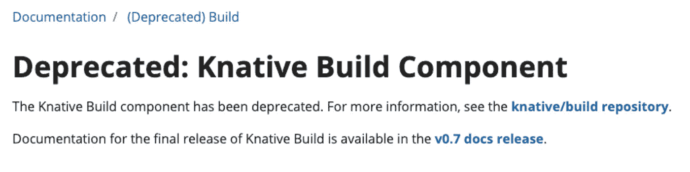
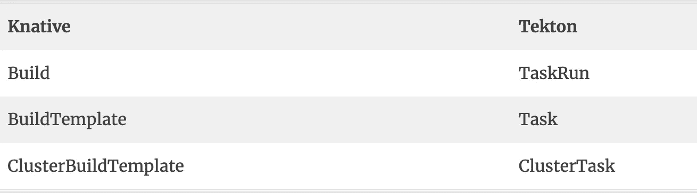

# Knative Build(已弃用)→ Tekton 管道

> 原文：<https://medium.com/google-cloud/knative-build-deprecated-tekton-pipelines-34de021178ee?source=collection_archive---------1----------------------->

在 0.8.0 版本中，Knative 宣布放弃构建组件，转而支持 [Tekton 管道](https://github.com/tektoncd/pipeline)。随着这一宣布，Tekton Pipelines 成为了 [Knative Build](https://github.com/knative/build) 的技术继承者。



Knative 安装文档([https://knative.dev/docs/install/](https://knative.dev/docs/install/))也只包括 Knative Serving 和 Eventing，没有提到 Build。没有解释为什么 Knative Build 被弃用，也没有任何关于替代的指导。经过一些研究，我能够找到更多关于弃用的信息，以及我想在这篇文章中分享的迁移路径。

GitHub 有一个问题([https://github.com/knative/build/issues/614](https://github.com/knative/build/issues/614))有更多关于弃用原因的细节。反对 Knative Build 的理由是，为服务构建和推送图像不应该是 Knative 的核心职责之一，而是由能够在 Kubernetes 中构建图像的任何项目来分担。

tek ton Pipeline([https://github.com/tektoncd/pipeline](https://github.com/tektoncd/pipeline))项目源自 Knative 项目(was `knative/build-pipeline`)，正在增强 Knative 的构建功能，在 Knative 奠定的基础之上提供高级 CI/CD 特性。

# 什么是 Tekton 管道？

Tekton Pipelines 是一个 Kubernetes 扩展，它安装并运行在您的 Kubernetes 集群上。它定义了一组 Kubernetes [定制资源](https://kubernetes.io/docs/concepts/extend-kubernetes/api-extension/custom-resources/)作为构建块，您可以从这些构建块组装 CI/CD 管道。一旦安装完毕，Tekton 管道就可以通过 Kubernetes CLI (kubectl)和 API 调用使用，就像 pod 和其他资源一样。Tekton 是开源的，是 [CD Foundation](https://cd.foundation/) 的一部分，这是一个 [Linux Foundation](https://www.linuxfoundation.org/projects/) 项目。

在 [Tekton Pipelines](https://github.com/tektoncd/pipeline) 中，您可以创建简单的一次性任务或更复杂的 CI/CD 管道。Tekton 管道有 4 个主要原语:

*   [任务](https://github.com/tektoncd/pipeline/blob/master/docs/tasks.md)定义了需要执行一个或多个步骤的工作。
*   [PipelineResources](https://github.com/tektoncd/pipeline/blob/master/docs/resources.md) 定义了可以传入和传出任务的工件。
*   [TaskRun](https://github.com/tektoncd/pipeline/blob/master/docs/taskruns.md) 使用提供的资源运行您定义的任务。
*   [Pipeline](https://github.com/tektoncd/pipeline/blob/master/docs/pipelines.md) 定义了按顺序执行的任务列表。

在使用 Tekton 管道之前，您需要将其安装在您的 Kubernetes 集群中。详细的[说明](https://github.com/tektoncd/pipeline/blob/master/docs/install.md)在这里，但是很简单:

```
kubectl apply -f https://storage.googleapis.com/tekton-releases/latest/release.yaml
```

安装后，您可以检查 Tekton pods:

```
kubectl get pods -n tekton-pipelines
```

```
NAME                                           READY   STATUS
tekton-pipelines-controller-78c6b3b9f6-9p879   1/1     Running
tekton-pipelines-webhook-7634d5bcc8-pf6x9      1/1     Running
```

# 从 Knative Build 迁移

Tekton 实体基于 Knative Build 的实体，但提供了额外的灵活性和可重用性。简而言之，这些是 Knative Build 构造的 Tekton 等价物:



有关于从 Knative Build 迁移到 Tekton 的基本文档。

此外， [Tekton 目录](https://github.com/tektoncd/catalog)旨在提供一个可重用任务的目录，类似于 Knative BuildTemplate repository 以前所做的。

# 用 Kaniko 构建容器图像

让我们看看如何使用 Tekton 管道构建一个图像并将其推送到 Google 容器注册中心(GCR)。

kaniko 是一个在容器或 Kubernetes 集群中从 docker 文件构建容器映像的工具。

kaniko 不依赖 Docker 守护进程，完全在用户空间中执行 Docker 文件中的每个命令。这使得在不能轻松或安全地运行 Docker 守护进程的环境中构建容器映像成为可能，比如标准的 Kubernetes 集群。

kaniko 的本意是作为一个形象来经营。这使得它成为 Tekton 的完美工具。此任务也可用于 Tekton 链，以证明和签名图像。

使用[社区中心](https://hub.tekton.dev/)中的 [Kaniko](https://hub.tekton.dev/tekton/task/kaniko) 任务构建图像。

1.  将图像参考添加到`pipeline.yaml`中的`params`部分:

```
params:  
- name: image-reference   
  type: string
```

该参数用于添加与容器注册表相对应的标记，您将把图像推送到该注册表中。

2.在同一个`pipeline.yaml`文件中创建新的`build-push`任务:

```
tasks:
...
  - name: build-push
    runAfter: ["fetch-source"]
    taskRef:
      name: kaniko
    workspaces:
    - name: source
      workspace: shared-data
    params:
    - name: IMAGE
      value: $(params.image-reference)
```

这个新任务是指`kaniko`，它将从[社区中心](https://hub.tekton.dev/)安装。一个任务有它自己的一组`workspaces`和`params`从在流水线级定义的参数和工作空间传递下来。在这种情况下，工作空间`source`和`IMAGE`的值。

3.实例化`build-push`任务。将`image-reference`的值添加到`pipelinerun.yaml`中的`params`部分:

```
params:
- name: image-reference
  value: container.registry.com/sublocation/my_app:version
```

用您的注册表的实际标签替换`container.registry.com/sublocation/my_app:version`。您可以设置一个本地注册表用于测试目的。

# 容器注册认证

在大多数情况下，要将映像推送到容器注册中心，您必须首先提供身份验证凭证。

1.  使用 Docker credential helper 设置身份验证，并为您的注册表生成 Docker 配置文件`~/.docker/config.json`。
2.  参考 GCR ( [谷歌神器注册表](https://cloud.google.com/artifact-registry/docs/docker/authentication))。
3.  用您的凭证创建一个 [Kubernetes 秘密](https://kubernetes.io/docs/concepts/configuration/secret/)、`docker-credentials.yaml`:

```
apiVersion: v1
kind: Secret
metadata:
  name: docker-credentials
data:
  config.json: efuJAmF1...
```

`config.json`的值是 base64 编码的`~/.docker/config.json`文件。您可以使用以下命令获取该数据:

```
cat ~/.docker/config.json | base64 -w0
```

4.更新`pipeline.yaml`并添加一个工作空间来挂载凭证目录:

在管道级别:

```
workspaces:
- name: docker-credentials
```

而在`build-push`任务下:

```
workspaces:
- name: dockerconfig
  workspace: docker-credentials
```

4.通过在`workspaces`下添加一个新条目，在您的`pipelinerun.yaml`文件中实例化新的`docker-credentials`工作空间:

```
- name: docker-credentials
  secret:
    secretName: docker-credentials
```

# 运行您的管道

您已经准备好安装任务并运行管道。

1.  安装`git-clone`和`kaniko`任务:

```
tkn hub install task git-clone tkn hub install task kaniko
```

2.应用你的 Docker 凭证的秘密。

```
kubectl apply -f docker-credentials.yaml
```

3.应用管道:

```
kubectl apply -f pipeline.yaml
```

4.创建管道管路:

```
kubectl create -f pipelinerun.yaml
```

这将每次创建一个具有唯一名称的 PipelineRun:

```
pipelinerun.tekton.dev/clone-build-push-run-4kgjr created
```

5.使用上一步输出中的 PipelineRun 名称来监视管道执行:

```
tkn pipelinerun logs  clone-build-push-run-4kgjr -f
```

几秒钟后，输出确认映像已成功构建并推送:

```
[build-push : build-and-push] INFO[0012] Taking snapshot of full filesystem...        
[build-push : build-and-push] INFO[0013] Pushing image to us-east1-docker.pkg.dev/tekton-tests/tektonstuff/docsy:v1 
[build-push : build-and-push] INFO[0029] Pushed image to 1 destinations               

[build-push : write-url] **us-east1-docker.pkg.dev/my-tekton-tests/tekton-samples/docsy:v1**
```

如需完整代码示例，请参考此[https://tek ton . dev/docs/how-to-guides/kaniko-build-push/# full-code-samples](https://tekton.dev/docs/how-to-guides/kaniko-build-push/#full-code-samples)

希望这篇博文为您提供了从 Knative Build 过渡到 Tekton Pipelines 所需的基础知识。