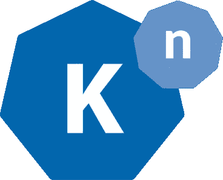
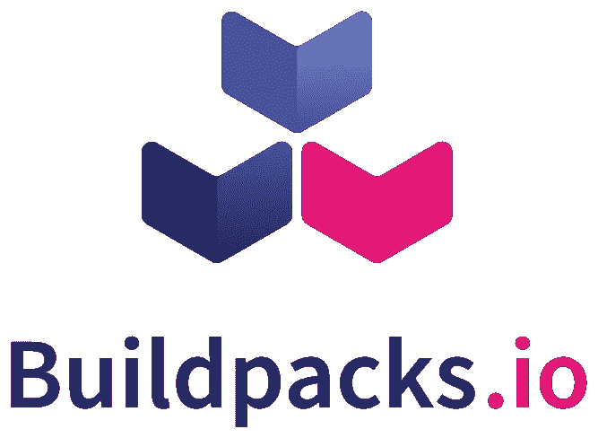
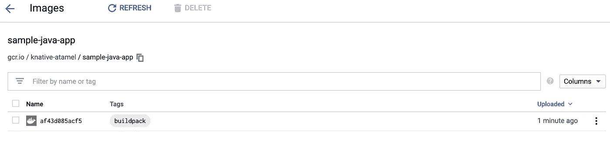

# Knative + Buildpacks:不带 Dockerfile 的容器映像的源代码

> 原文：<https://medium.com/google-cloud/knative-buildpacks-source-code-to-container-image-without-dockerfile-34cb2dbfc49c?source=collection_archive---------1----------------------->



我之前[谈到过](/google-cloud/hands-on-knative-part-3-d8731ad2f23d) [Knative Build](https://github.com/knative/build) 以及它如何让你从源代码到存储库中的容器映像。您可以从头开始编写您的构建，也可以依赖 Knative 已经提供的许多 [BuildTemplates](https://github.com/knative/build-templates) 。例如，在我的 [Knative 教程](https://github.com/meteatamel/knative-tutorial)中，我[向](https://github.com/meteatamel/knative-tutorial/blob/master/docs/10.5-kanikobuildtemplate.md)展示了如何安装 [Kaniko BuildTemplate](https://github.com/knative/build-templates/tree/master/kaniko) 并使用 Kaniko 构建容器图像。

您通常需要编写一个`Dockerfile`，这样 Knative Build(或者更准确地说是 Kaniko)就知道如何构建容器映像。如果有一种不用定义`Dockerfile`就能自动构建应用程序的方法，那不是很好吗？嗯，有！

[Cloud Native Buildpacks](https://buildpacks.io/) 是一个为构建应用提供比 Dockerfiles 更高层次抽象的项目。[云原生构建包](https://buildpacks.io/)允许你从源代码到容器映像，而不必定义`Dockerfile`。它通过一些自动检测功能来判断你的代码是用什么语言写的，以及它有什么样的依赖关系。最终，您得到了一个可运行的应用程序映像，而不必担心创作和优化一个`Dockerfile`的细节。

好消息是 Knative 有一个 [Buildpacks 模板](https://github.com/knative/build-templates/tree/master/buildpacks)，使得在 Knative 构建中使用 Buildpacks 变得非常容易。我在我的 Knative Buildpacks 构建模板教程[中详细展示了如何做到这一点，但让我们在这里重述一下。](https://github.com/meteatamel/knative-tutorial/blob/master/docs/10.7-buildpacksbuildtemplate.md)

# 安装 Buildpacks 模板

首先，您需要安装 Buildpacks 模板:

```
kubectl apply -f https://raw.githubusercontent.com/knative/build-templates/master/buildpacks/cnb.yaml
```

并检查模板是否已安装:

```
kubectl get buildtemplate

NAME             AGE
buildpacks-cnb   1m
```

# 设计构建

接下来，让我们创建一个构建，使用构建模板在 GitHub ( [sample-java-app](https://github.com/buildpack/sample-java-app.git) )上构建一个示例 Java 应用程序。创建`build.yaml`文件:

```
apiVersion: build.knative.dev/v1alpha1
kind: Build
metadata:
  name: buildtemplate-buildpack-sample-java-app-gcr
spec:
  source:
    git:
      url: [https://github.com/buildpack/sample-java-app.git](https://github.com/buildpack/sample-java-app.git)
      revision: master
  template:
      name: buildpacks-cnb
      arguments:
      - name: IMAGE
        value: gcr.io/knative-atamel/sample-java-app:buildpack
```

你会注意到的一件事是`sample-java-app`没有定义`Dockerfile`。Buildpacks 将使用它的自动检测来构建图像，Knative 将把它推到在`IMAGE`参数中指定的位置(在本例中是 Google 容器注册表)。

# 运行构建

我们终于可以运行构建了:

```
kubectl apply -f build.yaml
```

几分钟后，检查构建是否成功:

```
kubectl get buildNAME                                          SUCCEEDED   
buildtemplate-buildpack-sample-java-app-gcr    True
```

此时，您应该看到图像被推送到 Google 容器注册表:



与 Dockerfiles 相比，Knative Build 和 Buildpacks 是在更高抽象层次上构建应用程序的一个很好的组合！