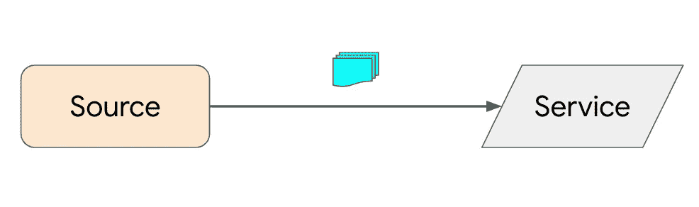
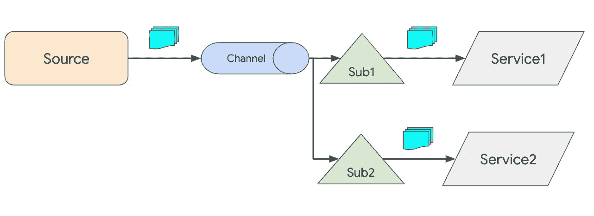
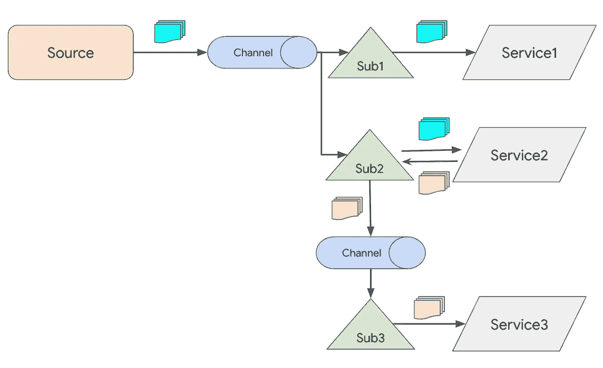
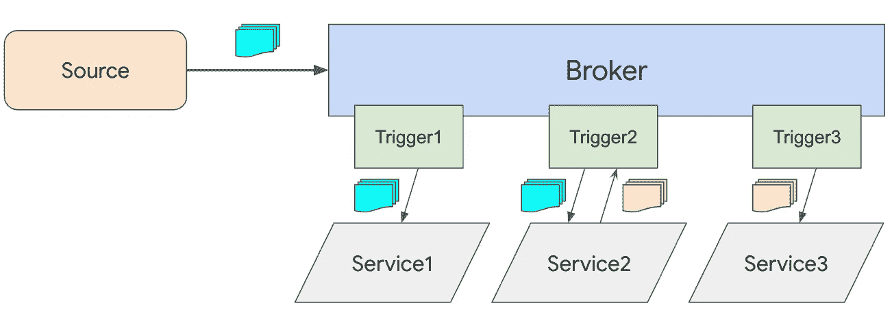

# 失败的事件交付方法

> 原文：<https://medium.com/google-cloud/knative-eventing-delivery-methods-79d4ebe30a68?source=collection_archive---------1----------------------->

当谈到它支持的不同事件交付方法时，Knative Eventing [docs](https://knative.dev/docs/eventing/) 有点令人困惑。它谈到了**事件代理和触发器**和**T5，还谈到了**源**、**服务**、**频道**和**订阅**。用什么，什么时候用？不清楚。我们来分解一下。**

## 交付方式

Knative 有 3 种不同的方法:

1.  简单交付
2.  具有可选回复的复杂交付
3.  代理和触发交付

**代理和触发器交付是你大部分时间应该关心的事情**。然而，简单和复杂的交付已经流行了一段时间，仍然很好地了解了幕后发生的事情。

## 简单交付

在简单交付中，事件源直接向服务发送消息。现在是 1:1，完全没有交付保证:



简单交付，源直接向服务发送事件

例如，下面是一个 CronJobSource，它根据给定的 cron 时间表触发事件，将消息直接发送到 Knative 服务:

```
apiVersion: sources.eventing.knative.dev/v1alpha1
kind: CronJobSource
metadata:
  name: source
spec:
  schedule: "* * * * *"
  data: '{"message": "Hello world from cron!"}'
  sink:
    apiVersion: serving.knative.dev/v1
    kind: Service
    name: service
```

你可以在我的 Knative 教程中看到完整的简单交付示例。

## 复杂交付

复杂交付允许使用**通道**和 1:n 扇出**订阅的交付保证。**



1:n 扇出的复杂传输

源向通道发送消息。它可以是内存通道，也可以是更持久的通道，如 Kafka 通道:

```
apiVersion: sources.eventing.knative.dev/v1alpha1
kind: CronJobSource
metadata:
  name: source
spec:
  schedule: "* * * * *"
  data: '{"message": "Hello world from cron!"}'
  sink:
    apiVersion: messaging.knative.dev/v1alpha1
    kind: InMemoryChannel
    name: channel
```

然后，服务通过订阅连接到频道:

```
apiVersion: messaging.knative.dev/v1alpha1
kind: Subscription
metadata:
  name: subscription1
spec:
  channel:
    apiVersion: messaging.knative.dev/v1alpha1
    kind: InMemoryChannel
    name: channel
  subscriber:
    ref:
      apiVersion: serving.knative.dev/v1
      kind: Service
      name: service1
```

复杂交付还允许服务用其他事件来回复事件:



复杂交付，其中 Service2 用另一个事件回复一个事件

在这种情况下，服务 2 用另一个事件回复传入事件，并通过另一个通道和订阅路由到服务 3。回复被定义为订阅的一部分:

```
apiVersion: messaging.knative.dev/v1alpha1
kind: Subscription
metadata:
  name: subscription2
spec:
  channel:
    apiVersion: messaging.knative.dev/v1alpha1
    kind: InMemoryChannel
    name: channel1
  subscriber:
    ref:
      apiVersion: serving.knative.dev/v1
      kind: Service
      name: service2
  reply:
    ref:
      apiVersion: messaging.knative.dev/v1alpha1
      kind: InMemoryChannel
      name: channel2
```

你可以在我的 Knative 教程中看到完整的[复杂交付示例](https://github.com/meteatamel/knative-tutorial/blob/master/docs/complexdelivery.md)和[带回复的复杂交付示例](https://github.com/meteatamel/knative-tutorial/blob/master/docs/complexdeliverywithreply.md)。

## 代理和触发交付

复杂的交付模式可行，但很难维持多个渠道、订阅和回复。它也没有过滤的概念，所以服务必须自己过滤所有的消息。

一个更简单的模型是代理和触发器。Broker 将通道、回复和过滤功能组合到一个资源中。触发器提供所有事件的声明性过滤。

在这个方法中，前面的例子变成了这样:



代理被注入到服务和源的名称空间中。源向代理发送事件:

```
apiVersion: sources.eventing.knative.dev/v1alpha1
kind: CronJobSource
metadata:
  name: source
spec:
  schedule: "* * * * *"
  data: '{"message": "Hello world from cron!"}'
  sink:
    apiVersion: eventing.knative.dev/v1alpha1
    kind: Broker
    name: default
```

经纪人有渠道做后盾。服务通过触发器注册对特定事件类型的兴趣:

```
apiVersion: eventing.knative.dev/v1alpha1
kind: Trigger
metadata:
  name: trigger1
spec:
  filter:
    attributes:
      type: dev.knative.cronjob.event
  subscriber:
    ref:
      apiVersion: serving.knative.dev/v1
      kind: Service
      name: service1
```

在幕后，trigger 创建订阅。任何服务都可以回复传入的事件。通过对该类型事件感兴趣的代理和服务路由回的回复事件获得该事件:

```
apiVersion: eventing.knative.dev/v1alpha1
kind: Trigger
metadata:
  name: trigger3
spec:
  filter:
    attributes:
      type: dev.knative.samples.hifromknative
  subscriber:
    ref:
      apiVersion: serving.knative.dev/v1
      kind: Service
      name: service3
```

你可以在我的 Knative 教程中看到完整的[代理和触发器交付示例](https://github.com/meteatamel/knative-tutorial/blob/master/docs/brokertrigger.md)。

正如我之前提到的，你通常只关心 Knative Eventing 中的 Broker 和 Trigger，但我希望这篇文章澄清不同的交付方法以及在 coverrs 下会发生什么。

一如既往，如果你有任何问题，请随时在[推特](https://twitter.com/meteatamel)上联系我！