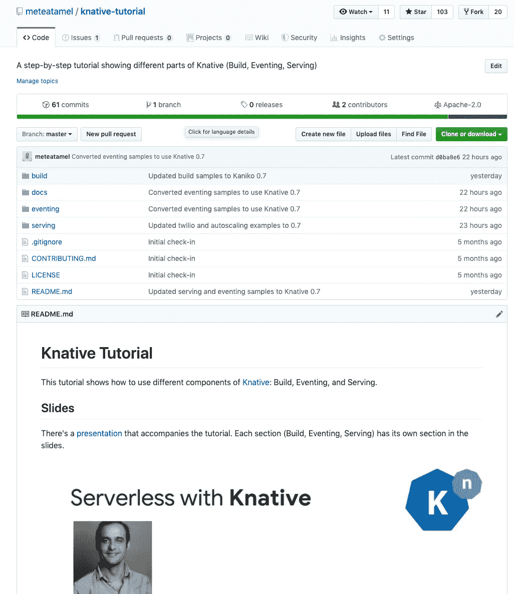

# 每份 0.7 克

> 原文：<https://medium.com/google-cloud/knative-serving-0-7-96e6d7be463e?source=collection_archive---------0----------------------->

你可能已经听说了，Knative 0.7 已经在上周发布了。这个版本的一个显著变化是 Knative Serving API 从`[v1alpha](http://serving.knative.dev/v1alpha)1`发展到了`[v1beta](http://serving.knative.dev/v1beta)1`。虽然您仍然可以使用旧的`v1alpha1` API，但是如果您想要更新到`v1beta`，您需要重写您的 Knative 服务定义文件。新的 API 还允许命名修订、静默最新部署和更好的流量分流配置。在这篇文章中，我想概述一些变化。

# 更简洁的服务定义

在以前版本的 Knative 中，如果您想部署一个简单的 Knative 服务并将 100%的流量路由到它，您必须使用如下的`runLatest`块:

```
apiVersion: serving.knative.dev/v1alpha1
kind: Service
metadata:
  name: helloworld
  namespace: default
spec:
  runLatest:
    configuration:
      revisionTemplate:
        spec:
          container:
            image: docker.io/meteatamel/helloworld:v1
            env:
              - name: TARGET
                value: "v1"
```

在新版本中，相同的服务定义如下所示:

```
apiVersion: serving.knative.dev/v1beta1
kind: Service
metadata:
  name: helloworld
  namespace: default
spec:
  template:
    spec:
      containers:
        - image: docker.io/meteatamel/helloworld:v1
          env:
            - name: TARGET
              value: "v1"
```

请注意，这里没有`runLatest`或`configuration`，现在`revisionTemplate`被简单地称为`template`。这允许更紧凑的服务定义文件。

# 命名修订

在以前的版本中，当您部署对 Knative 服务的更改时，您会得到如下的随机修订号:

```
$ kubectl get revisionNAME                                                   
revision.serving.knative.dev/helloworld-c4pmt   
revision.serving.knative.dev/helloworld-vkvjt
```

这通常是可以的，但是会使流量分割配置变得有点麻烦(稍后会详细介绍)。

在新版本中，默认情况下你仍然会得到随机的修订号，但是你也可以给你的修订起一个可预测的名字。例如，看看这个带有修订名称的服务定义文件:

```
apiVersion: serving.knative.dev/v1beta1
kind: Service
metadata:
  name: helloworld
  namespace: default
spec:
  template:
    metadata:
      name: helloworld-v1
    spec:
      containers:
        - image: docker.io/meteatamel/helloworld:v1
          env:
            - name: TARGET
              value: "v1"
  traffic:
  - tag: current
    **revisionName: helloworld-v1**
    percent: 100
  - tag: latest
    latestRevision: true
    percent: 0
```

部署时，您将获得指定的修订名称:

```
$ kubectl get revision

NAME               SERVICE NAME       GENERATION
helloworld-f4xvr   helloworld-f4xvr   2         
helloworld-ln8rv   helloworld-ln8rv   3         
**helloworld-v1      helloworld-v1      4 **        
helloworld-z9clz   helloworld-z9clz   1
```

# 能够静默部署最新版本

在前面的例子中，您可能注意到了`latest`配置:

```
traffic:
  - tag: current
    revisionName: helloworld-v1
    percent: 100
 **- tag: latest
    latestRevision: true
    percent: 0**
```

当您部署服务时，它将部署最新的修订版(在随机命名的修订版 id 下),但是`helloworld-v1`将获得所有流量。换句话说，你默默地部署了最新的版本。主 url `[http://helloworld.default.example.com](http://helloworld.default.example.com)`将指向`helloworld-v1`修订版，但是您也可以在`[http://latest-helloworld.default.example.com](http://latest-helloworld.default.example.com))`下访问最新的修订版

如果您想在向用户展示之前部署一些代码并对其进行测试，这是非常有用的。

# 更强大的流量分流配置

在 Knative 的前一版本中，当您想要在当前版本和候选版本之间划分流量时，您必须创建一个版本并定义一个部署百分比，如下所示:

```
apiVersion: serving.knative.dev/v1alpha1
kind: Service
metadata:
  name: helloworld
  namespace: default
spec:
  release:
    # First revision is traffic target "current"
    # Second revision is traffic target "candidate"
    revisions: ["helloworld-xyzss", "helloworld-zyxss"]
    rolloutPercent: 20 # 20% traffic to route to "candidate"
    configuration:
      revisionTemplate:
        spec:
          container:
            image: docker.io/meteatamel/helloworld:v1
            env:
              - name: TARGET
                value: "v4"
```

这是有问题的，因为在初始部署之前不知道候选修订 id。您必须应用此配置来部署候选版本，获取已部署候选版本的随机版本 id，并使用该版本 id 再次进行部署，以应用流量分离。不理想。

在 Knative 的最新版本中，您可以在流量分割中使用命名修订:

```
apiVersion: serving.knative.dev/v1beta1
kind: Service
metadata:
  name: helloworld
  namespace: default
spec:
  template:
    metadata:
      name: helloworld-v4
    spec:
      containers:
        - image: docker.io/meteatamel/helloworld:v1
          env:
            - name: TARGET
              value: "v4"
  traffic:
  - tag: current
    **revisionName: helloworld-v1**
    percent: 50
  - tag: candidate
    **revisionName: helloworld-v4**
    percent: 50
  - tag: latest
    latestRevision: true
    percent: 0
```

这无疑是定义流量分流的更简单、更清晰的方式。

这就是我想用 Knative Serving 0.7 覆盖的所有内容。如果你想试用 Knative 0.7，我用 0.7 的说明测试并更新了我的 [Knative 教程](https://github.com/meteatamel/knative-tutorial)，所以去看看吧。

