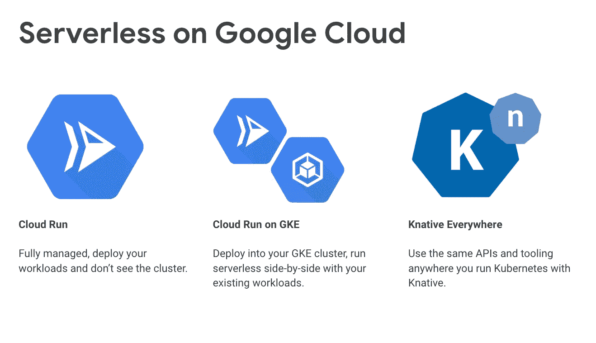

# 云运行的技巧

> 原文：<https://medium.com/google-cloud/knative-to-cloud-run-f0ed1617e256?source=collection_archive---------0----------------------->


云运行

在我的 Knative 系列([第 1 部分](/google-cloud/hands-on-knative-part-1-f2d5ce89944e)、[第 2 部分](/google-cloud/hands-on-knative-part-2-a27729f4d756)、[第 3 部分](/google-cloud/hands-on-knative-part-3-d8731ad2f23d))中，我展示了如何使用 Knative Serving、Eventing 以及在任何地方构建任何 Kubernetes 集群。这对于可移植性来说非常好，但是伴随着可移植性而来的是创建和管理 Kubernetes 集群的开销。更不用说 Istio 的复杂性了，它是 Knative 的一个依赖项。

谷歌 Kubernetes 引擎(GKE)有助于管理 Kubernetes 集群，但您仍然需要担心 Kubernetes 集群的所有附加功能。拥有 Knative 服务体验而不必担心底层基础设施不是很好吗？嗯，你可以带着[云跑](https://cloud.google.com/run/)！

[Cloud Run](https://cloud.google.com/run/) 是 Google Cloud 的一个托管的无服务器平台，使你能够运行通过 HTTP 请求调用的无状态容器。云运行是从 Knative 构建的。这意味着您可以将 Knative 服务的容器部署到完全托管的云服务器上，或者部署到位于 GKE 的 GKE 集群中。您将获得与 Knative 服务相同的体验和特性，如自动缩放、版本控制等。



在我的 [Knative 教程](https://github.com/meteatamel/knative-tutorial)的 [Hello World Serving](https://github.com/meteatamel/knative-tutorial/blob/master/docs/01-helloworldserving.md) 示例中，我们构建了一个简单地回复“Hello C# Sample v1”的服务。最终，这是一个非常简单的服务，但在部署服务之前，我们必须做大量的准备工作，即:

1.  创建 GKE 集群。
2.  在 GKE 集群上安装 Istio。
3.  在 GKE 集群上安装活动组件(服务、事件、构建)。
4.  构建一个容器映像并将其推送到 DockerHub
5.  为服务创建一个活动服务 yaml 文件。
6.  为 Knative 服务配置域
7.  最后，部署 Knative 服务

一个简单的服务需要很多步骤！在 Cloud Run 中，事情要简单得多。云运行的主要优势在于它是完全托管的，因此无需担心基础架构或 Kubernetes。它还带有一个简单直观的命令行和用户界面，可以快速部署和管理您的无服务器容器。

将我的[实用教程](https://github.com/meteatamel/knative-tutorial)的相同 [Hello World Serving](https://github.com/meteatamel/knative-tutorial/blob/master/docs/01-helloworldserving.md) 示例部署到云运行需要什么？实际上是 2 个 gcloud 命令。

首先，构建相同的容器映像并将其推送到 Google 容器注册中心(GCR):

```
gcloud builds submit --tag gcr.io/cloudrun-atamel/helloworld-csharp:v1
```

其次，部署到云运行:

```
gcloud beta run deploy --image gcr.io/cloudrun-atamel/helloworld-csharp:v1
```

就是这样！如果你想了解细节，你可以查看我的[实用教程](https://github.com/meteatamel/knative-tutorial)的[部署到云运行](https://github.com/meteatamel/knative-tutorial/blob/master/docs/05.5-deploycloudrun.md)部分。