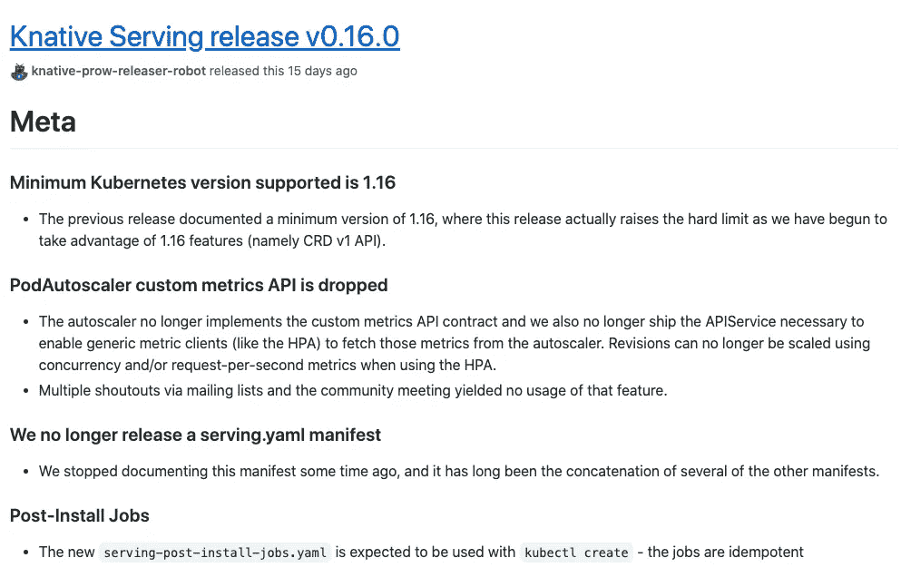

# Knative v0.16.0 更新

> 原文：<https://medium.com/google-cloud/knative-v0-16-0-update-5a5690e5354c?source=collection_archive---------4----------------------->



我终于把我的 [Knative 教程](https://github.com/meteatamel/knative-tutorial)从 Knative `v0.14.0`更新到了最新的 Knative `v0.16.0` [版本](https://github.com/knative/serving/releases/tag/v0.16.0)。由于我跳过了`v0.15.0`，我不确定哪些变化是由于`v0.15.0`对`v0.16.0`。不管怎样，我想在这篇博文中概述一些值得注意的变化。这并不意味着是一份详尽的清单。如果有其他值得注意的变化，请在评论中告诉我。

# 糖控制器

当我更新到`v0.16.0`时，我意识到`Broker`注入默认名称空间不起作用。原来，你需要安装一个新的`Sugar Controller`来进行`Broker`注射。[安装控制器](https://knative.dev/docs/install/any-kubernetes-cluster/)页面有更多细节，我的[设置](https://github.com/meteatamel/knative-tutorial/tree/master/setup)脚本已经更新，可以安装这个控制器。这是您安装它的方式:

```
kubectl apply -f \ [https://github.com/knative/eventing/releases/download/v0.16.0/eventing-sugar-controller.yaml](https://github.com/knative/eventing/releases/download/v0.16.0/eventing-sugar-controller.yaml)
```

这允许您:

1.  当一个名称空间标有`eventing.knative.dev/injection=enabled`时，控制器将在该名称空间中创建一个默认的`Broker`。
2.  当一个触发器用`eventing.knative.dev/injection=enabled`注释时，控制器将在`Trigger`的名称空间中创建一个由那个`Trigger`命名的`Broker`。

# 代理注入的名称空间标签

如果你很小心，你已经意识到`Broker`注入的名称空间标签曾经是:

```
knative-eventing-injection
```

现在，它变成了:

```
eventing.knative.dev/injection
```

现在，为了将`Broker`注入到名称空间中(在本例中为`default`，您必须将您的名称空间标记如下:

```
kubectl label ns default eventing.knative.dev/injection=enabled
```

# 默认代理 URL

一旦`Broker`启动并运行，您还会意识到默认的`Broker` URL 也发生了变化。如果将`Broker`注入到`default`名称空间中，URL 应该是这样的:

```
[http://default-broker.default.svc.cluster.local](http://default-broker.default.svc.cluster.local)
```

现在，新的网址是:

```
[http://broker-ingress.knative-eventing.svc.cluster.local/default/default](http://broker-ingress.knative-eventing.svc.cluster.local/default/default)
```

最好记住是否需要向`Broker`发送消息。

# GCP API 版本

如你所知， [Knative-GCP](https://github.com/google/knative-gcp) 项目对于将谷歌云事件读入 Knative 集群非常有用。它还有一个`v0.16.0` [释放](https://github.com/google/knative-gcp/releases/tag/v0.16.0)。这样，你现在可以从`v1alpha1`转移到`v1beta1` API。这会影响您定义信号源的时间，例如`CloudStorageSource`。您可以使用较新的 API:

```
apiVersion: events.cloud.google.com/v1beta1
kind: CloudStorageSource
...
```

# 谷歌云事件

`v0.16.0`中另一个值得注意的变化是 Knative-GCP 现在使用新的 CloudEvent 属性和数据模式，所有的数据源现在都发出这些 cloud event。你可以在 [google-cloudevents](https://github.com/googleapis/google-cloudevents) 存储库中看到 CloudEvents 的列表。

例如，如果您想在云存储中监听存储桶中的文件更新，您可以使用`com.google.cloud.storage.object.finalize`过滤器创建一个触发器:

```
apiVersion: eventing.knative.dev/v1beta1
kind: Trigger
metadata:
  name: trigger
spec:
  filter:
    attributes:
      type: com.google.cloud.storage.object.finalize
```

现在，您需要使用 [google-cloudevents](https://github.com/googleapis/google-cloudevents) 中列出的新 CloudEvents。相反，相同的触发器需要在`google.cloud.storage.object.v1.finalized`上过滤:

```
apiVersion: eventing.knative.dev/v1beta1
kind: Trigger
metadata:
  name: trigger
spec:
  filter:
    attributes:
      type: google.cloud.storage.object.v1.finalized
```

# CloudSchedulerSource 更改

最后但同样重要的是，我已经意识到`CloudSchedulerSource`事件略有变化。比如，看看下面这个`CloudSchedulerSource`:

```
apiVersion: events.cloud.google.com/v1beta1
kind: CloudSchedulerSource
metadata:
  name: schedulersource-cy
spec:
  location: "europe-west1"
  data: "Cyprus"
  schedule: "0 17 * * *"
  sink:
    ref:
      apiVersion: eventing.knative.dev/v1beta1
      kind: Broker
      name: default
```

过去，您会得到一个在`Data`字段中带有`Cyprus`的 CloudEvents。在`v0.16.0`中，您会得到一个值为`{"custom_data":"Q3lwcnVz"}`的`Data`字段。这基本上是`Cyprus` Base64 编码，保存在`custom_data`下。当您在代码中解析 CloudEvent 时，需要考虑到这一点。

这些是在`v0.16.0`中要注意的变化。我错过什么了吗？如果有，请在评论中告诉我或者在 Twitter 上联系我( [@meteatamel](https://twitter.com/meteatamel) )。

*原发布于*[*https://atamel . dev*](https://atamel.dev/posts/2020/07-22_knative-v0-16-0-update/)*。*