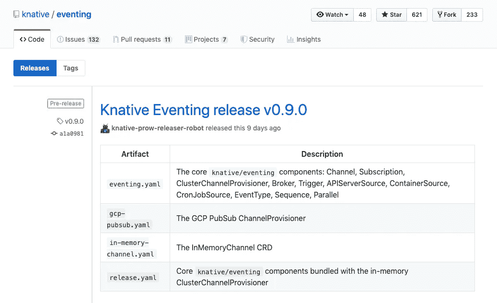

# Knative v0.9.0

> 原文：<https://medium.com/google-cloud/knative-v0-9-0-a6fa0a3b1f7d?source=collection_archive---------1----------------------->

Knative 发展得相当快。大约每 6 周就有一个新版本，每个版本都有重大变化。Knative v0.7.0 完全是关于 Knative 发球的变化([我的帖子](/google-cloud/knative-serving-0-7-96e6d7be463e))。Knative v0.8.0 是关于 Knative Build 的弃用，支持 Tekton 管道([我的帖子](/google-cloud/migrating-from-knative-build-to-tekton-pipelines-68fc6de14373))。

一个多星期前发布了 Knative [Serving v0.9.0](https://github.com/knative/serving/releases/tag/v0.9.0) 和 [Eventing v0.9.0](https://github.com/knative/eventing/releases/tag/v0.9.0) 。在服务方面，有一个**v1 API*和一些关于自动缩放和冷启动的改进。在事件中，读取事件的方式发生了很大的变化。我想在这里概述一下这些变化。*

**

# *ClusterChannelProvisioners CRDs*

*从 v0.8.0 开始，已经从 ClusterChannelProvisioners 转移到 CRDs，这在 v0.9.0 中结束。[发行说明](https://github.com/knative/eventing/releases/tag/v0.9.0)给出了更多细节，但这影响了 Knative 如何设置来传输事件。例如，在 Knative 的以前版本中，为了使用 Google Cloud Pub/Sub 作为事件传输，您需要创建一个带有 *gcp-pubsub* provisioner 的通道，如[文档](https://knative.dev/v0.8-docs/eventing/samples/gcp-pubsub-source/)中所述。*

*在这个版本中，现在有一个具体的 CRD，*channels . pubsub . cloud . run*，由您创建。它包括该传输可用的所有配置参数。这使得查看可用参数和验证它们变得更加容易。*

# *GCP 项目创意*

*与 GCP 合作的 kna tive 是一个新项目，旨在实现轻松配置和消费谷歌云事件。现在，这是在 Knative 中消费 Google Cloud 事件的首选方式。它单独安装在 Knative ( [指令](https://github.com/google/knative-gcp/blob/master/docs/install/README.md))之上，允许读取云存储、云调度程序或云发布/订阅事件。*

# *云发布/订阅订阅*

*在我的 [Knative 教程](https://github.com/meteatamel/knative-tutorial)中，我从 Cloud Pub/Sub 将事件读入 Knative。Knative 与 GCP 项目有多种方式读取发布/订阅消息到 Knative。 [PullSubscription](https://github.com/google/knative-gcp/blob/master/docs/pullsubscription/README.md) 是将云发布/订阅消息直接读入 Knative 的一种方式。*

*这与先前版本的 Knative 略有不同。默认情况下，发布/订阅消息不再包装到 CloudEvents 中，因此您不必担心解开 CloudEvents。由于您不再有 CloudEvents，您也不必担心对 CloudEvents 的数据字段进行 Base64 解码(如果您仍然喜欢旧的行为，有一个 [*模式*](https://github.com/google/knative-gcp/blob/master/config/300-pullsubscription.yaml#L92-L95) 配置，您可以将其设置为 *PushCompatible* ) *。**

*所有这些使得发布/订阅消息的处理比以前更简单。PullSubscription 需要一个来自启用了发布/订阅的服务帐户的密码([指令](https://github.com/google/knative-gcp/tree/master/docs/pubsub))和一个如下所示的 yaml 定义文件:*

```
*apiVersion: pubsub.cloud.run/v1alpha1
kind: PullSubscription
metadata:
  name: my-topic-source
spec:
  topic: my-topic
  sink:
    apiVersion: v1
    kind: Service
    name: event-display*
```

*这将一个发布/订阅主题链接到一个 Kubernetes 服务，但它可以是任何可寻址的内容，如 Knative 服务、通道、代理等。*

*我希望这能提供 Knative 在 v.0.9.0 中的一点变化。我已经更新了我的 [Knative 教程](https://github.com/meteatamel/knative-tutorial)来使用 Knative 0.9.0。 [Hello World Eventing](https://github.com/meteatamel/knative-tutorial/blob/master/docs/08-helloworldeventing.md) 在一个简单的 Kubernetes 服务中完成读取发布/订阅消息所需的所有设置步骤。试试看！*