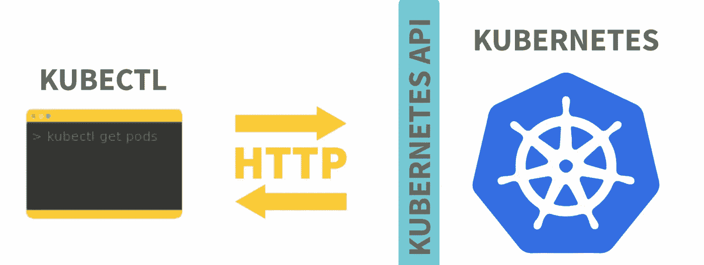
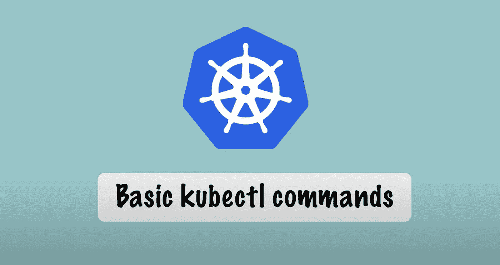

# Kubernetes 命令 101📝📝

> 原文：<https://medium.com/google-cloud/kubectl-commands-101-bbeec4c83e45?source=collection_archive---------0----------------------->

开始 k8s 之旅必须知道的基本 kubectl 命令

## 介绍🚩🚩

各位读者好👋我已经写了一段时间关于 Kubernetes 及其对象的基础知识。在 Kubernetes 的世界里，前方的道路将会更加先进。主题包括从日程安排到网络的概念。

我认为在讨论这些话题之前，我们必须首先了解基本的 Kubernetes 命令。到目前为止，我已经在以前的文章中讨论过其中的一些，但是我认为将它们收集并存放在一个地方是一个好主意:)

***所以在这篇文章中，我们将试着了解一下*** :

*   什么是 kubectl？？
*   基本的 kubectl 命令。
*   管理 Kubernetes 集群的命令式和声明式方法。

> 这将是一篇非常短小精悍的文章。
> 所以不要再拖延了，让我们开始吧:)

## 什么是 kubectl？？🤔🤔



Kubernetes 提供了一个命令行工具，用于使用 Kubernetes API 与 Kubernetes 集群的控制平面进行通信。这个工具被命名为 **kubectl** 。
**Kubectl 命令遵循语法**或通用结构，这使得管理员可以读取和验证在终端窗口中输入的每个 Kubectl 命令。每个 kubectl 调用都有四个重要的参数。

```
kubectl <command> <type> <name> <flags>
```

> **kubectl** 是我们用来查询和管理 Kubernetes 集群的通用 CLI 工具。
> **kubectl** 使用 Kubernetes 的 API 接口来查看、控制和管理集群。它受不同平台的支持，并且可以很容易地设置来管理集群。

## 基本 kubectl 命令🤓🤓



*   **集群管理**

```
**kubectl cluster-info** Display endpoint information regarding the services and master in the cluster**kubectl version**
Show the Kubernetes version functioning on the client and server**kubectl config view**
Get the configuration of the cluster**kubectl api-resources**
Make a list of the available API resources**kubectl api-versions**
Make a list of the available API versions**kubectl get all –all-namespaces**
List everything
```

*   **节点操作**

```
**kubectl get node**
List one or more nodes**kubectl delete node <node_name>**
Delete a node or multiple nodes**kubectl top node**
Display Resource usage (CPU/Memory/Storage) for nodes**kubectl describe nodes | grep Allocated -A 5**
Resource allocation per node**kubectl get pods -o wide | grep <node_name>**
Pods running on a node**kubectl annotate node <node_name>**
Annotate a node**kubectl cordon node <node_name>**
Mark a node as unschedulable**kubectl uncordon node <node_name>**
Mark node as schedulable**kubectl drain node <node_name>**
Drain a node in preparation for maintenance**kubectl label node** Add the labels of one or more nodes
```

*   名称空间[ 短码= ns]

```
**kubectl create namespace <namespace_name>**
Create namespace <name>**kubectl describe namespace <namespace_name>**
Show the detailed condition of one or more namespace**kubectl delete namespace <namespace_name>**
Delete a namespace**kubectl edit namespace <namespace_name>**
Edit and modify the namespace’s definition**kubectl top namespace <namespace_name>**
Display Resource (CPU/Memory/Storage) usage for a namespace
```

*   **部署**

```
**kubectl get deployment**
List one or more deployments**kubectl describe deployment <deployment_name>**
Show the in-depth state of one or more deployments**kubectl edit deployment <deployment_name>**
Edit and revise the definition of one or more deployment on the server**kubectl create deployment <deployment_name>
** Generate one a new deployment**kubectl delete deployment <deployment_name>
** Delete deployments**kubectl rollout status deployment <deployment_name>**
Check the rollout status of a deployment
```

*   **复制控制器[** 短码= rc]

```
**kubectl get rc**
Make a list of the replication controllers**kubectl get rc –namespace=<namespace_name>** 
Make a list of the replication controllers by namespace
```

*   复制集

```
**kubectl get replicasets**
List ReplicaSets**kubectl describe replicasets <replicaset_name>**
Show the detailed state of one or more ReplicaSets**kubectl scale –replicas=[x]**
Scale a ReplicaSet [x is a number here]
```

*   **列表资源**

```
**kubectl get namespaces**
Create a plain-text list of all namespaces**kubectl get pods**
Create a plain-text list of all pods**kubectl get pods -o wide**
Create a comprehensive plain-text list of all pods**kubectl get pods–field-selector=spec. nodeName=[server-name]**
Create a list of all pods functioning on a certain node server**kubectl get replicationcontroller [replication-controller-name]**
In plain text, make a lst a specific replication controller**kubectl get replicationcontroller, services**
Generate a plain-text list of all replication services and controllers
```

*   **日志**

```
**kubectl logs <pod_name>**
Print the logs for a pod**kubectl logs –since=1h <pod_name>**
Print the logs for a pod for the last hour**kubectl logs –tail=20 <pod_name>**
Get the current 20 lines of logs**kubectl logs -f <service_name> [-c <$container>]**
Get logs from a service and choose which container optionally**kubectl logs -f <pod_name>**
Adhere to new logs and print the logs for a pod**kubectl logs -c <container_name> <pod_name>**
For a container in a pod, Print the logs**kubectl logs <pod_name> pod.log**
Output the logs for a pod into a ‘pod.log’ file**kubectl logs –previous <pod_name>**
View the logs for the last failed pod
```

> 在本节的中，我们已经看到了在管理 Kubernetes 集群时使用的最基本的 kubectl 命令**列表。**

## 管理 Kubernetes 集群的不同方式**💭 💭**


照片由[克里斯汀·休姆](https://unsplash.com/@christinhumephoto?utm_source=medium&utm_medium=referral)在 [Unsplash](https://unsplash.com?utm_source=medium&utm_medium=referral) 上拍摄

**命令式方式:** 简单来说，就是一种 ***的方式，我们在其中确切地说出必须做什么和如何做*** 。

***例如*** 如果我们必须在 Kubernetes 集群中创建或删除任何东西，我们使用这些命令并准确地告诉我们想要这样做。

```
kubectl delete deployment/nginxkubectl create service nodeport
```

**陈述方式:**
简单来说，就是一种 ***方式，告诉我们要做什么，而不告诉我们如何*** 。Kubernetes 自己检测它必须做的事情，查看配置文件中的变化。

例如，如果我们必须在 Kubernetes 集群中创建或更新任何东西，我们在集群中创建或更新特定的配置文件，然后 ***在这些配置文件上使用 kubectl apply 命令*** 。

```
create a deployment yaml file [deployment.yaml]kubectl apply -f deployment.yaml
```

在上面的步骤中，我们不告诉什么必须做，而是使用应用命令。Kubernetes 本身会检测“deployment.yaml”文件中所做的更改，并执行它必须做的事情:)

> 希望现在我们已经清楚了管理 Kubernetes 集群的命令式和声明式方法🙈🙈

## 接下来呢？👀 👀


> 非常感谢你来到这里！是本文的结尾。
> 在本文中，我们只是简单介绍了基本的 kubectl 命令。
> 但是无论我们已经介绍了什么，都足以让每个人开始 K8s 之旅，从现在开始，没有人会在理解基本的 Kubernetes 命令方面遇到任何问题。
> 
> 请鼓掌并跟我来🙈如果你喜欢我的作品，并希望在未来更多地阅读我的作品:)

如果你对这篇文章有任何疑问，或者想聊聊天，请随时联系我的社交媒体账号

*推特—*【https://twitter.com/ChindaVibhor】

**LinkedIn—*[*https://www.linkedin.com/in/vibhor-chinda-465927169/*](https://www.linkedin.com/in/vibhor-chinda-465927169/)*

## *我以前写的文章:*

*[](/google-cloud/basics-of-yaml-e5897b8f11a0) [## YAML 基础知识📝📝

### 什么是 YAML？？

medium.com](/google-cloud/basics-of-yaml-e5897b8f11a0) [](/google-cloud/kubernetes-services-part-2-90b2cfa98d21) [## kubernetes 服务公司:第二部分

### Kubernetes 有哪些服务？

medium.com](/google-cloud/kubernetes-services-part-2-90b2cfa98d21) [](/google-cloud/kubernetes-services-️️-part-1-42244ada9990) [## kubernetes 服务公司第一部分

### Kubernetes 有哪些服务？

medium.com](/google-cloud/kubernetes-services-️️-part-1-42244ada9990) 

我仍然会继续发表新的文章，涵盖我正在探索的一系列主题。

那都是乡亲们！！涂鸦:))*