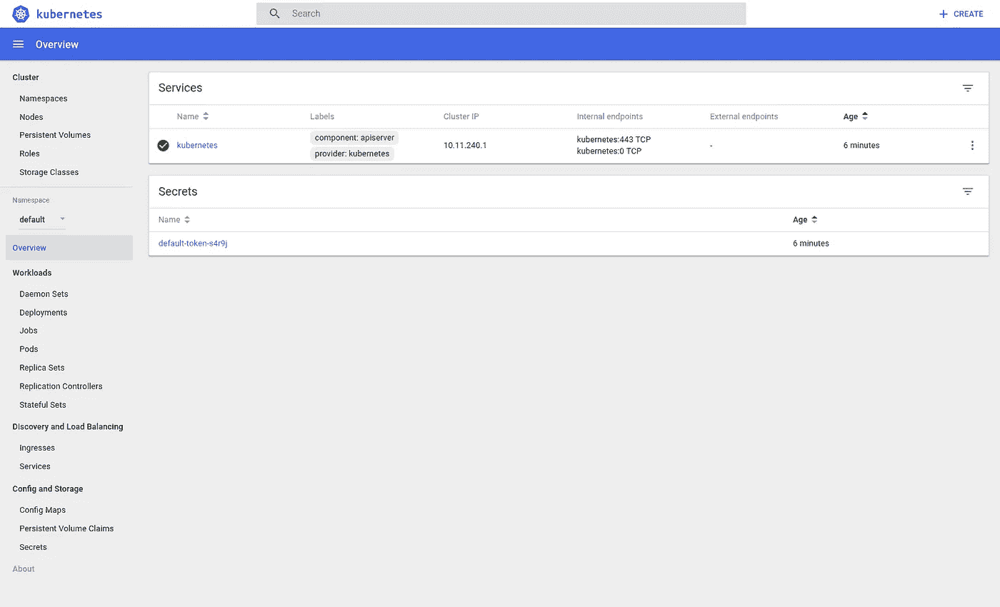
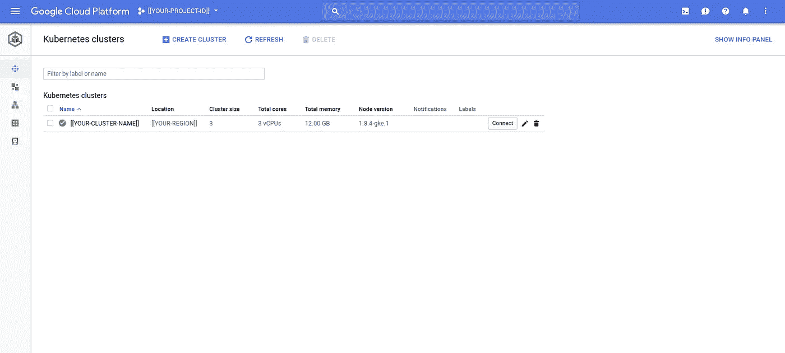
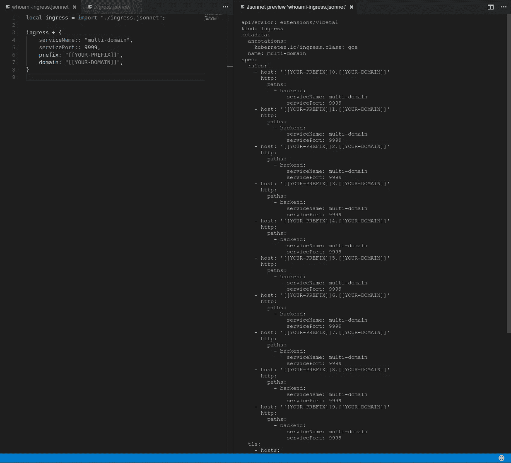
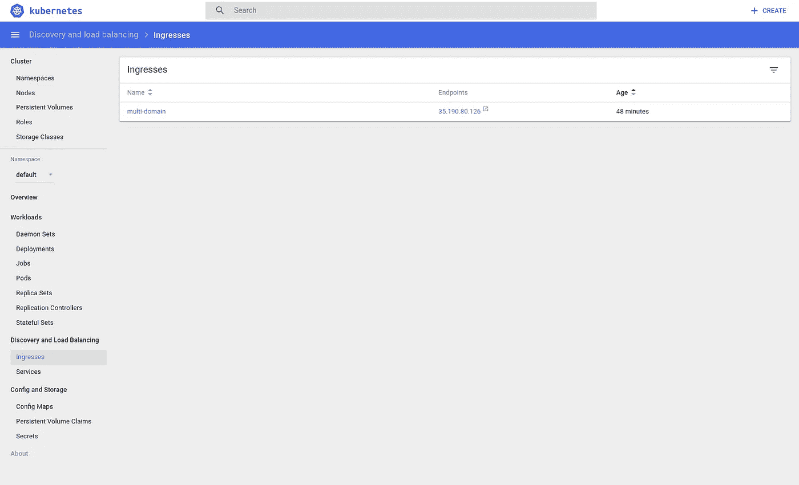
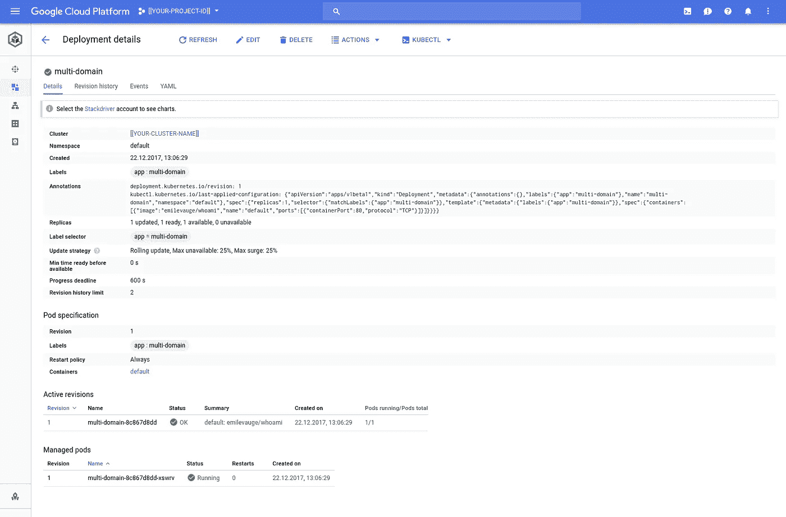
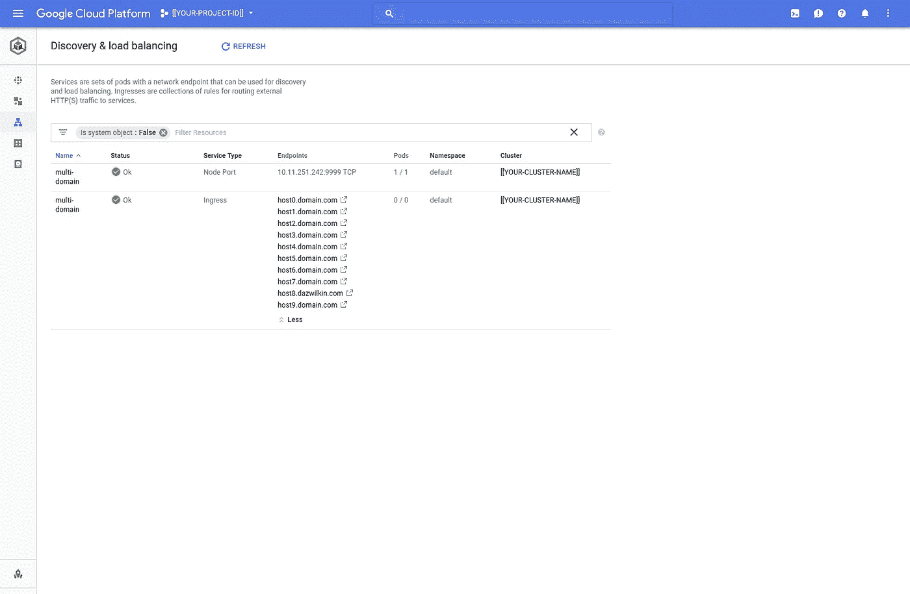

# Kubernetes 10 域入口

> 原文：<https://medium.com/google-cloud/kubernetes-10-domain-ingress-c6c2bbf381bb?source=collection_archive---------0----------------------->

## “因为一个人可以”系列

一个客户有兴趣通过每个客户的 TLS 端点公开其多租户 [Google Kubernetes 引擎](https://cloud.google.com/kubernetes-engine/) (GKE)服务。GCP L7LB 仅支持 [10 certs](https://cloud.google.com/compute/docs/load-balancing/http/#ssl_certificates) (有计划扩展这一功能)，但我决定尝试一下 10，并在途中尝试一些其他东西，包括 [Jsonnet](http://jsonnet.org/) 和[谷歌云 DNS](https://cloud.google.com/dns/) [事务](https://cloud.google.com/dns/records/)。

## 设置

我以前讨论过这个领域的大部分内容，您可能已经知道如何创建 Kubernetes 引擎集群。我将创建一个[区域集群](https://cloud.google.com/kubernetes-engine/docs/concepts/multi-zone-and-regional-clusters#regional)并与 [RBAC](https://kubernetes.io/docs/admin/authorization/rbac/) 发生冲突，如果您对此感兴趣，请继续阅读:

```
export ROOT=$(whoami)-$(date +%y%m%d)
export PROJECT=${ROOT}-multi-domain
export CLUSTER=${ROOT}-cluster-01
export BILLING=[[YOUR-BILLING-ID]]
export REGION=[[YOUR-PREFERRED-REGION] #us-west1gcloud alpha projects create $PROJECTgcloud beta billing projects link $PROJECT \
--billing-account=$BILLINGgcloud services enable container.googleapis.com \
--project=$PROJECT
```

您可以指定主版本和节点版本，但是您需要确定您所在地区的可用版本。你可以看看这里的版本，选择你最喜欢的:

```
gcloud beta container get-server-config \
--project=$PROJECT \
--region=${REGION}
```

然后创建集群:

```
gcloud beta container clusters create $CLUSTER \
--username="" \
--cluster-version=1.8.4-gke.1 \
--machine-type=custom-1-4096 \
--image-type=COS \
--preemptible \
--num-nodes=1 \
--enable-autorepair \
--enable-autoscaling \
--enable-autoupgrade \
--enable-cloud-logging \
--enable-cloud-monitoring \
--min-nodes=1 \
--max-nodes=2 \
--labels=medium=c6c2bbf381bb \
--region=$REGION \
--project=$PROJECT
```

对于 broad(！)RBAC 权限:

```
ACCOUNT=$(gcloud config get-value account)kubectl create clusterrolebinding $(whoami)-cluster-admin-binding --clusterrole=cluster-admin --[user=$](mailto:user=dazwilkin@google.com)ACCOUNTkubectl create clusterrolebinding kube-system-cluster-admin --clusterrole=cluster-admin --serviceaccount=kube-system:defaultkubectl create clusterrolebinding default-cluster-admin --clusterrole=cluster-admin --serviceaccount=default:default
```

最后一点:

```
gcloud beta container clusters get-credentials $CLUSTER \
--project=$PROJECT \
--region=$REGIONkubectl proxy --port=0 &
```

代理命令应该报告

```
Starting to serve on [[SOME-URL]]
```

一切正常后，您就可以打开 Kube UI 了:

```
https://[[SOME-URL]]/ui
```



Kube UI

和/或通过云控制台:

```
http://console.cloud.google.com/[kubernetes/list?project=$](https://pantheon.corp.google.com/kubernetes/list?project=dazwilkin-171222-multi-domain&organizationId=433637338589){PROJECT}
```



云控制台:Kubernetes

## 秘密

让我们为我们计划的入口创建 10 个 TLS 证书。有一种快速生成 TLS 证书并将其作为 Kubernetes 秘密的好方法:

```
PREFIX=[[YOUR-PREFIX]]
DOMAIN=[[YOUR-DOMAIN]]for NUM in {0..9}
do
  NAME=${PREFIX}${NUM}.${DOMAIN}
  openssl req \
  -x509 \
  -nodes \
  -days 365 \
  -newkey rsa:2048 \
  -keyout ${NAME}.key \
  -out ${NAME}.crt \
  -subj "/CN=${NAME}"
done
```

然后(如果你愿意，也可以合并)

```
for NUM in {0..9}
do
  NAME=${PREFIX}${NUM}.${DOMAIN}
  echo "
  apiVersion: v1
  kind: Secret
  metadata:
    name: ${NAME}
  data:
    tls.crt: `base64 --wrap 0 ./${NAME}.crt`
    tls.key: `base64 --wrap 0 ./${NAME}.key`
  " | kubectl apply --filename -
done
```

一切正常，下面应该包括 10 个秘密领域${NUM}。＄{ DOMAIN }和默认令牌:

```
kubectl get secrets --output=name
```

## 部署|服务

使用我的定位测试图像为入口创建基础服务:

```
kubectl run whoami \
--image=emilevauge/whoami \
--replicas=2 \
--port=80kubectl expose deployment/whoami \
--port=9999 \
--target-port=80 \
--type=NodePort
```

我使用 Jsonnet(见下文)重新设计了部署和服务，并将包括下面的内容，但将重点解释入口。

## Jsonnet

Kube UI 是观察 Kubernetes 的优秀工具，云控制台 UI 工具也越来越好。作为一个题外话，有人向我指出(我同意),在 Kubernetes(豆荚、服务、入口)和 GCP 世界之间切换可能会不和谐。我不完全相信云控制台用户界面能解决这个问题。

不管怎样，对于改变 Kubernetes 来说，命令行仍然是最好的工具，尽管 kubectl 提供了许多(经过深思熟虑的)命令来创建部署、服务等。等等。在早期，你只需要抓住配置文件的角，并熟练地制作、理解和应用它们。

有各种各样的努力正在进行中，以避免开发人员编写配置文件。我被迫尝试 Ksonnet，但今天我将坚持使用一个更早、更简单的工具 [Jsonnet](http://jsonnet.org) :

您可以从其 GitHub repo 中获取 Jsonnet，然后“制作”它:

```
git clone [https://github.com/google/jsonnet.git](https://github.com/google/jsonnet.git)
cd jsonnet
make
jsonnet --helpJsonnet commandline interpreter v0.9.5General commandline:
jsonnet [<cmd>] {<option>} { <filename> }
Note: <cmd> defaults to "eval"The eval command:
jsonnet eval {<option>} <filename>
Note: Only one filename is supported
```

我遵循一种模式(感谢 Bitnami[kube-manifests](https://github.com/bitnami/kube-manifests)GitHub repo 提供的指导和最佳实践)，拥有一个实例文件(whoami-ingress.jsonnet)和一个“类”文件(ingress.jsonnet):

whoami-ingress.jsonnet

ingress.jsonnet

请千万不要把这些当成 Jsonnet 里的大师课。我让他们工作，这就是我所能提供的一切；-)whoami-ingress 导入“类”并为必需的参数提供值。如果没有提供这些，就会产生“错误”。

入口文件旨在生成一个入口[规范](https://kubernetes.io/docs/reference/generated/kubernetes-api/v1.9/#ingress-v1beta1-extensions)。参见“种类”和“apiVersion ”,您应该可以识别该模式。Jsonnet 的动机是这个 YAML 有“规则”和“tls”的重复部分(10 个),模板化的两个优点是变量替换(覆盖)和迭代。Jsonnet 的循环与 Python 类似。我用的是:[{ X(N)} for N in[…]。]].两个循环都迭代 0..9，两者都会在数组中生成 10 个 JSON 副本。这两个循环都利用了一个名为“name”的闭包，该闭包将它的单个参数——循环迭代器值(num)——与脚本全局的“prefix”和“domain”值结合起来。

> **NB** closure vs. function 可能有点学术性，但是在这种情况下,“name”是一个函数，它接受一个参数(num ),但是在脚本中对“prefix”和“domain”的全局值进行封闭。所以“名”是一个函数闭包；-)
> 
> **注意**这里前缀“$”表示“前缀”和“域”对于脚本是全局的。

Jsonnet 处理 whoami-ingress.jsonnet 的结果只是一个 ingress 资源。您可以看到生成了以下内容:

```
jsonnet whoami-ingress.jsonnet
{
   "apiVersion": "extensions/v1beta1",
   "kind": "Ingress",
   "metadata": {
      "annotations": {
         "kubernetes.io/ingress.class": "gce"
      },
      "name": "multi-domain"
   },
   ...
}
```

您可以将它直接应用于您的集群:

```
jsonnet whoami-ingress.jsonnet \
| kubectl apply --filename -ingress "multi-domain" unchanged
```

Heptio 的优秀人员为 Jsonnet 提供了一个 Visual Studio 代码插件:

 [## Jsonnet - Visual Studio 市场

### Jsonnet 的 Visual Studio 代码语言支持扩展

marketplace.visualstudio.com](https://marketplace.visualstudio.com/items?itemName=heptio.jsonnet) 

这将预览输出:



heptio Jsonnet:Jsonnet→JSON(YAML)

Kube UI 对入口资源没有太多作用，但是:



Kube UI:入口“多域”

这里是更有趣的云控制台视图:



云控制台:工作负载“多域”

L7 配置为:



云控制台:发现和负载平衡

我挑战任何人找到一个比用 Kubernetes 入口资源更简单的方法来编程 GCP l7。

剩下的工作就是将这些域名添加到我们的 DNS 记录中。

## 云 DNS

如果您使用的是云 DNS，那么使用云 SDK(又名“g Cloud”)编写这些附加功能的脚本就相对简单了。在继续之前，您可能希望获取当前 DNS 区域配置的快照。以防万一:

```
DNS_ZONE=[[YOUR-CLOUD-DNS-ZONE]]gcloud dns record-sets export ${DNS_ZONE}.yaml \
--zone ${DNS_ZONE} \
--project=${PROJECT}
```

我们将使用事务，注意这是通过创建一个 transaction.yaml 脚本来实现的:

```
DNS_ZONE=[[YOUR-CLOUD-DNS-ZONE]]gcloud beta dns record-sets transaction start \
--zone=${DNS_ZONE} \
--project=${PROJECT}Transaction started [transaction.yaml].
```

下面是我运行这个命令时产生的 transaction.yaml:

```
---
additions:
- kind: dns#resourceRecordSet
  name: domain.com.
  rrdatas:
  - ns-cloud-d1.googledomains.com. cloud-dns-hostmaster.google.com. 5 21600 3600 259200
    300
  ttl: 21600
  type: SOA
deletions:
- kind: dns#resourceRecordSet
  name: domain.com.
  rrdatas:
  - ns-cloud-d1.googledomains.com. cloud-dns-hostmaster.google.com. 1 21600 3600 259200
    300
  ttl: 21600
  type: SOA
```

我相信(！？)奇怪的添加和删除看似相同的条目是因为条目确实有细微的不同。在我的案例版本(！？)“4”被删除，而“5”被创建。我会确认这种行为。

现在，我们简单地遍历 10 个主机域，并将它们添加为指向 Ingres 创建的负载平衡器的 IP 的(lias)记录:

```
PREFIX=[[YOUR-PREFIX]]
DOMAIN=[[YOUR-DOMAIN]]LB=$(kubectl get ingress/multi-domain \
--output=jsonpath='{ .status.loadBalancer.ingress[0].ip }')for NUM in {0..9}
do
  gcloud beta dns record-sets transaction add "${LB}" \
  --name=${PREFIX}${NUM}.${DOMAIN} \
  --ttl=300 \
  --type=A \
  --zone=${DNS_ZONE} \
  --project=${PROJECT}
done
```

最后提交更改:

```
gcloud beta dns record-sets transaction execute \
--zone=${DNS_ZONE} \
--project=${PROJECT}
```

并且，您应该能够确认更改已经生效:

```
gcloud beta dns record-sets list \
--zone=${DNS_ZONE} \
--project=${PROJECT} \
| grep "${PREFIX}[0-9].${DOMAIN}"
```

## 试验

您可以使用以下命令确认更改对客户端的 DNS 查找是否有效:

```
for NUM in {0..9}
do
  nslookup ${PREFIX}${NUM}.${DOMAIN} 8.8.8.8
done
```

而且，你应该能够卷曲端点:

```
for NUM in {0..9}
do
  curl --silent --insecure [https://${PREFIX}${NUM}.${DOMAIN}/](https://${PREFIX}${NUM}.${DOMAIN}/) \
  | grep "Host: ${PREFIX}[0-9].${DOMAIN}"
done
```

## 结论

这些入口资源可能是粗糙的，但这里有一个支持 10(你不能得到更多的[今天])域。它的创建得益于一次在 Jsonnet 的奇妙之旅。

谷歌的 SRE 人试图避免“辛劳”，通常你可以通过自动化来避免辛劳。有时候为了自动化，你必须学习新的工具。Jsonnet 非常强大，我相信，如果我继续使用它，我会灵活运用我的知识，它将成为我的工具集的一个有用的补充。

云 DNS 很棒。它并不总是最容易编程的。但是，如你所见，情况正在好转。

## 整理

您应该恢复您的 DNS 记录:

```
gcloud beta dns record-sets transaction start \
--zone=${DNS_ZONE} \
--project=${PROJECT}for NUM in {0..9}
do
  gcloud beta dns record-sets transaction remove "${LB}" \
  --name=${PREFIX}${NUM}.${DOMAIN} \
  --ttl=300 \
  --type=A \
  --zone=${DNS_ZONE} \
  --project=${PROJECT}
donegcloud beta dns record-sets transaction execute \
--zone=${DNS_ZONE} \
--project=${PROJECT}
```

运行我们之前的测试应该返回零:

```
gcloud beta dns record-sets list \
--zone=${DNS_ZONE} \
--project=${PROJECT} \
| grep "${PREFIX}[0-9].${DOMAIN}"
```

如果出现任何问题，你听从了我的建议，做了备份，所以你可以恢复它。

我为每个任务创建集群，并经常删除它们:

```
gcloud beta container clusters delete $CLUSTER \
--project=$PROJECT \
--region=$REGION \
--quiet
```

但是，如果你想整理，你可以删除我们创造的所有美好的东西:

```
kubectl delete ingress/multi-domainfor NUM in {0..9}
do
  kubectl delete secret/${PREFIX}${NUM}.${DOMAIN}
donekubectl delete service/multi-domain
kubectl delete deployment/multi-domain
```

如果您想要(不可撤销地)删除 GCP 项目(这是不可撤销的)，您可以:

```
gcloud projects delete ${RPOJECT} --quiet
```

那都是乡亲们！