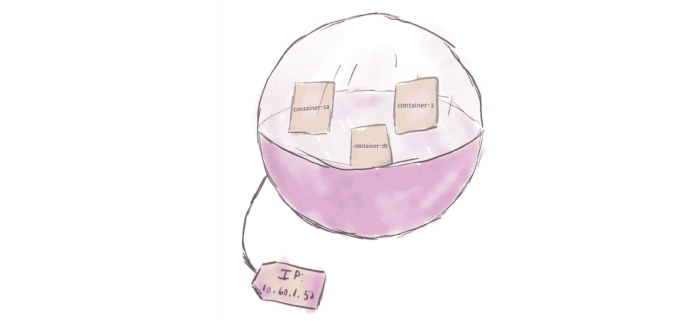
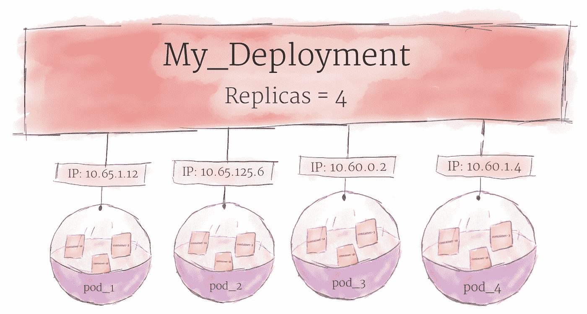

# kubernetes 101:pod、节点、容器和集群

> 原文：<https://medium.com/google-cloud/kubernetes-101-pods-nodes-containers-and-clusters-c1509e409e16?source=collection_archive---------0----------------------->

Kubernetes 正迅速成为在云中部署和管理软件的新标准。然而，在 Kubernetes 提供的所有功能之外，还有一个陡峭的学习曲线。作为一名新人，试图解析官方文档可能会让人不知所措。系统由许多不同的部分组成，很难区分哪些部分与您的用例相关。这篇博客文章将提供 Kubernetes 的一个简化视图，但是它将试图给出最重要的组件以及它们如何组合在一起的高层次概述。

首先，让我们看看硬件是如何表示的

# 五金器具

## 节点

一个[节点](https://kubernetes.io/docs/concepts/architecture/nodes/)是 Kubernetes 中计算硬件的最小单位。它代表了集群中的一台机器。在大多数生产系统中，一个节点可能是数据中心的物理机，或者是托管在云提供商如[谷歌云平台](https://cloud.google.com/)上的虚拟机。然而，不要让习俗限制你；理论上，你可以用[几乎](https://twitter.com/jkrippy/status/932800484703862784) [任何东西](https://blog.hypriot.com/post/setup-kubernetes-raspberry-pi-cluster/)做一个节点。

将机器视为“节点”允许我们插入一个抽象层。现在，我们不用担心任何单个机器的独特特征，而是可以简单地将每台机器视为一组可以利用的 CPU 和 RAM 资源。这样，任何机器都可以替代 Kubernetes 集群中的任何其他机器。

## 集群

尽管使用单个节点可能有用，但这不是 Kubernetes 的方式。通常，您应该将集群作为一个整体来考虑，而不是担心单个节点的状态。

在 Kubernetes 中，节点将它们的资源汇集在一起，形成一个更强大的机器。当您将程序部署到集群上时，它会智能地将工作分配给各个节点。如果添加或删除了任何节点，集群将根据需要改变工作。对于程序或程序员来说，实际上是哪台机器在运行代码并不重要。

如果这种类似 hivemind 的系统让你想起《星际迷航》中的博格人，你并不孤单；“博格”是 Kubernetes 基于的谷歌内部项目[的名字。](http://blog.kubernetes.io/2015/04/borg-predecessor-to-kubernetes.html)

## 持久卷

因为在集群上运行的程序不能保证在特定的节点上运行，所以数据不能保存到文件系统中的任意位置。如果一个程序试图将数据保存到一个文件中以备后用，但随后被重新定位到一个新的节点上，那么该文件将不再位于程序所期望的位置。因此，与每个节点相关联的传统本地存储被视为保存程序的临时缓存，但是不能期望本地保存的任何数据会持久。

为了永久存储数据，Kubernetes 使用了[持久卷](https://kubernetes.io/docs/concepts/storage/persistent-volumes/)。虽然所有节点的 CPU 和 RAM 资源都由群集有效地汇集和管理，但持久性文件存储却不是。相反，本地或云驱动器可以作为永久卷附加到集群。这可以被认为是将外部硬盘插入集群。永久卷提供了一个可以挂载到集群的文件系统，无需与任何特定的节点相关联。

# 软件

## 容器

运行在 Kubernetes 上的程序被打包成 Linux 容器。容器是一个被广泛接受的标准，因此已经有许多[预构建的映像](https://hub.docker.com/explore/)可以部署在 Kubernetes 上。

容器化允许您创建自包含的 Linux 执行环境。任何程序及其所有依赖项都可以打包成一个文件，然后在互联网上共享。任何人都可以下载容器并将其部署到他们的基础设施上，只需要很少的设置。创建容器可以通过编程来完成，从而允许形成强大的 CI 和 CD 管道。

可以将多个程序添加到一个容器中，但是如果可能的话，应该限制每个容器只能有一个进程。最好有许多小容器，而不是一个大容器。如果每个容器都有一个紧密的焦点，更新就更容易部署，问题也更容易诊断。

## 分离舱

与您过去可能用过的其他系统不同，Kubernetes 不直接运行容器；相反，它将一个或多个容器包装到一个更高级的结构中，称为 [pod](https://kubernetes.io/docs/concepts/workloads/pods/pod/) 。同一 pod 中的任何容器将共享相同的资源和本地网络。容器可以很容易地与同一个 pod 中的其他容器通信，就像它们在同一台机器上一样，同时保持与其他容器的一定程度的隔离。

豆荚被用作 Kubernetes 的复制单位。如果您的应用程序变得太受欢迎，单个 pod 实例无法承担负载，Kubernetes 可以配置为在必要时将 pod 的新副本部署到集群。即使在没有重负载的情况下，标准做法是在生产系统中随时运行一个 pod 的多个副本，以实现负载平衡和故障抵抗。

豆荚可以容纳多个容器，但你应该尽可能限制自己。因为单元是作为一个单元向上和向下扩展的，所以单元中的所有容器必须一起扩展，而不管它们各自的需求。这导致浪费资源和昂贵的账单。为了解决这个问题，pod 应该保持尽可能小，通常只包含一个主进程及其紧密耦合的助手容器(这些助手容器通常被称为“侧车”)。

## 部署

尽管 pods 是 Kubernetes 中的基本计算单元，但它们通常不会直接在集群上启动。相反，pod 通常由另一个抽象层管理:T2 部署 T3。

部署的主要目的是声明一次应该运行多少个 pod 副本。当一个部署被添加到集群中时，它将自动启动所请求数量的 pod，然后监视它们。如果一个 pod 失效，部署将自动重新创建它。

使用部署，您不必手动处理 pod。您只需声明系统的期望状态，它将自动为您管理。

## 进入

使用上述概念，您可以创建一个节点集群，并在集群上启动 pod 部署。然而，还有最后一个问题需要解决:允许外部流量进入您的应用程序。

默认情况下，Kubernetes 提供了 pod 与外界的隔离。如果您想与 pod 中运行的服务进行通信，您必须打开一个通信通道。这被称为入口。

有多种方法可以向集群添加入口。最常见的方法是添加一个[入口](https://kubernetes.io/docs/concepts/services-networking/ingress/)控制器，或者一个[负载平衡器](https://kubernetes.io/docs/tasks/access-application-cluster/create-external-load-balancer/)。这两个选项之间的确切权衡超出了本文的范围，但是您必须意识到，在使用 Kubernetes 进行实验之前，您需要处理入口问题。

## 下一步是什么

上面描述的是 Kubernetes 的一个过于简化的版本，但是它应该给你开始实验所需要的基础知识。既然您已经了解了组成系统的各个部分，那么是时候使用它们来部署真正的应用程序了。查看 [Kubernetes 110:您的第一次部署](/@sanche/kubernetes-110-your-first-deployment-bf123c1d3f8)开始。

为了在本地试验 Kubernetes， [Minikube](https://kubernetes.io/docs/getting-started-guides/minikube/) 将在您的个人硬件上创建一个虚拟集群。如果你准备尝试云服务， [Google Kubernetes Engine](https://cloud.google.com/kubernetes-engine/) 有一系列[教程](https://cloud.google.com/kubernetes-engine/docs/tutorials/)帮助你入门。

如果你是容器和网络基础设施的新手，我建议你阅读一下 [12 因素应用方法论](https://12factor.net/)。本文描述了在 Kubernetes 这样的环境中设计软件时需要记住的一些最佳实践。

最后，更多类似的内容，请务必在 Medium 和 Twitter (@DanSanche21)上关注我。