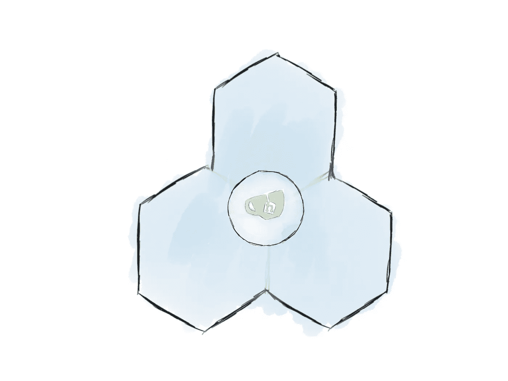

# Kubernetes 110:您的首次部署

> 原文：<https://medium.com/google-cloud/kubernetes-110-your-first-deployment-bf123c1d3f8?source=collection_archive---------0----------------------->

如果你已经[读过我对 Kubernetes](/google-cloud/kubernetes-101-pods-nodes-containers-and-clusters-c1509e409e16) 的介绍，你应该对构成 Kubernetes 的基本部分有很好的基础理解。然而，如果你和我一样，你不会完全理解一个概念，除非你亲自动手。本文是将服务实际部署到云的过程的系列文章中的第一篇。具体来说，本教程将介绍如何使用 Google Kubernetes 引擎部署 Gitea，一个开源的 git 托管服务。


Gitea 没有什么特别的地方，但是通过将一个任意的开源应用程序部署到云的过程将会给我们一些使用 Kubernetes 的实际操作经验。另外，最后你会得到一个很棒的自托管服务，你可以用它来托管你未来的项目！

# 设置集群

## kubectl 和 gcloud

设置 Kubernetes 环境时使用的最重要的工具是 *kubectl* 命令。这个命令允许您与 Kubernetes API 进行交互。它用于创建、更新和删除 Kubernetes 资源，如 pod、部署和负载平衡器。

然而，有一个问题: *kubectl* 不能用于直接供应运行您的 pod 的节点或集群。这是因为 Kubernetes 的设计是平台不可知的。Kubernetes 不知道也不关心它在哪里运行，所以它没有内置的方式来与您选择的云提供商通信，以代表您租用节点。因为我们在本教程中使用 Google Kubernetes 引擎，所以我们需要使用 *gcloud* 命令来完成这些任务。

简而言之， *gcloud* 用于提供 [my Kubernetes 101 post](/google-cloud/kubernetes-101-pods-nodes-containers-and-clusters-c1509e409e16) 上“硬件”下列出的资源， *kubectl* 用于管理“软件”下列出的资源

本教程假设您的系统上已经安装了 *kubectl* 和 *gcloud* 。如果你是全新开始，你首先会想检查一下[谷歌 Kubernetes 引擎快速启动](https://cloud.google.com/kubernetes-engine/docs/quickstart)的第一部分，注册一个 GCP 账户，建立一个项目，启用计费，并安装命令行工具。

一旦您的环境准备就绪，您就可以通过运行以下命令来创建集群:

```
# create the cluster
# by default, 3 standard nodes are created for our cluster
gcloud container clusters create my-cluster --zone us-west1-a# get the credentials so we can manage it locally through kubectl
# creating a cluster can take a few minutes to complete
gcloud container clusters get-credentials my-cluster \
     --zone us-west1-a
```


我们现在有一个由三个 n1-standard1 节点组成的调配集群

除了 *gcloud* 命令，你还可以通过谷歌云控制台页面管理你的资源。运行前面的命令后，您应该看到您的集群出现在 GKE 部分下的[。您还应该在 GCE 部分](https://console.cloud.google.com/kubernetes)下看到一个配置为您的节点[的虚拟机列表。请注意，虽然 GCE UI 允许您从该页面删除虚拟机，但它们是由集群管理的，当集群发现它们丢失时，会重新创建它们。当您完成本教程并希望永久删除虚拟机时，您可以通过删除群集本身来一次删除所有内容。](https://console.cloud.google.com/compute)


# 部署应用程序

## YAML:声明式基础设施

既然我们的集群已经上线，是时候让它发挥作用了。向 Kubernetes 添加资源有两种方式:通过命令行使用`kubectl add`进行交互，以及通过在 [YAML](https://docs.ansible.com/ansible/latest/YAMLSyntax.html) 文件 [](#34aa) 中定义资源进行声明。

虽然使用`kubectl add`的交互式部署对于实验来说很棒，但是当你想要构建可维护的东西时，YAML 是一个不错的选择。通过将所有的 Kubernetes 资源写入 YAML 文件，可以将集群的整个状态记录在一组易于维护的文件中，这些文件可以像系统的其他部分一样进行版本控制和管理。这样，托管服务所需的所有指令都可以与代码一起保存。

## 添加 Pod

为了展示 Kubernetes YAML 文件的基本示例，让我们向集群添加一个 pod。创建一个名为 gitea.yaml 的新文件，并用以下文本填充它:

这个豆荚是相当基本的。第 2 行声明我们正在创建的资源类型是一个 pod 第 1 行说这个资源是在 Kubernetes API 的 v1 中定义的。第 3–8 行描述了我们的 pod 的属性。在这种情况下，pod 的原始名称是“gitea-pod”，它包含一个我们称之为“gitea-container”的容器。

第 8 行是最有趣的部分。这一行定义了我们想要运行的容器图像；在这种情况下，图像在 *gitea/gitea* 存储库中标记为 1.4。Kubernetes 将告诉内置的容器运行时找到所请求的容器映像，并将其下拉到 pod 中。因为默认的容器运行时是 Docker，所以它会找到托管在 Dockerhub 上的 gitea 存储库，并下拉请求的映像。

现在我们已经写出了 YAML，我们将它应用到我们的集群:

```
kubectl apply -f gitea.yaml
```

这个命令将导致 Kubernetes 读取我们的 YAML 文件，并相应地更新集群中的任何资源。要查看新创建的 pod 的运行情况，您可以运行`kubectl get pods`。你应该看到吊舱在运行。

```
$ kubectl get podsNAME        READY     STATUS    RESTARTS   AGE
gitea-pod   1/1       Running   0          9m
```



Gitea 现在在集群的一个 pod 中运行

如果需要更多信息，可以使用以下命令查看容器的标准输出:

```
$ kubectl logs -f gitea-podGenerating /data/ssh/ssh_host_ed25519_key...
Feb 13 21:22:00 syslogd started: BusyBox v1.27.2
Generating /data/ssh/ssh_host_rsa_key...
Generating /data/ssh/ssh_host_dsa_key...
Generating /data/ssh/ssh_host_ecdsa_key...
/etc/ssh/sshd_config line 32: Deprecated option UsePrivilegeSeparation
Feb 13 21:22:01 sshd[12]: Server listening on :: port 22.
Feb 13 21:22:01 sshd[12]: Server listening on 0.0.0.0 port 22.
2018/02/13 21:22:01 [T] AppPath: /app/gitea/gitea
2018/02/13 21:22:01 [T] AppWorkPath: /app/gitea
2018/02/13 21:22:01 [T] Custom path: /data/gitea
2018/02/13 21:22:01 [T] Log path: /data/gitea/log
2018/02/13 21:22:01 [I] Gitea v1.4.0+rc1-1-gf61ef28 built with: bindata, sqlite
2018/02/13 21:22:01 [I] Log Mode: Console(Info)
2018/02/13 21:22:01 [I] XORM Log Mode: Console(Info)
2018/02/13 21:22:01 [I] Cache Service Enabled
2018/02/13 21:22:01 [I] Session Service Enabled
2018/02/13 21:22:01 [I] SQLite3 Supported
2018/02/13 21:22:01 [I] Run Mode: Development
2018/02/13 21:22:01 Serving [::]:3000 with pid 14
2018/02/13 21:22:01 [I] Listen: [http://0.0.0.0:3000](http://0.0.0.0:3000)
```

如您所见，现在有一个服务器在我们集群的容器内运行！不幸的是，我们将无法访问它，直到我们开始开放入口通道(在未来的帖子中)。

## 部署

正如在 [Kubernetes 101](/google-cloud/kubernetes-101-pods-nodes-containers-and-clusters-c1509e409e16) 中所解释的，pod 通常不会直接在 Kubernetes 中运行。相反，我们应该定义一个部署来管理我们的 pod。

首先，让我们删除已经运行的 pod:

```
kubectl delete -f gitea.yaml
```

该命令从集群中删除 YAML 文件中定义的所有资源。我们现在可以修改我们的 YAML 文件，如下所示:

这个看起来比我们之前做的豆荚要复杂一点。这是因为我们在这里实际上定义了两个不同的对象:部署本身(第 1–9 行)，以及它所管理的 pod 的模板(第 10–17 行)。

6 号线是我们部署中最重要的部分。它定义了我们想要运行的 pod 的副本数量。在这个例子中，我们只请求一个副本，因为 Gitea 在设计时没有考虑到多个 pod。[](#7bb9)

这里还引入了另一个新概念:[标签和选择器](https://kubernetes.io/docs/concepts/overview/working-with-objects/labels/)。标签只是用户定义的与 Kubernetes 资源相关的键值存储。选择器用于检索匹配给定标签查询的资源。在这个例子中，第 13 行将标签“app=gitea”分配给这个部署创建的所有 pod。现在，如果部署需要检索它创建的所有 pod 的列表(例如，确保它们都是健康的)，它将使用在第 8–9 行定义的选择器。通过这种方式，部署可以通过搜索那些被分配了“app=gitea”标签的单元来跟踪它所管理的单元。

在大多数情况下，标签是用户定义的。在上面的例子中，“app”对 Kubernetes 来说并没有什么特别的意义，它只是一种我们可能会发现对组织我们的系统有用的方式。话虽如此，但 Kubernetes 会自动应用某些[标签，其中包含有关系统的信息。](https://kubernetes.io/docs/reference/labels-annotations-taints/)

既然我们已经创建了新的 YAML 文件，我们可以将其重新应用到我们的群集:

```
kubectl apply -f gitea.yaml
```


现在，我们的 pod 由一个部署来管理

现在，如果我们运行`kubectl get pods`,我们现在可以运行我们的新 pod，正如我们的部署中所指定的:

```
$ kubectl get podsNAME                               READY     STATUS     RESTARTS
gitea-deployment-8944989b8-5kmn2   0/1       Running    0 
```

我们可以看到关于部署本身的信息:

```
$ kubectl get deploymentsNAME               DESIRED   CURRENT   UP-TO-DATE   AVAILABLE   AGE
gitea-deployment   1         1         1            1           4m
```

为了测试以确保一切正常，尝试用`kubectl delete pod <pod_name>`删除 pod。你应该很快看到一个新的弹出回到它的位置。这就是部署的魔力！

你可能已经注意到新的 pod 有一个奇怪的，部分随机生成的名字。这是因为 pod 现在是由部署批量创建的，并且是短暂的。当包裹在部署中，豆荚应该被[认为是牛而不是宠物。](http://cloudscaling.com/blog/cloud-computing/the-history-of-pets-vs-cattle/)

## 下一步是什么

我们现在有 Gitea 软件在我们的集群中运行，但是在我们可以通过 web 浏览器与它交互之前，我们还有一段路要走。这个系列的下一篇文章[在这里](/@sanche/kubernetes-120-networking-basics-3b903f13093a)，讲述了 Kubernetes 的基本网络特性。本系列的后续文章将讨论持久存储、环境变量等等。请务必在 Medium 和 [Twitter (@DanSanche21)](https://twitter.com/DanSanche21) 上关注我，以便在新文章发布时获得通知。

脚注

1.  ^ JSON 也可以，但是 YAML 是标准的

2. [^](#450a) Gitea 被设计成在一台服务器上本地运行。它假设它运行在一台机器上，可以在没有冲突的情况下读写文件到它的目录中。如果我们创建 Gitea pod 的多个副本，并试图让它们访问相同的数据，这些副本将不知道如何协调读取和写入，这可能会导致问题。因为 Gitea 的设计不能正确地协调多个 pod，所以在集群中拥有多个副本是没有意义的。