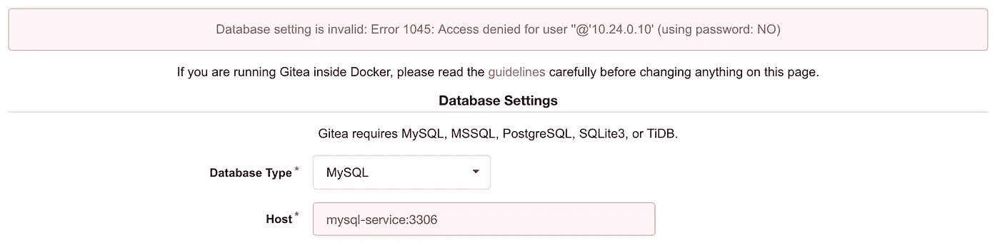

# Kubernetes 120:网络基础

> 原文：<https://medium.com/google-cloud/kubernetes-120-networking-basics-3b903f13093a?source=collection_archive---------0----------------------->

如果您已经阅读了本系列的前一篇文章[，](/google-cloud/kubernetes-110-your-first-deployment-bf123c1d3f8),那么您现在应该已经有一个 Gitea 部署在您的集群上成功运行了。下一步是通过网络浏览器访问它。这篇文章将介绍一些基本的 Kubernetes 网络主题，并在这个过程中，使我们的 Gitea 容器可以通过公共互联网访问

## 开放集装箱港口

默认情况下，pod 基本上是与外界隔离的。为了将流量路由到我们的应用程序，我们需要打开我们计划用于容器的一组端口。

我们的 Gitea 容器中的软件被设计成在端口 3000 上监听 HTTP 请求，在端口 22 上监听 SSH 连接(到克隆存储库)。让我们通过 YAML 文件打开容器中的这些端口:

将更新的文件应用到群集:

```
$ kubectl apply -f gitea.yaml
```

现在，我们应该能够运行`kubectl describe deployment`来查看部署摘要中列出的新开放的端口。我们的 pod 应该打开端口 3000 和 22 进行连接。

```
$ kubectl describe deployment | grep Ports
    Ports:        3000/TCP, 22/TCP
```


端口 3000 和 22 现在在容器本身上是开放的，但是还没有暴露给开放的互联网

## 使用端口转发进行调试

我们的容器上的端口现在应该是开放的，但是我们仍然需要一种方法来与集群中的 pod 通信。出于调试目的，我们可以使用`kubectl port-forward`连接到我们的 pod

```
# grab the name of your active pod
$ PODNAME=$(kubectl get pods --output=template \
     --template="{{with index .items 0}}{{.metadata.name}}{{end}}")# open a port-forward session to the pod
$ kubectl port-forward $PODNAME 3000:3000
```

现在，`kubectl`会将本地机器上 3000 端口上的所有连接转发到云中运行的 pod。如果您在 web 浏览器中打开 [http://localhost:3000](http://localhost:3000) ，您应该能够与服务器进行交互，就像它在本地运行一样。


*"kubectl port-forward"* 在单个 pod 和您的本地主机之间创建一个临时的直接连接


连接到 [http://localhost:3000](http://localhost:3000) 应该会显示 Gitea 注册页面

## 创建外部负载平衡器

现在我们知道我们的 pod 正在工作，让它可以访问公共互联网。为此，我们需要添加一个新的 Kubernetes 资源，它将提供一个公共的公共 IP 地址，并将传入的请求路由到我们的 pod。这可以通过使用一个叫做服务的 Kubernetes 资源来实现。我们可以使用[几种不同类型的服务](/google-cloud/kubernetes-nodeport-vs-loadbalancer-vs-ingress-when-should-i-use-what-922f010849e0)，但是对于我们的用例，我们将使用负载平衡器。[](#7ab2)

与部署一样，该服务使用选择器(第 29–30 行)。这个选择器告诉负载平衡器将流量路由到哪个 pods。当负载平衡器收到请求时，它会智能地将负载分配给所有与选择器匹配的 pods。在我们的例子中，负载平衡很容易，因为我们只有一个 pod。

第 31–39 行定义了负载平衡器管理的端口。除了唯一的名称和协议类型(TCP/UDP)之外，您还必须定义“端口”和“目标端口”。这两个字段定义了从外部 IP 上的端口(port)到容器使用的端口(targetPort)的映射。 [](#6a2a) 在第 33 行和第 34 行，我们说负载均衡器将监听端口 80(您的 web 浏览器用来查看网站的默认端口)上的请求，并将请求传递到我们的 pod 上的端口 3000。

同样，我们需要将我们的更新应用到集群

```
$ kubectl apply -f gitea.yaml
```

在等待几分钟传播您的更改后，检查您的服务

```
$ kubectl get serviceNAME            TYPE           CLUSTER-IP     EXTERNAL_IP    AGE
gitea-service   LoadBalancer   10.27.240.34   35.192.x.x     2m
```

几分钟后，您应该会看到一个外部 IP 自动添加到您的服务中。将此 IP 输入您的 web 浏览器，您就可以与 pod 托管的 web 服务器进行交互。


新的负载平衡器公开了一个外部 IP 地址。端口 80 上的传入请求将被路由到 Gitea pod 上的端口 3000。Gitea 注册页面现在应该可以通过开放的互联网访问了。

## Pod 间通信:集群 IP 服务

如果你试着浏览一下 Gitea 注册页面，你会发现还缺少一些东西:Gitea 需要一个数据库来运行。为了解决这个问题，我们可以在 Gitea pod 中添加一个 MySQL 容器作为[侧车](https://www.voxxed.com/2015/01/use-container-sidecar-microservices/)，或者我们可以单独为 MySQL 创建一个新的 pod。 [](#b5ad) 这两种方法可能各有利弊，取决于你的需求。出于本教程的目的，我们将创建一个新的 pod。

让我们启动一个名为 *mysql.yaml* 的新 YAML 文件来管理数据库:

这其中的大部分应该看起来很熟悉。我们再次声明一个部署来管理我们的单个 pod，并且我们通过一个服务来管理网络连接。在这种情况下，服务的类型是“cluster IP”；这仅仅意味着 IP 仅在集群内部公开，而不是像我们为 Gitea 服务所做的那样通过负载平衡器对外公开。

将这个新的 YAML 文件应用到集群

```
$ kubectl apply -f mysql.yaml
```

现在，您应该看到一个新的 pod、部署和服务添加到了您的集群中

```
$ kubectl get pods
NAME        READY     STATUS    RESTARTS   AGE
gitea-pod   1/1       Running   0          9m
mysql-pod   1/1       Running   0          9s$ kubectl get deployments
NAME               DESIRED   CURRENT   UP-TO-DATE   AVAILABLE   AGE
gitea-deployment   1         1         1            1           11m
mysql-deployment   1         1         1            1           5m$ kubectl get services
NAME            TYPE           CLUSTER-IP     EXTERNAL_IP    AGE
gitea-service   LoadBalancer   10.27.240.34   35.192.x.x  2m
mysql-service   ClusterIP      10.27.254.69   <none>         6m
```


MySQL 现在被部署为集群中的一个独立单元。它的 ClusterIP 服务可以由集群中的 Gitea pod 访问，但是它不会在公共互联网上公开

ClusterIP 服务将自动为我们生成一个内部 IP 地址，在控制台输出中列为“CLUSTER-IP”。集群中的任何容器都可以使用这个地址访问我们的 MySQL pod。然而，直接使用这些内部 IP 地址是一种不好的做法。相反，Kubernetes 有一个更简单的方法来访问我们的新服务:我们可以简单地在地址栏中输入“mysql-service”。这是因为一个名为[“kube-dns”](https://kubernetes.io/docs/concepts/services-networking/dns-pod-service/)的内置 pod，它管理所有服务的内部 DNS 解析。 [⁴](#c3e8) 通过这种方式，您可以忽略短暂的内部 IP 地址，而是使用静态的、人类可读的服务名。

要允许 Gitea 与 MySQL pod 通信，只需在 web UI 的“host”字段中写入服务的名称和端口。如果一切正常，您应该会看到一个“拒绝访问”错误。这意味着我们的 pod 可以成功通信，但它们需要更多配置才能成功认证。敬请关注下一篇文章，了解如何做到这一点。



## 下一步是什么

这篇文章介绍了 Kubernetes 网络的一些基础知识，包括容器端口、端口转发、负载平衡器和集群 IP 服务，以及 kube-dns。当然，网络是一个巨大的话题，所以还有很多没有说。如果你想了解 Kubernetes 中网络是如何实现的，可以看看[这个系列](/google-cloud/understanding-kubernetes-networking-pods-7117dd28727)。如果您对控制哪些 pods 可以在您的集群中通信感兴趣，您应该研究一下[网络策略。](https://github.com/ahmetb/kubernetes-network-policy-recipes)如果你想更好地控制服务之间的通信方式，可以考虑像 [Istio](https://istio.io/) 这样的服务网状产品。

一如既往，在 Medium 和 [Twitter (@DanSanche21)](https://twitter.com/DanSanche21) 上关注我，以便在有新文章发布时收到通知。

脚注

1.  [^](#fec2) 负载平衡器在像 GCP 这样的云服务上工作得很好，但是如果你在 [Docker](https://blog.docker.com/2018/01/docker-mac-kubernetes/) 或 [Minikube](https://kubernetes.io/docs/setup/minikube/) 上运行本地集群，你可能需要使用[节点端口服务](https://kubernetes.io/docs/concepts/services-networking/service/#nodeport)来代替
2.  [^](#8ce7) 面向外部的端口可以设置为任何值，但是请记住，如果您想使用非标准的方式访问，可能需要在 GKE 上设置[防火墙规则](https://cloud.google.com/vpc/docs/firewalls)
3.  [^](#5622) 这里使用了 MySQL，因为这是 Gitea 的设计初衷。MySQL 是一个遗留服务，它并没有考虑到 Kubernetes。如果您正在从头开始设计应用程序，可能有其他存储解决方案会更适合您。
4.  ^管理着许多像这样的隐藏单元和服务。要查看它们，运行`kubectl get pods --namespace=kube-system`