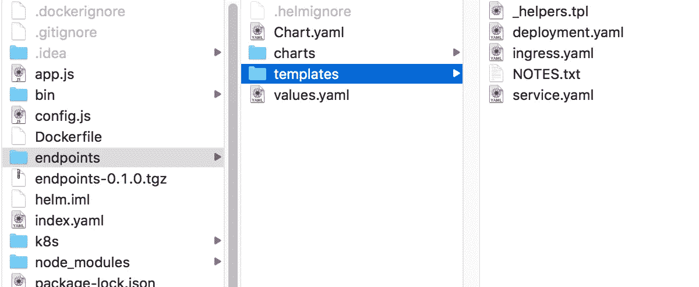
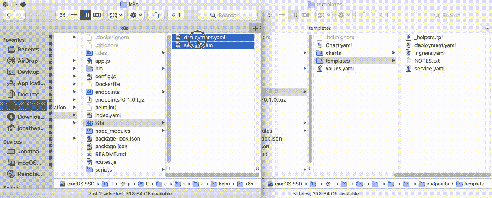

# Kubernetes 和头盔:创建自己的头盔图

> 原文：<https://medium.com/google-cloud/kubernetes-and-helm-create-your-own-helm-chart-5f54aed894c2?source=collection_archive---------0----------------------->

你脑子里有过技术障碍吗？只是有些技术你的大脑不想让你理解？我在创建自己的舵图时就有这种感觉。在创建我自己的舵轮图之前，我已经制作了许多 Kubernetes YAML 文件来描述我自己的 Kubernetes 集群。此外，我一直在使用 Helm 将其他 Helm 图表合并到我的 Kubernetes 集群中。


伊恩·基夫在 [Unsplash](https://unsplash.com?utm_source=medium&utm_medium=referral) 上发表的“在湖上航行的游艇上的绳索和帆”

然而，不管出于什么原因，我就是无法在脑海中拼凑出自己的舵轮图。然后，就像大多数事情是如何完成的一样，我决定就这么做。几分钟后，我有了一个工作舵图表。真的，只花了几分钟。这很容易。精神障碍消失了，我能够开始创建左右舵图表。你也可以。在本文中，我们将了解如何为您的 Kubernetes 集群创建自己的掌舵图。

*如果你没有通读甚至没有读过本系列* *的第一部分* [*，你可能会感到困惑，对代码在哪里或者之前做了什么有疑问。记住这里假设你正在使用*](/@jonbcampos/kubernetes-day-one-30a80b5dcb29)[*GCP*](https://cloud.google.com/)*和*[*GKE*](https://cloud.google.com/kubernetes-engine/)*。我将始终提供代码和如何测试代码是按预期工作。*

[](/google-cloud/kubernetes-day-one-30a80b5dcb29) [## Kubernetes:第一天

### 这是 Kubernetes 帖子的必选步骤之一。如果你对 Kubernetes 感兴趣，你可能已经读过 100 本了…

medium.com](/google-cloud/kubernetes-day-one-30a80b5dcb29) 

# 安装舵命令行工具

如果你试图在你的 Kubernetes 集群中安装 Helm(和 Tiller)……这不是现在的文章——你应该看看我关于这个主题的其他文章。

您现在需要做的是将 Helm 命令行工具安装到您的开发环境中。

幸运的是，Helm Github 文档为您提供了一个很好的演示。这对你来说应该非常简单，只需要几分钟。你可以在这里看到下载信息的[链接](https://github.com/helm/helm#install)。

[](https://github.com/helm/helm#install) [## 头盔/头盔

### helm-Kubernetes 包管理器

github.com](https://github.com/helm/helm#install) 

对于我自己的环境，我只需运行以下命令，将 Helm 包含到我的计算机中:

```
**$ brew install kubernetes-helm**
```

过一会儿，头盔就会安装好，你就可以走了。

# 运行舵创建

在你电脑上安装 Helm 的命令行工具，我们就可以开始工作了。首先，去你美妙的 Kubernetes ready 服务，你需要把它变成一个掌舵图。我需要一个[微服务来玩我的回购，如果你需要一个](https://github.com/jonbcampos/kubernetes-series/tree/master/helm)。

服务准备就绪后，您只需转到目录并运行`helm create`命令。

```
**$ cd /to/your/folder
$ helm create endpoints** # endpoints is the name of your chart
```

这将创建一个舵图设置，你将需要编辑到你的完美舵图。



基本舵图表文件夹结构

接下来我们将开始编辑`deployment.yaml`和`service.yaml`文件。

N 注意:如果您在 yaml 文件中更改了图表的名称，那么您需要更新图表的文件夹名称以匹配新名称。我知道是因为我希望文件夹被命名为`helm/`，而构建步骤抱怨了名称上的差异。

# 从你的基本 Kubernetes YAML 文件开始

你有库伯内特 YAML 的工作文件吗？您想只使用这些文件吗？太好了！我们可以做到。最简单，最基本的图表只是你的原始库本内特 YAML 文件。我们只需复制`deployment.yaml`和`service.yaml`文件，无需任何编辑，就大功告成了。你甚至不需要阅读关于在图表中放置模板和变量的内容。



只是 deployment.yaml 和 service.yaml 文件的基本复制/替换

显然，你会想比这更进一步。变量使得这种努力是值得的。

# 使用模板变量自定义

如果您查看生成的`deployment.yaml`和`service.yaml`文件，您会看到很多下面的代码。

```
apiVersion: apps/v1beta2
kind: Deployment # it is a deployment
metadata:
 name: **{{ template “chart.fullname” . }}** # name of the Deployment
 labels:
 # any Pods with matching labels are included in this Deployment
 app: **{{ template “chart.name” . }}**
 chart: **{{ template “chart.chart” . }}**
 release: **{{ .Release.Name }}**
 heritage: **{{ .Release.Service }}**
spec:
 # ReplicaSet specification
 replicas: **{{ .Values.replicaCount }}** # we are making 3 Pods
 selector:...
```

这些是安装舵图时插入的值。这有助于您通过注入新值或提供自定义的`values.yaml`来自定义图表。说到`values.yaml`，重要的是我们要看看模板的所有这些值来自哪里。

在上面的片段中，我强调了三种类型的变量。

```
**{{ template “chart.fullname” . }}** # values from Chart.yaml 
**{{ .Release.Name }}** # built in Release object
**{{ .Values.replicaCount }}** # value from values.yaml
```

您可以编辑`Chart.yaml`文件中的`“chart.____”`值。您可以将自己的值添加到`values.yaml`中，以影响`.Values._____`值。`.Release.______`值基于[内置发布对象](https://docs.helm.sh/chart_template_guide/#built-in-objects)。

还有[更多的内置类型，我还没有谈到](https://docs.helm.sh/chart_template_guide/#built-in-objects)以及一些[很酷的模板特性](https://docs.helm.sh/chart_template_guide/#variables)来检验。

通过编辑这些值，您最终可以得到一个好的定制模板，它具有所有正确的值，并且可以做您需要的所有事情。

## 最佳实践

Helm 文档中有一个写得非常好的[最佳实践部分](https://docs.helm.sh/chart_best_practices/#values)，其中包含了许多比我在这里要包含的更好的要点。我的一条建议是:将尽可能多的变量移出模板，放到`values.yaml`文件中。这样，您可以在安装时轻松地更新和注入新值。接下来您将看到如何做到这一点。

# 安装你的舵图

现在我们已经准备好将我们的`endpoints`舵图安装到任何 Kubernetes 集群上。现在，我们将从您的 bash 环境中本地运行这个安装。您也可以从发布的舵图运行安装。

假设您准备好了一个可安装的 Helm Chart，我们可以使用以下命令将其安装到我们的活动 Kubernetes 集群中。

```
**$ helm install --name endpoints path/to/chart/endpoints**
```

这将安装舵图表使用所有的默认内置到图表。如果我们想改变`values.yaml`文件中的一个值呢？我们可以使用 set 命令轻松地做到这一点。

```
**$** helm install --name endpoints path/to/chart/endpoints \
     **--set image.project=my-project**
```

变了。这就是为什么你把所有的变量都放在`values.yaml`文件中。

想在安装之前查看输出以确保一切正常吗？尝试以下命令。

```
**$** helm install --name endpoints path/to/chart/endpoints \
     --set image.project=my-project \
     **--dry-run --debug**
```

通过添加`dry-run`和`debug`标志，我已经停止了舵图的安装并查看了输出。

# 为您的组织创建一个私人 Helm Repo

我打算写一整节关于如何创建私人 Helm Repo——因为不是所有的事情都可以公开。但我真的看不出有什么意义。这很重要，但是已经有一篇精彩的文章提供了这一确切的信息。请随意[在这里](https://hackernoon.com/using-a-private-github-repo-as-helm-chart-repo-https-access-95629b2af27c)阅读。

 [## 使用私有 github repo 作为 helm chart repo (https 访问)

### Helm 是 Kubernetes 的一个不错的包管理器。如果你正在使用 k8s 特别是在复杂的设置头盔可以帮助你…

hackernoon.com](https://hackernoon.com/using-a-private-github-repo-as-helm-chart-repo-https-access-95629b2af27c) 

# 结论

希望所有这些都有所帮助，我肯定是要结束“通用”的头盔信息，这不是非常具体的部署需求。我强烈建议在必要时创建图表，因为它们有助于强化您的开发实践，并使您的 Kubernetes 部署更具可重用性。

# 本系列的其他文章

[](/@jonbcampos/install-secure-helm-in-gke-254d520061f7) [## 在 GKE 安装安全头盔

### 在我的上一篇文章中，我谈了很多关于 Helm 的乐趣，以及为什么你应该花时间把它安装到你的…

medium.com](/@jonbcampos/install-secure-helm-in-gke-254d520061f7) [](/google-cloud/installing-helm-in-google-kubernetes-engine-7f07f43c536e) [## 在 Google Kubernetes 引擎中安装 Helm

### 当我第一次真正开始进入 Kubernetes 时，我会去寻找各种必要程序的 docker 图像…

medium.com](/google-cloud/installing-helm-in-google-kubernetes-engine-7f07f43c536e) [](/@jonbcampos/kubernetes-running-background-tasks-with-batch-jobs-56482fbc853) [## Kubernetes:使用批处理作业运行后台任务

### 当构建令人惊叹的应用程序时，有时您可能想要处理用户之外的动作…

medium.com](/@jonbcampos/kubernetes-running-background-tasks-with-batch-jobs-56482fbc853) [](/google-cloud/kubernetes-run-a-pod-per-node-with-daemon-sets-f77ce3f36bf1) [## Kubernetes:用守护进程集在每个节点上运行一个 Pod

### 我最初给这篇文章起的标题只是“守护进程集”,并假设它足以抓住要点…

medium.com](/google-cloud/kubernetes-run-a-pod-per-node-with-daemon-sets-f77ce3f36bf1) [](/google-cloud/kubernetes-cron-jobs-455fdc32e81a) [## 库伯内特:克朗·乔布斯

### 有时候你的工作不是事务性的。我们不再等待用户点击按钮让系统亮起来…

medium.com](/google-cloud/kubernetes-cron-jobs-455fdc32e81a) [](/google-cloud/kubernetes-dns-proxy-with-services-d7d9e800c329) [## Kubernetes:带服务的 DNS 代理

### 构建应用程序时，通常需要与外部服务进行交互来完成业务…

medium.com](/google-cloud/kubernetes-dns-proxy-with-services-d7d9e800c329) [](/google-cloud/kubernetes-routing-internal-services-through-fqdn-d98db92b79d3) [## Kubernetes:通过 FQDN 路由内部服务

### 我记得当我第一次进入 Kubernetes 时。一切都是崭新的、闪亮的、有规模的。当我继续的时候…

medium.com](/google-cloud/kubernetes-routing-internal-services-through-fqdn-d98db92b79d3) [](/google-cloud/kubernetes-liveness-checks-4e73c631661f) [## Kubernetes:活性检查

### 最近，我整理了一篇关于 Kubernetes 就绪性调查以及它对您的集群有多重要的文章…

medium.com](/google-cloud/kubernetes-liveness-checks-4e73c631661f) [](https://itnext.io/kubernetes-readiness-probe-83f8a06d33d3) [## Kubernetes:就绪探测

### 如果对这个特性有任何疑问，我写这篇文章是为了说明这不是一个…

itnext.io](https://itnext.io/kubernetes-readiness-probe-83f8a06d33d3) [](/google-cloud/kubernetes-horizontal-pod-scaling-190e95c258f5) [## Kubernetes:水平 Pod 缩放

### 通过 Pod 自动扩展，您的 Kubernetes 集群可以监控现有 Pod 的负载，并确定我们是否需要更多…

medium.com](/google-cloud/kubernetes-horizontal-pod-scaling-190e95c258f5) [](/google-cloud/kubernetes-cluster-autoscaler-f1948a0f686d) [## Kubernetes:集群自动缩放

### 自动缩放是 Kubernetes 的一个巨大的(并且已经上市的)特性。当你的网站/应用程序/应用程序接口/项目变得越来越大时，洪水…

medium.com](/google-cloud/kubernetes-cluster-autoscaler-f1948a0f686d) [](/google-cloud/kubernetes-day-one-30a80b5dcb29) [## Kubernetes:第一天

### 这是 Kubernetes 帖子的必选步骤之一。如果你对 Kubernetes 感兴趣，你可能已经读过 100 本了…

medium.com](/google-cloud/kubernetes-day-one-30a80b5dcb29) 

问问题？反馈？我很想听听你可能会遇到什么问题，或者这是否有助于你更好地理解。如果我错过了什么，也可以随意分享。我们都在一起！

[Jonathan Campos](http://jonbcampos.com/) 是一个狂热的开发者，喜欢学习新事物。我相信我们应该不断学习、成长和失败。我总是开发社区的支持者，并且总是愿意提供帮助。因此，如果你对这个故事有任何问题或意见，请在下面提出。在 [LinkedIn](https://www.linkedin.com/in/jonbcampos/) 或 [Twitter](https://twitter.com/jonbcampos) 上与我联系，并提及这个故事。