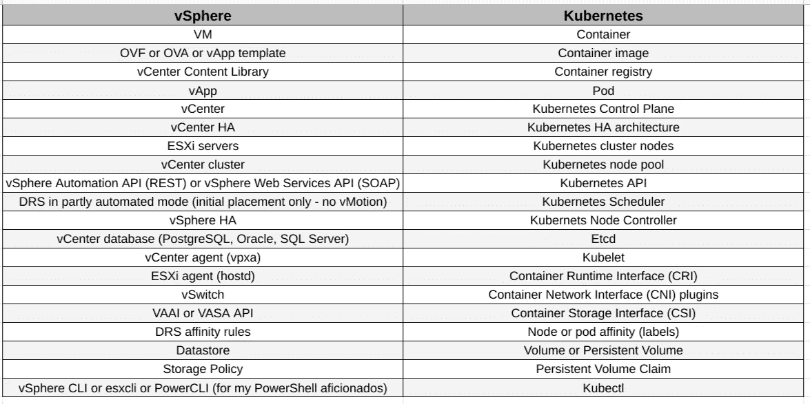

# Kubernetes 和 vSphere 的相似之处

> 原文：<https://medium.com/google-cloud/kubernetes-and-vsphere-similarities-ba5495d58543?source=collection_archive---------0----------------------->

网上有许多文章非常详细地描述了 Kubernetes 的不同组件，但只有少数文章从功能的角度将它们与虚拟化世界联系起来，这正是我们在这里努力实现的目标。

在将我的职业生涯更多地转向云计算和容器之前，我利用我作为虚拟化工程师的几年卑微经验，构建了这个非常简单的功能表，这些功能在 vSphere 和 Kubernetes 之间具有相似的功能，因此我的基础架构和系统工程师同事们知道，Kubernetes 的学习曲线对你们来说不会太陡！

vSphere 和 Kubernetes 功能相似

您可以在#GoogleCloudPlatform 上快速轻松地部署#GoogleKubernetesEngine 集群，继续学习 Kubernetes。

[https://cloud.google.com/kubernetes-engine](https://cloud.google.com/kubernetes-engine)