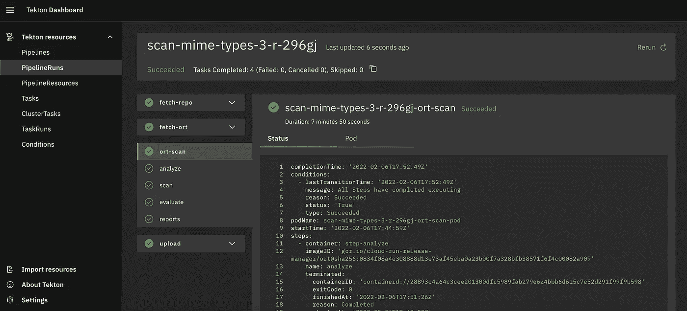

# Kubernetes 和工人队列

> 原文：<https://medium.com/google-cloud/kubernetes-and-worker-queues-c02fa56a0e31?source=collection_archive---------2----------------------->

利瓦伊·琼斯在 [Unsplash](https://unsplash.com/?utm_source=unsplash&utm_medium=referral&utm_content=creditCopyText) 上的照片

几个月前，我在[Eclipse OSS Review Toolkit](https://oss-review-toolkit.org/)(ORT)的朋友找到我，寻求一些关于 Kubernetes 的指导。ORT 允许您设置一个工具链来管理源代码中的 OSS 依赖关系，并且如果您将它作为 CI/CD 工具链的一部分进行集成，可以在早期避免 OSS 许可冲突。

他们希望实现按需扫描服务。基本上从触发器运行 OSS 扫描。在 Java 生态系统中，ORT 主要是用 Kotlin 编写的，其范例通常是解决 JVM 进程内的挑战。因此，您可以使用类似于 [Quartz](http://www.quartz-scheduler.org/) 的作业调度器，或者类似于 [JobRunr](https://www.jobrunr.io/en/) 的更新工具来调度异步作业执行。这可能导致 Java 生态系统中的应用程序变得功能和框架过载。此外，在 Java 中配置分布式作业队列技术在状态和可靠性方面也具有挑战性。但是我们可以很容易地区分关于 web 队列工作器设置的多个不同的关注点:

*   有一个启动作业的客户端
*   有一个控制器来调度和跟踪作业的执行
*   有一个执行作业的执行器

由于他们正在运行一个 OSS 项目，他们希望保持云供应商中立，尽管一个共同的标准是 Kubernetes，因为它现在广泛可用。在这篇博文中，我将使用谷歌云平台服务(GCP)，但是解决方案应该适用于所有的 Kubernetes (K8S)发行版。

如果您想跳过这一步，可以前往 ORT repo 检查源代码。

 [## 主 oss 上的 ort/integrations/tek ton-审查-工具包/ort

### 这个示例管道允许您在 Tekton 上运行 ORT。一些关于 Tekton 和 Kubernetes 的知识将有助于…

github.com](https://github.com/oss-review-toolkit/ort/tree/main/integrations/tekton) 

所以我决定做一个简单的概念验证来展示如何在 K8S 上实现这一点。因为我想利用云原生生态系统，所以我不必在这里重新发明轮子，而是可以为问题选择一个好的实现。我的决定落在了 [Tekton](https://tekton.dev/) 上，这是一个云原生的 CI/CD 框架。Tekton 是围绕几个带有控制器实现的 K8S 自定义资源定义(CRD)构建的。这意味着 Tekton 工作不需要额外的数据库，因为所有状态都保存在 K8S 集群中。

按照[安装说明](https://tekton.dev/docs/pipelines/install/)可以轻松设置 Tekton。你只需要调用`kubectl apply --filename [https://storage.googleapis.com/tekton-release/pipeline/latest/release.yaml](https://storage.googleapis.com/tekton-release/pipeline/latest/release.yaml)`。这将为 Tekton 安装 CRDs 和控制器。Tekton 是一个可扩展的框架，您可以创建和安装自己的任务类型，对于 ORT 示例，您需要安装 [git-clone](https://hub.tekton.dev/tekton/task/git-clone) 和 [gcs-upload](https://hub.tekton.dev/tekton/task/gcs-upload) 任务。

在这之后，我们可以定义我们的管道(参见 [ort-pipeline.yaml](https://github.com/oss-review-toolkit/ort/blob/main/integrations/tekton/ort-pipeline.yaml) 作为例子)。管道定义了应该运行的步骤，以及哪些输出和输入工作区(想想文件夹)，管道需要存储和读取数据。一旦定义了管道，您就可以通过创建一个`PipelineRun`资源来运行它。(例如 [simple-maven.yaml](https://github.com/oss-review-toolkit/ort/blob/main/integrations/tekton/simple-maven.yaml) )。

成功扫描了 [mime-types repo](https://github.com/jshttp/mime-types)

对简单 maven 回购的不成功扫描

由于每次我们想要执行管道时调用`kubectl apply`有点麻烦，并且不是真正的生产就绪，Tekton 还提供了[触发器和事件监听器](https://tekton.dev/docs/triggers/)，利用它们你可以设置常见的模式，比如基于 [Cron 的](https://github.com/tektoncd/triggers/tree/main/examples/v1beta1/cron)触发器，基于 [Webhook 的触发器](https://github.com/tektoncd/triggers/tree/main/examples/v1beta1/github)用于拉请求和 Git 提交，甚至是基于[云事件](https://github.com/tektoncd/triggers/blob/main/examples/v1beta1/cloudevent/eventlistener.yaml)的监听器。

在我看来，如果你正在寻找一个厂商中立的基于 K8S 的 CI/CD 解决方案，你应该试试 Tekton。但是在 CI/CD 场景之外，它还有更多有用的用例，因为它基本上允许您基于触发器编排任务，这是许多应用程序都有的用例。与 K8S 作业相比，它在多步骤工作流程方面提供了更多功能。当然，如果你想做工作流程编排，并且乐于使用完全托管的解决方案，你可以尝试一下[谷歌云工作流程](https://cloud.google.com/workflows)。