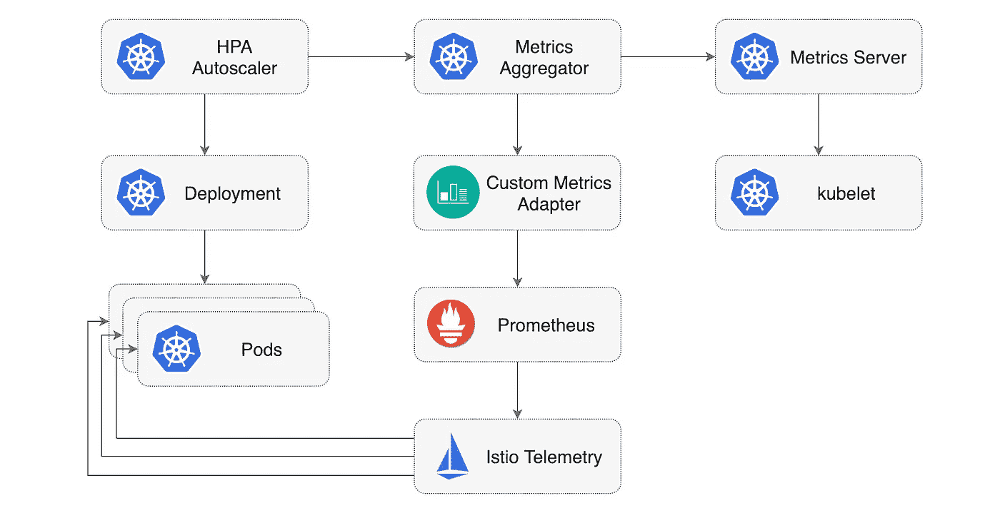

# Kubernetes 使用 Istio 指标自动缩放

> 原文：<https://medium.com/google-cloud/kubernetes-autoscaling-with-istio-metrics-76442253a45a?source=collection_archive---------0----------------------->

自动扩展是一种根据资源使用情况自动扩大或缩小工作负载的方法。Kubernetes 中的自动缩放有两个维度:处理节点缩放操作的集群自动缩放器和自动缩放部署中单元数量的水平单元自动缩放器。

默认情况下，水平窗格自动缩放器(HPA)可以根据观察到的 CPU 利用率和内存使用情况来缩放窗格。从 Kubernetes 1.7 开始，引入了一个聚合层，允许第三方应用程序通过将自己注册为 API 附加组件来扩展 Kubernetes API。这种附加组件可以实现自定义指标 API，并支持 HPA 访问任意指标。

使用像 Istio 这样的服务网格的优势之一是内置的监控功能。您不必为了监控 L7 流量而使用您的 web 应用程序。Istio 遥测服务从与您的应用程序一起运行的 Envoy sidecars 中收集统计数据，如 HTTP 请求率、响应状态代码和响应持续时间。除了监控，这些指标还可用于推动自动扩展和[金丝雀部署](https://github.com/stefanprodan/flagger)。



以下是使用 Istio Mixer 提供的指标配置 HPA v2 的分步指南。安装 Istio 时，确保遥测服务和 Prometheus 已启用。如果你使用的是 GKE Istio 插件，你必须按照这里描述的[部署 Prometheus](https://docs.flagger.app/install/flagger-install-on-google-cloud#install-prometheus)。

为了将 Istio metrics 与水平 Pod 自动缩放器一起使用，您需要一个可以运行 Prometheus 查询的适配器。Zalando 为 Kubernetes 制作了一个通用指标适配器，名为 [kube-metrics-adapter](https://github.com/zalando-incubator/kube-metrics-adapter) 。Zalando 适配器扫描 HPA 对象，执行 promql 查询(用注释指定)并将指标存储在内存中。

# 安装自定义指标适配器

克隆 [istio-hpa](https://github.com/stefanprodan/istio-hpa) 存储库:

```
git clone [https://github.com/stefanprodan/istio-hpa](https://github.com/stefanprodan/istio-hpa)
cd istio-hpa
```

在`kube-system`名称空间中部署度量适配器:

```
kubectl apply -f ./kube-metrics-adapter/
```

当适配器启动时，它将生成一个自签名证书，并将自己注册到`custom.metrics.k8s.io`组下。

该适配器被配置为查询在`istio-system`名称空间中运行的 Prometheus 实例。

通过检查适配器日志来验证安装:

```
kubectl -n kube-system logs deployment/kube-metrics-adapter
```

# 安装演示应用程序

您将使用一个基于 Golang 的小型 web 应用程序 [podinfo](https://github.com/stefanprodan/k8s-podinfo) 来测试水平吊舱自动缩放器。

首先创建一个启用了 Istio sidecar 注入的`test`名称空间:

```
kubectl apply -f ./namespaces/
```

在`test`名称空间中创建 podinfo 部署和 ClusterIP 服务:

```
kubectl apply -f ./podinfo/deployment.yaml,./podinfo/service.yaml
```

为了触发自动缩放，您需要一个工具来生成流量。在`test`名称空间中部署负载测试服务:

```
kubectl apply -f ./loadtester/
```

通过调用 podinfo API 来验证安装。Exec 进入负载测试器 pod，并使用`hey`生成几秒钟的负载:

```
export loadtester=$(kubectl -n test get pod -l "app=loadtester" -o jsonpath='{.items[0].metadata.name}')kubectl -n test exec -it ${loadtester} -- sh~ $ hey -z 5s -c 10 -q 2 [http://podinfo.test:9898](http://podinfo.test:9898)Summary:
  Total:	5.0138 secs
  Requests/sec:	19.9451Status code distribution:
  [200]	100 responses
```

podinfo [ClusterIP 服务](https://github.com/stefanprodan/istio-hpa/blob/master/podinfo/service.yaml)在`http`名称下公开端口 9898。当使用 http 前缀时，特使边车将切换到 L7 路由，遥测服务将收集 HTTP 度量。

# 查询 Istio 指标

Istio 遥测服务从网格中收集指标，并将其存储在 Prometheus 中。一个这样的指标是`istio_requests_total`，使用它您可以确定工作负载每秒接收的请求率。

您可以通过这种方式向 Prometheus 查询 podinfo 在最后一分钟收到的请求/秒速率，不包括 404 秒:

```
sum(
    rate(
      istio_requests_total{
        destination_workload="podinfo",
        destination_workload_namespace="test",
        reporter="destination",
        response_code!="404"
      }[1m]
    )
  )
```

HPA 需要知道每个 pod 接收的请求/秒。您可以使用 kubelet 中的容器内存使用度量来计算 pod 的数量，并计算每个 pod 的 Istio 请求率:

```
sum(
    rate(
      istio_requests_total{
        destination_workload="podinfo",
        destination_workload_namespace="test"
      }[1m]
    )
  ) /
  count(
    count(
      container_memory_usage_bytes{
        namespace="test",
        pod_name=~"podinfo.*"
      }
    ) by (pod_name)
  )
```

# 使用 Istio 指标配置 HPA

使用 req/sec 查询，您可以定义一个 HPA，它将根据每个实例每秒接收的请求数来扩展 podinfo 工作负载:

```
**apiVersion**: autoscaling/v2beta1
**kind**: HorizontalPodAutoscaler
**metadata**:
  **name**: podinfo
  **namespace**: test
  **annotations**:
    **metric-config.object.istio-requests-total.prometheus/per-replica**: "true"
    **metric-config.object.istio-requests-total.prometheus/query**: |
      sum(
        rate(
          istio_requests_total{
            destination_workload="podinfo",
            destination_workload_namespace="test"
          }[1m]
        )
      ) /
      count(
        count(
          container_memory_usage_bytes{
            namespace="test",
            pod_name=~"podinfo.*"
          }
        ) by (pod_name)
      )
**spec**:
  **maxReplicas**: 10
  **minReplicas**: 1
  **scaleTargetRef**:
    **apiVersion**: apps/v1
    **kind**: Deployment
    **name**: podinfo
  **metrics**:
    - **type**: Object
      **object**:
        **metricName**: istio-requests-total
        **target**:
          **apiVersion**: v1
          **kind**: Pod
          **name**: podinfo
        **targetValue**: 10
```

当每个副本的平均流量负载超过 10 req/sec 时，上述配置将指示水平 Pod 自动缩放器扩展部署。

使用以下内容创建 HPA:

```
kubectl apply -f ./podinfo/hpa.yaml
```

启动负载测试，并验证适配器是否计算了指标:

```
kubectl -n kube-system logs deployment/kube-metrics-adapter -fCollected 1 new metric(s)
Collected new custom metric 'istio-requests-total' (44m) for Pod test/podinfo
```

列出自定义指标资源:

```
kubectl get --raw "/apis/custom.metrics.k8s.io/v1beta1" | jq .
```

Kubernetes API 应该返回一个包含 Istio 指标的资源列表:

```
{
  "kind": "APIResourceList",
  "apiVersion": "v1",
  "groupVersion": "custom.metrics.k8s.io/v1beta1",
  "resources": [
    {
      "name": "**pods/istio-requests-total**",
      "singularName": "",
      "namespaced": true,
      "kind": "MetricValueList",
      "verbs": [
        "get"
      ]
    }
  ]
}
```

几秒钟后，HPA 将从适配器获取指标:

```
kubectl -n test get hpa/podinfoREFERENCE            TARGETS   MINPODS   MAXPODS   REPLICAS
Deployment/podinfo   44m/10    1         10        1
```

# 基于 HTTP 流量的自动缩放

为了测试 HPA，您可以使用负载测试器来触发一个向上扩展事件。

进入测试舱，使用`hey`产生几分钟的负载:

```
kubectl -n test exec -it ${loadtester} -- sh~ $ hey -z 5m -c 10 -q 2 [http://podinfo.test:9898](http://podinfo.test:9898)
```

一分钟后，HPA 将开始扩大工作负载，直到每个 pod 的请求/秒降至目标值以下:

```
watch kubectl -n test get hpa/podinfoREFERENCE            TARGETS     MINPODS   MAXPODS   REPLICAS
Deployment/podinfo   25272m/10   1         10        3
```

当负载测试完成时，每秒的请求数将降至零，HPA 将开始缩减工作负载。请注意，HPA 有一个回退机制，可防止快速扩大/缩小事件，几分钟后复制副本的数量将恢复为一个。

默认情况下，指标同步每 30 秒发生一次，只有在过去 3-5 分钟内没有重新缩放的情况下，才会发生放大/缩小。通过这种方式，HPA 可以防止冲突决策的快速执行，并为集群自动伸缩提供时间。

# 包扎

基于流量的扩展对 Kubernetes 来说并不新鲜，NGINX 等入口控制器可以公开 HPA 的 Prometheus 指标。使用 Istio 的不同之处在于，您还可以自动扩展后端服务，即只能从网格内部访问的应用程序。我不太喜欢在 Kubernetes yaml 中嵌入代码，但是 Zalando metrics 适配器足够灵活，允许这种定制的自动伸缩。

如果您对改进本指南有任何建议，请在 GitHub 上提交问题或 PR，地址为 [stefanprodan/istio-hpa](https://github.com/stefanprodan/istio-hpa) 。非常欢迎投稿！