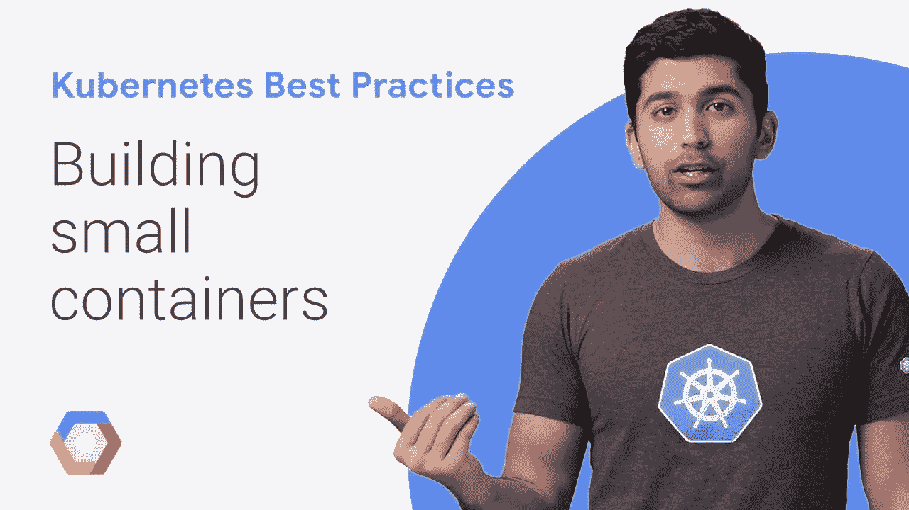
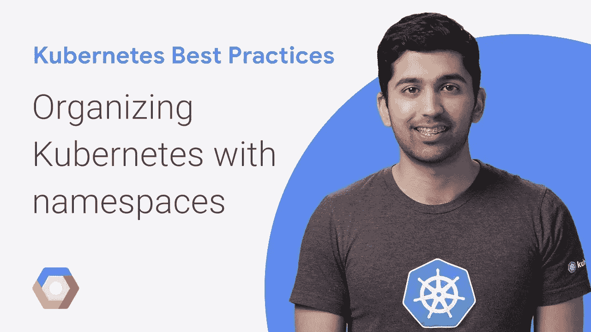
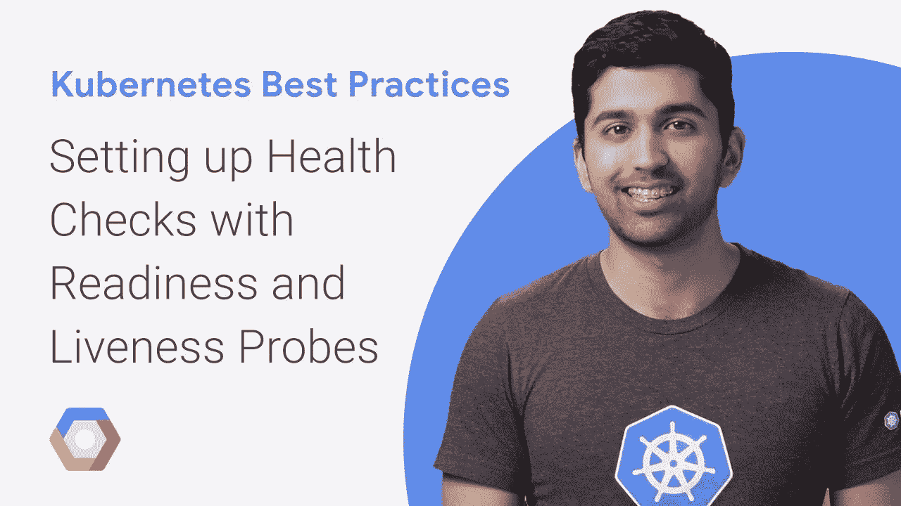
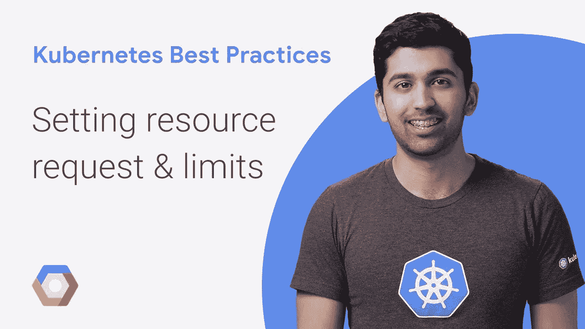
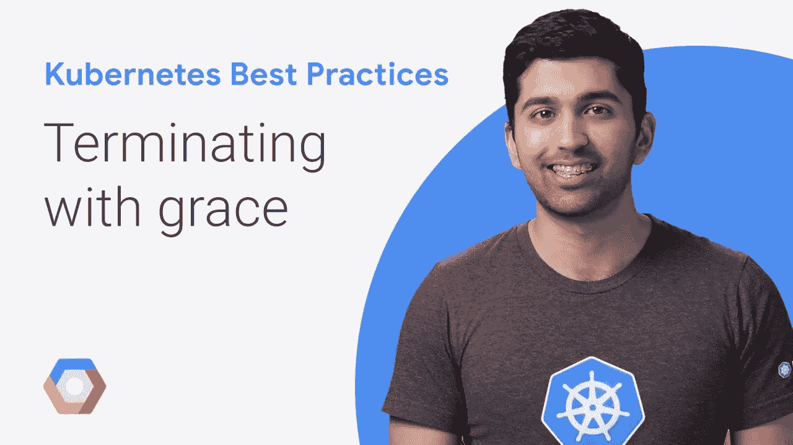
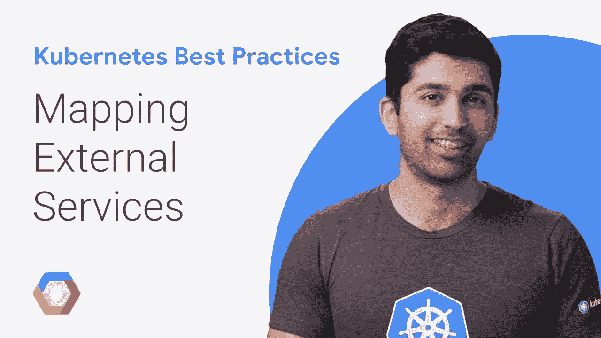
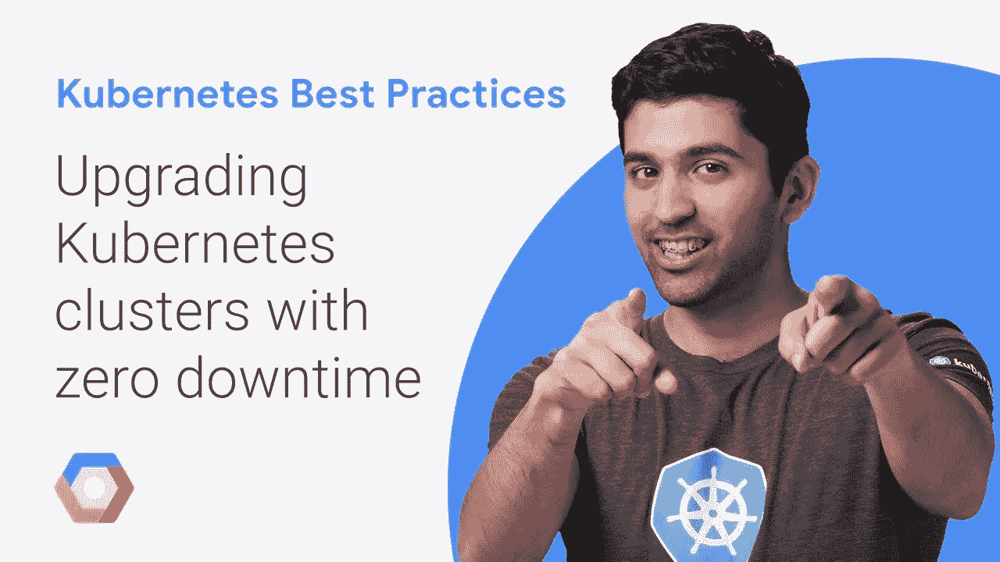

# Kubernetes 最佳实践—第一季

> 原文：<https://medium.com/google-cloud/kubernetes-best-practices-season-one-11119aee1d10?source=collection_archive---------1----------------------->

Kubernetes 很复杂，而且一天比一天复杂。如果你刚开始使用 Kubernetes，或者已经在生产中运行了一段时间，那么很难跟上快速发展的步伐。当你有一个基于 Kubernetes 的团队时，这就更难了，因为你必须确保每个人都是最新的和高效的。

虽然有大量关于“Hello World”体验的内容，但使用 Kubernetes 要比运行部署并通过服务公开它复杂得多。Kubernetes 本身提供了一个空白的石板，在这里你基本上可以做任何你想做的事情，但真的很难知道从哪里开始！

考虑到这一点，我开始准备一个题为“Kubernetes 最佳实践”的演讲(这里有[张幻灯片](https://speakerdeck.com/thesandlord/kubernetes-best-practices)和[段视频](https://www.youtube.com/watch?v=BznjDNxp4Hs))，这些都是基于我在野外与日常生活中的人们交谈时收到的问题和反馈。这个演讲非常受欢迎，所以我决定深入到各个主题。我最终为这第一次运行制作了七集([，这很合适](https://cloudplatform.googleblog.com/2016/07/from-Google-to-the-world-the-Kubernetes-origin-story.html))，我真的认为它们可以帮助你和你的团队快速提升 Kubernetes。

所以这七集都是为了让你看得开心！我现在正在制作下一批视频，希望你能就你想看的内容提供反馈。请在 Twitter 上发表评论或给我发消息[提出你的建议！](https://twitter.com/SandeepDinesh)

# 第一季剧集

*   [所有视频](https://www.youtube.com/playlist?list=PLIivdWyY5sqL3xfXz5xJvwzFW_tlQB_GB)

## 如何以及为什么构建小容器

在你能使用 Kubernetes 之前，你必须建造一些容器。Docker 使构建容器变得非常容易，但这也意味着构建低效和不安全的容器也很容易。构建更小的容器是从 Kubernetes 集群中获得更多好处的一种简单方法，不需要做很多工作。

*   [博文](https://cloudplatform.googleblog.com/2018/04/Kubernetes-best-practices-how-and-why-to-build-small-container-images.html)
*   [视频](https://youtu.be/wGz_cbtCiEA)

## 用名称空间组织

一旦你超越了“hello world”，当你试图管理运行在 Kubernetes 上的微服务时，你可能会遇到组织问题。当你的团队成长，你需要更多的可见性和控制力时，情况会变得更糟。名称空间为管理 Kubernetes 中的资源提供了一种强大的方法，并为策略和管理提供了基础。

*   [博文](https://cloudplatform.googleblog.com/2018/04/Kubernetes-best-practices-Organizing-with-Namespaces.html)
*   [视频](https://youtu.be/xpnZX3if9Tc)

## 通过就绪和活性探针进行健康检查

健康检查是创建健壮可靠的服务所必需的。虽然 Kubernetes 有默认的内置健康检查，但对许多应用程序来说还不够。就绪性和活性探测使您能够轻松地为您的应用程序定制这些健康检查。

*   [博文](https://cloudplatform.googleblog.com/2018/05/Kubernetes-best-practices-Setting-up-health-checks-with-readiness-and-liveness-probes.html)
*   [视频](https://youtu.be/mxEvAPQRwhw)

## 资源请求和限制

内存泄漏、无限循环、不良行为者、过度供应，天哪！Kubernetes 为您提供了一个强大的平台来运行您的服务，但是如果您不围绕资源定义规则，最终您将会陷入困境。幸运的是，Kubernetes 给了你很多对资源以及如何使用它们的控制权。

*   [博文](https://cloudplatform.googleblog.com/2018/05/Kubernetes-best-practices-Resource-requests-and-limits.html)
*   [视频](https://youtu.be/xjpHggHKm78)

## 优雅地结束

Kubernetes 中的豆荚和容器需要优雅地处理终止。Kubernetes 可以出于各种原因决定终止一个完全健康的 Pod，干净地关闭是为您的用户提供良好体验的关键。

*   [博文](https://cloudplatform.googleblog.com/2018/05/Kubernetes-best-practices-terminating-with-grace.html)
*   [视频](https://youtu.be/Z_l_kE1MDTc)

## 映射外部服务

您可能有位于 Kubernetes 集群之外的服务。其中一些可能是第三方服务，其他可能是您的团队或公司运行的服务。不管怎样，生活在混合世界里会带来它的复杂性。Kubernetes 为您提供了映射这些外部服务的能力，使它们看起来和感觉上像本地的 Kubernetes 服务，从而更容易弥合世界之间的差距。

*   [博文](https://cloudplatform.googleblog.com/2018/05/Kubernetes-best-practices-mapping-external-services.html)
*   [视频](https://youtu.be/fvpq4jqtuZ8)

## 零停机升级您的集群

您需要做的最重要的事情之一是让您的集群保持最新。使用像 GKE 这样的托管服务可以使这变得容易得多，但仍然有一些方法可以让升级过程更顺利。

*   [博文](https://cloudplatform.googleblog.com/2018/06/Kubernetes-best-practices-upgrading-your-clusters-with-zero-downtime.html)
*   [视频](https://youtu.be/ajbC1yTW2x0)

*感谢让这一切成为可能的所有人，从审查内容的人到使这个系列成为现实的视频和博客编辑团队！*