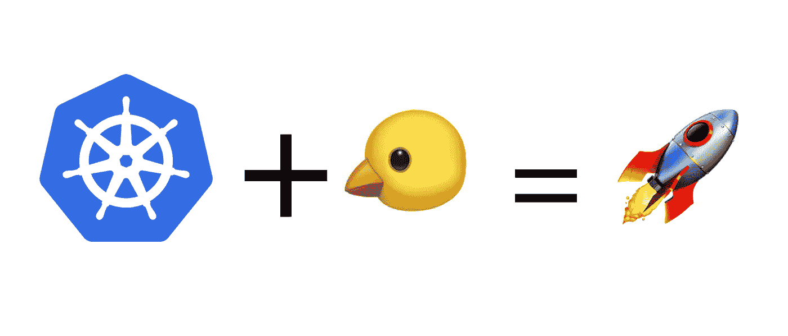
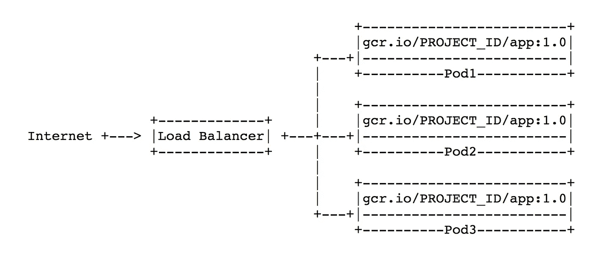

# Kubernetes 金丝雀部署🐤对于凡人来说

> 原文：<https://medium.com/google-cloud/kubernetes-canary-deployments-for-mere-mortals-13728ce032fe?source=collection_archive---------0----------------------->

## 以及如何安全可靠地推出软件版本

> 最初发布于 [Dockbit 博客](https://blog.dockbit.com/kubernetes-canary-deployments-for-mere-mortals-6696910a52b2)



Canary 部署是一种降低发布新软件版本风险的模式。[名字](https://en.wikipedia.org/wiki/Domestic_canary#Miner.27s_canary)背后的历史并不美好。但是在软件中，对于采用连续交付实践的团队来说，释放金丝雀可能是一种战略战术。

这个想法是，您将把一个新的版本与它的稳定版本一起逐步地部署到一小组服务器上。一旦您测试了 waters，您就可以将这些更改推广到基础架构的其余部分。

这有效地向一小部分用户公开了新版本，作为可能发生的故障的早期指示器。金丝雀对于避免有问题的部署和愤怒的用户非常方便！如果一个 canary 部署失败，其余的服务器不会受到影响，您可以简单地放弃它并修复根本原因。

从历史上看，实施金丝雀部署是一件痛苦的事情，尤其是对小公司而言。团队甚至不得不在他们的应用核心中实现诸如[功能切换](https://martinfowler.com/bliki/FeatureToggle.html)的技术来实现类似的行为。

Docker 容器等技术🐳使我们向前迈进了一步，但是我们仍然缺乏实现高级部署技术的高级工具。

**输入容器编排器和调度器**🚀

当您开始需要将容器分发到单台机器之外时，通常会使用调度器和编排器，因此它是排序之上的另一个管理层。但这不一定是你应该采用它们的唯一理由。

仅举几个例子，通过简单地为容器采用调度器，您可以“免费”获得一些好处:自我修复、水平伸缩、服务发现、负载分布、部署管理等等。

这已经是一个巨大的胜利了。如果您今天在 Docker 镜像中发布软件，那么对您的日常工作流程非常有帮助的特性之一就是容器部署的管理。您必须手动协调在不同节点上提取新版本的 Docker 映像并重启服务的日子已经一去不复返了。管弦乐队可以为你提炼出一句俏皮话。

虽然市场上有太多的选择:[码头工人群](https://docs.docker.com/engine/swarm/)，[哈西科尔游牧者](https://www.nomadproject.io)，[马拉松](https://mesosphere.github.io/marathon/)；一个真正致力于使 Docker 容器部署可重复和简化的调度程序是 Kubernetes。

Kubernetes(简称 k8s)awesome sauce 在于它提供了现成的高级部署技术。许多场景都不需要或只需要很少的黑客就可以支持。现在，是的，您必须将您的软件封装在 Docker 映像中，并设置您的 Kubernetes 对象(pod、复制集、部署等..)，但是你的投资得到了这么多的回报。

布伦丹·伯恩斯(k8s 联合创始人)讲述 k8s 如何让你的生活更轻松

看到 Canary 部署的实际情况比谈论它们更令人兴奋，所以让我们亲自动手，深入研究一个基于 k8s 的示例设置。

# 概观

这里是总体规划:首先，我们需要一个 k8s 集群来工作。一个 Kubernetes 集群由十几个[组件](https://kubernetes.io/docs/concepts/overview/components/)组成。为了快速启动，我们将关注用于创建集群的自动化工具，而不是通过艰难的方式创建集群。

对于本地测试，Minikube 将为您提供非常好的服务。为了得到更真实的设置，我们将使用由 k8s 驱动的[谷歌容器引擎](https://cloud.google.com/container-engine/) (GKE)。它将负责在 [GCP](https://cloud.google.com) 上设置实例，安装所有 k8s 组件以及处理初始配置。

部署到 k8s 要求我们的应用程序以容器格式打包。对于本演练，我们将使用 [Docker](https://www.docker.com) 运行时。示例应用程序的两个版本(Stable 和 Canary)都将打包在 Docker 图像中，不同版本的 Docker 图像标记为。

我们将首先对 k8s 上的 Canary 版本进行简单的设置，然后升级它以使用更多的技巧。

# 阶段 0:准备环境

以下是您在 GCP 上开始使用 k8s 所需的内容:

*   [选择或创建](https://console.cloud.google.com/cloud-resource-manager)一个项目。这将所有使用的资源分开，以便以后更容易清理。
*   [为项目启用计费](https://support.google.com/cloud/answer/6293499#enable-billing)。
*   [为计算引擎和容器引擎启用 API](https://console.cloud.google.com/flows/enableapi?apiid=compute_component,container)。这些将允许我们使用 [gcloud](https://cloud.google.com/sdk/gcloud/) CLI 工具访问所需的资源。
*   如果您还没有安装最新版本的 [gcloud](https://cloud.google.com/sdk/docs/#install_the_latest_cloud_tools_version_cloudsdk_current_version) 。或者，可以使用[云壳](https://console.cloud.google.com/?cloudshell=true)。
*   最后，通过执行`gcloud components install kubectl`安装`kubectl`。

接下来，我们可以继续创建一个[容器引擎集群](https://cloud.google.com/container-engine/docs/concepts/cluster-architecture)。该集群由至少一台主机和多台工作机组成，将自动为我们创建。

*   获取[项目 ID](https://support.google.com/cloud/answer/6158840?hl=en) 并将其存储在变量`export PROJECT_ID=<ID>`中。
*   设置要使用的项目:`gcloud config set project $PROJECT_ID`。
*   设置默认的计算引擎区域，例如:`gcloud config set compute/zone us-east1-d`。
*   最后，创建容器集群，这里我们称之为`canary`:`gcloud container clusters create canary`。

如果事情按照计划进行，您将能够通过执行:`kubectl cluster-info`获得 k8s 组件端点。

GitHub 资源库中提供了即将发布的材料中使用的代码/配置:

 [## DockbitExamples/kubernetes

### kubernetes — Kubernetes 示例

github.com](https://github.com/DockbitExamples/kubernetes) 

# 第一阶段:应用程序

首先，我们需要一个 app 来部署！为了这篇文章，我们创建了一个简单的 Go 应用程序。Go 程序编译成自给自足的可移植二进制文件，因此它们非常适合在 Docker 映像中使用。

同样的方法也适用于可以打包在 Docker 容器中的任何其他技术栈。无论是需要编译的语言如 [Elixir](https://elixir-lang.org) 还是解释语言如 [Ruby](http://ruby-lang.org) 或 [Python](https://www.python.org) 。只是在后一种情况下，您需要包含代码本身，而不是工件。

该应用程序打印出部署的版本以及一些操作要求:

可从[https://github . com/DockbitExamples/kubernetes/tree/master/source](https://github.com/DockbitExamples/kubernetes/tree/master/source)获得

第 8–10 行:将应用程序的版本存储在名为`version`的常量中，并通过 Go 的 [http 包](https://golang.org/pkg/net/http/)将其打印出来。注意`version`被设置为`1.0`，这将是我们稍后将在 Docker 映像中烘焙的第一个“稳定”版本。

第 14–15，24 行:作为健康检查，如果请求命中`/health`，应用程序将响应 HTTP 200。

第 18–20，25 行:在`/version`公开一个端点，它返回当前部署的应用程序的版本。这将使以后更容易确认 k8s 上运行的是哪个版本的应用程序。

第 26 行:最后，我们在端口`8080`上监听任何传入的 HTTP 请求。

现在，我们可以通过构建二进制文件来编译应用程序:

您会注意到使用了`netgo`构建标签。这有助于通过用 system 的 libc 代替 Go 的`netgo`库来生成静态二进制文件。

如果您在本地没有 Go 的构建设置，您可以使用位于[这里](https://github.com/DockbitExamples/kubernetes/tree/master/source)的预构建二进制文件。版本`1.0`的可下载版本可通过[此链接](https://github.com/DockbitExamples/kubernetes/blob/master/source/1.0/app?raw=true)获得。

接下来，我们需要将 Go 二进制文件封装到 Docker 映像中，以便稍后部署到 k8s。

# 第二阶段:码头工人形象🐳

将 Go 工件包装在 Docker 映像中非常简单。只是将二进制文件复制到映像中。

可从[https://github . com/DockbitExamples/kubernetes/blob/master/docker file](https://github.com/DockbitExamples/kubernetes/blob/master/Dockerfile)获得

您会注意到，我们使用 Docker [构建时参数](https://blog.dockbit.com/making-use-of-docker-build-arguments-68792d751f3)来指定将哪个版本的应用程序打包到映像中。

由于我们的 k8s 设置是在 [GCP](https://cloud.google.com) 之上，我们可以利用[谷歌容器注册表](https://cloud.google.com/container-registry/)(简称 GCR)来存储图像。URL 根据我们之前设置的[项目 ID](https://support.google.com/cloud/answer/6158840?hl=en) 而改变。

Container Engine 的一大优点是它会在 k8s worker 节点上自动预配置 Docker 注册凭证。因此 k8s 可以开箱即用地访问 GCR 的图像。

至此，我们已经有了一个正确打包在 Docker 映像中的应用程序，k8s 可以使用和部署它。是时候一头扎进库伯内特斯了。

# 阶段 3:将 Stable 部署到 k8s

在深入研究代码之前，我们需要熟悉一些 k8s 术语。首先也是最重要的:[吊舱](https://kubernetes.io/docs/concepts/workloads/pods/pod-overview/)。

> Pod 是 Kubernetes 的基本构建块，是您创建或部署的 Kubernetes 对象模型中最小和最简单的单元。一个 Pod 代表集群上正在运行的进程。
> 
> 一个容器(如鲸的容器或豌豆荚)是一组一个或多个容器(如 Docker 容器)，具有共享的存储/网络，以及如何运行容器的规范。一个 pod 的内容总是位于同一位置并被共同调度，并且在一个共享的上下文中运行

实际上，您最关心的是定义您的 pod 的“规格”。这些可以包括使用哪个容器映像、健康检查、在 Pod 中运行什么命令、暴露哪个端口等。对于大多数工作负载，您将拥有同一个 Pod 的多个实例，工作负载将使用某种形式的负载平衡在它们之间分配，这就引出了复制集的概念。

[ReplicaSets](https://kubernetes.io/docs/concepts/workloads/controllers/replicaset/) (简称 RS)确保特定数量的 pod 副本同时运行。你只需告诉 k8s，你需要某个 Pod 的 x 个副本，它会确保根据 Pod 的[生命周期](https://kubernetes.io/docs/concepts/workloads/pods/pod-lifecycle/)，完全相同的数量始终有效。

然而，在编写 k8s 配置时，您很少需要定义副本集，而是使用[部署](https://kubernetes.io/docs/concepts/workloads/controllers/deployment/)。

> 部署是一个更高层次的概念，它管理副本集，并提供对 pod 的声明性更新以及许多其他有用的特性
> 
> 您在部署对象中描述一个期望的状态，部署控制器以受控的速度将实际状态更改为期望的状态。您可以定义部署来创建新的副本集，或者删除现有的部署并在新部署中采用它们的所有资源。

下面是一个使用我们之前构建的 Docker 映像定义 k8s 部署的示例:

可从[https://github . com/DockbitExamples/kubernetes/blob/master/k8s/lb/app-production . yml](https://github.com/DockbitExamples/kubernetes/blob/master/k8s/lb/app-production.yml)获得

第 1–2 行:我们想要创建的 Kubernetes [对象](https://kubernetes.io/docs/concepts/overview/working-with-objects/kubernetes-objects/)的种类以及创建时使用的 API 版本。

第 3–4 行:唯一标识对象的元数据。

第 5–12 行:代表 [Pod 模板](https://kubernetes.io/docs/concepts/workloads/pods/pod-overview/#pod-templates)的开始。

> Pod 模板是包含在其他对象中的 pod 规格。
> 
> pod 模板不指定所有副本的当前所需状态，而是像切饼刀一样。一旦饼干被切割，饼干就与切割者没有任何关系。

在本例中，我们配置了一个模板，使其拥有同一个容器的 3 个副本，并附加了一些可用于引用部署对象的标签[。这个设置中的一个重要标签是`app: kubeapp`。例如，通过将应用程序名称设置为附加到 pod，我们可以在以后从负载平衡器指向 pod。](https://kubernetes.io/docs/concepts/overview/working-with-objects/labels/)

> 标签是附加到对象(如窗格)的键/值对。标签可用于组织和选择对象子集。

第 13–25 行:定义了 k8s 将作为副本集的一部分在 Pods 中运行的容器的规格。

*   这些集装箱是基于储存在 GCR 的码头图像`gcr.io/PROJECT_ID/app:1.0`设计的。其中`PROJECT_ID`应按如下所示进行评估。
*   `imagePullPolicy`告诉 k8s 总是从 Docker 注册表中提取图像，以防有新的图像被推送，带有相同的标签。
*   `readinessProbe`定义对 Pod 运行的健康检查(在本例中，在端口 8080 上调用`/health`)。
*   `command`设置启动后在容器中运行的命令。这里我们指向 Go 二进制文件在`/app`的位置。
*   `ports`打开端口 8080，以便容器可以接受和发送流量。

在我们继续执行部署之前，我们需要解析`PROJECT_ID`，我们可以使用以前的`sed`来完成:

为部署创建一个 k8s [名称空间](https://kubernetes.io/docs/concepts/overview/working-with-objects/namespaces/)也是一个好主意。Kubernetes 支持由同一个物理集群支持的多个虚拟集群。这些虚拟集群被称为名称空间。

名称空间非常适合的一个例子是部署环境。因此，在完全相同的 k8s 集群中，您最终可以获得一个用于生产的名称空间和另一个用于暂存的名称空间。下面是创建名称空间的方法:

现在，我们终于可以开始部署了🚀

注意我们如何需要指定使用哪个名称空间。通过部署创建的所有 k8s 资源将驻留在`production`名称空间中。所以为了访问它们，我们需要总是添加`--namespace`参数。我们可以通过`rollout status`命令检查卷展的进度:

耶！😁


查克批准的部署！

`get`命令可用于获取所有 k8s 对象的信息。要获得部署后创建的 pod 列表，我们可以运行:

仔细观察，您会发现 k8s 将 pod 分布在 3 个 worker [节点](https://kubernetes.io/docs/concepts/architecture/nodes/)上。

另一个非常有用的命令是`get events`。这从 k8s 控制器中提取了一系列事件，可以方便地进行故障排除和查看发生了什么。

此时，应用程序的 3 个副本已启动，并在端口`8080`上监听传入的连接。但是我们缺少完成设置的最后一个组件，它将允许我们访问应用程序:一个负载平衡器。



k8s 支持创建云原生负载平衡器(简称 LB)。它通过创建一个负载平衡器(想想 [GCP LB](https://cloud.google.com/load-balancing/) 或 [AWS ELB](https://aws.amazon.com/elasticloadbalancing/) )作为[服务](https://kubernetes.io/docs/concepts/services-networking/service/)来做到这一点。在实践中，服务可以有不同的含义。pod 和服务之间的主要区别在于，pod 是会死的(因此，如果它们重生，网络寻址会改变)，另一方面，服务可以通过给它们贴上[标签](https://kubernetes.io/docs/concepts/overview/working-with-objects/labels/)来识别，以便以后参考，而不用担心寻址问题。

下面是如何将负载平衡器定义为指向前面创建的 pod 的服务:

可从[https://github . com/DockbitExamples/kubernetes/blob/master/k8s/lb/app-lb . yml](https://github.com/DockbitExamples/kubernetes/blob/master/k8s/lb/app-lb.yml)获得

第 1–4 行:指定我们使用 k8s API 版本 1 和元数据创建一个服务类型的 k8s [对象](https://kubernetes.io/docs/concepts/overview/working-with-objects/kubernetes-objects/)。

第 6 行:将[服务类型](https://kubernetes.io/docs/concepts/services-networking/service/#publishing-services---service-types)设置为负载均衡器。这使用云提供商的负载均衡器对外公开服务。在我们的例子中，这将创建 [GCP 负载平衡器](https://cloud.google.com/load-balancing/)，并自动创建所有必要的路由，以通过 LB 将 pod 内部运行的工作负载连接到外部世界。

第 7–11 行:代表 LB 配置。在这种情况下，LB 监听端口`80`，将请求定向到后端`8080`的 TCP 端口。

第 12–13 行:向我们介绍了另一个重要的 k8s 概念:[选择器](https://kubernetes.io/docs/concepts/overview/working-with-objects/labels/)。它们与标签一起工作来识别和分组 k8s 对象。早些时候，我们将`app: kubeapp`的标签分配给了我们的 pod。在 LB 定义中，我们可以简单地在完全相同的标签上使用一个选择器，以便 LB 可以自动发现它可以将流量定向到哪个 pod。

创建 LB 使用我们之前创建部署时使用的相同的`apply`命令:

云 LB 是异步创建的，一旦完成，您可以使用`get`命令获取 LB 的公共 IP 地址:

我们还可以使用这个一行程序提取 LB 的 IP 地址👉

厉害！我们的应用程序版本`1.0`(稳定版)已经部署🙌。两个 k8s 配置文件和一些命令采用了我们的 Docker 镜像，部署了 3 个分布式容器，创建了一个 LB 并把东西连接在一起，一点也不差！

# 阶段 4:将 Canary 部署到 k8s🐤

现在我们已经将稳定版本部署到集群中，我们可以开始部署 Canary 版本了。让我们把它命名为`2.0`，我们将遵循类似的流程。`1.0`和`2.0`之间的差值将仅仅是 Go [常量](https://github.com/DockbitExamples/kubernetes/blob/master/source/2.0/app.go#L8)的值。

*   为`2.0`构建 Go 二进制文件(或者在这里下载一个预构建的二进制文件[)。](https://github.com/DockbitExamples/kubernetes/blob/master/source/2.0/app?raw=true)

*   为`2.0`构建并推送 Docker 映像。

*   通过应用与 Stable 略有不同的 k8s 配置推出 Canary 版本:

可从[https://github . com/DockbitExamples/kubernetes/blob/master/k8s/lb/app-canary . yml](https://github.com/DockbitExamples/kubernetes/blob/master/k8s/lb/app-canary.yml)获得

让我们强调一下不同之处:

第 4、12 行:区分 Canary 部署和 Stable 的唯一元数据。注意名为`env`的标签是如何不同的，但是 Stable 和 Canary 对于`app`标签共享相同的值`kubeapp`。

第 6 行:为 Canary 版本设置我们需要的副本数量。这很重要，因为它控制了我们的用户点击金丝雀版本的比例。在这种情况下，我们有一个稳定:金丝雀的 [3](https://github.com/DockbitExamples/kubernetes/blob/master/k8s/lb/app-production.yml#L6) : [1](https://github.com/DockbitExamples/kubernetes/blob/master/k8s/lb/app-canary.yml#L6) 比率，因此命中负载平衡器的 25%的请求将获得金丝雀释放。

我们不需要对 LB 做任何更改，因为它已经有一个应用于标签`app: kubeapp`的[选择器](https://github.com/DockbitExamples/kubernetes/blob/master/k8s/lb/app-lb.yml#L12-L13)，该标签跨越两个部署(稳定和金丝雀)。所以通过金丝雀部署发射的吊舱将自动加入 LB。

是时候释放金丝雀了🐤

我们可以通过在先前设置的`SERVICE_IP`上执行 curl in for 循环来模拟用户点击应用程序:

一旦`2.0`通过测试和批准，我们可以继续将 [app-production.yml](https://github.com/DockbitExamples/kubernetes/blob/master/k8s/lb/app-production.yml#L16) 中使用的 Docker 映像切换到`2.0`，然后简单地重新应用配置。另一种方法是将使用的图像直接保存到 k8s API:

这将指示 k8s 发射新的吊舱，同时终止旧的吊舱。至此，您并不真正需要金丝雀部署。你可以通过执行`kubectl --namespace=production delete deployment/kubeapp-canary`来删除它。

一旦你开始测试 Canary 版本，你很快就会遇到的一个问题是 LB 可能会开始在两个版本之间切换你的会话，使得单独测试`2.0`变得非常困难。此外，使用 k8s 提供的 LBs 来实现 SSL 终止或路由规则等操作需求实际上是不可行的。

进入[入口资源](https://kubernetes.io/docs/concepts/services-networking/ingress/#what-is-ingress)。

# 阶段 5:使用入口资源访问 Canary 部署

> 入口是允许入站连接到达群集服务的规则集合。
> 
> 它可以被配置为向服务提供外部可访问的 URL、负载平衡流量、终止 SSL、提供基于名称的虚拟主机等等。

入口资源由一个[入口控制器](https://github.com/kubernetes/ingress-gce#what-is-an-ingress-controller)在 k8s 中提供。这些控制器抽象出用于实现高级负载平衡的后端软件的内部工作方式(甚至可以是 [nginx](https://github.com/kubernetes/ingress-nginx) 、 [GCE LB](https://github.com/kubernetes/ingress-gce) 、HAProxy 等)，让我们专注于路由规则。

入口控制器通常不会在初始集群创建时自动创建，尽管很酷的一点是它们可以作为 k8s Pods 部署。至于我们现有的 [GKE](https://cloud.google.com/container-engine/) 设置，它实际上已经存在，因此我们可以直接进入如何使用入口资源。

我们对入口资源的目标是将 Canary 部署的流量分割到一个子域上。这将使得独立于稳定版本测试 Canary 版本变得更加容易。

让我们假设稳定版本在`http://foo.bar`可访问，金丝雀部署在`http://canary.foo.bar`。您需要在本地解析器(又名:`/etc/hosts`)中添加这些域的记录，将流量定向到入口资源的公共 IP。

> 在执行下一节中的命令之前，您可能需要删除之前创建的资源。抛弃名称空间并重新创建它可以通过这个任务来实现:`*kubectl delete namespace production && kubectl create namespace production*`

让我们从探索部署本身需要做哪些更改开始:

可从[https://github . com/DockbitExamples/kubernetes/blob/master/k8s/ingress/app-production . yml](https://github.com/DockbitExamples/kubernetes/blob/master/k8s/ingress/app-production.yml)获得

部署对象是原样的，这里没有什么新东西。新配置位于第 2 部分(从第 27 行开始)。在这里，我们基本上是通过一个`NodePort`类型的 k8s 服务发布部署创建的 pod。

> Kubernetes master 将从一个标记配置的范围(缺省值:30000–32767)中分配一个端口，每个节点将该端口(每个节点上的相同端口号)代理到您的服务中。

我们的部署公开端口`8080`，因此服务指向该端口，并在节点本身上公开端口`80`。入口资源不能直接与部署对象对话，而是需要一个服务来首先发布部署。

与我们之前所做的类似，下面是部署+服务组合的流程:

查询 k8s API 将向我们展示，Pods 被集体公开为一个监听内部 IP 地址的服务。这也是通过指向 pod[模板](https://github.com/DockbitExamples/kubernetes/blob/master/k8s/ingress/app-production.yml#L10-L12)中使用的标签的[选择器](https://github.com/DockbitExamples/kubernetes/blob/master/k8s/ingress/app-production.yml#L39-L41)来完成的。

一旦服务发布，我们就可以开始创建我们的入口资源。下面我们定义一个最小资源:

可从[https://github . com/DockbitExamples/kubernetes/blob/master/k8s/ingress/app-ingress-production . yml](https://github.com/DockbitExamples/kubernetes/blob/master/k8s/ingress/app-ingress-production.yml)获得

和所有其他 k8s 对象一样，类型和元数据都被设置为`Ingress`。入口资源需要知道将请求路由到哪个后端，我们这里只有一个后端指向前面定义的服务。

在这种情况下，我们没有列出任何路由，这意味着这将代表*默认后端*，所有请求都将转到该后端。一旦后端的健康检查开始报告`HEALTHY`，我们就可以点击入口地址并开始测试我们的设置。

注意第 16 行，在我们能够访问入口资源 IP 地址之前，我们需要等待后端报告 **HEALTHY** 。

金丝雀释放非常类似于稳定。唯一的区别是[副本](https://github.com/DockbitExamples/kubernetes/blob/master/k8s/ingress/app-canary.yml#L6)的数量、要使用的 Docker 图像(在我们的例子中是`[2.0](https://github.com/DockbitExamples/kubernetes/blob/master/k8s/ingress/app-canary.yml#L16)`)和相关的元数据。可以使用通常的流程来滚动部署:

为了能够在单独的子域上访问 Canary 版本，我们需要添加一些指向 Canary [服务](https://github.com/DockbitExamples/kubernetes/blob/master/k8s/ingress/app-canary.yml#L27-L41)的入口路由。我们在这里使用的方法是基于名称的虚拟主机，其中入口资源将检查[主机头](https://tools.ietf.org/html/rfc7230#section-5.4)并判断它应该将流量发送到哪个服务。

```
**foo.bar        --|                 |-> kubeapp-production-service 80
                 |   Ingress IP    |
canary.foo.bar --|                 |-> kubeapp-canary-service     80**
```

可从[https://github . com/DockbitExamples/kubernetes/blob/master/k8s/ingress/app-ingress-canary . yml](https://github.com/DockbitExamples/kubernetes/blob/master/k8s/ingress/app-ingress-canary.yml)获得

第 6–8 行:设置默认后端。这将匹配任何到达没有主机头集的入口 IP 地址的请求，将其定向到包含生产 pod 的生产服务。

第 9 行:开始入口资源规则部分。

第 10–15 行:匹配域`canary.foo.bar`并将流量定向到端口`80`上名为`[kubeapp-canary-service](https://github.com/DockbitExamples/kubernetes/blob/master/k8s/ingress/app-canary.yml#L27-L41)`的 k8s 服务。

第 16–21 行:对我们用于服务的主域做同样的事情`foo.bar`。

这种技术对于在生产环境中测试 Canary 版本非常有用，不会影响用户使用的稳定版本。相同的入口路由可以修改为在相同域的不同 URL 路径上工作，而不是使用 vhosts(也称为[扇出](https://kubernetes.io/docs/concepts/services-networking/ingress/#simple-fanout))。

将 Canary 版本升级到生产可以使用前面讨论过的相同流程来执行:使用`set image`或者修改 Docker 映像以在[生产配置](https://github.com/DockbitExamples/kubernetes/blob/master/k8s/ingress/app-production.yml#L16)中使用。

因此，在 k8s 上设置金丝雀部署并不困难。事情甚至可以通过[多级金丝雀部署](http://blog.kubernetes.io/2017/04/multi-stage-canary-deployments-with-kubernetes-in-the-cloud-onprem.html)和[流量权重的更精细控制](https://istio.io/blog/canary-deployments-using-istio.html)得到进一步发展。

# 结论

Kubernetes 是一个巨大的项目，它允许各种形状和规模的公司采用过去只有大型公司才能使用的基础设施结构(k8s 的灵感毕竟来自于 [borg](http://blog.kubernetes.io/2015/04/borg-predecessor-to-kubernetes.html) )。最重要的是，与其他系统相比，实现类似的设置相对容易。

这篇文章只是触及了一个用例的表面。k8s 有适合每个人的东西，通过[概念](https://kubernetes.io/docs/concepts/)挖掘，看看它在哪里适合你！

让他们飞起来！🐤 🚀