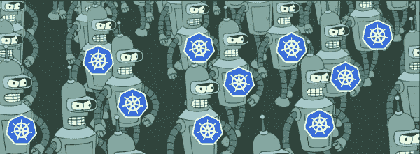

# Kubernetes:集群自动缩放

> 原文：<https://medium.com/google-cloud/kubernetes-cluster-autoscaler-f1948a0f686d?source=collection_archive---------1----------------------->

自动缩放是 Kubernetes 的一个巨大的(并且已经上市的)特性。当你的网站/应用程序/API/项目变得很大，大量的请求开始涌入，你不必袖手旁观你的电脑和管理你的服务器，相反，Kubernetes 只是为你管理这些。您可以通过多种方式控制这种自动缩放，并围绕它找到最佳实践。这就是本文的目的。



节点来了

*如果你还没有通读甚至阅读过本系列* *的第一部分* [*，你可能会感到困惑，不知道代码在哪里，或者之前做了什么。记住这里假设你正在使用*](/@jonbcampos/kubernetes-day-one-30a80b5dcb29) [*GCP*](https://cloud.google.com/) *和*[*GKE*](https://cloud.google.com/kubernetes-engine/)*。我将始终提供代码和如何测试代码是按预期工作。*

[](/@jonbcampos/kubernetes-day-one-30a80b5dcb29) [## 库伯内特:第一天

### 这是 Kubernetes 帖子的必选步骤之一。如果你对 Kubernetes 感兴趣，你可能已经读过 100 本了…

medium.com](/@jonbcampos/kubernetes-day-one-30a80b5dcb29) 

# 什么是集群自动缩放？

Cluster Autoscaler 是一个内置于 Kubernetes 的系统，它可以监视集群的大小，并根据集群的需求调整正在运行的节点数量。它通过观察集群的使用情况来做到这一点，当需要新的 pod 或由于缺乏资源而失败时，Cluster Autoscaler 会向池中添加更多节点。如果您有太多的资源，那么集群自动伸缩甚至可以删除节点，为您节省一些钱。根据您的需求，您甚至可以将集群的规模降至零，尽管至少会有 1 个虚拟机始终运行来管理集群。

# 让我们扩大规模

出于本文的目的，我将展示用 Kubernetes 创建集群自动缩放器的两种方法。我们将了解的第一种方法是何时创建集群。第二种方式是当您已经创建了一个集群，并且需要在事后添加扩展时。

## 在集群创建期间

设置自动伸缩的第一种方法，也是更简单的方法，是在创建 Kubernetes 集群时正确地进行。正如你在下面的代码中看到的，为你的集群设置 **enable-autoscaling** 标签和一个 max/min 就很简单。

```
echo "creating container engine cluster"
gcloud container clusters create ${CLUSTER_NAME} \
    --preemptible \
    --zone ${INSTANCE_ZONE} \
    --scopes cloud-platform \
    **--enable-autoscaling --min-nodes 0 --max-nodes 10** \
    --num-nodes 3
```

通过陈述您的**最小节点**和**最大节点**，您为集群的节点扩展提供了一些界限。对于较小的团队来说，**最大节点数**非常重要，因为如果你不小心的话，它会增加成本。

## 集群创建后

好吧，我们承认吧。你搞砸了。您有一个正在运行的集群，但您忘记添加 **enable-autoscaling** 标记。你不想删除一切，重新开始，但你想要的是自动缩放的好处。不过不要担心。您不需要清除所有内容并重新开始，您只需要为您的 Kubernetes 集群创建一个节点池，并给它一些界限。

```
echo "adding autoscaling node pool"
**gcloud container node-pools create ${CLUSTER_NAME}-pool \
    --cluster ${CLUSTER_NAME} \
    --enable-autoscaling --min-nodes 0 --max-nodes 10 \
    --zone ${INSTANCE_ZONE}**
```

不太痛苦。但我们在这里谈论的是节点，而不是豆荚。我们能爬上我们的豆荚吗？缩放窗格和缩放节点有区别吗？

# 水平机架扩展与集群自动扩展

如果你看过 Kubernetes 的其他帖子，你可能已经看到了节点被扩展和 pod 被扩展的奇怪混合——需要注意的是，这些是不同的系统。一些作者甚至错误地展示了集群自动缩放，同时谈论了他们的 pod 如何缩放。请务必理解这种差异，因为它会影响与运行集群相关的成本。

> 集群自动缩放扩展 Pods 运行的节点。
> 
> [水平机架扩展](/@jonbcampos/kubernetes-horizontal-pod-scaling-190e95c258f5)根据资源指标扩展机架。

# 演示时间

为了了解这在一个全新的集群上是如何进行的，让我们从实际运行代码开始。正如我在本系列中的早期文章一样，在下面的链接中，您可以根据自己的需要查看和定制许多优秀的 bash 脚本。

## 使用自动缩放创建集群

首先，我们可以创建一个新的 Kubernetes 集群，默认情况下集群自动伸缩已经打开。

```
$ git clone [https://github.com/jonbcampos/kubernetes-series.git](https://github.com/jonbcampos/kubernetes-series.git)
$ cd ~/[kubernetes-series/autoscaling/scripts](https://github.com/jonbcampos/kubernetes-series/tree/master/autoscaling/scripts)
$ sh [startup.sh](https://github.com/jonbcampos/kubernetes-series/blob/master/autoscaling/scripts/startup.sh) # with autoscaling
```

## 事后添加自动缩放

或者我们可以创建一个没有集群自动缩放的 Kubernetes 集群，然后添加/编辑集群自动缩放器。

```
$ git clone [https://github.com/jonbcampos/kubernetes-series.git](https://github.com/jonbcampos/kubernetes-series.git)
$ cd ~/[kubernetes-series/autoscaling/scripts](https://github.com/jonbcampos/kubernetes-series/tree/master/autoscaling/scripts)
$ # sh [startup_wo_autoscaling.sh](https://github.com/jonbcampos/kubernetes-series/blob/master/autoscaling/scripts/startup_wo_autoscaling.sh) # without autoscaling
$ # sh [add_autoscaling.sh](https://github.com/jonbcampos/kubernetes-series/blob/master/autoscaling/scripts/add_autoscaling.sh) # add autoscaling **after** creation
```

## 打扫

当你运行完这些文件后，我建议你一定要运行拆卸脚本，这样你就不会给你的 GCP 账户增加额外的费用。

```
$ cd ~/kubernetes-series/autoscaling/scripts # if necessary
$ sh [teardown.sh](https://github.com/jonbcampos/kubernetes-series/blob/master/autoscaling/scripts/teardown.sh)
```

# 集群扩展最佳实践

云计算和 Kubernetes 经常遇到的一个问题是，如何确定虚拟机实例的最佳大小，因为你也有这个自动伸缩系统来帮助处理负载。嗯，我去了谷歌的来源，听听他们是怎么做的，答案就像你希望的那样简单。

> 让虚拟机尽可能小，以便运行您的应用程序。水平扩展比垂直扩展更便宜/高效。

这意味着您完全可以停止强调虚拟机的大小，而是专注于使您的应用程序具有可伸缩性。如果您可以轻松地上下旋转应用程序的实例，那么您就可以充分利用 Kubernetes。

# 关闭

这篇文章与围绕[水平 Pod 定标器](/@jonbcampos/kubernetes-horizontal-pod-scaling-190e95c258f5)的另一篇文章齐头并进。如果这激发了你对扩展的兴趣，我会推荐你朝那个方向前进。

H 你是否发现 Kubernetes 很难扩展？
你是如何解决 Kubernetes 秤的问题的？

# 本系列的其他文章

[](/@jonbcampos/kubernetes-day-one-30a80b5dcb29) [## 库伯内特:第一天

### 这是 Kubernetes 帖子的必选步骤之一。如果你对 Kubernetes 感兴趣，你可能已经读过 100 本了…

medium.com](/@jonbcampos/kubernetes-day-one-30a80b5dcb29) [](/@jonbcampos/kubernetes-horizontal-pod-scaling-190e95c258f5) [## Kubernetes:水平 Pod 缩放

### 通过 Pod 自动扩展，您的 Kubernetes 集群可以监控现有 Pod 的负载，并确定我们是否需要更多…

medium.com](/@jonbcampos/kubernetes-horizontal-pod-scaling-190e95c258f5) [](/@jonbcampos/kubernetes-readiness-probe-83f8a06d33d3) [## Kubernetes:就绪探测

### 如果对这个特性有任何疑问，我写这篇文章是为了说明这不是一个…

medium.com](/@jonbcampos/kubernetes-readiness-probe-83f8a06d33d3) 

[乔纳森·坎波斯](http://jonbcampos.com/)是一个狂热的开发者，也是学习新事物的爱好者。我相信我们应该不断学习、成长和失败。我总是开发社区的支持者，并且总是愿意提供帮助。因此，如果你对这个故事有任何问题或意见，请在下面提出。在 [LinkedIn](https://www.linkedin.com/in/jonbcampos/) 或 [Twitter](https://twitter.com/jonbcampos) 上与我联系，并提及这个故事。