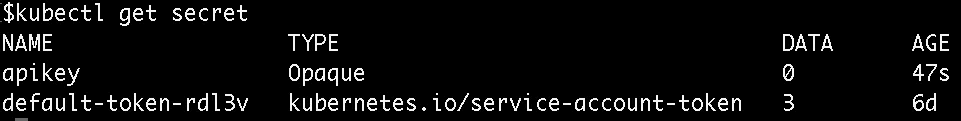

# Kubernetes 配置图和秘密

> 原文：<https://medium.com/google-cloud/kubernetes-configmaps-and-secrets-68d061f7ab5b?source=collection_archive---------0----------------------->

每个人都需要配置应用程序。您经常需要引用“特殊”的数据，比如 API 密钥、令牌和其他秘密。您的应用程序可以使用配置设置进行调整，例如 PHP.ini 文件，或者更改应用程序逻辑的环境变量和标志。

您可能想将这些引用硬编码到您的应用程序逻辑中。在小型的独立应用程序中，这可能是可以接受的，但在任何合理规模的应用程序中，这很快就变得难以管理了。

当然，我们已经解决了这个问题。您可以使用环境变量和配置文件将这些信息存储在一个“中心位置”，并从我们的应用程序中引用这些信息。当您想要更改配置时，只需在文件中更改或更改环境变量，就可以了！不需要搜寻引用数据的每个位置。

这个问题在容器和微服务领域变得更加严重。Docker 允许您在 docker 文件中指定环境变量，但是如果您需要在两个不同的容器中引用相同的数据呢？如果您尝试使用主机环境，那么当您在具有多台机器的集群上运行时会发生什么？

我们来看一个硬编码配置的应用程序，将其更改为从环境变量中读取，最后设置 Kubernetes 来为您管理配置。

在第二部分中，我将使用一个配置文件来代替环境变量。

**所有代码都位于此 Gist:**[https://Gist . github . com/thesandlord/6e 297d 7 CEB 807 e6f 0243255 ab 7885d 83](https://gist.github.com/thesandlord/6e297d7ceb807e6f0243255ab7885d83)

# 硬编码的应用

这是这款应用的所有硬编码荣耀:


[https://gist . github . com/the sand Lord/6e 297d 7 CEB 807 e6f 0243255 ab 7885d 83 # file-hard code-js](https://gist.github.com/thesandlord/6e297d7ceb807e6f0243255ab7885d83#file-hardcode-js)

如果你想改变语言或者 API 键，你需要修改代码。这可能会导致错误、安全漏洞，并污染源代码历史。

让我们转而使用环境变量。

# 步骤 1:使用环境变量

转移到环境变量很容易。大多数编程语言都有内置的阅读方式。


[https://gist . github . com/the sand Lord/6e 297d 7 CEB 807 e6f 0243255 ab 7885d 83 # file-env vars-js](https://gist.github.com/thesandlord/6e297d7ceb807e6f0243255ab7885d83#file-envvars-js)

这就够了！

现在，我们可以设置这些环境变量，而不必接触应用程序的代码

在 Unix 系统(如 MacOS 和 Linux)中，您可以运行此命令为当前会话设置环境变量:

```
export LANGUAGE=Englishexport API_KEY=123–456–789
```

对于 Windows，您可以使用以下命令:

```
setx LANGUAGE “English”setx API_KEY “123–456–789”
```

您也可以在启动服务器时设置环境变量。

例如，对于这个 Node.js 应用程序，您可以运行:

```
LANGUAGE=Spanish API_KEY=0987654 npm start
```

而这些都会暴露在 app 里。

# 步骤 2:转移到 Docker 环境变量

当您转向容器化的解决方案时，您将不再依赖于主机的环境变量。每个容器都有自己的环境，所以确保正确配置容器的环境是很重要的。幸运的是，Docker 使得构建内置环境变量的容器变得很容易。在 docker 文件中，可以用 ENV 指令指定它们。


[https://gist . github . com/the sand Lord/6e 297d 7 CEB 807 e6f 0243255 ab 7885d 83 # file-docker file](https://gist.github.com/thesandlord/6e297d7ceb807e6f0243255ab7885d83#file-dockerfile)

将 docker 文件放在与代码相同的目录中。

然后构建容器:

```
docker build -t envtest .
```

构建容器后，使用以下命令运行它:

```
docker run -p 3000:3000 -ti envtest
```

在命令行上运行时，也可以覆盖环境变量:

```
docker run -e LANGUAGE=Spanish -e API_KEY=09876 -p 3000:3000 \
           -ti envtest
```

# 步骤 3:转移到 Kubernetes 环境变量

当从 Docker 转移到 Kubernetes 时，事情再次发生了变化。您可能会在多个 kubernetes 部署中使用同一个 Docker 容器，或者您可能希望在使用不同配置的同一个容器的部署中进行 A/B 测试。

就像 docker 文件一样，您可以在 Kubernetes 部署 YAML 文件中直接指定环境变量。这意味着每个部署可以获得一个定制的环境。


[https://gist . github . com/the sand Lord/6e 297d 7 CEB 807 e6f 0243255 ab 7885d 83 # file-embedded env-YAML](https://gist.github.com/thesandlord/6e297d7ceb807e6f0243255ab7885d83#file-embededenv-yaml)

重要的部分是 pod 规范的**包络**部分。您可以在这里指定任意数量的环境变量。这两个环境变量现在都是通过 Kubernetes 设置的！

# 步骤 4:使用 Kubernetes 秘密和配置图进行集中配置

Docker 和 Kubernetes 环境变量的不足之处在于它们与容器或部署相关联。如果您想要更改它们，您必须重新构建容器或修改部署。更糟糕的是，如果您想在多个容器或部署中使用该变量，您必须复制数据！

谢天谢地，Kubernetes 用 Secrets(针对机密数据)和 ConfigMaps(针对非机密数据)解决了这个问题。

机密和配置映射之间的最大区别是机密是用 Base64 编码进行模糊处理的。将来可能会有更多的不同，但是对机密数据(如 API 密钥)使用 Secrets，对非机密数据(如端口号)使用 ConfigMaps 是一种很好的做法。

让我们将 API 密钥保存为一个秘密:

```
kubectl create secret generic apikey --from-literal=API_KEY=123–456
```

以及作为配置图的语言:

```
kubectl create configmap language --from-literal=LANGUAGE=English
```

您可以使用以下命令检查这些文件是否已创建:

```
kubectl get secret
```



和

```
kubectl get configmap
```


现在，您可以修改 Kubernetes 部署来读取这些值，而不是硬编码的值。


[https://gist . github . com/the sand Lord/6e 297d 7 CEB 807 e6f 0243255 ab 7885d 83 # file-final-YAML](https://gist.github.com/thesandlord/6e297d7ceb807e6f0243255ab7885d83#file-final-yaml)

# 更新机密和配置映射

如上所述，让 Kubernetes 为您管理环境变量意味着当您想要更改变量值时，您不必更改代码或重新构建容器。

因为 pods 在启动时缓存环境变量的值，所以这是一个两步过程。

首先，更新值:

```
kubectl create configmap language --from-literal=LANGUAGE=Spanish \ -o yaml --dry-run | kubectl replace -f -kubectl create secret generic apikey --from-literal=API_KEY=098765 \ -o yaml --dry-run | kubectl replace -f -
```

然后，重启吊舱。这可以通过多种方式实现，例如强制进行新的部署。快速简单的方法是手动删除 pod，并让部署自动启动新的 pod。

```
kubectl delete pod -l name=envtest
```

这就够了！您的应用程序现在将使用新值！

[在第二部分](/google-cloud/kubernetes-configmaps-and-secrets-part-2-3dc37111f0dc)，我将向您展示如何使用配置文件，在 Kubernetes 中，配置文件比环境变量更强大。